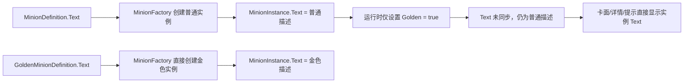

# 金色随从描述同步专项修复方案

## 文档状态

- 日期：2026-07-18。
- 状态：已按本文完成实现与相关 EditMode 回归。
- 问题：随从变为金色后，卡面、详情弹窗和提示区域仍显示普通版本描述。
- 实施范围：已修改金色状态转换与普通副本恢复路径；未修改 `ProjectSettings`，未提交、未推送、未部署。

## 实施结果（2026-07-18）

- `MinionCatalog` 已增加安全查找及 `TrySyncGoldenText`，只同步 `Text`，未知 token/proxy 保留原文。
- 标准三连与 Surprise Elemental 三连在结果入手牌/棋盘前同步金色描述。
- `MatchService` 的持久/战斗临时金色、调试 Golden patch、临时金色锤恢复和变形保留金色状态路径已接入同步。
- `HeroEffectEngine` 的金色化与 plain copy 路径已接入目录同步。
- `TavernSpellEngine` 的金色化法术和“变金后返回手牌”路径已接入目录同步。
- 未替换玩法使用的普通 `CardId`，未重置动态关键词、附魔或卡池份数。
- 新增目录双向同步、未知代理卡保护、调试双向切换、三连结果和 Golden Touch 测试。

验证结果：

- `MinionCatalogTests`、`MatchServiceTests`、`TavernSpellEngineTests`：216/216 通过。
- `HeroPowerBuddyEffectTests`：148/148 通过。
- Runtime 与 EditMode Tests 经 Unity 刷新后编译通过。
- 完整 EditMode 任务曾启动，但启动命令进程被外部 1 秒超时中断，之后 MCP 查询处于忙碌超时，未取得可归档的全量结果；不把该次运行计为通过。
- 实际主 Unity Editor MCP 为 `6400`。`6401` 的监听进程经命令行核验是该项目的 `AssetImportWorker4`，不响应测试协议；本轮未修改任何端口或 `ProjectSettings`。

## 执行摘要

当前问题不是金色卡牌数据缺失，也不是 UI 缓存没有刷新。

项目的随从数据模型已经包含独立的 `GoldenMinionDefinition.Text`。当前数据文件共有 280 个随从定义，280 个均有金色描述，其中 264 个金色描述与普通描述不同。

真正的根因是：

> `MinionInstance.Golden` 是可在运行时变化的状态，但 `MinionInstance.Text` 是创建实例时复制进去的快照。项目没有建立“Golden 变化后必须同步 Text”的统一约束。

因此：

- 通过 `MinionFactory.Create(..., golden: true)` 直接创建的金色随从，描述通常正确。
- 通过三连、英雄效果、酒馆法术、任务奖励、异常、饰品或调试工具把现有普通实例改成金色时，大多只执行 `Golden=true` 和属性翻倍，`Text` 仍是普通描述。
- 临时金色结束或从金色随从创建普通复制时，部分路径只执行 `Golden=false`，可能产生“普通随从显示金色描述”的反向错误。
- UI 直接读取 `MinionInstance.Text`，所以 UI 当前显示的是错误状态的结果，而不是错误来源。

建议增加一个统一的“随从普通/金色展示身份同步”方法。所有会改变 `Golden` 的持久化或临时入口必须调用它。此次修复只同步描述等展示字段，不修改玩法使用的 `CardId`，避免破坏大量按普通 CardId 分派的卡牌逻辑。

## 用户可见现象

### 主要复现路径

1. 获得三张同名普通随从。
2. 三连生成金色随从。
3. 打开金色随从卡面描述、选中区域或详情弹窗。
4. 数值和金色标记已经变化，但描述仍是普通版本。

例如 `BG28_300` 无害的骨颅：

- 普通描述：`亡语：召唤两个1/1的骷髅。`
- 金色描述：`亡语：召唤四个1/1的骷髅。`

当前三连后实例仍继承第一张普通材料的 `Text`，所以显示“召唤两个”，尽管规则实现已经按金色效果召唤四个。

### 其它可复现入口

- 调试工具中切换“金色”。
- `MakeGoldenInPlace` 驱动的异常、饰品、任务和时空酒馆效果。
- HeroEffectEngine 中把现有随从变金色的英雄或伙伴效果。
- TavernSpellEngine 中的“使一个随从变为金色”法术。
- 战斗开始时临时把战斗快照随从变金色。
- 临时金色锤结束后恢复普通。
- 从金色随从生成 plain copy。

## 数据与显示链路



### 数据层已经具备金色描述

`GoldenMinionDefinition` 已包含：

- Golden CardId。
- 金色基础属性。
- 金色关键词。
- 金色规则文本 `Text`。

`MinionCatalogLoader` 也会从 JSON 的 `golden.text` 读取金色描述。

数据审计结果：

| 项目 | 数量 |
|---|---:|
| 随从定义总数 | 280 |
| 带 Golden 定义 | 280 |
| 带 Golden Text | 280 |
| Golden Text 与普通 Text 不同 | 264 |
| Golden Text 缺失 | 0 |

结论：不需要重新抓取或批量补写金色描述数据。

### 创建时行为正确

`MinionFactory.Create` 会根据 `golden` 参数选择：

- 普通或金色基础属性。
- 普通或金色关键词。
- 普通或金色 `Text`。

因此“直接创建金色卡”不是主要缺陷。

### 运行时转换行为不完整

当前主要金色化方法执行的逻辑大致为：

```csharp
target.Golden = true;
StatMath.DoubleCurrentStats(target, false);
```

缺少：

```csharp
target.Text = definition.Golden.Text;
```

三连逻辑同样从第一份普通材料执行 `Clone()`，随后只更新 `Golden`、属性、附魔和池归属，普通材料的 `Text` 被完整保留下来。

### UI 不是根因

以下显示入口均直接读取实例 `Text`：

- Unity 风格卡牌组件。
- 卡牌详情弹窗。
- 选中卡牌信息区。
- 拖拽提示。
- 旧版/Realistic 酒馆界面。

只要实例的 `Text` 正确，这些入口会自然显示金色描述，不需要分别修补 UI。

### 关键代码证据

| 文件 | 当前行为 | 结论 |
|---|---|---|
| `Domain/Models/MinionModels.cs` | Golden 定义包含 Text；Factory 创建金色实例时选择 Golden Text | 数据模型与创建路径支持正确行为 |
| `Domain/Engine/TripleEngine.cs` | clone 普通材料后设置 `Golden=true`，未替换 Text | 标准三连根因 |
| `Application/Services/MatchService.cs` | `MakeGoldenInPlace`、战斗临时金色、MinionPatch 多数只改 Golden/属性 | 最大影响面 |
| `Domain/Engine/HeroEffectEngine.cs` | 独立 `MakeGoldenInPlace` 只改 Golden/属性 | 英雄与伙伴入口根因 |
| `Domain/Engine/TavernSpellEngine.cs` | 独立 `MakeGolden` 只改 Golden/属性 | 酒馆法术入口根因 |
| `UnityTavernCardComponent.cs` | 描述直接来自 `minion.Text` | UI 无需自行查 Golden 定义 |
| `UnityTavernCardDetailModalComponent.cs` | 详情正文直接来自 `card.Text` | 详情弹窗不是独立根因 |

## Root Cause Analysis

**Error**：随从 `Golden=true` 后仍显示普通规则文本。

**Expected**：实例进入金色状态时显示 `MinionDefinition.Golden.Text`；恢复普通状态时显示 `MinionDefinition.Text`。

**Cause**：`Golden` 和 `Text` 都存放在 `MinionInstance`，但没有统一同步不变量。`MinionFactory` 只保证创建时一致；三连及其它运行时转换入口直接修改 `Golden`，没有重新应用对应定义的展示数据。UI 仅显示实例当前的 `Text`。

**Fix**：增加统一的 normal/golden 展示同步方法，通过稳定 `DefinitionId` 查找 `MinionDefinition`，根据 `target.Golden` 更新 `Text`。所有改变 `Golden` 的入口必须经过该方法；无法找到定义的代理卡/token 安全保留原文本。

**Prevention**：新增数据完整性测试、三连/英雄/法术/临时金色/调试切换测试，并禁止业务代码新增裸写 `target.Golden = ...` 而不调用展示同步方法。

## 推荐修复架构

### 设计目标

建立以下不变量：

> 对于能在 MinionCatalog 中找到定义的随从，`MinionInstance.Text` 必须始终与当前 `Golden` 状态对应。

### 建议新增共享方法

建议在 Domain 层增加一个无 UI 依赖的共享方法，例如：

```csharp
public static bool SyncGoldenPresentation(
    MinionInstance target,
    MinionCatalog catalog)
```

行为：

1. `target` 或 `catalog` 为空时返回 `false`。
2. 优先按稳定的 `DefinitionId` 查找普通定义。
3. 必要时按普通 `CardId` 回退查找。
4. `target.Golden=true` 且存在 Golden 定义时，将 `target.Text` 更新为 `definition.Golden.Text`。
5. `target.Golden=false` 时，将 `target.Text` 恢复为 `definition.Text`。
6. Golden Text 为空时回退普通 Text，不能把已有文本清空。
7. 找不到定义时安全返回 `false`，保留代理卡、token 或测试卡的原文本。

该方法只处理展示身份，不负责：

- 属性翻倍或恢复。
- 附魔迁移。
- 三连材料消耗。
- PoolCopiesHeld/PoolSource。
- 亡语或战吼实现。

这样可以避免描述修复与复杂玩法逻辑相互污染。

### 为什么优先按 DefinitionId

- 三连后 `DefinitionId` 仍保持普通定义的稳定 Id。
- 当前 `MinionFactory` 即使创建金色实例，也保留普通 `CardId`。
- 部分官方金色 CardId 使用 `_G`，部分使用 `TB_BaconUps_*`，不能靠字符串拼接推导。
- `DefinitionId` 比较适合作为普通/金色两个展示版本的共同身份。

### 不要在本轮全局替换 CardId

`GoldenMinionDefinition` 虽有独立 CardId，但当前项目大量规则代码采用：

```csharp
minion.CardId == SomeNormalCardId
```

并结合：

```csharp
minion.Golden
```

决定普通/金色效果倍率。

如果为了显示文本把 `MinionInstance.CardId` 全部替换为 Golden CardId，可能导致：

- 战吼/亡语 switch 不再命中。
- 饰品、任务、伙伴和英雄效果识别失败。
- 测试场景、卡池释放和日志聚合发生变化。
- 旧存档和调试命令无法按普通 CardId 查找随从。

因此本轮只同步 `Text`。Golden CardId、金色卡图和规则身份分离应作为独立重构，不与本缺陷捆绑。

## 需要修改的入口

### 1. 三连合成

位置：`TripleEngine.CreateGoldenFromMaterials` 与 `MatchService.ResolvePlayerTriples`。

当前问题：

- clone 第一份普通材料。
- 设置 `Golden=true`。
- 未获得 catalog，无法切换金色 Text。

建议：

- 保持 TripleEngine 专注材料合并，不直接依赖全局 catalog。
- 最小方案是在 MatchService 得到 `TripleResult.Golden` 后、放入 Hand/Board 前调用共享展示同步方法。
- 如果希望 TripleEngine 返回值自身始终满足不变量，可由 MatchService 传入明确的 `MinionDefinition`，而不是让 TripleEngine 持有或查询全局 catalog。
- Surprise Elemental 的独立三连路径也必须经过同一同步点。

这样可以避免把 Catalog 依赖扩散进通用三连算法。

### 2. MatchService.MakeGoldenInPlace

该 helper 有大量异常、任务、饰品、时空酒馆和购买效果调用者，是最重要的统一修复点。

建议：

- 从 `static` 改为实例方法，直接使用 MatchService 持有的 `catalog`。
- 完成 `Golden=true` 和属性处理后调用展示同步。
- 已经是金色的实例也可以做一次同步，修复旧状态或存档中 `Golden=true/Text=普通` 的脏数据。

### 3. 战斗临时金色

位置：`MakeGoldenForCombat`。

战斗快照中的金色随从也可能出现在战斗回放和详情界面，因此应同步金色描述。

该同步只作用于 combat clone，不污染酒馆真实实例。

### 4. HeroEffectEngine

HeroEffectContext 已持有 `MinionCatalog Minions`。

建议：

- 将内部 `MakeGoldenInPlace(target)` 改为接收 `context.Minions`。
- 所有英雄/伙伴金色化入口复用共享同步方法。
- `CreatePlainCopy` 和把 clone 强制改为普通的路径，也必须恢复普通 Text。

### 5. TavernSpellEngine

`Cast` 已接收 `MinionCatalog minions`。

建议：

- `MakeGolden(target)` 增加 catalog 参数。
- 所有酒馆法术金色化调用传入当前 minions。

### 6. Debug/编辑器 MinionPatch

`UpdateMinionInList` 当前只执行：

```csharp
minion.Golden = patch.Golden.Value;
```

建议：

- 让该方法能够访问 catalog，或在 UpdateMinion 完成后对更新目标执行同步。
- 必须同时覆盖玩家 Board、对手 Board、Hand、Shop 和 Discover Options。
- `true → false` 和 `false → true` 两个方向都要验证。

### 7. 临时金色恢复普通

`ClearQuestTemporaryGoldenHammer` 当前只清除属性附魔并设置 `Golden=false`。

建议在清除后恢复普通 Text。

否则修复正向金色描述后，该效果会留下“普通状态显示金色描述”的新回归。

### 8. Plain Copy 与变形

从金色源 clone 后再执行 `copy.Golden=false` 的代码必须恢复普通 Text。

完整复制/变形直接复制 `Text + Golden` 的路径通常是一致的，不应额外覆盖；只有改变 Golden 状态而不改变 Text 的路径需要同步。

## 数据与代理卡兼容边界

### 普通卡池随从

- 280 个定义均有 Golden Text。
- 应严格同步。

### Token

- 部分 token 没有 MinionCatalog 定义。
- 部分 token 通过手写 `MinionInstance` 构造，Text 可能为空。
- helper 找不到定义时必须安全跳过，不抛异常。

### Hero Buddy

- Buddy 使用单独定义模型，不能假设一定存在于 MinionCatalog。
- 如果 Buddy 也有普通/金色独立文本，应增加 Buddy definition resolver；没有数据时保持现状。

### Timewarped Tavern

- 当前 Timewarped 定义包含 GoldenCardId，但没有独立 GoldenText 字段。
- Oathstone 转换出的 Golden 定义目前复用普通 Text。
- 本轮不虚构时空卡金色文本；后续若补数据，可复用同一展示同步机制。

### Proxy/测试卡

- CardId/DefinitionId 可能不在 catalog。
- 保留原 Text，不报错。

## 测试方案

### 数据测试

| 测试 | 预期 |
|---|---|
| 所有普通卡池随从的 Golden 定义存在 | 通过 |
| Golden Text 非空 | 280/280 |
| Golden Text 与普通 Text 不同时可被正确解析 | 以 Bonehead、Surf n' Surf 等样例验证 |

### Domain/Service 测试

| 场景 | 预期 |
|---|---|
| `MinionFactory.Create(..., golden:true)` | Text 为 Golden Text |
| 普通三连 | Golden=true，Text 为 Golden Text |
| Surprise Elemental 三连 | Text 为目标随从 Golden Text |
| 六个相同 token 连续三连 | 两张金卡的 Text 均正确 |
| MatchService.MakeGoldenInPlace | Text 从普通切换为金色 |
| HeroEffectEngine 金色化 | Text 切换为金色 |
| TavernSpellEngine 金色化 | Text 切换为金色 |
| Debug patch `Golden=true` | Board/Hand/Shop/对手/Discover 均显示金色 Text |
| Debug patch `Golden=false` | Text 恢复普通 |
| 临时金色锤结束 | Golden=false 且普通 Text 恢复 |
| 从金色源生成 plain copy | copy 为普通 Text |
| 找不到定义的 proxy/token | 不抛异常，原 Text 保持 |
| 普通和金色文本本来相同 | 状态切换不产生空文本 |

### UI 测试

UI 无需新增查表逻辑，但需要验证最终显示结果：

| UI 入口 | 验证内容 |
|---|---|
| 棋盘卡牌 | 三连后显示金色描述 |
| 手牌卡牌 | 金卡进入手牌后显示金色描述 |
| 选中卡牌面板 | Text 与实例金色状态一致 |
| 卡牌详情弹窗 | 显示 Golden Text，不显示普通 Text |
| 拖拽提示 | 金色卡使用 Golden Text |
| 对手编辑器 | 切换金色后描述立即更新 |
| 战斗回放详情 | 临时金色 combat clone 显示金色描述 |

## 建议实施顺序

1. 给 MinionCatalog 增加安全的 `TryGetById`/`TryGetByCardId`，或实现等价的安全解析。
2. 增加共享 `SyncGoldenPresentation` helper，并先写 Domain 单元测试。
3. 在 `ResolvePlayerTriples` 中同步标准三连和 Surprise Elemental 三连结果。
4. 改造 MatchService 的 `MakeGoldenInPlace`、`MakeGoldenForCombat` 和 MinionPatch。
5. 接入 HeroEffectEngine 与 TavernSpellEngine。
6. 修复临时金色恢复和 plain copy 的反向同步。
7. 补 UI 集成测试。
8. 运行完整 EditMode 和相关 PlayMode 回归。
9. 本地确认所有入口后再更新版本；本轮不直接发布。

## 验收标准

- 任意普通卡池随从通过三连变金后，所有 UI 入口显示 Golden Text。
- 任意受支持的英雄、法术、任务、异常或饰品金色化入口显示 Golden Text。
- 临时金色结束、plain copy 或调试切回普通后恢复普通 Text。
- 264 个文本发生变化的定义均不依赖单卡硬编码。
- 找不到 catalog 定义的 token/proxy 不报错、不丢失原文本。
- 不通过修改 UI 组件分别补丁解决。
- 不把玩法使用的普通 CardId 全局替换为 Golden CardId。
- 不改变属性、附魔、卡池份数和现有普通/金色效果倍率。
- Runtime、EditMode Tests 编译通过，相关 EditMode/PlayMode 回归通过。
- `ProjectSettings` 无修改，现有滚动位置和 Warghoul/token 修复不受影响。

## 风险与防护

### 风险 1：同步方法覆盖动态文本

部分卡牌实例的 Text 可能带实时计数，例如“还剩 4 张”。直接重置为定义文本可能丢失运行时数字。

防护：

- 只在 Golden 状态实际变化或发现状态明显不一致时同步。
- 识别动态文本更新器；金色化后应由现有计数刷新逻辑重新格式化。
- 为带进度文本的卡牌增加专项测试。

### 风险 2：关键词被错误重置

随从可能获得永久 Taunt、Reborn 等动态关键词。

防护：

- 本轮只同步 `Text`。
- 不用 Golden 定义整体覆盖 `Keywords`。
- 如后续要同步原生关键词，应只合并定义差异，不能替换实例关键词集合。

### 风险 3：CardId 改动破坏规则分派

防护：本轮明确不修改实例玩法 CardId。

### 风险 4：旧状态/存档已经脏化

已有实例可能处于 `Golden=true` 但普通 Text 的状态。

防护：

- 主要刷新/载入边界可执行一次幂等同步。
- `MakeGoldenInPlace` 即使目标已经 Golden，也允许修复 Text，而不是直接 return。

## Root Cause 修复原则

此次修复应落在状态变化的共享边界，而不是 UI：

- UI 显示 `Text` 的方式是正确的。
- 数据中的 Golden Text 是完整的。
- 真正需要修复的是 `Golden` 状态和展示字段之间缺少一致性维护。

只在某一张卡或某一个弹窗里替换文字会留下其它二十余个金色化入口继续出错。统一同步方法是本问题最小且可持续的根因修复。
