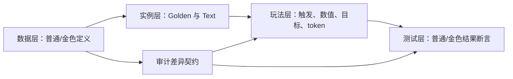
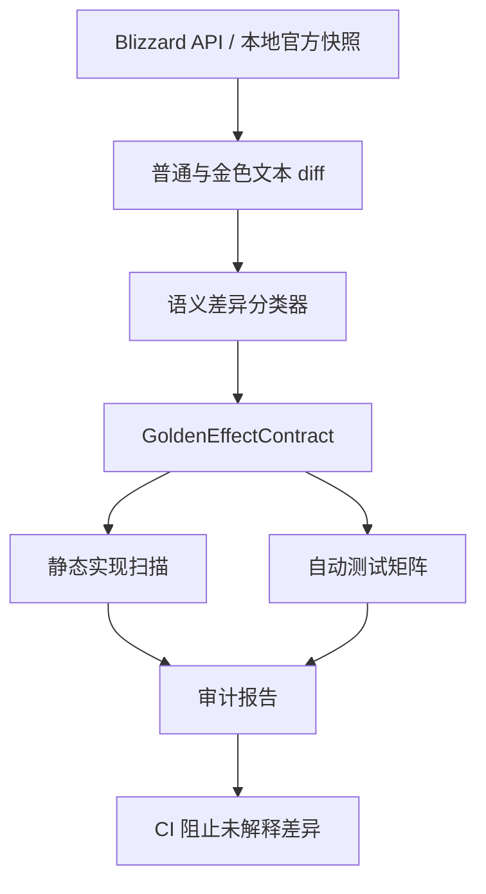

# 金色随从玩法效果一致性全量审计与改进建议

## 文档状态

- 审计日期：2026-07-19。
- 审计对象：`Assets/LearnHearthstone/Resources/Data/battlegroundsMinions.json` 中的普通/金色随从定义，以及 `Runtime`、`Tests` 中对应玩法实现与验证。
- 游戏范围：项目明确支持的单人酒馆战棋训练体验；`BGDUO*` 双打专属系统按 `PROJECT_SCOPE.md` 保持 `OutOfScope`。
- 交付性质：不足分析、风险清单、自动化审计设计、实际修复和持续门禁。
- 实施状态：已完成 P0 玩法修复、237 张单人差异卡 contract ledger、离线审计工具、CI 检查脚本和专项回归；未修改 `ProjectSettings`。

## 实施结果（2026-07-19）

- 修复 `BG34_922` Maelstrom Emergent：不再在酒馆阶段重复普通酒馆法术；战斗开始时对已排队的战斗酒馆法术按普通额外 1 次、金色额外 2 次结算。
- 修复 `BG30_121` Hot-Air Surveyor：只对从手牌打出的血宝石生效，普通实例贡献额外 1 次、金色实例贡献额外 2 次，并按实例累计。
- 补齐 `BG32_235` Surfing Sylvar：回合结束强化相邻随从，按友方金色随从数量重复，金色版本使用 +2 攻击。
- 补齐 `BG21_018` Defiant Shipwright：所有通过统一附魔入口获得的正攻击增益都会触发生命成长，普通 +1、金色 +2。
- 补齐 `BG31_815` Dune Dweller：战吼永久成长当前和未来酒馆元素，金色完整执行两次。
- 修复 `BGS_049` Freedealing Gambler：普通出售 3 金，金色出售 6 金。
- 修复 `BG24_018` Tortollan Blue Shell：上一场战斗失败时普通出售 5 金，金色出售 10 金。
- 补齐 `BG34_682` Razorfen Flapper：亡语获得 Blood Gem Barrage，普通 1 张、金色 2 张。
- 新增 `Tools/audit-golden-minion-effects.mjs` 和 `Tools/check-golden-minion-effects.ps1`。
- 生成 `Docs/data/golden-minion-effect-contracts.json`：237/237 单人普通/金色规则差异卡均有 contract、Runtime owner、差异分类和验证状态。
- 生成 `Docs/generated/GoldenMinionEffectAuditReport.md`：当前 0 error、0 warning、0 needs semantic review。
- 新增 contract 完整性测试和 9 项直接专项回归。

验证结果：

- Unity Runtime/EditMode 编译通过。
- Golden P0 最终专项：9 项中的 8 项首轮通过；Razorfen Flapper 分支入口修正后单项通过，因此本次新增/修改的 9 项均已取得通过结果。
- DomainEngine、TavernSpellEngine、TierFourAcceptance 相关回归：94 项中 92 通过；2 项失败来自既有目标型法术测试没有传显式目标，分别为 Volcanic Visitor Attack 和 Defender's Rites，与本次 Golden 改动无关。
- 离线审计门禁：237 contracts、237 Runtime referenced、0 errors、0 warnings。
- `git diff --check` 通过。

## 执行摘要

当前项目不能依靠“人工逐张试玩金色随从”保证正确性，也不能用“金色描述已经显示正确”代替玩法效果验证。

本次审计得到以下核心结果：

1. 本地卡牌目录有 280 张随从，280/280 都有 Golden 定义；264 张普通与金色描述不同。
2. 264 张差异卡中，177 张包含数值序列变化，117 张涉及次数、数量、目标范围或类似非简单语义。
3. 排除项目明确不支持的双打卡后，有 237 张单人随从的普通/金色文本不同。
4. 现有实现大量采用 CardId 分派和散落的 `Golden ? X : Y`。这种方式能覆盖简单数值翻倍，但无法自动保证目标数、总次数、token 身份、阶段和选择规则正确。
5. 已确认 `BG33_825` 骄傲的私掠者此前存在金色次数遗漏；同构扫描又确认 `BG34_922` 大漩涡涌流纳迦和 `BG30_121` 热气球勘测员仍使用 `Any(...) + 固定一次`，金色强度被压成普通强度。
6. 大漩涡涌流纳迦还有阶段风险：真实文本限定“在战斗中”，现有验收测试却在酒馆阶段直接验证普通酒馆法术重复。
7. 两张单人差异卡 `BG32_235` Surfing Sylvar、`BG21_018` Defiant Shipwright 在 Runtime 中没有 CardId 引用，也没有可见的可执行数据 payload，属于高风险未实现候选。
8. 现有测试并未形成全卡池普通/金色矩阵。Tier 7 的 12 张差异卡仅 2 张在测试中出现，邻近显式 Golden 测试为 0；全部测试中显式 `.Golden = true` 只有约 24 处。

因此，推荐把金色正确性从“单卡实现者记得写分支”提升为可机器检查的项目契约：

> 每张支持的随从必须拥有可追溯的普通/金色规则差异分类、实现入口、测试证据和完成状态；任何卡牌数据更新都必须重新生成审计报告并阻止未解释的差异进入完成状态。

## 审计问题定义

### 用户真正面对的问题

骄傲的私掠者只是第一个被观察到的症状：

- 普通版文字和效果看起来正确。
- 三连后卡面也可能显示正确的金色文字。
- 但玩法代码仍执行普通版次数或数值。
- 只有玩家碰巧使用具体组合时才发现。

如果继续按这种方式处理，后续会不断出现“某张金色卡无法触发”“金色数量没翻倍”“金色 token 还能再次三连”等零散反馈。人工逐卡排查 237 张单人差异卡既低效，也无法在卡池更新后持续复用。

### 本文要回答的问题

1. 当前金色数据、展示、玩法和测试分别处于什么状态？
2. 真实酒馆战棋中的金色效果有哪些常见变化类型？
3. 当前架构为什么容易漏掉金色语义？
4. 哪些问题已经确认，哪些只是高风险候选？
5. 如何建立可重复执行的自动审计，而不是继续人工逐张查？
6. 应该按什么优先级修复，如何证明修复完成？

## 范围与证据等级

### 包含范围

- 当前本地随从目录中的普通与 Golden 定义。
- 单人卡牌的酒馆阶段、战斗阶段、战后奖励和生成物效果。
- 三连、直接金色化、临时金色、普通复制和 token 身份。
- Runtime 中 CardId 分派、`Golden` 分支、计数器和共享 helper。
- EditMode/PlayMode/Acceptance 中的普通与金色验证。
- 实现注册表对“Implemented”的定义是否足够。

### 不包含范围

- `BGDUO*` 双打卡的队友、传递和团队系统实现。
- 金色专属美术资源制作。
- 本轮直接修复所有确认或疑似问题。
- 仅凭静态文本推断客户端未公开的精确事件队列顺序。

### 证据等级

| 等级 | 定义 | 可得出的结论 |
|---|---|---|
| A：确认 | 普通/金色文本明确，代码路径明确，行为或测试与文本直接冲突 | 可登记为确定缺陷 |
| B：高置信度 | 数据和实现差异明确，但缺少一次可执行行为验证或客户端顺序证据 | 优先补测试，通常可直接进入修复候选 |
| C：风险候选 | 静态扫描发现缺少 Golden、固定值、无测试或无 Runtime 引用 | 需要人工/自动专项验证，不能直接称为 bug |
| D：覆盖缺口 | 实现看起来正确，但没有金色测试或注册表未记录金色契约 | 补契约和回归，不一定改代码 |
| OutOfScope | 双打专属机制，项目范围明确不实现 | 不纳入单人完成率，不做错误近似 |

## 数据基线

### 全量目录统计

| 指标 | 数量 |
|---|---:|
| 随从定义总数 | 280 |
| 带 Golden 定义 | 280 |
| 标记在池 | 276 |
| 普通/金色描述不同 | 264 |
| 普通/金色数字序列不同 | 177 |
| 涉及次数、数量或目标范围词 | 117 |
| 排除 `BGDUO*` 后的单人描述差异卡 | 237 |

这组数据说明：

- 数据层的 Golden 定义完整，不需要人工补齐 280 张金色文本。
- 玩法风险面很大。264 张差异卡中，大多数不是只把卡身攻击和生命翻倍，而是规则文字本身发生变化。
- 不能把 `Golden=true` 理解为统一的 `effect × 2`。

### 数据层、展示层、玩法层、测试层必须分开评价



| 层次 | 当前状态 | 不能证明的事情 |
|---|---|---|
| 数据层 | 280/280 有 Golden 定义 | 不能证明代码执行了金色规则 |
| 展示层 | 已有专项同步修复 | 不能证明卡面文字与实际效果一致 |
| 玩法层 | 大量单卡手写分派 | 不能由注册表或文本自动推导完整度 |
| 测试层 | 有许多功能测试，但金色覆盖零散 | 不能防止下一张同类卡再次遗漏 |

## 真实酒馆战棋中的金色效果不是统一翻倍

真实卡牌数据表明，金色变化至少可分为以下类型。

### 1. 简单数值增强

示例：

- Kalecgos：普通触发战吼后给龙 +2/+2，金色 +4/+4。
- Eternal Knight：每个死亡的 Eternal Knight 提供普通 +4/+2、金色 +8/+4。
- Deflect-o-Bot：战斗中召唤机械后普通 +2 攻击、金色 +4 攻击。

这类通常可用：

```csharp
var multiplier = source.Golden ? 2 : 1;
```

但仍需测试永久/本场战斗、当前实体/未来实体等作用域。

### 2. 生成数量增加

示例：

- Draconic Warden：普通获得 1 张 Chromadrake，金色获得 2 张。
- Highkeeper Ra：普通获得 1 张六本随从，金色获得 2 张。
- Lost City Looter：普通获得 1 张悬赏令，金色获得 2 张。

风险包括手牌上限、随机次数、每张是否独立随机、溢出处理和奖励日志。

### 3. 目标范围改变

示例：

- Warghoul：普通触发一个合法相邻亡语，金色触发两侧合法相邻亡语。
- Mummifier：普通给一个不同友方亡灵复生，金色给两个不同目标。
- Wildfire Elemental：普通将溢出伤害打向一个相邻目标，金色作用于两侧相邻目标。

这类不能靠把数值乘二实现。必须改变候选选择、目标去重和事件顺序。

### 4. 总触发次数不是普通次数简单翻倍

示例：

- Proud Privateer：普通“悬赏令施放两次”，金色“施放三次”。
- Brann 类效果：基础 1 次，普通光环增加到 2 次，金色增加到 3 次。
- Drakkari 类效果同样常表现为 2 次/3 次，而不是 2 次/4 次。

正确模型是“每个实例贡献额外次数”：

```text
总次数 = 基础次数 + Σ(各光环额外次数)
```

而不是：

```text
总次数 = 基础次数 × 2 × 金色倍率
```

### 5. 数量不变，但生成物属性或身份改变

示例：

- Manasaber：普通和金色都召唤两个 Cubling，但 token 从 0/1 变为 0/2。
- Surf n' Surf：普通赋予召唤 3/2 Crab，金色赋予召唤 6/4 Crab；该 6/4 对应独立金色 token 身份。
- 某些卡金色仍召唤相同数量，但 token 关键词、复生或卡牌 ID 发生变化。

只改属性但不改 token 的 `Golden`/CardId/DefinitionId，会影响后续三连、复制和按 CardId 分派。

### 6. 阈值不变，奖励翻倍

示例：

- Upbeat Frontdrake：仍然每 3 回合触发，但普通获得 1 张龙，金色获得 2 张。
- Gluttonous Trogg：仍然购买 4 张牌完成，但奖励从 +4/+4 变为 +8/+8。

如果错误地把阈值也乘二，会让金色反而更难触发。

### 7. 效果公式改变

示例：

- Stone Age Slab：普通先 +10/+10 再翻倍属性；金色先 +10/+10 再变为三倍属性。
- Stalwart Kodo：普通赋予自身最大属性，金色赋予双倍最大属性，但每场战斗 3 次的上限不变。
- Futurefin：普通给予自身属性，金色给予双倍自身属性。

这类需要明确公式和操作顺序，不能只在最终结果上盲目乘二。

### 8. 重复执行完整效果

示例：

- The Last One Standing：普通执行一次“每个类型各选一个 +12/+12”，金色把完整选择和增益流程执行两次。

“执行两次完整效果”与“一次选两个目标”并不总等价：第一次执行可能改变第二次的候选、随机种子、属性或死亡链。

## 当前实现架构

### 主要效果入口

金色玩法判断主要集中在：

| 文件 | 约计 Golden 引用 | 责任 |
|---|---:|---|
| `MatchService.cs` | 239 | 酒馆阶段、购买/出售、战吼、回合事件、奖励、法术和大量单卡逻辑 |
| `CombatEngine.cs` | 195 | 攻击、死亡、亡语、召唤、战斗光环、战斗奖励 |
| `HeroEffectEngine.cs` | 15 | 英雄/伙伴相关金色化与效果 |
| `MinionCatalogLoader.cs` | 13 | 普通/金色数据加载和文本 |
| `TavernSpellEngine.cs` | 6 | 酒馆法术导致的金色化与相关效果 |
| `TripleEngine.cs` | 3 | 三连结果和金色实例形成 |

### 当前常见实现模式

#### 模式 A：正确的实例权重累计

```csharp
extra += board
    .Where(minion => minion.CardId == SomeAuraCardId)
    .Sum(minion => minion.Golden ? 2 : 1);
```

适用于每个普通实例贡献 1、每个金色实例贡献 2 的叠加光环。

#### 模式 B：正确的单实例 multiplier

```csharp
var multiplier = source.Golden ? 2 : 1;
AddReward(multiplier);
```

适用于奖励数量和简单数值翻倍。

#### 模式 C：高风险布尔压缩

```csharp
if (board.Any(minion => minion.CardId == AuraCardId))
{
    extra += 1;
}
```

它会丢失：

- 金色实例比普通实例更强的差异。
- 多个实例的叠加。
- 每个实例独立消耗/计数的状态。

#### 模式 D：只实现普通流程

```csharp
case SomeCardId:
    ApplyOneTargetOrOneReward();
    break;
```

如果金色文本改变目标数、执行次数或 token 身份，就会静默沿用普通逻辑。

#### 模式 E：注册为 Implemented，但未记录金色契约

当前 Tier 实现注册表通常只写：

```text
Implemented: Battlecry and Deathrattle reward Chromawhelps.
```

它没有回答：

- 普通获得几张？
- 金色获得几张？
- 战吼、亡语、进击是否都覆盖？
- 是否有普通和金色结果测试？

所以 `Implemented` 目前更接近“找到一条效果路径”，不是“普通/金色完整实现”。

## 已确认缺陷与历史案例

### A1. 骄傲的私掠者：已确认并已修复

| 项目 | 内容 |
|---|---|
| CardId | `BG33_825` |
| 普通文本 | 悬赏令施放两次 |
| 金色文本 | 悬赏令施放三次 |
| 旧实现 | `Any(...)` 后固定 `extra += 1` |
| 旧结果 | 普通 2 次，金色仍 2 次 |
| 正确结果 | 普通实例贡献额外 1，金色贡献额外 2，并按实例累计 |

这张卡证明“金色描述正确”不等于“效果正确”。

### A2. 大漩涡涌流纳迦：金色倍率与阶段双重问题

| 项目 | 内容 |
|---|---|
| CardId | `BG34_922` |
| 英文普通文本 | Your Tavern spells cast an extra time in combat. |
| 英文金色文本 | Your Tavern spells cast 2 extra times in combat. |
| 当前实现 | `Board.Any(...)` 后固定 `extra += 1` |
| 当前测试 | 在酒馆阶段从手牌施放普通酒馆法术并期待重复 |

确认不足：

1. 金色版本仍只额外 1 次，而不是额外 2 次。
2. 多个实例被 `Any(...)` 压成一个布尔值。
3. 文本限定 `in combat`，当前验收却在酒馆阶段触发。

建议把“战斗中酒馆法术施放”建立独立事件入口，而不是复用所有酒馆阶段法术的通用额外次数。

### A3. 热气球勘测员：金色血宝石额外次数遗漏

| 项目 | 内容 |
|---|---|
| CardId | `BG30_121` |
| 普通文本 | 从手牌打出的血宝石额外施放一次 |
| 金色文本 | 从手牌打出的血宝石额外施放两次 |
| 当前实现 | 只检查场上是否存在任意一个实例，然后额外应用一次血宝石 |

金色单实例已经足以确认现有固定一次不符合文本。多个实例是否叠加也必须用真实客户端或权威规则测试固化；在未证明“不叠加”前，不能用 `Any` 默认为不叠加。

### A4. 历史 Warghoul 缺陷：目标范围不是数值翻倍

历史审计已确认：

- 普通 Warghoul 触发一个合法相邻亡语。
- 金色 Warghoul 触发两侧合法相邻亡语。
- 旧代码没有 Golden 分支，仍随机选择一个目标。

这类问题只有“目标集合测试”能发现，数值断言无法覆盖。

### A5. 历史 Harmless Bonehead 缺陷：数量与 token 属性不可互换

真实金色文本要求召唤四个 1/1 Skeleton；旧实现召唤两个 2/2 Skeleton。

两者总属性相近，但玩法完全不同：

- 占用格子数不同。
- 复仇计数不同。
- 亡语/召唤观察者触发次数不同。
- 三连时点不同。

这说明测试不能只比较总攻击/生命。

### A6. 历史 Surf n' Surf 缺陷：金色 token 身份丢失

旧实现生成了 6/4 Crab 数值，却保持 `Golden=false`。结果可能让三个本应已经是金色的 6/4 Crab 再次三连，形成不存在的二次金色化。

这说明生成物需要同时验证：

- CardId/DefinitionId。
- `Golden`。
- 基础属性。
- 关键词。
- 是否参与三连。

### A7. 历史描述同步缺陷：Golden 状态没有统一不变量

此前三连、英雄效果、酒馆法术和调试入口会只修改 `Golden`，不更新 `Text`。专项修复建立了展示同步 helper，但它只解决“显示什么”，没有解决“玩法执行什么”。

## 高风险候选与覆盖缺口

### 两张单人卡没有 Runtime CardId 引用

| CardId | 卡牌 | 普通/金色差异 | 风险等级 |
|---|---|---|---|
| `BG32_235` | Surfing Sylvar | 相邻随从 +1 攻击变 +2；还会按友方金色随从重复 | B/C：高风险未实现候选 |
| `BG21_018` | Defiant Shipwright | 从其它来源获得攻击时，普通 +1 生命；金色执行两次 | B/C：高风险未实现候选 |

当前 JSON 没有可执行效果 payload，而 Runtime 也没有 CardId 分派。除非后续证明存在按关键词完全通用的处理，否则不应把这两张卡视为已实现。

### 正确实现但缺少专项金色测试的反例

静态扫描不能把“缺少测试”直接判定为 bug。例如：

| 卡牌 | 当前代码表现 | 结论 |
|---|---|---|
| Draconic Warden | Battlecry/Deathrattle 使用 `Golden ? 2 : 1` 奖励数量 | 实现看起来正确，缺金色回归 |
| Highkeeper Ra | Battlecry/Deathrattle/Rally 使用 multiplier | 实现看起来正确，缺金色回归 |
| The Last One Standing | 金色完整执行两轮类型选择与增益 | 实现看起来正确，需验证两轮顺序 |
| Stalwart Kodo | 金色使用双倍最大属性，使用次数仍为 3 | 实现看起来正确，需验证上限与多实例 |

这些反例决定了自动审计工具必须输出分级报告，而不能简单输出“没有 Golden 字样 = bug”。

## 测试覆盖审计

### 按酒馆等级的单人差异卡覆盖

| 等级 | 差异卡 | Runtime 有 CardId | Tests 有 CardId | 邻近显式 Golden 测试 |
|---:|---:|---:|---:|---:|
| 1 | 18 | 18 | 18 | 11 |
| 2 | 32 | 30 | 27 | 2 |
| 3 | 38 | 38 | 32 | 5 |
| 4 | 50 | 50 | 25 | 8 |
| 5 | 53 | 53 | 26 | 5 |
| 6 | 34 | 34 | 15 | 2 |
| 7 | 12 | 12 | 2 | 0 |

说明：最后一列是基于 CardId 周围是否出现显式 `Golden=true` 的启发式统计，不是精确覆盖率。但它足以显示当前测试结构的系统性不足：

- Tier 1 相对完整，因为已有早期全卡验收。
- Tier 4-7 的普通实现数量迅速增长，金色测试没有同步增长。
- Tier 7 完全没有形成邻近金色测试。
- 全部测试中显式 `.Golden = true` 约 24 处，远少于 237 张单人规则差异卡。

### 当前测试的主要不足

1. 大量测试只证明卡牌“有反应”，没有同时断言普通和金色结果。
2. 只断言最终属性，可能漏掉召唤数量、目标数和事件次数错误。
3. 只测试单实例，无法发现 `Any(...)` 丢失多实例叠加。
4. 只测试酒馆阶段或只测试战斗阶段，无法发现阶段泄漏。
5. 只测试直接创建金色卡，无法覆盖三连、临时金色、普通复制和 token 路径。
6. 实现注册表的 `Implemented` 不要求绑定测试名或金色契约。

## 根因分析

### Root Cause 1：规则文本与可执行效果没有共同契约

数据中有普通和金色文本，但 Runtime 不是从结构化规则生成，而是开发者手写 CardId 分支。两者之间没有机器可验证的映射。

### Root Cause 2：Golden 是布尔状态，规则差异却是多维结构

`Golden=true` 只描述身份，不描述：

- 数值倍率。
- 额外次数。
- 目标数量。
- token 定义。
- 阈值是否变化。
- 阶段和持续时间。
- 完整效果是否重复。

因此单个布尔值不能自动推导玩法。

### Root Cause 3：实现过度依赖散落的手写条件

`MatchService` 和 `CombatEngine` 中有数百个 Golden 读取。单卡新增时容易出现：

- 普通分支完成，忘记 Golden。
- 一个入口处理 Golden，另一个入口忘记。
- 战吼正确，亡语或进击仍固定一次。
- 招募阶段正确，战斗奖励回写错误。

### Root Cause 4：布尔存在判断被误用于强度光环

`Any(CardId)` 无法表达实例权重。骄傲的私掠者、大漩涡涌流纳迦和热气球勘测员属于同一根因家族。

### Root Cause 5：完成状态没有普通/金色维度

注册表只有 `Implemented` 等粗粒度状态，没有：

- `NormalImplemented`。
- `GoldenImplemented`。
- `GoldenContractKind`。
- `NormalTest` / `GoldenTest`。
- `KnownDeviation`。

所以一条普通路径存在后，卡牌容易过早被视为完成。

### Root Cause 6：测试不是从卡池差异自动派生

当前金色测试依靠开发者主动补写。卡池更新、平衡补丁或文本变化后，没有自动失败机制提醒“普通/金色差异已经改变”。

## 推荐的自动化审计体系

### 总体原则

不要在运行时解析中文或英文卡牌文本决定玩法。文本解析只用于离线审计和生成待确认契约；最终玩法仍使用明确、版本化、可测试的结构化规则。



### 1. 建立可重复的数据快照

离线工具应记录：

- Blizzard/HearthstoneJSON 来源 URL。
- 下载时间。
- locale。
- 内容哈希。
- 普通 CardId、Golden CardId、dbfId 和 premium/normal 映射。
- 是否在当前单人池。

运行时不联网；更新卡池时显式执行同步命令并提交精简快照。

### 2. 生成普通/金色语义差异清单

第一层可以自动完成：

- 去除富文本标签和动态进度括号。
- 比较数字序列。
- 识别次数词：once/twice/three times/repeat。
- 识别目标词：one/two/both/all/adjacent/another。
- 识别阶段词：in combat/this turn/this game/start/end。
- 识别生成词：get/summon/add/copy。
- 识别 token 属性和 premium 映射。

输出示例：

```json
{
  "cardId": "BG33_825",
  "goldenCardId": "BG33_825_G",
  "deltaKinds": ["TotalCastCount", "AuraContribution"],
  "normal": { "extraCasts": 1 },
  "golden": { "extraCasts": 2 },
  "phase": "AnyBountyCast",
  "stacking": "PerInstanceAdditive",
  "confidence": "Confirmed"
}
```

文本分类器只产生候选，人工确认后写入版本化契约。

### 3. 新增 `GoldenEffectContract` 审计数据

建议每张受支持差异卡至少记录：

| 字段 | 用途 |
|---|---|
| `CardId` | 普通玩法身份 |
| `GoldenCardId` | 数据核对和 token 身份 |
| `DeltaKinds` | 数值、数量、目标、次数、token、公式、阶段等 |
| `NormalParameters` | 普通规则参数 |
| `GoldenParameters` | 金色规则参数 |
| `StackingRule` | 不叠加、按实例相加、取最大值、完整重复等 |
| `Phase` | Recruit、Combat、Deathrattle、Rally 等 |
| `ImplementationOwners` | MatchService/CombatEngine/helper |
| `NormalTest` | 普通结果测试名 |
| `GoldenTest` | 金色结果测试名 |
| `MultiCopyTest` | 多实例叠加测试名 |
| `Status` | Confirmed/Implemented/KnownDeviation/OutOfScope |
| `Source` | 官方 API/快照/规则说明 URL |

这份契约首先用于审计和测试，不要求一次性重构全部玩法为数据驱动。

### 4. 静态风险规则

审计工具应至少实现以下规则：

| 规则 | 条件 | 默认严重度 |
|---|---|---|
| `GOLD001` | 文本不同但无 Golden contract | P1 |
| `GOLD002` | 单人差异卡无 Runtime CardId/通用 payload | P0/P1 |
| `GOLD003` | 规则要求实例权重，但实现使用 `Any/Exists` | P0 |
| `GOLD004` | 普通/金色数量不同，但实现固定生成次数 | P0 |
| `GOLD005` | 金色目标范围变化，但没有 Golden 目标分支 | P0 |
| `GOLD006` | Golden token 有独立 premium 映射，但生成实例不是 Golden | P0 |
| `GOLD007` | 文本包含阶段限定，测试或实现跨阶段触发 | P0 |
| `GOLD008` | 注册为 Implemented，但无 Golden 测试证据 | P1 |
| `GOLD009` | CardId 在多个效果入口出现，只有部分入口读取 Golden | P1 |
| `GOLD010` | 数据更新改变普通/金色 delta，但 contract 未更新 | CI 阻断 |

### 5. 不要只靠 grep 判定正确性

静态扫描只能排序。以下情况会产生误报：

- CardId 常量和实际 Golden 分支相距很远。
- 共享 helper 在调用层外处理 multiplier。
- 测试通过工厂直接创建金色实例，没有显式 `.Golden=true`。
- 通用机制按标签处理，不在单卡附近出现 Golden。

因此报告必须包含：

- 静态命中原因。
- 实现入口。
- 是否有可执行验证。
- 人工确认状态。

### 6. 自动生成普通/金色测试骨架

对每个 contract 自动生成或验证以下测试槽位：

```text
Normal_SingleCopy
Golden_SingleCopy
Normal_TwoCopies
NormalPlusGolden
WrongPhase_DoesNotTrigger
GeneratedTokenIdentity
CapacityOrOverflow
```

不是每张卡都需要全部槽位，但 contract 必须说明为何不适用。

### 7. 运行时行为追踪

为测试环境增加结构化 effect trace：

```text
SourceCardId
SourceInstanceId
SourceGolden
EventType
Phase
TargetInstanceIds
AppliedAmount
GeneratedCardIds
RepeatIndex
```

这样测试可以断言“触发了几次、作用于谁、生成了什么”，而不是只看最终总属性。

## 推荐测试矩阵

### 通用矩阵

| 维度 | 必测内容 |
|---|---|
| 身份 | 普通、金色、临时金色、恢复普通 |
| 数量 | 0 个、1 个普通、1 个金色、2 个普通、普通+金色 |
| 阶段 | 酒馆、战斗开始、攻击、死亡、亡语、战后回写 |
| 空间 | 空位充足、满场、满手、目标不足 |
| 目标 | 单目标、双目标、相邻、随机去重、无合法目标 |
| token | CardId、Golden、属性、关键词、三连资格 |
| 重复器 | Brann/Titus/Drakkari/其它重复来源组合 |
| 持续时间 | 本次、当前回合、本场战斗、本局游戏、永久 |

### 次数光环专项

以 Proud Privateer/Hot-Air Surveyor 类为例：

| 场上状态 | 预期额外次数 |
|---|---:|
| 无光环 | 0 |
| 1 普通 | 1 |
| 1 金色 | 2 |
| 2 普通 | 需要按权威 stacking contract 断言 |
| 普通 + 金色 | 需要按权威 stacking contract 断言 |
| 错误法术类型 | 0 |
| 错误阶段 | 0 |

### 生成数量专项

- 每一次生成是否独立随机。
- 手牌满时是阻止、截断、溢出记录还是临时扩容。
- 金色生成两张时不能只创建一张并把属性翻倍。

### 目标范围专项

- 金色两个目标必须不同。
- 目标不足时只作用于合法目标，不重复选同一目标冒充两个。
- 相邻目标以触发时快照还是结算时位置为准，必须写入 contract。

### token 身份专项

- `Golden=true` 与 Golden CardId/DefinitionId 映射一致。
- 三连系统不能再次合成已经是 Golden 的 token。
- 普通复制必须正确恢复普通身份和普通描述。

## 实施优先级

### P0：立即处理确认缺陷

1. 修复 Maelstrom Emergent 的 Golden 权重。
2. 把 Maelstrom 的 combat-only 限定从酒馆阶段通用重复施法中拆出。
3. 修复 Hot-Air Surveyor 的 Golden 权重，并明确多实例 stacking。
4. 为 Proud Privateer 保留普通、金色和混合实例回归。
5. 核验 Surfing Sylvar、Defiant Shipwright 是否完全未实现；若是，登记为缺口而非继续显示 Implemented。

### P1：建立审计防线

1. 新增离线 `golden-effect-audit` 工具。
2. 生成 237 张单人差异卡的 contract ledger。
3. 把 Tier 注册表扩展为普通/金色完成状态和测试证据。
4. CI 阻止 `GOLD002/GOLD003/GOLD006/GOLD007/GOLD010`。
5. 为 Tier 7 和 Tier 6 优先补金色测试。

### P2：按风险类型批量补测

建议顺序：

1. `Any/Exists` 强度光环。
2. 目标数变化。
3. 生成数量和手牌/场地溢出。
4. token premium 身份。
5. 阈值不变、奖励翻倍。
6. 完整效果重复和事件顺序。
7. 简单数值 multiplier。

### P3：收敛共享实现

只在已经出现多个同构案例时提取 helper，例如：

```csharp
private int SumAuraContribution(string cardId, int normal, int golden)
```

或：

```csharp
private IEnumerable<MinionInstance> ActiveSources(string cardId)
```

不要为了 237 张卡一次性重写成复杂规则引擎。先让 contract 和测试成为事实来源，再按重复模式逐步收敛。

### P4：卡池更新自动化

每次同步卡牌数据后自动输出：

- 新增普通/金色差异卡。
- 删除或退池卡。
- 文本 delta 变化。
- Golden CardId 映射变化。
- contract 缺失。
- 测试证据失效。

## 建议的实施阶段

### 第一阶段：报告器，不改玩法架构

交付：

- `Tools/audit-golden-minion-effects.*`
- 机器可读 JSON 报告。
- 人类可读 Markdown 报告。
- CI 中先以 warning 运行。

目标是建立可重复清单，替代人工记忆。

### 第二阶段：P0 卡牌与测试

交付：

- Maelstrom/Hot-Air 修复。
- 两张无 Runtime 引用单人卡的明确状态。
- 次数光环和阶段测试基座。

### 第三阶段：Golden contract ledger

先覆盖 Tier 7、Tier 6、Tier 5，再向低 Tier 扩展。每张卡必须有：

- delta 类型。
- 实现位置。
- 普通测试。
- 金色测试。
- 已知偏差。

### 第四阶段：CI 强制

当 ledger 覆盖率达到可接受水平后：

- 新增差异卡无 contract 时失败。
- contract 标记 Implemented 但无测试时失败。
- 数据 delta 改变但 contract 未更新时失败。

## 完成度指标

不再用“卡牌有 CardId 分支”作为唯一完成标准。建议公开以下指标：

| 指标 | 目标 |
|---|---:|
| 单人差异卡 contract 覆盖 | 237/237 |
| 支持卡普通测试覆盖 | 100% |
| 支持卡金色测试覆盖 | 100% |
| 目标/次数/token 高风险卡多实例测试 | 100% |
| OutOfScope 双打卡明确登记 | 100% |
| 未解释 `Any(CardId)` 强度光环 | 0 |
| Golden token premium 映射遗漏 | 0 |
| 数据 delta 变化未更新 contract | 0 |

## 验收标准

### 文档与工具验收

- 能从本地数据一键重建普通/金色差异清单。
- 能区分单人、双打 OutOfScope、退池和 token。
- 能输出确认缺陷、高风险候选、覆盖缺口和已验证正确四类结果。
- 每条结果包含 CardId、文本差异、实现位置、测试证据和置信度。

### 玩法验收

- 金色数值、数量、目标、次数、token 和阶段均与 contract 一致。
- 多实例行为明确，不再默认用 `Any(...)` 压缩。
- 三连、直接创建金色、临时金色和恢复普通使用同一规则身份。
- 生成的金色 token 不会错误再次三连。

### 测试验收

- Tier 1-7 每张支持差异卡至少有普通和金色结果测试。
- 非线性金色卡必须断言事件次数/目标/token，而非只断言最终总属性。
- 阶段限定卡必须有错误阶段负向测试。
- 数据更新后 contract/test 缺失能够在 CI 中失败。

## 不建议的方案

### 1. 不建议继续逐卡人工试玩

无法重复、无法覆盖组合、卡池更新后全部失效。

### 2. 不建议把所有效果统一乘二

会破坏 three-times、目标扩展、阈值不变、token 身份和公式变化类卡牌。

### 3. 不建议运行时解析卡牌文本

本地化、富文本、动态数字和补丁措辞会让玩法不稳定。文本解析只用于离线提示。

### 4. 不建议一次性建设通用规则 DSL

当前首要问题是缺少契约和测试证据，而不是代码行数。过早设计完整 DSL 会扩大风险。应先建立 ledger，再对重复模式抽 helper。

### 5. 不建议把静态扫描结果直接标成 bug

Draconic Warden、Highkeeper Ra 等卡说明：代码可能在远处通过共享 multiplier 正确处理。扫描结果必须经过实现追踪或测试验证。

## Root Cause Analysis

**Error**：项目会持续出现普通效果正确、金色效果仍沿用普通数值/次数/目标或错误阶段的单卡问题。

**Expected**：每张支持的单人随从，其普通与金色玩法结果都与当前权威卡牌规则一致，并有自动测试证明。

**Cause**：普通/金色文本差异没有结构化玩法契约；效果分散在 CardId 手写分支中；完成注册表不包含金色维度；测试不是从 237 张单人差异卡自动派生；`Any(CardId)` 等布尔实现还会系统性丢失金色和多实例强度。

**Fix**：建立离线数据 diff、`GoldenEffectContract` ledger、静态风险规则、普通/金色/多实例/错误阶段测试矩阵和 CI 门禁；先修复已确认的 Maelstrom/Hot-Air 等 P0，再按风险类别批量收敛共享实现。

**Prevention**：卡池更新时自动比较普通/金色 delta；新增或变化的差异卡没有 contract/test 时禁止标记 Implemented 或合入。

## 置信度

| 结论 | 置信度 | 依据 |
|---|---|---|
| 280/280 有 Golden 定义，264 文本不同 | 高 | 本地 JSON 全量机器统计 |
| 237 张单人规则差异卡 | 高 | 排除 `BGDUO*` 后机器统计 |
| Proud Privateer 旧缺陷 | 高 | 文本、旧代码、修复和专项测试一致 |
| Maelstrom 金色固定一次错误 | 高 | 金色文本明确为额外两次，代码固定额外一次 |
| Maelstrom 酒馆阶段触发不符合 combat-only 文本 | 高 | 文本与现有验收路径直接冲突 |
| Hot-Air Surveyor 金色固定一次错误 | 高 | 金色文本明确为额外两次，代码只额外应用一次 |
| Surfing Sylvar/Defiant Shipwright 未实现 | 中高 | Runtime 无 CardId、无可执行数据 payload；仍需确认不存在完全通用标签路径 |
| 多实例一律按实例相加 | 中 | 多数同类光环符合叠加模型，但每张卡仍应以权威规则或客户端测试确认 |
| 启发式 Golden 测试覆盖数字 | 中 | 可用于风险趋势，不是语义级精确覆盖率 |

## 来源

1. [Battle.net Hearthstone Game Data APIs](https://community.developer.battle.net/documentation/hearthstone/game-data-apis) — Blizzard 官方卡牌列表、单卡、元数据和 Battlegrounds 查询接口说明。
2. [Hearthstone Battlegrounds 官方产品页](https://hearthstone.blizzard.com/en-us/battlegrounds/) — Blizzard 官方酒馆战棋模式入口。
3. [HearthstoneJSON latest enUS cards](https://api.hearthstonejson.com/v1/latest/enUS/cards.json) — HearthSim 社区维护的全量卡牌数据，用于普通/金色文本、CardId 和 premium/normal 映射批量 diff；不是 Blizzard 最终规则权威。
4. `Assets/LearnHearthstone/Resources/Data/battlegroundsMinions.json` — 项目当前 280 张普通/金色随从的可复现本地快照。
5. `Docs/GoldenMinionDescriptionSynchronizationFixPlan.zh-CN.md` — 金色展示身份同步的既有根因、实现边界和验证结果。
6. `Docs/RecruitPhaseGoldrinnWarghoulAndTokenTripleAudit.zh-CN.md` — Warghoul、Harmless Bonehead、Surf n' Surf 和 token 三连的历史普通/金色规则审计。
7. `Docs/ProudPrivateerGoldenTriggerFixPlan.zh-CN.md` — Proud Privateer 次数光环缺陷和修复契约。

## 最终建议

不要再以“发现一张、修一张”作为金色随从质量策略。

最小且可持续的正确方向是：

1. 先修复已经确认的同构问题。
2. 建立 237 张单人差异卡的 Golden contract ledger。
3. 用自动报告替代人工清单。
4. 用普通/金色/多实例/错误阶段测试替代“看起来有分支”。
5. 把注册表的 `Implemented` 升级为有规则、有测试、有来源的可验证状态。

完成这些后，新增卡牌或平衡补丁带来的金色变化会在数据同步当天自动暴露，而不是等待玩家在对局中逐个发现。
