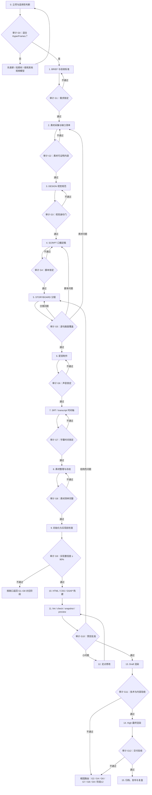

# HyperFrames 视频工程完整生成与审计 SOP

> 适用项目：Learn Heartstone 宣传片、教程片、版本介绍、玩法演示及后续同类视频。
> 文档状态：持续维护版。依据抖音《HyperFrames正确使用流程》完整视频、口播转写与关键帧核对整理，并结合当前 HyperFrames 工程实践补充审计闭环；2026-07-30 增补已验证的授权声音克隆、旁白母带和中文 DTW 时间轴流程。
> 核心原则：不要让 AI 猜视频；让 AI 执行一个已经策划、配音、定时、备齐素材并定义验收标准的视频工程。

## 1. 使用方式

以后每次生成视频，都应先建立本 SOP 规定的工程资料包，再进入 HyperFrames 实现。除非审计门明确通过，否则不得跳到下一阶段，也不得直接渲染最终版。

执行者可以是 Codex 或其他 AI coding agent；但脚本定稿、素材真实性、预览批准和最终发布必须由人确认。

## 2. 方法来源与项目补充

### 2.1 参考视频明确提出的方法

- HyperFrames 是 HTML 到视频的渲染框架，不是“一句话自动成片”的黑箱工具。
- 正确输入应包含口播稿、配音、字幕时间戳、分镜、素材路径、设计风格和验收标准。
- 推荐阶段为：采集素材 → 确定设计 → 脚本 → 分镜 → 配音与时间戳 → 构建工程 → 预览、校验、渲染。
- 第一版完成后要组合使用预览、结构校验和 snapshot 审计；修改时使用小范围、可定位的剪辑指令。本 SOP 按当前工具规则固定为 `lint → check → snapshot → final preview`。
- 教程标题、流程图、数据图表、网页/产品介绍、字幕包装、代码演示和 UI 动效适合 HyperFrames；复杂真人实拍、电影级镜头和随机 B-roll 应由录屏、素材库或其他视频模型先提供。

### 2.2 本 SOP 的工程化补充

- 使用当前 HyperFrames 的统一审计命令 `check` 代替旧版分散的 validate/inspect 流程；开发中仍可单独运行 lint 做快速反馈。
- 增加 `BRIEF.md`、`ACCEPTANCE.md`、`ASSET_MANIFEST.md`、`REVIEW_LOG.md`，使需求、验收、素材和修改记录均可追溯。
- 增加“依赖失效规则”：脚本、配音、时间轴或素材发生变化时，明确哪些下游产物必须重新生成和审计。
- 增加 draft render、FFprobe、音轨检查、关键帧接触表和交付归档。
- 增加授权声音克隆分支：参考音频授权、Voicebox/Chatterbox 分段生成、母带响度审计、中文 DTW 转写和 HyperFrames 声明式音轨接入均可追溯。

## 3. 总流程



## 4. 标准工程资料包

每个视频工程至少应具有以下结构：

除明确标为“仓库相对路径”的项目实例外，下文路径和命令均以 HyperFrames 工程根目录 `VideoProject/` 为当前目录。不得把操作系统绝对路径写成可复现流程的唯一依据。

```text
VideoProject/
├─ BRIEF.md
├─ ACCEPTANCE.md
├─ DESIGN.md
├─ SCRIPT.md
├─ STORYBOARD.md
├─ RECORDING_PLAN.md            # 有真实操作/录屏时必备
├─ ASSET_MANIFEST.md
├─ REVIEW_LOG.md
├─ DELIVERY_POLICY.json        # 机器可读的交付授权策略，不承载文件列表
├─ PUBLIC_ALLOWLIST.txt        # 脱敏外发包唯一允许复制的相对路径
├─ SOURCE_COLLAB_ALLOWLIST.txt # 源码协作包唯一允许复制的相对路径
├─ hyperframes.json
├─ index.html
├─ narration/
│  ├─ script.txt                # 从锁定 SCRIPT.md 导出的纯口播文本
│  ├─ narration.wav
│  ├─ segments/                 # 需要分段配音时使用
│  ├─ reference/                # 仅限已授权的克隆参考音频与授权记录
│  │  ├─ AUTHORIZATION.md
│  │  ├─ authorized-reference-30s.wav
│  │  └─ reference.txt          # 与参考音频逐字对应的唯一文字真值
│  ├─ scripts/                  # 固定版本的生成、混音和 DTW 映射脚本
│  ├─ profile-binding.json      # 项目参考源到 Voicebox sample ID 的上传回执与双哈希
│  ├─ voicebox-generation.json  # 克隆 profile、引擎、seed、分段与哈希
│  ├─ audio-audit.json          # 母带规格、响度、峰值与 SHA256
│  ├─ transcription-audit.json  # ASR/DTW 模型、参数与映射规则
│  ├─ mix-filter.txt            # 由清单生成并归档的 FFmpeg filter
│  ├─ dtw-map.json              # 锁定文字到原始 DTW token span 的显式映射
│  └─ whisper-segments/         # 分段原始 DTW JSON/日志，需要时保留
├─ captions/
│  ├─ captions.srt
│  └─ transcript.json
├─ assets/
│  ├─ audio/                    # composition 实际引用的最终音轨
│  ├─ screenshots/              # 真实软件和游戏截图
│  ├─ recordings/               # 连续操作录屏
│  ├─ images/                   # 生成图、背景图、装饰图
│  ├─ cards/                    # 卡牌、角色或产品独立素材
│  ├─ bgm/
│  └─ sfx/
├─ snapshots/
├─ renders/
└─ source/                      # 原始资料，不直接在成片中引用
```

### 4.1 文件职责

| 文件 | 唯一职责 | 锁定时间 |
|---|---|---|
| `BRIEF.md` | 视频目的、受众、平台、比例、时长、信息边界 | G1 |
| `ACCEPTANCE.md` | 可判定的完成标准和禁止项 | G1，后续只能明确增补 |
| `DESIGN.md` | 色彩、字体、字幕、布局、动效语法、禁止风格 | G3 |
| `SCRIPT.md` | 最终口播文字，不承载画面说明 | G4 |
| `STORYBOARD.md` | 时间段、口播、画面、素材、动画、转场、审计点 | G5 |
| `RECORDING_PLAN.md` | Build SHA、测试存档、逐镜头操作、期望结果和重录条件 | G2 |
| `ASSET_MANIFEST.md` | 每个素材的路径、来源、用途、状态、版权/真实性 | G8 |
| `narration/reference/AUTHORIZATION.md` | 声音权利人、来源、允许用途、确认日期、保留/撤回规则；仅克隆分支必备 | G6 前 |
| `narration/reference/reference.txt` | 与克隆样本实际人声逐字对应的唯一参考文字，并记录 SHA256 | G6 前 |
| `narration/scripts/*` | 本次实际执行的 Voicebox 落盘、filter 生成和 DTW 映射脚本；保存版本与 SHA256 | 对应阶段执行时 |
| `narration/profile-binding.json` | 记录项目专用 profile、sample ID、上传源音频/文字哈希、Voicebox 内部存储样本哈希；证明实际 profile 使用的是本项目授权样本 | G6 前 |
| `narration/voicebox-generation.json` | profile、引擎、模型、语言、seed、逐段文本/入点/生成 ID/哈希 | G6 |
| `narration/audio-audit.json` | 分段与母带的时长、采样率、声道、响度、true peak 和 SHA256 | G6 |
| `narration/transcription-audit.json` | ASR/DTW 版本、模型哈希、参数、原始证据和时间戳映射规则 | G7 |
| `captions/captions.srt` | 句级字幕时间轴 | G7 |
| `captions/transcript.json` | 词级开始/结束时间；本 SOP 默认必备，用于同步验证和后续换音频 | G7 |
| `REVIEW_LOG.md` | 每次审计、问题、修改和通过记录 | 持续更新 |
| `DELIVERY_POLICY.json` | 是否允许独立音频、源码协作和受限克隆资料外发；绑定授权记录 SHA256，不承载逐文件白名单 | G1，授权变化时重锁 |
| `PUBLIC_ALLOWLIST.txt` | 脱敏外发包允许复制的文件白名单；不等同于内部归档清单 | G12 前 |
| `SOURCE_COLLAB_ALLOWLIST.txt` | 授权源码协作包允许复制的文件白名单；与公开包白名单物理分离 | G12 前 |

母带唯一真值规则：`narration/narration.wav` 是内部审计母带；composition 可引用其本身，也可引用复制到 `assets/audio/` 的部署副本。若存在两份，二者 SHA256 必须一致，`ASSET_MANIFEST.md` 必须明确唯一的 composition 引用路径；部署副本不得反向覆盖审计母带。

## 5. 阶段 0：立项与适用性判断

### 输入

- 视频主题和业务目标。
- 已有素材类型：录屏、截图、卡图、实拍、数据、网页或文档。
- 发布平台和画面比例。

### 动作

1. 判断核心画面是否属于可控、清晰、可复现的信息表达。
2. 列出必须由真实素材证明的内容。
3. 列出 HyperFrames 无法凭空生成、必须外部提供的内容。

### 输出

- 一页立项说明，写入 `BRIEF.md` 的背景部分。
- 初始素材缺口列表。

### 审计 G0：适用性

通过条件：

- 主体可以由文字、图形、截图、录屏、卡牌、图表或已有视频构成。
- 复杂真人镜头或真实操作已经有来源，或有明确采集计划。
- 不要求 HyperFrames 凭空生成未经提供的真实玩法或人物镜头。

不通过：先录制、采购或生成外部素材，完成后重新进入 G0。

## 6. 阶段 1：需求与验收标准锁定

### `BRIEF.md` 必填项

- 文件顶部包含机器可读的单行 `composition_duration_s: <秒数>`；它是总时长唯一真值，后续 manifest、HTML 和 render 参数只能复制并校验，不得各自维护默认值。
- 视频名称、目的、目标观众。
- 发布平台、分辨率、比例、帧率、目标时长。
- 本次批准的 HyperFrames 固定版本。
- 一句话核心信息。
- 必须展示的功能和不得展示的内容。
- 是否需要旁白、字幕、BGM、音效。
- 如使用声音克隆：声音权利人、授权用途、参考音视频来源、允许保留期限，以及是否允许对外单独交付音频。
- 是否需要 storyboard 评审和人工最终批准。

同时建立 `DELIVERY_POLICY.json`，至少写入 `allow_standalone_audio`、`allow_source_collaboration`、`allow_restricted_clone_material_in_source_package`、最终 MP4 相对路径、SHA256 文件相对路径，以及使用克隆时的授权记录文件与 SHA256。它只表达交付权限；公开/源码协作包的逐文件列表分别只以两个 allowlist 文件为准。

### `ACCEPTANCE.md` 必填项

验收条目必须可以回答“是/否”，不能只写“效果高级”“节奏舒服”。例如：

- 总时长在 58–62 秒。
- 输出 1080×1920、30fps、H.264 + AAC。
- 全程显示“测试版”。
- 每个功能声明都有真实画面或真实素材支撑。
- 不显示 Unity Console、开发者工具、个人路径或调试错误。
- 字幕不超过两行，并位于平台安全区内。
- 音轨没有削波、静音空段或明显爆音。
- 使用声音克隆时，授权记录、参考音频哈希、生成清单和母带审计均存在，且未使用未经授权的声音。

### 审计 G1：需求锁定

审计人：内容负责人。
通过条件：目的、平台、时长、必须项、禁止项和可判定验收标准均已确认。
不通过：禁止开始脚本和画面实现。

## 7. 阶段 2：素材采集

### 动作

1. 按 `ACCEPTANCE.md` 的每条功能声明反推所需证明素材。
2. 真实操作优先录制短片段，不尝试一次性录完整视频。
3. 每个关键动作保留操作前、操作中、操作后状态。
4. 清除通知、浏览器书签、个人信息、控制台和调试浮层。
5. 记录素材来源、分辨率、时长和可用范围。

### 录制技术规格（项目默认值）

- 录制来源：只捕获游戏/WebGL窗口，不录桌面、Unity Editor、终端或浏览器开发者工具。
- 源分辨率：优先 1920×1080；浏览器缩放固定 100%。
- 源帧率：60fps；最终视频仍可按 BRIEF 输出30fps。
- 编码：H.264，高质量恒定质量或足够高的码率；禁止二次压缩后的聊天软件转存素材。
- 鼠标：操作教学镜头显示鼠标；纯结果镜头可以隐藏，但必须在分镜中注明。
- 音频：游戏原声和系统音效按镜头需要录制；旁白在后期独立混合。
- 镜头手柄：每段操作开始前、结果出现后各保留至少1秒静止画面。
- 环境：通知关闭、个人账号信息遮蔽、无弹窗、无 Console、无调试路径。
- 竖屏预检：录完后立即放入1080×1920裁切模板，确认按钮、卡名和描述仍可读。
- 版本记录：每段录屏必须记录 Git commit/build SHA、运行入口和测试存档/场景编号。

推荐工具可使用 OBS 或系统录屏；工具不是验收重点，输出规格和可复现性才是。

### Learn Heartstone 必须录制的连续素材

- 选择种族并确认。
- 选择英雄并进入酒馆。
- 购买、刷新、拖拽上场和调整站位。
- 查看普通随从详情与关键属性，验证卡牌信息展示。
- 准备阶段触发、亡语、召唤物和衍生物结算顺序。
- 战斗回放的攻击指针、时间轴和逐步播放。
- 卡牌库按等级/名称筛选并加载更多，不绑定某张具体卡牌。
- 完整阵容进入战斗的结尾镜头。

### Learn Heartstone 逐镜头录制表

正式录制前，将下表复制进 `STORYBOARD.md` 或独立 `RECORDING_PLAN.md` 并补全。若项目尚无可复现测试存档/场景注入，先建立 fixture，禁止依赖随机刷新反复碰运气。

| 镜头 ID | Build SHA | 前置存档/测试场景 | 操作步骤 | 期望结果 | 前后保留 | 失败重录条件 | 输出文件名 |
|---|---|---|---|---|---|---|---|
| LH-R01 | 待填 | 开始界面固定存档 | 选择5个种族并确认 | 显示已选5/5并进入下一步 | 各1秒 | 选项未完整显示、鼠标遮字 | `scene-03-tribe-selection-clean.mp4` |
| LH-R02 | 待填 | R01结束状态 | 选择英雄并确认 | 英雄与技能清晰可见，进入酒馆 | 各1秒 | 技能文字不可读、转场卡顿 | `scene-03-hero-selection-clean.mp4` |
| LH-R03 | 待填 | 固定3金币/商店/手牌 fixture | 购买→刷新→拖拽上场→调整站位 | 四个动作均有明确状态变化 | 各1秒 | 任一步失败或画面被浮层遮挡 | `scene-04-buy-refresh-position.mp4` |
| LH-R04 | 待填 | 固定普通随从 fixture | 打开卡牌详情并停留 | 名称、等级、属性和描述可读 | 各1.5秒 | 详情未打开、描述停留不足 | `scene-05-minion-details.mp4` |
| LH-R05 | 待填 | 固定亡语/准备阶段阵容 fixture | 进入结算并逐步观察 | 准备触发、亡语、召唤和衍生物顺序清楚 | 各1秒 | 结算过快、日志/顺序不可读 | `scene-06-resolution-order.mp4` |
| LH-R06 | 待填 | 已完成战斗回放 fixture | 播放/暂停/逐步/拖动时间轴 | 攻击指针、死亡、召唤记录清晰 | 各1秒 | 时间轴或事件被裁切 | `scene-07-combat-replay-controls.mp4` |
| LH-R07 | 待填 | 完整卡池 fixture | 按等级筛选→输入批准的普通卡名→加载更多 | 条件生效，目标卡出现，加载后列表连续 | 各1秒 | 卡牌未显示、筛选条件不可读 | `scene-08-library-filter-search.mp4` |
| LH-R08 | 待填 | 完成阵容 fixture | 点击开始战斗 | 阵容完整、无弹窗，双方开打 | 前1秒/后2秒 | 阵容被遮挡或出现调试信息 | `scene-09-enter-combat-final.mp4` |

### 审计 G2：素材覆盖

逐条对照验收标准：

| 检查项 | 通过标准 |
|---|---|
| 真实性 | 素材来自当前可运行版本，不伪造 UI 和功能 |
| 完整性 | 每项声明至少有一份可用素材 |
| 连续性 | 操作型功能有连续录屏，而不是只靠静态截图 |
| 清洁度 | 无调试信息、隐私和无关弹窗 |
| 可读性 | 手机竖屏裁切后关键文字仍能识别 |

任一关键功能无素材：退回阶段 2，不得用装饰画面代替证明。

## 8. 阶段 3：视觉规范

`DESIGN.md` 至少包含：

- 视觉定位和情绪。
- 主色、辅助色、背景色、正文色和警示色。
- 字体及本地可渲染的后备字体。
- 标题、字幕、角标、信息卡的字号和安全区。
- 横屏素材在竖屏中的 contain/crop 规则。
- 场景入口、场景内运动、转场和最终淡出规则。
- 明确禁止的风格，例如蓝紫霓虹、通用 AI 渐变、过量粒子、持续闪烁。

### 审计 G3：Visual Identity Gate

通过条件：在写 composition HTML 前，`DESIGN.md` 已存在；颜色、字体、排版、素材裁切和动效语言均可执行。
不通过：不得开始 HTML 实现。

## 9. 阶段 4：口播脚本定稿

### 动作

1. 先写内容结构，再写完整口播。
2. 每段只承担一个信息目标。
3. 所有功能表述必须与当前版本一致。
4. 朗读并计时，按照目标时长删减。
5. 删除需要 AI 自行补事实的模糊表述。

### 推荐结构

- 0–3秒：问题或结果钩子。
- 3–8秒：产品是什么。
- 中段：按用户操作或机制因果依次展示。
- 倒数5–8秒：总结、测试版状态和非官方声明。

### 审计 G4：脚本锁定

通过条件：

- 事实与当前版本一致。
- 朗读时长留出转场和停顿空间。
- 每句话都可以在素材库中找到对应证明。
- 口播已经人工确认，状态标记为 `LOCKED`。

脚本锁定后再改文字，会使配音、SRT、transcript 和分镜失效，必须按第 21 节依赖规则重做。

## 10. 阶段 5：分镜

`STORYBOARD.md` 使用下表逐段填写：

| 场景 | 时间 | 口播 | 主画面 | 素材路径 | 字幕 | 动画 | 转场 | 审计点 |
|---|---:|---|---|---|---|---|---|---|
| S01 | 00:00–00:03 | … | … | `assets/...` | … | … | … | 画面能否证明口播 |

### 分镜规则

- 每句口播必须有明确画面，不允许“AI 自行找合适素材”。
- 每个素材必须填写真实本地路径。
- 每场只安排一个主运动，避免截图同时缩放、旋转和漂移。
- 转场服从叙事关系：翻面适合卡牌/正反对比，Push 适合步骤推进，光漏适合庆祝或升档，模糊溶解适合焦点切换。
- 非最终场景不得提前做退出动画；退出由场景交界统一处理。

### 审计 G5：逐句覆盖

通过条件：脚本每句话均能追溯到场景、素材、字幕和时间段；场景总时长与目标一致；没有素材占位符。
不通过：退回脚本或素材阶段，不允许让实现阶段补策划。

## 11. 阶段 6：配音

### 动作

1. 使用锁定后的 `SCRIPT.md` 录制真人音频或外部 TTS。
2. 如使用声音克隆，必须先完成授权记录和参考音频来源登记；授权不明确时立即停止，不得先生成后补授权。
3. 输出无削波、无环境噪声、响度一致的 WAV。
4. 如果分段生成，建立音频清单，记录每段文本、文件、时长、计划开始时间、引擎、seed 和 SHA256。
5. 不满意内置声音时应更换工具或真人录制，不要让低质量声音进入后续工程。
6. 从锁定后的 `SCRIPT.md` 导出 `narration/script.txt`；该文件只含需要朗读的纯文本，不得包含 Markdown 标题、分镜说明或审计备注。分段生成时每个非空行严格对应一个分段，行序即段号；不得把多段合并成一行或用空行占位。

### 可执行的配音路径

任选一种，并在 `REVIEW_LOG.md` 记录工具、声音、速度和版本：

1. 真人录音：录制为 WAV，后续统一响度。
2. 外部 TTS：导出无背景音乐的独立 WAV。
3. HyperFrames 本地 TTS（环境支持时）：

```powershell
$hfVersion = "0.7.62"  # 示例；必须与 BRIEF 中批准的版本一致
npx --yes "hyperframes@$hfVersion" tts narration\script.txt `
  --voice zf_xiaobei --lang zh `
  --output narration\raw-narration.wav
```

4. 授权声音克隆：使用 Voicebox 的 Chatterbox Multilingual 分场景生成；按下文保存授权、profile、seed、逐段哈希和母带审计。

真人或常规 TTS 原始音频可统一转换为项目母带；授权克隆的分段音频应按下文清单合成：

```powershell
ffmpeg -y -i narration\raw-narration.wav `
  -af "loudnorm=I=-16:LRA=7:TP=-1.5" -ar 48000 -ac 1 `
  narration\narration.wav
```

项目默认规格：48kHz、单声道 PCM WAV；旁白目标响度 -16 LUFS，允许误差 ±0.5 LU，true peak 不高于 -1.4dBTP（目标值 -1.5dBTP，给测量舍入留 0.1dB 容差）。最终与BGM/SFX混音后再次检查整体响度；BRIEF 另有更严格标准时以其为准并同步修改审计阈值。

### 授权声音克隆旁白分支（Voicebox + Chatterbox）

仅当声音权利人明确同意克隆及本项目用途时使用。不得克隆未授权的公众人物、陌生人、游戏角色演员或来源不明的声音，也不得借克隆声音冒充本人背书。

#### 1. 授权与参考音频

在 `narration/reference/AUTHORIZATION.md` 至少记录：权利人/授权人、确认日期、来源文件、允许用途与平台、是否允许二次编辑或单独音频交付、保留期限、撤回方式、参考文件 SHA256。若允许独立音频外发，必须包含独立单行 `standalone_audio_external_delivery: true`；未写、写为其他值或授权文件哈希与 `DELIVERY_POLICY.json` 不一致时，一律按不允许处理。

参考音频优先选取约 20–30 秒的单人、清晰、干声片段；不得含 BGM、其他说话人、明显混响、削波或游戏原声。还必须把与样本实际内容逐字一致的文字保存为 `narration/reference/reference.txt`，因为克隆 profile 的样本需要音频与准确文字共同建立。该文件是 `reference_text` 的唯一真值，禁止只把文字留在 Voicebox UI、聊天记录或操作者记忆中。

从已授权视频提取 30 秒 WAV 的模板：

```powershell
New-Item -ItemType Directory -Path narration\reference -Force | Out-Null
$referenceStart = "00:02:15.500" # 必须先试听后选择，不是固定从 00:00:00 开始
ffmpeg -y -ss $referenceStart -i source\authorized-reference.mp4 -t 30 `
  -map 0:a:0 -vn -ar 48000 -ac 1 -c:a pcm_s16le `
  narration\reference\authorized-reference-30s.wav

ffprobe -v error -show_entries format=duration `
  -show_entries stream=codec_name,sample_rate,channels -of json `
  narration\reference\authorized-reference-30s.wav
Get-FileHash narration\reference\authorized-reference-30s.wav -Algorithm SHA256
Get-FileHash narration\reference\reference.txt -Algorithm SHA256
```

提取区间应由人试听后选择；若 30 秒内出现其他人声或音乐，应换区间或重新提供素材，不能靠强降噪把不合格样本“修成”授权样本。参考音频或 `reference.txt` 任一内容变化，都视为 profile 样本变化：旧 G6 立即失效，G7–G12 必须按依赖规则重新验证。

#### 2. 建立 profile 并做服务预检

只从 [jamiepine/voicebox 官方仓库](https://github.com/jamiepine/voicebox) 的固定 Release 安装，不使用网盘重打包或来源不明的便携版。Windows v0.5.0 可复现示例：

```powershell
$voiceboxVersion = "0.5.0"
$installer = "tools\Voicebox_${voiceboxVersion}_x64-setup.exe"
$installerUrl = "https://github.com/jamiepine/voicebox/releases/download/v0.5.0/Voicebox_0.5.0_x64-setup.exe"
$expectedInstallerSha256 = "EAF5410E77946F3A76388270112BFC72925DC9D4C305B891BA600B583BC8B3B8"
New-Item -ItemType Directory -Path tools -Force | Out-Null
Invoke-WebRequest -UseBasicParsing -Uri $installerUrl -OutFile $installer
if ((Get-FileHash $installer -Algorithm SHA256).Hash -ne $expectedInstallerSha256) {
  throw "Voicebox installer SHA256 mismatch"
}
Start-Process -FilePath $installer -Wait
```

其他版本必须从对应 Release 重新取得官方 digest，并把版本、下载 URL、安装包 SHA256、`voicebox.exe` ProductVersion/FileVersion 和可执行文件 SHA256 写入审计；不得沿用 v0.5.0 的哈希。启动 `voicebox.exe` 并保留 UI，确认 FFmpeg/FFprobe 可执行。首次使用 Chatterbox 时先在 UI 完成模型下载；模型较大，下载或首次加载期间不得直接开始批量生成。项目已验证 v0.5.0 的 REST 地址为 `http://127.0.0.1:17493`；未来版本若接口变化，必须重新审计。

在 UI 中新建一个**仅供当前项目使用、尚无 sample 的空 profile**，不要复用含旧样本的 profile。随后把下列脚本保存为 `narration/scripts/bind-voicebox-profile.ps1`，用 API 上传本项目保存的参考音频和 `reference.txt`。这样才能获得“本地授权源 → 上传请求 → Voicebox sample ID → 内部存储样本”的连续回执；只有 profile 名称或 `sample_count >= 1` 不能证明样本身份。

Voicebox 会把上传 WAV 规范化为 24 kHz、去直流、裁边和限峰，因此源 WAV 与内部 sample WAV 的文件 SHA256 通常不同。正确审计方式是保存上传源哈希、返回 sample ID、规范化参考文字哈希和内部存储样本哈希，不得错误要求两个 WAV 文件哈希相等。

```powershell
param(
  [Parameter(Mandatory=$true)][string]$ProfileId,
  [Parameter(Mandatory=$true)][string]$ProfileName,
  [Parameter(Mandatory=$true)][string]$VoiceboxVersion,
  [Parameter(Mandatory=$true)][string]$VoiceboxExePath,
  [string]$Base = "http://127.0.0.1:17493",
  [string]$ReferenceAudioPath = "narration\reference\authorized-reference-30s.wav",
  [string]$ReferenceTextPath = "narration\reference\reference.txt",
  [string]$AuthorizationPath = "narration\reference\AUTHORIZATION.md",
  [string]$OutputPath = "narration\profile-binding.json"
)

Set-StrictMode -Version Latest
$ErrorActionPreference = "Stop"
$utf8NoBom = New-Object System.Text.UTF8Encoding($false)
$utf8Strict = New-Object System.Text.UTF8Encoding($false, $true)
$createdSampleId = $null
$client = $null
$form = $null

function Get-CanonicalText([string]$Path) {
  $text = [IO.File]::ReadAllText([IO.Path]::GetFullPath($Path), $utf8Strict)
  $text = $text.Replace("`r`n", "`n").Replace("`r", "`n")
  return $text.TrimEnd([char[]]@("`r", "`n"))
}

function Get-TextSha256([string]$Text) {
  $sha = [Security.Cryptography.SHA256]::Create()
  try {
    return (($sha.ComputeHash([Text.Encoding]::UTF8.GetBytes($Text)) |
      ForEach-Object { $_.ToString("x2") }) -join "").ToUpperInvariant()
  } finally { $sha.Dispose() }
}

function Resolve-StoragePath([string]$StorageRoot, [string]$ReportedPath) {
  $root = [IO.Path]::GetFullPath($StorageRoot)
  $prefix = $root.TrimEnd([char[]]@("\", "/")) + [IO.Path]::DirectorySeparatorChar
  $candidate = if ([IO.Path]::IsPathRooted($ReportedPath)) {
    [IO.Path]::GetFullPath($ReportedPath)
  } else {
    [IO.Path]::GetFullPath((Join-Path $root $ReportedPath))
  }
  if ($candidate -ne $root -and
      -not $candidate.StartsWith($prefix, [StringComparison]::OrdinalIgnoreCase)) {
    throw "Voicebox sample path escapes storage root"
  }
  return $candidate
}

try {
  $referenceAudioFull = [IO.Path]::GetFullPath($ReferenceAudioPath)
  $referenceTextFull = [IO.Path]::GetFullPath($ReferenceTextPath)
  $authorizationFull = [IO.Path]::GetFullPath($AuthorizationPath)
  $outputFull = [IO.Path]::GetFullPath($OutputPath)
  if (Test-Path -LiteralPath $outputFull) { throw "Binding already exists; use a new empty profile" }
  foreach ($required in @($referenceAudioFull, $referenceTextFull, $authorizationFull, $VoiceboxExePath)) {
    if (-not (Test-Path -LiteralPath $required -PathType Leaf)) { throw "Required file missing: $required" }
  }

  $exe = Get-Item -LiteralPath $VoiceboxExePath
  if ($exe.VersionInfo.ProductVersion -ne $VoiceboxVersion) {
    throw "Voicebox executable version does not match pinned version"
  }
  $health = Invoke-RestMethod -TimeoutSec 15 "$Base/health"
  $filesystem = Invoke-RestMethod -TimeoutSec 15 "$Base/health/filesystem"
  $profile = Invoke-RestMethod -TimeoutSec 15 "$Base/profiles/$ProfileId"
  $samplesBefore = @(Invoke-RestMethod -TimeoutSec 15 "$Base/profiles/$ProfileId/samples")
  $models = Invoke-RestMethod -TimeoutSec 30 "$Base/models/status"
  $model = $models.models | Where-Object model_name -eq "chatterbox-tts" | Select-Object -First 1
  $badDirs = @($filesystem.directories | Where-Object { -not $_.exists -or -not $_.writable })
  $generationsDir = $filesystem.directories |
    Where-Object { $_.path -match '[\\/]generations$' -and $_.exists -and $_.writable } |
    Select-Object -First 1
  if ($health.status -ne "healthy" -or -not $filesystem.healthy -or $badDirs.Count -gt 0) {
    throw "Voicebox health/filesystem preflight failed"
  }
  if (-not $generationsDir) { throw "Writable generations directory not reported" }
  if ($profile.id -ne $ProfileId -or $profile.name -ne $ProfileName) { throw "Profile identity mismatch" }
  if ($samplesBefore.Count -ne 0) { throw "Profile is not empty; create a project-specific empty profile" }
  if (-not $model -or -not $model.downloaded) { throw "chatterbox-tts is not downloaded" }

  $referenceText = Get-CanonicalText $referenceTextFull
  if ([string]::IsNullOrWhiteSpace($referenceText)) { throw "reference.txt is empty" }
  Add-Type -AssemblyName System.Net.Http
  $client = [System.Net.Http.HttpClient]::new()
  $client.Timeout = [TimeSpan]::FromMinutes(5)
  $form = [System.Net.Http.MultipartFormDataContent]::new()
  $fileContent = [System.Net.Http.ByteArrayContent]::new([IO.File]::ReadAllBytes($referenceAudioFull))
  $fileContent.Headers.ContentType = [System.Net.Http.Headers.MediaTypeHeaderValue]::Parse("audio/wav")
  $textContent = [System.Net.Http.StringContent]::new($referenceText, [Text.Encoding]::UTF8, "text/plain")
  $form.Add($fileContent, "file", [IO.Path]::GetFileName($referenceAudioFull))
  $form.Add($textContent, "reference_text")
  $response = $client.PostAsync("$Base/profiles/$ProfileId/samples", $form).GetAwaiter().GetResult()
  $responseText = $response.Content.ReadAsStringAsync().GetAwaiter().GetResult()
  if (-not $response.IsSuccessStatusCode) { throw "Profile sample upload failed: $responseText" }
  $created = $responseText | ConvertFrom-Json
  $createdSampleId = [string]$created.id
  if (-not $createdSampleId) { throw "Voicebox did not return a sample id" }

  $samplesAfter = @(Invoke-RestMethod -TimeoutSec 15 "$Base/profiles/$ProfileId/samples")
  if ($samplesAfter.Count -ne 1) { throw "Project profile must contain exactly one sample" }
  $sample = $samplesAfter | Where-Object id -eq $createdSampleId | Select-Object -First 1
  if (-not $sample -or $sample.profile_id -ne $ProfileId) { throw "Uploaded sample identity mismatch" }
  $apiText = ([string]$sample.reference_text).Replace("`r`n", "`n").Replace("`r", "`n").TrimEnd([char[]]@("`r", "`n"))
  if ($apiText -cne $referenceText) { throw "Voicebox reference_text differs from reference.txt" }

  $storageRoot = [IO.Path]::GetFullPath((Split-Path -Parent $generationsDir.path))
  $storedSample = Resolve-StoragePath $storageRoot ([string]$sample.audio_path)
  if (-not (Test-Path -LiteralPath $storedSample -PathType Leaf)) { throw "Stored Voicebox sample missing" }
  $probeText = & ffprobe -v error -show_entries format=duration `
    -show_entries stream=codec_name,sample_rate,channels -of json $storedSample
  if ($LASTEXITCODE -ne 0) { throw "ffprobe failed for stored Voicebox sample" }
  $probe = $probeText | ConvertFrom-Json
  $stream = @($probe.streams)[0]
  $duration = [double]$probe.format.duration
  if ($duration -lt 2 -or $duration -gt 30 -or $stream.codec_name -ne "pcm_s16le" -or
      [int]$stream.sample_rate -ne 24000 -or [int]$stream.channels -ne 1) {
    throw "Stored Voicebox sample has unexpected media properties"
  }

  $binding = [pscustomobject][ordered]@{
    schema_version = 1
    created_at = (Get-Date).ToString("o")
    voicebox = [pscustomobject][ordered]@{
      version = $VoiceboxVersion
      executable = $VoiceboxExePath
      executable_sha256 = (Get-FileHash $VoiceboxExePath -Algorithm SHA256).Hash
      base_url = $Base
      generations_directory = $generationsDir.path
    }
    profile = [pscustomobject][ordered]@{ id = $ProfileId; name = $ProfileName; sample_id = $createdSampleId }
    authorization = [pscustomobject][ordered]@{
      file = $AuthorizationPath
      sha256 = (Get-FileHash $authorizationFull -Algorithm SHA256).Hash
    }
    source_reference_audio = [pscustomobject][ordered]@{
      file = $ReferenceAudioPath
      sha256 = (Get-FileHash $referenceAudioFull -Algorithm SHA256).Hash
    }
    source_reference_text = [pscustomobject][ordered]@{
      file = $ReferenceTextPath
      canonical_sha256 = Get-TextSha256 $referenceText
    }
    stored_sample = [pscustomobject][ordered]@{
      reported_path = [string]$sample.audio_path
      sha256 = (Get-FileHash $storedSample -Algorithm SHA256).Hash
      duration_s = [math]::Round($duration, 3)
      codec = $stream.codec_name
      sample_rate = [int]$stream.sample_rate
      channels = [int]$stream.channels
    }
  }
  $parent = Split-Path -Parent $outputFull
  New-Item -ItemType Directory -Path $parent -Force | Out-Null
  $temp = Join-Path $parent (".{0}.{1}.tmp" -f [IO.Path]::GetFileName($outputFull), [guid]::NewGuid())
  [IO.File]::WriteAllText($temp, (($binding | ConvertTo-Json -Depth 12) + "`n"), $utf8NoBom)
  [IO.File]::Move($temp, $outputFull)
  $binding | ConvertTo-Json -Depth 12
} catch {
  if ($createdSampleId) {
    try { Invoke-RestMethod -Method Delete -TimeoutSec 15 "$Base/profiles/samples/$createdSampleId" | Out-Null } catch {}
  }
  throw
} finally {
  if ($form) { $form.Dispose() }
  if ($client) { $client.Dispose() }
}
```

调用后人工确认 `narration/profile-binding.json` 已生成，再计算绑定脚本和回执 SHA256。任何旧 profile 无上传回执、profile 中有额外 sample、sample ID/内部样本哈希/reference text 变化，均不得进入分段生成；应新建空 profile 并重新绑定。`loaded` 可以在首次生成时由服务按需变为 `true`；只看到进程存在或 UI 打开不算通过。

#### 3. 按场景分段生成并锁定参数

`narration/script.txt` 的非空行集合是预期段落全集；在 G6 首次生成时，把每段 `scene_start_s` 从已批准分镜复制进 generation manifest。自 `VOICE LOCKED` 起，`voicebox-generation.json` 是机器可读入点唯一真值；mix 和 DTW 只能读取它，不得在 `dtw-map.json` 或脚本默认值中再维护第二份入点。中文克隆必须显式传 `engine: "chatterbox"`，对应 Chatterbox Multilingual / `chatterbox-tts`；`personality` 固定为 `false`，避免改写锁定文字。

将下列模板保存为 `narration/scripts/generate-voicebox-segment.ps1`。它验证 profile binding、BRIEF 总时长和整份锁定脚本，锁定 generation context；参数变化时拒绝混入旧批次。脚本持有 manifest 独占锁，禁止并行生成；输出先转为 48 kHz/mono/PCM、在临时文件上 FFprobe/哈希，再以不可变的内容哈希文件名落盘，旧有效 WAV 永不被覆盖。

```powershell
param(
  [Parameter(Mandatory=$true)][int]$Index,
  [Parameter(Mandatory=$true)][string]$Text,
  [Parameter(Mandatory=$true)][double]$SceneStartS,
  [Parameter(Mandatory=$true)][int]$ExpectedSegmentCount,
  [string]$Base = "http://127.0.0.1:17493",
  [int]$Seed = 42917,
  [int]$PollSeconds = 2,
  [int]$GenerationTimeoutMinutes = 120,
  [string]$BriefPath = "BRIEF.md",
  [string]$ScriptPath = "narration\script.txt",
  [string]$BindingPath = "narration\profile-binding.json",
  [string]$ManifestPath = "narration\voicebox-generation.json"
)

Set-StrictMode -Version Latest
$ErrorActionPreference = "Stop"
$activeStatuses = @("loading_model", "queued", "generating")
$utf8NoBom = New-Object System.Text.UTF8Encoding($false)
$utf8Strict = New-Object System.Text.UTF8Encoding($false, $true)
$root = [IO.Path]::GetFullPath((Get-Location).Path)
$segmentsDir = [IO.Path]::GetFullPath((Join-Path $root "narration\segments"))
$manifestFull = [IO.Path]::GetFullPath((Join-Path $root $ManifestPath))
$briefFull = [IO.Path]::GetFullPath((Join-Path $root $BriefPath))
$scriptFull = [IO.Path]::GetFullPath((Join-Path $root $ScriptPath))
$bindingFull = [IO.Path]::GetFullPath((Join-Path $root $BindingPath))
$job = $null
$result = $null
$manifest = $null
$contextHash = $null
$manifestCompatible = $false
$lockStream = $null
$downloadTemp = $null
$verifiedTemp = $null
$newImmutableFile = $null
New-Item -ItemType Directory -Path $segmentsDir -Force | Out-Null

function Get-CanonicalTextFile([string]$Path) {
  $text = [IO.File]::ReadAllText($Path, $utf8Strict)
  return $text.Replace("`r`n", "`n").Replace("`r", "`n").TrimEnd([char[]]@("`r", "`n"))
}

function Get-TextSha256([string]$Value) {
  $sha = [Security.Cryptography.SHA256]::Create()
  try {
    return (($sha.ComputeHash([Text.Encoding]::UTF8.GetBytes($Value)) |
      ForEach-Object { $_.ToString("x2") }) -join "").ToUpperInvariant()
  } finally { $sha.Dispose() }
}

function Resolve-UnderRoot([string]$AllowedRoot, [string]$ReportedPath) {
  $baseRoot = [IO.Path]::GetFullPath($AllowedRoot)
  $prefix = $baseRoot.TrimEnd([char[]]@("\", "/")) + [IO.Path]::DirectorySeparatorChar
  $candidate = if ([IO.Path]::IsPathRooted($ReportedPath)) {
    [IO.Path]::GetFullPath($ReportedPath)
  } else {
    [IO.Path]::GetFullPath((Join-Path $baseRoot $ReportedPath))
  }
  if ($candidate -ne $baseRoot -and
      -not $candidate.StartsWith($prefix, [StringComparison]::OrdinalIgnoreCase)) {
    throw "Path escapes allowed root: $ReportedPath"
  }
  return $candidate
}

function Invoke-VoiceboxJson {
  param([string]$Uri, [string]$Method = "Get", $Body = $null, [int]$TimeoutSec = 30)
  $request = @{ Uri = $Uri; Method = $Method; TimeoutSec = $TimeoutSec }
  if ($null -ne $Body) {
    $request.ContentType = "application/json; charset=utf-8"
    $request.Body = $Body | ConvertTo-Json -Depth 10
  }
  Invoke-RestMethod @request
}

function Write-ManifestAtomic($Value) {
  $parent = Split-Path -Parent $manifestFull
  New-Item -ItemType Directory -Path $parent -Force | Out-Null
  $temp = Join-Path $parent (".{0}.{1}.tmp" -f [IO.Path]::GetFileName($manifestFull), [guid]::NewGuid())
  $backup = "$manifestFull.backup"
  [IO.File]::WriteAllText($temp, (($Value | ConvertTo-Json -Depth 20) + "`n"), $utf8NoBom)
  if (Test-Path -LiteralPath $manifestFull) {
    [IO.File]::Replace($temp, $manifestFull, $backup, $true)
    Remove-Item -LiteralPath $backup -Force -ErrorAction SilentlyContinue
  } else {
    [IO.File]::Move($temp, $manifestFull)
  }
}

try {
  foreach ($required in @($briefFull, $scriptFull, $bindingFull)) {
    if (-not (Test-Path -LiteralPath $required -PathType Leaf)) { throw "Required file missing: $required" }
  }
  $lockStream = [IO.File]::Open("$manifestFull.lock", [IO.FileMode]::OpenOrCreate,
    [IO.FileAccess]::ReadWrite, [IO.FileShare]::None)

  $briefText = Get-CanonicalTextFile $briefFull
  $durationMatch = [regex]::Match($briefText, '(?m)^composition_duration_s:\s*(?<v>[0-9]+(?:\.[0-9]+)?)\s*$')
  if (-not $durationMatch.Success) { throw "BRIEF.md lacks composition_duration_s" }
  $compositionDuration = [double]::Parse($durationMatch.Groups['v'].Value,
    [Globalization.CultureInfo]::InvariantCulture)
  if ($compositionDuration -le 0) { throw "Invalid composition duration" }

  $scriptText = Get-CanonicalTextFile $scriptFull
  $scriptLines = @($scriptText -split "`n")
  if ($scriptLines.Count -ne $ExpectedSegmentCount -or
      @($scriptLines | Where-Object { [string]::IsNullOrWhiteSpace($_) }).Count -gt 0) {
    throw "script.txt must contain exactly ExpectedSegmentCount non-empty lines"
  }
  if ($Index -lt 1 -or $Index -gt $ExpectedSegmentCount) { throw "Segment index outside expected set" }
  if ($Text -cne $scriptLines[$Index - 1]) { throw "Segment text differs from locked script line" }
  if ($SceneStartS -lt 0 -or $SceneStartS -ge $compositionDuration) { throw "Invalid scene_start_s" }

  $binding = Get-Content -Raw -Encoding UTF8 -LiteralPath $bindingFull | ConvertFrom-Json
  $bindingSha = (Get-FileHash $bindingFull -Algorithm SHA256).Hash
  $authorizationFull = Resolve-UnderRoot $root ([string]$binding.authorization.file)
  $referenceAudioFull = Resolve-UnderRoot $root ([string]$binding.source_reference_audio.file)
  $referenceTextFull = Resolve-UnderRoot $root ([string]$binding.source_reference_text.file)
  if ((Get-FileHash $authorizationFull -Algorithm SHA256).Hash -ne $binding.authorization.sha256) {
    throw "Authorization record changed after profile binding"
  }
  if ((Get-FileHash $referenceAudioFull -Algorithm SHA256).Hash -ne $binding.source_reference_audio.sha256) {
    throw "Reference audio changed after profile binding"
  }
  if ((Get-TextSha256 (Get-CanonicalTextFile $referenceTextFull)) -ne
      $binding.source_reference_text.canonical_sha256) {
    throw "Reference text changed after profile binding"
  }
  if ($binding.voicebox.base_url -ne $Base) { throw "Voicebox base URL differs from binding" }

  $health = Invoke-VoiceboxJson "$Base/health" -TimeoutSec 15
  $filesystem = Invoke-VoiceboxJson "$Base/health/filesystem" -TimeoutSec 15
  $profile = Invoke-VoiceboxJson "$Base/profiles/$($binding.profile.id)" -TimeoutSec 15
  $samples = @(Invoke-VoiceboxJson "$Base/profiles/$($binding.profile.id)/samples" -TimeoutSec 15)
  $models = Invoke-VoiceboxJson "$Base/models/status" -TimeoutSec 30
  $model = $models.models | Where-Object model_name -eq "chatterbox-tts" | Select-Object -First 1
  $generationsDir = $filesystem.directories |
    Where-Object { $_.path -match '[\\/]generations$' -and $_.exists -and $_.writable } |
    Select-Object -First 1
  if ($health.status -ne "healthy" -or -not $filesystem.healthy -or -not $generationsDir) {
    throw "Voicebox health/filesystem preflight failed"
  }
  if ($profile.id -ne $binding.profile.id -or $profile.name -ne $binding.profile.name) {
    throw "Bound profile identity changed"
  }
  if ($samples.Count -ne 1 -or $samples[0].id -ne $binding.profile.sample_id) {
    throw "Bound profile sample set changed"
  }
  $apiReferenceText = ([string]$samples[0].reference_text).Replace("`r`n", "`n").Replace("`r", "`n").TrimEnd([char[]]@("`r", "`n"))
  if ((Get-TextSha256 $apiReferenceText) -ne $binding.source_reference_text.canonical_sha256) {
    throw "Voicebox sample reference_text changed"
  }
  $storageRoot = [IO.Path]::GetFullPath((Split-Path -Parent $generationsDir.path))
  $storedSample = Resolve-UnderRoot $storageRoot ([string]$samples[0].audio_path)
  if ((Get-FileHash $storedSample -Algorithm SHA256).Hash -ne $binding.stored_sample.sha256) {
    throw "Voicebox stored sample changed"
  }
  if (-not $model -or -not $model.downloaded) { throw "chatterbox-tts is not downloaded" }

  $context = [pscustomobject][ordered]@{
    brief = [pscustomobject][ordered]@{ file = $BriefPath; sha256 = (Get-FileHash $briefFull -Algorithm SHA256).Hash }
    composition_duration_s = $compositionDuration
    script = [pscustomobject][ordered]@{ file = $ScriptPath; sha256 = (Get-FileHash $scriptFull -Algorithm SHA256).Hash }
    profile_binding = [pscustomobject][ordered]@{ file = $BindingPath; sha256 = $bindingSha }
    authorization_sha256 = $binding.authorization.sha256
    reference_audio_sha256 = $binding.source_reference_audio.sha256
    reference_text_sha256 = $binding.source_reference_text.canonical_sha256
    stored_sample_sha256 = $binding.stored_sample.sha256
    voicebox_version = $binding.voicebox.version
    voicebox_executable_sha256 = $binding.voicebox.executable_sha256
    profile_id = $binding.profile.id
    profile_name = $binding.profile.name
    profile_sample_id = $binding.profile.sample_id
    engine = "chatterbox"
    model_name = "chatterbox-tts"
    language = "zh"
    seed = $Seed
    personality = $false
    normalize = $true
  }
  $contextHash = Get-TextSha256 ($context | ConvertTo-Json -Depth 12 -Compress)

  if (Test-Path -LiteralPath $manifestFull) {
    $manifest = Get-Content -Raw -Encoding UTF8 -LiteralPath $manifestFull | ConvertFrom-Json
    $requiredManifestProperties = @(
      "schema_version", "expected_segment_count", "composition_duration_s",
      "generation_context", "generation_context_sha256", "segments", "attempts"
    )
    $hasRequiredManifestProperties = @($requiredManifestProperties | Where-Object {
      -not $manifest.PSObject.Properties[$_]
    }).Count -eq 0
    if (-not $hasRequiredManifestProperties -or
        [int]$manifest.schema_version -ne 2 -or
        $manifest.generation_context_sha256 -ne $contextHash -or
        [int]$manifest.expected_segment_count -ne $ExpectedSegmentCount -or
        [double]$manifest.composition_duration_s -ne $compositionDuration) {
      throw "Generation context changed; archive this batch and start a new manifest"
    }
    $manifestCompatible = $true
  } else {
    $manifest = [pscustomobject][ordered]@{
      schema_version = 2
      batch_id = [guid]::NewGuid().ToString()
      created_at = (Get-Date).ToString("o")
      expected_segment_count = $ExpectedSegmentCount
      composition_duration_s = $compositionDuration
      generation_context = $context
      generation_context_sha256 = $contextHash
      segments = @()
      attempts = @()
    }
    Write-ManifestAtomic $manifest
    $manifestCompatible = $true
  }

  $payload = @{
    profile_id = $binding.profile.id
    text = $Text
    language = "zh"
    seed = $Seed
    engine = "chatterbox"
    personality = $false
    normalize = $true
  }
  $job = Invoke-VoiceboxJson "$Base/generate" -Method Post -Body $payload -TimeoutSec 60
  if (-not $job.id) { throw "Voicebox did not return a generation id" }
  $deadline = (Get-Date).AddMinutes($GenerationTimeoutMinutes)
  do {
    if ((Get-Date) -ge $deadline) { throw "Generation timed out" }
    $result = Invoke-VoiceboxJson "$Base/history/$($job.id)" -TimeoutSec 30
    if ($activeStatuses -contains $result.status) { Start-Sleep -Seconds $PollSeconds }
  } while ($activeStatuses -contains $result.status)
  if ($result.status -ne "completed" -or -not $result.audio_path) {
    throw "Generation failed: $($result.status) $($result.error)"
  }

  $token = "{0:D2}-{1}" -f $Index, $job.id
  $downloadTemp = Join-Path $segmentsDir ".$token.download.partial"
  $verifiedTemp = Join-Path $segmentsDir ".$token.verified.partial.wav"
  $audioUri = $null
  $isUri = [Uri]::TryCreate([string]$result.audio_path, [UriKind]::Absolute, [ref]$audioUri)
  if ($isUri -and $audioUri.Scheme -in @("http", "https")) {
    Invoke-WebRequest -UseBasicParsing -Uri $audioUri -OutFile $downloadTemp -TimeoutSec 120
  } else {
    $source = Resolve-UnderRoot $storageRoot ([string]$result.audio_path)
    if (-not (Test-Path -LiteralPath $source -PathType Leaf)) { throw "Generated audio missing" }
    Copy-Item -LiteralPath $source -Destination $downloadTemp
  }
  & ffmpeg -y -v error -i $downloadTemp -vn -ar 48000 -ac 1 -c:a pcm_s16le $verifiedTemp
  if ($LASTEXITCODE -ne 0 -or -not (Test-Path -LiteralPath $verifiedTemp -PathType Leaf)) {
    throw "Generated audio canonicalization failed"
  }
  $probeText = & ffprobe -v error -show_entries format=duration `
    -show_entries stream=codec_name,sample_rate,channels -of json $verifiedTemp
  if ($LASTEXITCODE -ne 0) { throw "ffprobe failed for candidate WAV" }
  $probe = $probeText | ConvertFrom-Json
  $stream = @($probe.streams)[0]
  $duration = [double]$probe.format.duration
  if ($duration -le 0 -or $stream.codec_name -ne "pcm_s16le" -or
      [int]$stream.sample_rate -ne 48000 -or [int]$stream.channels -ne 1 -or
      ($SceneStartS + $duration) -gt ($compositionDuration + 0.001)) {
    throw "Candidate WAV failed media or composition-boundary validation"
  }
  $sha256 = (Get-FileHash $verifiedTemp -Algorithm SHA256).Hash
  $destination = Join-Path $segmentsDir ("{0:D2}-{1}.wav" -f $Index, $sha256)
  if (Test-Path -LiteralPath $destination) {
    if ((Get-FileHash $destination -Algorithm SHA256).Hash -ne $sha256) {
      throw "Immutable segment filename collision"
    }
    Remove-Item -LiteralPath $verifiedTemp -Force
  } else {
    [IO.File]::Move($verifiedTemp, $destination)
    $newImmutableFile = $destination
  }

  $entry = [pscustomobject][ordered]@{
    index = $Index
    text = $Text
    scene_start_s = $SceneStartS
    generation_id = [string]$job.id
    source_audio_path = [string]$result.audio_path
    file = ("narration/segments/{0:D2}-{1}.wav" -f $Index, $sha256)
    duration_s = [math]::Round($duration, 3)
    codec = $stream.codec_name
    sample_rate = [int]$stream.sample_rate
    channels = [int]$stream.channels
    status = "completed"
    sha256 = $sha256
    generation_context_sha256 = $contextHash
    voicebox_version = $binding.voicebox.version
    profile_id = $binding.profile.id
    profile_sample_id = $binding.profile.sample_id
    engine = "chatterbox"
    model_name = "chatterbox-tts"
    language = "zh"
    seed = $Seed
    reference_audio_sha256 = $binding.source_reference_audio.sha256
    reference_text_sha256 = $binding.source_reference_text.canonical_sha256
    created_at = (Get-Date).ToString("o")
  }
  $remaining = @($manifest.segments | Where-Object { [int]$_.index -ne $Index })
  $manifest.segments = @(($remaining + @($entry)) | Sort-Object index)
  Write-ManifestAtomic $manifest
  $newImmutableFile = $null
  $entry | ConvertTo-Json -Depth 10
} catch {
  if ($manifestCompatible -and $manifest -and $contextHash) {
    $attempt = [pscustomobject][ordered]@{
      index = $Index
      text = $Text
      scene_start_s = $SceneStartS
      generation_id = if ($job -and $job.id) { [string]$job.id } else { $null }
      status = if ($result -and $result.status) { [string]$result.status } else { "exception" }
      generation_context_sha256 = $contextHash
      error = $_.Exception.Message
      recorded_at = (Get-Date).ToString("o")
    }
    $manifest.attempts = @($manifest.attempts) + @($attempt)
    try { Write-ManifestAtomic $manifest } catch {}
  }
  if ($newImmutableFile) { Remove-Item -LiteralPath $newImmutableFile -Force -ErrorAction SilentlyContinue }
  throw
} finally {
  foreach ($temp in @($downloadTemp, $verifiedTemp)) {
    if ($temp) { Remove-Item -LiteralPath $temp -Force -ErrorAction SilentlyContinue }
  }
  if ($lockStream) { $lockStream.Dispose() }
}
```

调用示例：

```powershell
powershell.exe -NoProfile -ExecutionPolicy Bypass `
  -File narration\scripts\generate-voicebox-segment.ps1 `
  -ExpectedSegmentCount 7 `
  -Index 1 -Text "这里是锁定后的单段口播。" -SceneStartS 0.6
```

脚本只允许串行执行。只重做发音或节奏有问题的段落；旧内容哈希 WAV 保留为内部历史，新 manifest 原子切换到新文件。profile、sample、授权、参考音频/文字、Voicebox 版本、engine/model/language/seed、BRIEF 总时长或整份脚本任一变化，context hash 都会变化，脚本必须停止；先归档旧批次再建立新 manifest，不得把旧段错误归因到新参数。失败/超时记录保留在内部 `attempts` 中，不进入脱敏外发包。

schema 至少包含：

```json
{
  "schema_version": 2,
  "batch_id": "<uuid>",
  "created_at": "2026-07-30T12:00:00+08:00",
  "expected_segment_count": 7,
  "composition_duration_s": 60.0,
  "generation_context": {
    "brief": { "file": "BRIEF.md", "sha256": "<SHA256>" },
    "script": { "file": "narration/script.txt", "sha256": "<SHA256>" },
    "profile_binding": { "file": "narration/profile-binding.json", "sha256": "<SHA256>" },
    "authorization_sha256": "<SHA256>",
    "reference_audio_sha256": "<SHA256>",
    "reference_text_sha256": "<SHA256>",
    "stored_sample_sha256": "<SHA256>",
    "voicebox_version": "0.5.0",
    "voicebox_executable_sha256": "<SHA256>",
    "profile_id": "<approved-profile-id>",
    "profile_name": "<approved-profile-name>",
    "profile_sample_id": "<sample-id>",
    "engine": "chatterbox",
    "model_name": "chatterbox-tts",
    "language": "zh",
    "seed": 42917,
    "personality": false,
    "normalize": true
  },
  "generation_context_sha256": "<SHA256>",
  "segments": [
    {
      "index": 1,
      "text": "这里是锁定后的单段口播。",
      "scene_start_s": 0.6,
      "generation_id": "<generation-id>",
      "source_audio_path": "<internal-path-or-url>",
      "file": "narration/segments/01-<SHA256>.wav",
      "duration_s": 3.98,
      "codec": "pcm_s16le",
      "sample_rate": 48000,
      "channels": 1,
      "status": "completed",
      "sha256": "<SHA256>",
      "generation_context_sha256": "<SHA256>",
      "voicebox_version": "0.5.0",
      "profile_id": "<approved-profile-id>",
      "profile_sample_id": "<sample-id>",
      "engine": "chatterbox",
      "model_name": "chatterbox-tts",
      "language": "zh",
      "seed": 42917,
      "reference_audio_sha256": "<SHA256>",
      "reference_text_sha256": "<SHA256>"
    }
  ],
  "attempts": []
}
```

#### 4. 合成母带与响度审计

由清单自动生成并归档 FFmpeg filter：每段先转为 48 kHz 单声道浮点采样，再按 manifest 的 `scene_start_s × 1000` 毫秒执行 `adelay`，完成 `amix` 后用 `apad + atrim` 补齐到 BRIEF 锁定的 composition 总时长。不要手工拖拽后只保存一个无法复核的成品。

将下列脚本保存为 `narration/scripts/build-voicebox-mix.ps1`。它不接收总时长默认值，而是验证 manifest 绑定的 BRIEF/脚本；要求段数、索引、锁定文字、context 和实际 WAV 哈希全部完整，再生成 `narration/mix-filter.txt` 与 `pcm_f32le` pre-master：

```powershell
param(
  [string]$ManifestPath = "narration\voicebox-generation.json",
  [string]$BriefPath = "BRIEF.md",
  [string]$ScriptPath = "narration\script.txt",
  [string]$FilterPath = "narration\mix-filter.txt",
  [string]$PreMasterPath = "narration\pre-master.wav"
)

Set-StrictMode -Version Latest
$ErrorActionPreference = "Stop"
$utf8NoBom = New-Object System.Text.UTF8Encoding($false)
$root = [IO.Path]::GetFullPath((Get-Location).Path)
$manifest = Get-Content -Raw -Encoding UTF8 -LiteralPath $ManifestPath | ConvertFrom-Json
if ([int]$manifest.schema_version -ne 2) { throw "Unsupported Voicebox manifest schema" }
$compositionDuration = [double]$manifest.composition_duration_s
$expectedCount = [int]$manifest.expected_segment_count
if ($compositionDuration -le 0 -or $expectedCount -le 0) { throw "Invalid manifest duration or segment count" }

$briefFull = [IO.Path]::GetFullPath((Join-Path $root $BriefPath))
$scriptFull = [IO.Path]::GetFullPath((Join-Path $root $ScriptPath))
if ((Get-FileHash $briefFull -Algorithm SHA256).Hash -ne $manifest.generation_context.brief.sha256 -or
    (Get-FileHash $scriptFull -Algorithm SHA256).Hash -ne $manifest.generation_context.script.sha256) {
  throw "BRIEF or locked script changed after generation"
}
$scriptText = [IO.File]::ReadAllText($scriptFull).Replace("`r`n", "`n").Replace("`r", "`n").TrimEnd([char[]]@("`r", "`n"))
$scriptLines = @($scriptText -split "`n")
if ($scriptLines.Count -ne $expectedCount -or
    @($scriptLines | Where-Object { [string]::IsNullOrWhiteSpace($_) }).Count -gt 0) {
  throw "Locked script line count no longer matches manifest"
}
$segments = @($manifest.segments | Sort-Object index)
if ($segments.Count -ne $expectedCount) { throw "Manifest is missing one or more expected segments" }
$actualIndices = @($segments | ForEach-Object { [int]$_.index })
$expectedIndices = @(1..$expectedCount)
if (($actualIndices -join ',') -ne ($expectedIndices -join ',') -or
    @($actualIndices | Group-Object | Where-Object Count -ne 1).Count -gt 0) {
  throw "Segment indices are incomplete, duplicated, or non-contiguous"
}

function Resolve-ProjectFile([string]$RelativePath) {
  if ([IO.Path]::IsPathRooted($RelativePath) -or $RelativePath -match '(^|[\\/])\.\.([\\/]|$)') {
    throw "Manifest segment path must be a safe project-relative path"
  }
  $prefix = $root.TrimEnd([char[]]@("\", "/")) + [IO.Path]::DirectorySeparatorChar
  $full = [IO.Path]::GetFullPath((Join-Path $root $RelativePath))
  if (-not $full.StartsWith($prefix, [StringComparison]::OrdinalIgnoreCase)) {
    throw "Manifest segment path escapes project root"
  }
  return $full
}

$inputs = @()
$filters = @()
$labels = @()
$previousEnd = 0.0
for ($i = 0; $i -lt $segments.Count; $i++) {
  $segment = $segments[$i]
  if ($segment.status -ne "completed" -or
      $segment.generation_context_sha256 -ne $manifest.generation_context_sha256 -or
      $segment.text -cne $scriptLines[$i] -or
      $segment.profile_id -ne $manifest.generation_context.profile_id -or
      $segment.profile_sample_id -ne $manifest.generation_context.profile_sample_id -or
      $segment.voicebox_version -ne $manifest.generation_context.voicebox_version -or
      $segment.engine -ne $manifest.generation_context.engine -or
      $segment.model_name -ne $manifest.generation_context.model_name -or
      $segment.language -ne $manifest.generation_context.language -or
      [int]$segment.seed -ne [int]$manifest.generation_context.seed -or
      $segment.reference_audio_sha256 -ne $manifest.generation_context.reference_audio_sha256 -or
      $segment.reference_text_sha256 -ne $manifest.generation_context.reference_text_sha256) {
    throw "Segment provenance or locked text mismatch at index $($segment.index)"
  }
  $file = Resolve-ProjectFile ([string]$segment.file)
  if (-not (Test-Path -LiteralPath $file)) { throw "Segment missing: $file" }
  if ((Get-FileHash $file -Algorithm SHA256).Hash -ne $segment.sha256) {
    throw "Segment SHA256 mismatch: $($segment.index)"
  }
  $probeText = & ffprobe -v error -show_entries format=duration `
    -show_entries stream=codec_name,sample_rate,channels -of json $file
  if ($LASTEXITCODE -ne 0) { throw "ffprobe failed: $file" }
  $probe = $probeText | ConvertFrom-Json
  $stream = @($probe.streams)[0]
  $duration = [double]$probe.format.duration
  if ($duration -le 0 -or $stream.codec_name -ne "pcm_s16le" -or
      [int]$stream.sample_rate -ne 48000 -or [int]$stream.channels -ne 1 -or
      [math]::Abs($duration - [double]$segment.duration_s) -gt 0.01) {
    throw "Segment media properties differ from manifest: $($segment.index)"
  }
  $start = [double]$segment.scene_start_s
  $end = $start + $duration
  if ($start -lt ($previousEnd - 0.001)) {
    throw "Narration segments overlap at index $($segment.index)"
  }
  if ($start -lt 0 -or $end -gt ($CompositionDuration + 0.001)) {
    throw "Narration segment is outside composition duration: $($segment.index)"
  }
  $previousEnd = $end
  $delayMs = [math]::Round($start * 1000)
  $inputs += @("-i", $file)
  $filters += "[${i}:a]aresample=48000,aformat=sample_fmts=fltp:channel_layouts=mono,adelay=${delayMs}:all=1[s$i]"
  $labels += "[s$i]"
}
$durationText = $compositionDuration.ToString([Globalization.CultureInfo]::InvariantCulture)
$filters += (($labels -join "") +
  "amix=inputs=$($segments.Count):normalize=0:dropout_transition=0," +
  "apad,atrim=duration=${durationText}[mix]")

$filterFull = [IO.Path]::GetFullPath((Join-Path $root $FilterPath))
$preMasterFull = [IO.Path]::GetFullPath((Join-Path $root $PreMasterPath))
New-Item -ItemType Directory -Path (Split-Path -Parent $filterFull) -Force | Out-Null
New-Item -ItemType Directory -Path (Split-Path -Parent $preMasterFull) -Force | Out-Null
$transactionId = [guid]::NewGuid().ToString("N")
$filterTemp = Join-Path (Split-Path -Parent $filterFull) `
  (".{0}.{1}.partial.txt" -f [IO.Path]::GetFileName($filterFull), $transactionId)
$preMasterTemp = Join-Path (Split-Path -Parent $preMasterFull) `
  (".{0}.{1}.partial.wav" -f [IO.Path]::GetFileName($preMasterFull), $transactionId)
$filterBackup = "$filterFull.$transactionId.backup"
$preMasterBackup = "$preMasterFull.$transactionId.backup"
$filterWasNew = -not (Test-Path -LiteralPath $filterFull)
$preMasterWasNew = -not (Test-Path -LiteralPath $preMasterFull)
$filterCommitted = $false
$preMasterCommitted = $false

try {
  [IO.File]::WriteAllText($filterTemp, (($filters -join ";`n") + "`n"), $utf8NoBom)
  & ffmpeg -y @inputs -filter_complex_script $filterTemp -map "[mix]" `
    -ar 48000 -ac 1 -c:a pcm_f32le $preMasterTemp
  if ($LASTEXITCODE -ne 0 -or -not (Test-Path -LiteralPath $preMasterTemp)) {
    throw "FFmpeg pre-master generation failed"
  }
  $preProbeText = & ffprobe -v error -show_entries format=duration `
    -show_entries stream=codec_name,sample_rate,channels -of json $preMasterTemp
  if ($LASTEXITCODE -ne 0) { throw "ffprobe failed for pre-master" }
  $preProbe = $preProbeText | ConvertFrom-Json
  $preStream = @($preProbe.streams)[0]
  if ([math]::Abs([double]$preProbe.format.duration - $compositionDuration) -gt 0.01 -or
      $preStream.codec_name -ne "pcm_f32le" -or [int]$preStream.sample_rate -ne 48000 -or
      [int]$preStream.channels -ne 1) {
    throw "Pre-master failed duration or media validation"
  }

  if ($filterWasNew) { [IO.File]::Move($filterTemp, $filterFull) }
  else { [IO.File]::Replace($filterTemp, $filterFull, $filterBackup, $true) }
  $filterCommitted = $true
  if ($preMasterWasNew) { [IO.File]::Move($preMasterTemp, $preMasterFull) }
  else { [IO.File]::Replace($preMasterTemp, $preMasterFull, $preMasterBackup, $true) }
  $preMasterCommitted = $true
  Remove-Item -LiteralPath $filterBackup, $preMasterBackup -Force -ErrorAction SilentlyContinue
} catch {
  $originalError = $_
  try {
    if ($preMasterCommitted) {
      if ($preMasterWasNew) {
        Remove-Item -LiteralPath $preMasterFull -Force -ErrorAction SilentlyContinue
      } elseif (Test-Path -LiteralPath $preMasterBackup) {
        Remove-Item -LiteralPath $preMasterFull -Force -ErrorAction SilentlyContinue
        [IO.File]::Move($preMasterBackup, $preMasterFull)
      }
    }
    if ($filterCommitted) {
      if ($filterWasNew) {
        Remove-Item -LiteralPath $filterFull -Force -ErrorAction SilentlyContinue
      } elseif (Test-Path -LiteralPath $filterBackup) {
        Remove-Item -LiteralPath $filterFull -Force -ErrorAction SilentlyContinue
        [IO.File]::Move($filterBackup, $filterFull)
      }
    }
  } catch {
    throw "Mix commit failed and rollback was incomplete. Preserve backup files for recovery. Original error: $($originalError.Exception.Message); rollback error: $($_.Exception.Message)"
  }
  throw $originalError
} finally {
  Remove-Item -LiteralPath $filterTemp, $preMasterTemp -Force -ErrorAction SilentlyContinue
}
```

旁白默认不得重叠；若创意上确需叠声，必须扩展 manifest schema 显式标记例外、人工审核听感，并在浮点 pre-master 上复测峰值后才能继续。不能通过删除重叠检查来“让命令通过”。脚本使用目标目录内的同卷临时文件，并把 filter 与 pre-master 作为一组提交；任一替换失败即回滚，不得让中断写入覆盖已通过审计的旧产物。

随后把下列固定脚本保存为 `narration/scripts/finalize-audio-master.ps1`。它在内存中解析第一遍 loudnorm JSON、自动回填第二遍参数、对最终临时母带重新 FFprobe/响度测量、逐段取峰值，并以 UTF-8 no-BOM 生成日志和 `audio-audit.json`；不使用 PowerShell 5.1 的 `>`/`2>` 文本重定向，也没有人工填写占位符。

```powershell
param(
  [string]$ManifestPath = "narration\voicebox-generation.json",
  [string]$PreMasterPath = "narration\pre-master.wav",
  [string]$FilterPath = "narration\mix-filter.txt",
  [string]$OutputPath = "narration\narration.wav",
  [string]$AuditPath = "narration\audio-audit.json",
  [double]$TargetI = -16.0,
  [double]$TargetLRA = 7.0,
  [double]$TargetTP = -1.5,
  [double]$IntegratedTolerance = 0.5,
  [double]$TruePeakTolerance = 0.1
)

Set-StrictMode -Version Latest
$ErrorActionPreference = "Stop"
$utf8NoBom = New-Object System.Text.UTF8Encoding($false)
$invariant = [Globalization.CultureInfo]::InvariantCulture
$root = [IO.Path]::GetFullPath((Get-Location).Path)
$manifestFull = [IO.Path]::GetFullPath((Join-Path $root $ManifestPath))
$preMasterFull = [IO.Path]::GetFullPath((Join-Path $root $PreMasterPath))
$filterFull = [IO.Path]::GetFullPath((Join-Path $root $FilterPath))
$outputFull = [IO.Path]::GetFullPath((Join-Path $root $OutputPath))
$auditFull = [IO.Path]::GetFullPath((Join-Path $root $AuditPath))
$masterTemp = "$outputFull.partial.wav"
$masterBackup = "$outputFull.backup"
$auditTemp = "$auditFull.partial"
$auditBackup = "$auditFull.backup"
$masterCommitted = $false
$auditCommitted = $false
$masterWasNew = -not (Test-Path -LiteralPath $outputFull)
$auditWasNew = -not (Test-Path -LiteralPath $auditFull)

function Invoke-Captured([string]$Command, [string[]]$Arguments) {
  $lines = @(& $Command @Arguments 2>&1 | ForEach-Object { [string]$_ })
  if ($LASTEXITCODE -ne 0) { throw "$Command failed: $($lines -join [Environment]::NewLine)" }
  return ,$lines
}

function Get-LoudnormObject([string[]]$Lines) {
  $matches = [regex]::Matches(($Lines -join "`n"), '(?s)\{\s*"input_i".*?\}')
  if ($matches.Count -eq 0) { throw "FFmpeg loudnorm JSON not found" }
  return ($matches[$matches.Count - 1].Value | ConvertFrom-Json)
}

function As-Double($Value) {
  return [double]::Parse([string]$Value, [Globalization.NumberStyles]::Float, $invariant)
}

function Invariant([double]$Value) { return $Value.ToString("0.########", $invariant) }

function Resolve-ProjectFile([string]$RelativePath) {
  if ([IO.Path]::IsPathRooted($RelativePath) -or $RelativePath -match '(^|[\\/])\.\.([\\/]|$)') {
    throw "Unsafe project-relative path"
  }
  $prefix = $root.TrimEnd([char[]]@("\", "/")) + [IO.Path]::DirectorySeparatorChar
  $full = [IO.Path]::GetFullPath((Join-Path $root $RelativePath))
  if (-not $full.StartsWith($prefix, [StringComparison]::OrdinalIgnoreCase)) {
    throw "Path escapes project root"
  }
  return $full
}

foreach ($required in @($manifestFull, $preMasterFull, $filterFull,
    (Join-Path $root "narration\scripts\generate-voicebox-segment.ps1"),
    (Join-Path $root "narration\scripts\build-voicebox-mix.ps1"))) {
  if (-not (Test-Path -LiteralPath $required -PathType Leaf)) { throw "Required audit input missing: $required" }
}
$manifest = Get-Content -Raw -Encoding UTF8 -LiteralPath $manifestFull | ConvertFrom-Json
if ([int]$manifest.schema_version -ne 2 -or
    @($manifest.segments).Count -ne [int]$manifest.expected_segment_count) {
  throw "Voicebox manifest is incomplete"
}
$compositionDuration = [double]$manifest.composition_duration_s
$targetFilter = "loudnorm=I=$(Invariant $TargetI):LRA=$(Invariant $TargetLRA):TP=$(Invariant $TargetTP):print_format=json"

try {
  Remove-Item -LiteralPath $masterTemp, $auditTemp, $masterBackup, $auditBackup `
    -Force -ErrorAction SilentlyContinue
  $pass1Lines = Invoke-Captured "ffmpeg" @(
    "-hide_banner", "-nostats", "-i", $preMasterFull,
    "-af", $targetFilter, "-f", "null", "NUL"
  )
  $pass1 = Get-LoudnormObject $pass1Lines
  foreach ($field in @("input_i", "input_lra", "input_tp", "input_thresh", "target_offset")) {
    if (-not $pass1.PSObject.Properties[$field]) { throw "Missing loudnorm field: $field" }
    [void](As-Double $pass1.$field)
  }
  [IO.File]::WriteAllText((Join-Path $root "narration\loudnorm-pass1.log"),
    (($pass1Lines -join "`n") + "`n"), $utf8NoBom)

  $pass2Filter = "loudnorm=I=$(Invariant $TargetI):LRA=$(Invariant $TargetLRA):TP=$(Invariant $TargetTP)" +
    ":measured_I=$($pass1.input_i):measured_LRA=$($pass1.input_lra)" +
    ":measured_TP=$($pass1.input_tp):measured_thresh=$($pass1.input_thresh)" +
    ":offset=$($pass1.target_offset):linear=true:print_format=json"
  $pass2Lines = Invoke-Captured "ffmpeg" @(
    "-y", "-hide_banner", "-nostats", "-i", $preMasterFull,
    "-af", $pass2Filter, "-ar", "48000", "-ac", "1", "-c:a", "pcm_s16le", $masterTemp
  )
  [IO.File]::WriteAllText((Join-Path $root "narration\loudnorm-pass2.log"),
    (($pass2Lines -join "`n") + "`n"), $utf8NoBom)

  $probeLines = Invoke-Captured "ffprobe" @(
    "-v", "error", "-show_entries", "format=duration",
    "-show_entries", "stream=codec_name,sample_rate,channels", "-of", "json", $masterTemp
  )
  $probeJson = $probeLines -join "`n"
  $probe = $probeJson | ConvertFrom-Json
  [IO.File]::WriteAllText((Join-Path $root "narration\master-ffprobe.json"),
    ($probeJson.TrimEnd() + "`n"), $utf8NoBom)
  $stream = @($probe.streams)[0]
  $duration = [double]$probe.format.duration
  if ([math]::Abs($duration - $compositionDuration) -gt 0.01 -or
      $stream.codec_name -ne "pcm_s16le" -or [int]$stream.sample_rate -ne 48000 -or
      [int]$stream.channels -ne 1) {
    throw "Final master failed duration or media validation"
  }

  $finalLines = Invoke-Captured "ffmpeg" @(
    "-hide_banner", "-nostats", "-i", $masterTemp,
    "-af", $targetFilter, "-f", "null", "NUL"
  )
  $final = Get-LoudnormObject $finalLines
  [IO.File]::WriteAllText((Join-Path $root "narration\loudnorm-final.log"),
    (($finalLines -join "`n") + "`n"), $utf8NoBom)
  $finalI = As-Double $final.input_i
  $finalTP = As-Double $final.input_tp
  if ([math]::Abs($finalI - $TargetI) -gt $IntegratedTolerance) {
    throw "Final integrated loudness is outside tolerance"
  }
  if ($finalTP -gt ($TargetTP + $TruePeakTolerance)) {
    throw "Final true peak exceeds allowed ceiling"
  }

  $segmentAudit = @()
  foreach ($segment in @($manifest.segments | Sort-Object index)) {
    $file = Resolve-ProjectFile ([string]$segment.file)
    if ((Get-FileHash $file -Algorithm SHA256).Hash -ne $segment.sha256) {
      throw "Segment changed before final audit: $($segment.index)"
    }
    $peakLines = Invoke-Captured "ffmpeg" @(
      "-hide_banner", "-nostats", "-i", $file,
      "-af", "volumedetect", "-f", "null", "NUL"
    )
    $peakMatch = [regex]::Match(($peakLines -join "`n"), 'max_volume:\s*(?<v>-?[0-9]+(?:\.[0-9]+)?)\s*dB')
    if (-not $peakMatch.Success) { throw "Segment peak measurement missing: $($segment.index)" }
    $segmentAudit += [pscustomobject][ordered]@{
      index = [int]$segment.index
      file = [string]$segment.file
      scene_start_s = [double]$segment.scene_start_s
      duration_s = [double]$segment.duration_s
      codec = [string]$segment.codec
      sample_rate = [int]$segment.sample_rate
      channels = [int]$segment.channels
      peak_dbfs = As-Double $peakMatch.Groups['v'].Value
      sha256 = [string]$segment.sha256
    }
  }

  $masterSha = (Get-FileHash $masterTemp -Algorithm SHA256).Hash
  $audit = [pscustomobject][ordered]@{
    schema_version = 2
    created_at = (Get-Date).ToString("o")
    generation_manifest = [pscustomobject][ordered]@{
      file = $ManifestPath
      sha256 = (Get-FileHash $manifestFull -Algorithm SHA256).Hash
      generation_context_sha256 = $manifest.generation_context_sha256
    }
    scripts = [pscustomobject][ordered]@{
      generation = (Get-FileHash (Join-Path $root "narration\scripts\generate-voicebox-segment.ps1") -Algorithm SHA256).Hash
      mix = (Get-FileHash (Join-Path $root "narration\scripts\build-voicebox-mix.ps1") -Algorithm SHA256).Hash
      finalize = (Get-FileHash $PSCommandPath -Algorithm SHA256).Hash
    }
    mix_filter = [pscustomobject][ordered]@{ file = $FilterPath; sha256 = (Get-FileHash $filterFull -Algorithm SHA256).Hash }
    pre_master = [pscustomobject][ordered]@{ file = $PreMasterPath; sha256 = (Get-FileHash $preMasterFull -Algorithm SHA256).Hash }
    target = [pscustomobject][ordered]@{
      integrated_lufs = $TargetI
      lra_lu = $TargetLRA
      true_peak_dbtp = $TargetTP
      integrated_tolerance_lu = $IntegratedTolerance
      true_peak_tolerance_db = $TruePeakTolerance
    }
    loudnorm_pass1 = $pass1
    segments = $segmentAudit
    master = [pscustomobject][ordered]@{
      file = $OutputPath
      duration_s = [math]::Round($duration, 3)
      codec = [string]$stream.codec_name
      sample_rate = [int]$stream.sample_rate
      channels = [int]$stream.channels
      integrated_lufs = $finalI
      lra_lu = As-Double $final.input_lra
      true_peak_dbtp = $finalTP
      threshold_lufs = As-Double $final.input_thresh
      sha256 = $masterSha
    }
    result = "PASS"
  }
  New-Item -ItemType Directory -Path (Split-Path -Parent $auditFull) -Force | Out-Null
  [IO.File]::WriteAllText($auditTemp, (($audit | ConvertTo-Json -Depth 20) + "`n"), $utf8NoBom)

  if ($masterWasNew) { [IO.File]::Move($masterTemp, $outputFull) }
  else { [IO.File]::Replace($masterTemp, $outputFull, $masterBackup, $true) }
  $masterCommitted = $true
  if ($auditWasNew) { [IO.File]::Move($auditTemp, $auditFull) }
  else { [IO.File]::Replace($auditTemp, $auditFull, $auditBackup, $true) }
  $auditCommitted = $true
  Remove-Item -LiteralPath $masterBackup, $auditBackup -Force -ErrorAction SilentlyContinue
  $audit | ConvertTo-Json -Depth 20
} catch {
  if ($auditCommitted) {
    if (Test-Path -LiteralPath $auditBackup) {
      Remove-Item -LiteralPath $auditFull -Force -ErrorAction SilentlyContinue
      [IO.File]::Move($auditBackup, $auditFull)
    } elseif ($auditWasNew) { Remove-Item -LiteralPath $auditFull -Force -ErrorAction SilentlyContinue }
  }
  if ($masterCommitted) {
    if (Test-Path -LiteralPath $masterBackup) {
      Remove-Item -LiteralPath $outputFull -Force -ErrorAction SilentlyContinue
      [IO.File]::Move($masterBackup, $outputFull)
    } elseif ($masterWasNew) { Remove-Item -LiteralPath $outputFull -Force -ErrorAction SilentlyContinue }
  }
  throw
} finally {
  Remove-Item -LiteralPath $masterTemp, $auditTemp -Force -ErrorAction SilentlyContinue
}
```

执行顺序：

```powershell
powershell.exe -NoProfile -ExecutionPolicy Bypass `
  -File narration\scripts\build-voicebox-mix.ps1
powershell.exe -NoProfile -ExecutionPolicy Bypass `
  -File narration\scripts\finalize-audio-master.ps1
```

`narration/audio-audit.json` 是 G6 母带结果真值：必须由脚本生成 `result: PASS`，记录生成/混音/finalize 脚本、manifest、filter、pre-master、每段实际峰值与 SHA256、两遍 loudnorm 输入指标，以及最终母带时长、编码、48 kHz、mono、-16 LUFS±0.5、true peak 不高于 -1.4dBTP 和 SHA256。任何占位符、手填测量值、缺段、哈希漂移或阈值不符都阻断 G6。若 BRIEF 禁止 BGM 或原声，母带中不得擅自加入。

#### 5. Learn Heartstone 已验证方法实例（2026-07-30，legacy 证据布局）

- 本小节路径以仓库根目录为基准，只用于证明技术方法已经跑通，不可覆盖前文的通用目录与门禁。
- 本次声音授权由用户在任务中明确确认，并记录在项目 `REVIEW_LOG.md`/`ASSET_MANIFEST.md`；历史工程未回填独立 `narration/reference/AUTHORIZATION.md` 和 `reference.txt`，因此属于 legacy 证据布局。若按本版 SOP 重新交付，必须先补齐两份文件及哈希，才能宣称通过当前 G6。
- 授权源视频：`PromoVideo/LearnHeartstoneCombatPromo16x9/6d322f674802313e7dd5db2e1b0c18cd.mp4`；提取参考：`PromoVideo/LearnHeartstoneCombatPromo16x9/voicebox-reference-30s.wav`，30 秒、48 kHz、mono、PCM s16le。
- 工具：本地 Voicebox v0.5.0；用户确认授权的 profile 名称“曼波”；实际引擎 Chatterbox Multilingual（`engine: chatterbox`、`model_name: chatterbox-tts`）；seed `42917`。
- 七段入点：`0.6, 5.7, 16.7, 25.7, 34.7, 44.7, 52.0`；生成脚本：`PromoVideo/LearnHeartstoneCombatPromo16x9/voicebox-work/generate-voicebox-narration.mjs`；生成清单：`PromoVideo/LearnHeartstoneCombatPromo16x9/hyperframes/narration/voicebox-generation.json`。
- 60 秒部署母带：`PromoVideo/LearnHeartstoneCombatPromo16x9/hyperframes/assets/audio/voiceover-final.wav`；48 kHz、mono、PCM s16le、-16.0 LUFS、-1.5 dBTP。该历史实例只保留部署母带；新项目必须按前文另存 `narration/narration.wav` 审计真值并校验部署副本哈希。
- 母带 SHA256：`D3208F0200733408EF5D33A1B76C7DD18CDA330ABAA2ECF441E0B94854203B24`。
- 边界：无 BGM、无官方游戏原声；WAV 只保留于工程审计，不作为独立交付物。历史 Qwen 下载故障只保留为排障证据，最终推荐方案是 Chatterbox。

### 审计 G6：声音锁定

- 使用声音克隆时，授权记录、参考音频/文字文件及其 SHA256、profile、引擎和 seed 均已锁定。
- `profile-binding.json` 证明项目专用 profile 当前只有批准的 sample；上传源音频、规范化参考文字、Voicebox 内部存储样本和授权记录的哈希均与实际文件/API 一致。
- 文本与 `SCRIPT.md` 一致。
- 发音、停顿和语速自然。
- 时长适配分镜。
- 音量无明显忽高忽低。
- Voicebox 健康/文件系统/profile/模型预检通过，生成无无限轮询，完成 WAV 已稳定落盘；失败尝试已按内部保留规则记录。
- generation manifest 的 context hash 与 BRIEF、整份锁定脚本、profile binding、Voicebox 可执行文件、模型参数和授权样本一致；预期段号完整、连续、无重复，每段文字、入点、媒体规格与实际 WAV SHA256 均匹配。
- 分段清单、生成/混音/finalize 脚本与 filter 已归档；`audio-audit.json` 由脚本自动生成且 `result: PASS`，母带和逐段的规格、响度/峰值及 SHA256 复测完整；只重做问题段时已更新全部下游产物。
- 状态标记 `VOICE LOCKED`。

不通过：只重录问题句；除非脚本本身错误，不回到整篇改写。

## 12. 阶段 7：字幕与词级时间轴

### 产物

- `captions/captions.srt`：句级字幕，必备。
- `captions/transcript.json`：词级时间戳，本 SOP 默认必备，即使当前版本不做逐词动画也要保留，便于同步审计和后续重剪。格式示例：

```json
[
  { "id": "w0", "text": "选择", "start": 8.45, "end": 8.78 },
  { "id": "w1", "text": "种族", "start": 8.78, "end": 9.16 }
]
```

### 动作

1. 从最终配音生成 SRT。
2. 始终生成词级 JSON；需要逐词高亮、关键词弹跳、数字强调时直接消费该文件，不再重新估时。
3. 人工校正产品名、卡牌名、英文缩写和专有名词。
4. 删除音乐符号、乱码、短促幻听和空白条目。

### 可执行的字幕路径

稳定优先方案：将最终 `narration.wav` 导入剪映/CapCut或其他成熟字幕工具，人工校对后导出 UTF-8 SRT。

本地 ASR 环境可用时：

```powershell
$hfVersion = "0.7.62"  # 示例；必须与 BRIEF 中批准的版本一致
New-Item -ItemType Directory -Path captions -Force | Out-Null
npx --yes "hyperframes@$hfVersion" transcribe narration\narration.wav `
  --dir captions --model small --language zh
npx --yes "hyperframes@$hfVersion" transcribe captions\transcript.json `
  --to srt --output captions\captions.srt
```

第一条命令的规范化输出必须为 `captions/transcript.json`，内容是本节示例所示的扁平词数组；第二条命令从它导出 SRT。执行后至少验证：

```powershell
$words = Get-Content -Raw -Encoding UTF8 captions\transcript.json | ConvertFrom-Json
if ($words.Count -eq 0 -or $null -eq $words[0].start -or $null -eq $words[0].end) {
  throw "transcript.json 不是有效的词级时间数组"
}
```

若当前固定版本或本机 whisper 构建链不支持，应使用外部 ASR 或 faster-whisper，最终仍须转换为同一扁平 schema 并保存到上述路径；不得退回到人工凭感觉估时间。生成方式、模型和转换脚本必须写入 `REVIEW_LOG.md`。

### 中文克隆旁白的分段 DTW 路径

连续中文 token 可能被归一化器合并成少数超长句。若全长转写出现这种情况，应对生成时保留的每个源段分别运行 whisper.cpp DTW，再按 `scene_start_s` 加回全片偏移。必须使用真实 token span，不得按字符数插值或人工伪造时间戳。

固定工具只能从 [ggml-org/whisper.cpp 官方 Release](https://github.com/ggml-org/whisper.cpp/releases) 与官方模型仓库取得。Windows x64 v1.9.1 + small 模型示例：

```powershell
$whisperVersion = "1.9.1"
$toolDir = "tools\whisper.cpp-v$whisperVersion"
$zip = "tools\whisper-bin-x64-v$whisperVersion.zip"
$zipUrl = "https://github.com/ggml-org/whisper.cpp/releases/download/v1.9.1/whisper-bin-x64.zip"
$zipSha256 = "7D8BE46ECD31828E1EB7A2ECDD0D6B314FEAFD82163038AB6092594B0A063539"
$model = "$toolDir\ggml-small.bin"
$modelUrl = "https://huggingface.co/ggerganov/whisper.cpp/resolve/main/ggml-small.bin"
$modelSha256 = "1BE3A9B2063867B937E64E2EC7483364A79917E157FA98C5D94B5C1FFFEA987B"
New-Item -ItemType Directory -Path tools, $toolDir -Force | Out-Null
Invoke-WebRequest -UseBasicParsing -Uri $zipUrl -OutFile $zip
if ((Get-FileHash $zip -Algorithm SHA256).Hash -ne $zipSha256) { throw "whisper.cpp archive hash mismatch" }
Expand-Archive -LiteralPath $zip -DestinationPath $toolDir -Force
$whisperCli = (Get-ChildItem -LiteralPath $toolDir -Recurse -File -Filter whisper-cli.exe |
  Select-Object -First 1).FullName
if (-not $whisperCli) { throw "whisper-cli.exe missing after extraction" }
Invoke-WebRequest -UseBasicParsing -Uri $modelUrl -OutFile $model
if ((Get-FileHash $model -Algorithm SHA256).Hash -ne $modelSha256) { throw "whisper model hash mismatch" }

New-Item -ItemType Directory -Path narration\whisper-segments -Force | Out-Null
$generation = Get-Content -Raw -Encoding UTF8 narration\voicebox-generation.json | ConvertFrom-Json
$segment01 = $generation.segments | Where-Object { [int]$_.index -eq 1 } | Select-Object -First 1
if (-not $segment01 -or
    (Get-FileHash -LiteralPath ([string]$segment01.file) -Algorithm SHA256).Hash -ne $segment01.sha256) {
  throw "Segment 01 is missing or changed"
}
& $whisperCli -m $model -f $segment01.file -l zh `
  --dtw small --no-flash-attn --output-json-full `
  --output-file narration\whisper-segments\01 `
  2> narration\whisper-segments\01.log
if ($LASTEXITCODE -ne 0) { throw "whisper.cpp DTW failed for segment 01" }
```

每次执行把下载 URL、压缩包/CLI/模型 SHA256 和 `whisper-cli.exe` 版本输出写入 `transcription-audit.json`。其他版本必须重新取得该 Release 的官方 digest；不得把上例哈希套给新版本。`--no-flash-attn` 是此版本保留 DTW token 时间戳的必要参数；若开启 Flash Attention，必须把该次输出判为无效。每段处理规则：

1. 保存原始 JSON 和运行日志，记录 whisper.cpp 版本、模型文件及 SHA256。
2. 过滤特殊 token、空白和非语音标记。
3. 以锁定 `SCRIPT.md` 校正文案；合并文字时，输出项的开始时间必须等于首个映射原 token 的开始，结束时间必须等于最后一个映射原 token 的结束。
4. 将本段真实时间加上清单中的 `scene_start_s`，生成全片扁平数组 `[{id,text,start,end}]`。
5. 验证 ID 连续、时间单调、无重叠、未超出母带；再由该数组生成 SRT。
6. 在 `narration/transcription-audit.json` 明确写入 `interpolated_timestamps: false` 和 `fabricated_timestamps: false`。

不能只在操作者脑中完成“原 token → 锁定文案”的映射。为每段保存 `narration/dtw-map.json`，以原始 JSON 中的 `transcription`/`tokens` 零基索引明确指定每个输出项使用的首尾 token。map 只保存段号、原始 DTW 文件/哈希、源音频哈希和 token span；**不得复制 `scene_start_s`**，偏移只能从 generation manifest 读取：

```json
{
  "segments": [
    {
      "index": 1,
      "raw": "narration/whisper-segments/01.json",
      "raw_sha256": "<SHA256>",
      "audio_sha256": "<segment-WAV-SHA256>",
      "items": [
        {
          "text": "一套",
          "utterance": 0,
          "token_start": 1,
          "token_end": 2,
          "approved_substitution": false,
          "approved_substitution_reason": null
        }
      ]
    }
  ]
}
```

上例只展示数据结构；正式 `dtw-map.json` 必须列出每个分段的全部输出项，并覆盖该段全部可听 token，否则下方转换脚本会直接失败。

将固定版本的转换实现保存为 `narration/scripts/map-dtw-to-transcript.py`。以下最小实现会阻断空 span、token 重用/遗漏、识别增删、未批准替换、倒序和重叠；它不会按字符数制造时间戳：

```python
import argparse
import hashlib
import json
import subprocess
import unicodedata
from pathlib import Path


def normalized(text: str) -> str:
    return "".join(
        ch
        for ch in unicodedata.normalize("NFKC", text)
        if not ch.isspace() and unicodedata.category(ch)[0] not in {"P", "Z"}
    )


def audible(token: dict) -> bool:
    offsets = token.get("offsets") or {}
    return (
        token.get("t_dtw", -1) >= 0
        and float(offsets.get("to", 0)) > float(offsets.get("from", 0))
        and bool(normalized(str(token.get("text", ""))))
    )


def sha256(path: Path) -> str:
    digest = hashlib.sha256()
    with path.open("rb") as handle:
        for chunk in iter(lambda: handle.read(1024 * 1024), b""):
            digest.update(chunk)
    return digest.hexdigest().upper()


def project_file(root: Path, value: str) -> Path:
    candidate = Path(value)
    if candidate.is_absolute() or ".." in candidate.parts:
        raise SystemExit(f"unsafe project-relative path: {value}")
    resolved = (root / candidate).resolve()
    try:
        resolved.relative_to(root)
    except ValueError as exc:
        raise SystemExit(f"path escapes project root: {value}") from exc
    return resolved


def master_duration(path: Path) -> float:
    result = subprocess.run(
        [
            "ffprobe",
            "-v",
            "error",
            "-show_entries",
            "format=duration",
            "-of",
            "json",
            str(path),
        ],
        check=True,
        capture_output=True,
        text=True,
        encoding="utf-8",
    )
    duration = float(json.loads(result.stdout)["format"]["duration"])
    if duration <= 0:
        raise SystemExit("master duration is invalid")
    return duration


parser = argparse.ArgumentParser()
parser.add_argument("--map", required=True)
parser.add_argument("--manifest", required=True)
parser.add_argument("--script", required=True)
parser.add_argument("--master", required=True)
parser.add_argument("--audio-audit", required=True)
parser.add_argument("--output", required=True)
args = parser.parse_args()
root = Path.cwd().resolve()
map_path = project_file(root, args.map)
manifest_path = project_file(root, args.manifest)
script_path = project_file(root, args.script)
master_path = project_file(root, args.master)
audio_audit_path = project_file(root, args.audio_audit)
mapping = json.loads(map_path.read_text(encoding="utf-8"))
manifest = json.loads(manifest_path.read_text(encoding="utf-8"))
audio_audit = json.loads(audio_audit_path.read_text(encoding="utf-8"))
if int(manifest.get("schema_version", 0)) != 2:
    raise SystemExit("unsupported generation manifest schema")
if audio_audit.get("result") != "PASS":
    raise SystemExit("audio audit has not passed")
if sha256(manifest_path) != audio_audit["generation_manifest"]["sha256"]:
    raise SystemExit("generation manifest changed after master audit")
if sha256(master_path) != audio_audit["master"]["sha256"]:
    raise SystemExit("master changed after audio audit")
if sha256(script_path) != manifest["generation_context"]["script"]["sha256"]:
    raise SystemExit("locked script changed after generation")

script_text = script_path.read_text(encoding="utf-8").replace("\r\n", "\n").replace("\r", "\n").rstrip("\n")
script_lines = script_text.split("\n")
expected_count = int(manifest["expected_segment_count"])
if len(script_lines) != expected_count or any(not line.strip() for line in script_lines):
    raise SystemExit("locked script lines do not match expected segment count")
segments = sorted(manifest.get("segments") or [], key=lambda item: int(item["index"]))
if len(segments) != expected_count or [int(item["index"]) for item in segments] != list(range(1, expected_count + 1)):
    raise SystemExit("generation manifest segment set is incomplete or duplicated")
for position, segment in enumerate(segments):
    if segment.get("status") != "completed":
        raise SystemExit("generation manifest contains an incomplete segment")
    if segment.get("generation_context_sha256") != manifest["generation_context_sha256"]:
        raise SystemExit("segment generation context differs from manifest")
    if segment["text"] != script_lines[position]:
        raise SystemExit("segment text differs from locked script")
    audio_path = project_file(root, segment["file"])
    if sha256(audio_path) != segment["sha256"]:
        raise SystemExit("segment WAV changed after generation")

duration_s = master_duration(master_path)
if abs(duration_s - float(manifest["composition_duration_s"])) > 0.01:
    raise SystemExit("master duration differs from generation manifest")
if abs(duration_s - float(audio_audit["master"]["duration_s"])) > 0.01:
    raise SystemExit("master duration differs from audio audit")

map_segments = mapping.get("segments") or []
map_indices = [int(item["index"]) for item in map_segments]
if len(map_indices) != expected_count or sorted(map_indices) != list(range(1, expected_count + 1)) or len(set(map_indices)) != len(map_indices):
    raise SystemExit("DTW map does not cover the complete unique segment set")
map_by_index = {int(item["index"]): item for item in map_segments}
words = []
last_end = -1.0

for generated in segments:
    index = int(generated["index"])
    segment = map_by_index[index]
    raw_path = project_file(root, segment["raw"])
    if sha256(raw_path) != segment["raw_sha256"]:
        raise SystemExit("raw DTW JSON hash mismatch")
    if segment["audio_sha256"] != generated["sha256"]:
        raise SystemExit("DTW map is bound to a different segment WAV")
    raw = json.loads(raw_path.read_text(encoding="utf-8"))
    transcriptions = raw.get("transcription") or []
    used = set()
    offset_s = float(generated["scene_start_s"])
    segment_end = offset_s + float(generated["duration_s"])
    target_parts = []
    for item in segment["items"]:
        utterance_index = int(item["utterance"])
        if utterance_index < 0 or utterance_index >= len(transcriptions):
            raise SystemExit("DTW mapping references a missing utterance")
        tokens = transcriptions[utterance_index].get("tokens") or []
        start_index = int(item["token_start"])
        end_index = int(item["token_end"])
        if start_index < 0 or end_index < start_index or end_index >= len(tokens):
            raise SystemExit("DTW mapping references an invalid token range")
        keys = {
            (utterance_index, i)
            for i in range(start_index, end_index + 1)
            if audible(tokens[i])
        }
        if used & keys:
            raise SystemExit("DTW token is mapped more than once")
        span = [tokens[i] for i in range(start_index, end_index + 1) if audible(tokens[i])]
        if not span:
            raise SystemExit("DTW mapping contains no valid audible token span")
        source_text = "".join(str(token.get("text", "")) for token in span)
        source_norm = normalized(source_text)
        target_norm = normalized(str(item["text"]))
        if len(source_norm) != len(target_norm):
            raise SystemExit("ASR insertion/deletion conflict; manual review or re-generation required")
        if source_norm != target_norm:
            if not item.get("approved_substitution") or not item.get("approved_substitution_reason"):
                raise SystemExit("Unapproved ASR substitution")
        start = offset_s + float(span[0]["offsets"]["from"]) / 1000.0
        end = offset_s + float(span[-1]["offsets"]["to"]) / 1000.0
        if start < last_end - 1e-6 or end <= start:
            raise SystemExit("DTW output is non-monotonic or overlapping")
        if end > segment_end + 0.02 or end > duration_s + 1e-6:
            raise SystemExit("DTW output exceeds its segment or master duration")
        words.append({
            "id": f"w{len(words)}",
            "text": str(item["text"]),
            "start": round(start, 3),
            "end": round(end, 3),
        })
        target_parts.append(str(item["text"]))
        last_end = end
        used |= keys

    expected = {
        (utterance_index, token_index)
        for utterance_index, transcription in enumerate(transcriptions)
        for token_index, token in enumerate(transcription.get("tokens") or [])
        if audible(token)
    }
    if used != expected:
        raise SystemExit("DTW mapping leaves audible tokens unmapped or maps non-audible tokens")
    if normalized("".join(target_parts)) != normalized(script_lines[index - 1]):
        raise SystemExit("DTW output text does not reproduce the complete locked script segment")

if not words or words[-1]["end"] > duration_s + 1e-6:
    raise SystemExit("transcript is empty or exceeds the master")
output = project_file(root, args.output)
output.parent.mkdir(parents=True, exist_ok=True)
temp = output.with_name(f".{output.name}.tmp")
temp.write_text(json.dumps(words, ensure_ascii=False, indent=2) + "\n", encoding="utf-8")
temp.replace(output)
```

执行并记录输入/输出哈希：

```powershell
python narration\scripts\map-dtw-to-transcript.py `
  --map narration\dtw-map.json `
  --manifest narration\voicebox-generation.json `
  --script narration\script.txt `
  --master narration\narration.wav `
  --audio-audit narration\audio-audit.json `
  --output captions\transcript.json
Get-FileHash narration\scripts\map-dtw-to-transcript.py -Algorithm SHA256
Get-FileHash narration\dtw-map.json -Algorithm SHA256
Get-FileHash narration\voicebox-generation.json -Algorithm SHA256
Get-FileHash narration\script.txt -Algorithm SHA256
Get-FileHash narration\narration.wav -Algorithm SHA256
Get-FileHash narration\audio-audit.json -Algorithm SHA256
Get-FileHash captions\transcript.json -Algorithm SHA256
```

若缺少任一 generation 段、map 段号重复/遗漏、raw/audio/manifest/master 哈希漂移、锁定脚本文字不完整、入点对应不上当前 manifest、无有效 token span、源/目标规范化后长度不一致、存在无法解释的识别增删、映射不能覆盖全部可听 token，或任何时间超出分段/母带，必须阻断 G7。允许的繁简体、专有名词等替换也要逐项写明批准原因；不得静默降级为字符均分、插值或“看起来差不多”的时间轴。

Learn Heartstone 实证：使用 whisper.cpp v1.9.1、`small`/`ggml-small.bin`，模型 SHA256 `1be3a9b2063867b937e64e2ec7483364a79917e157fa98c5d94b5c1fffea987b`；七段分别 DTW 后得到 55 条 transcript（`w0`–`w54`、0 重叠）和 7 条 SRT，审计文件为 `hyperframes/narration/transcription-audit.json`。

### 审计 G7：时间轴锁定

- 字幕文字与配音一致。
- 句级时间没有覆盖、倒序或超出音频。
- 词级时间来自 ASR/DTW 原始证据；没有字符均分、插值或伪造时间戳。
- DTW mapping、generation manifest、锁定脚本、母带/audio audit、固定转换脚本及输入/输出 SHA256 已归档；ASR 输入逐段等于 manifest 指向且经哈希验证的实际 WAV，map 覆盖完整唯一段号集合，所有可听 token 均被单调且唯一地覆盖。
- `scene_start_s` 只从 generation manifest 读取；最终时间未超出对应分段和实际 FFprobe 母带时长。
- 抽查开头、中间、结尾至少三段同步。
- 单屏字幕不超过两行，移动端可读。
- 产品名和专有名词识别正确。

不通过：修正字幕/转写；不得通过调整画面掩盖错误时间轴。

## 13. 阶段 8：素材整理与冻结

### 命名规则

推荐：`scene-<编号>-<用途>-<状态>.<扩展名>`。

示例：

- `scene-03-tribe-selection-clean.mp4`
- `scene-05-minion-normal.png`
- `scene-05-minion-details.mp4`
- `scene-08-library-filter-search.mp4`

### `ASSET_MANIFEST.md` 表格

| ID | 文件路径 | 类型 | 场景 | 来源 | 真实性/版权 | 状态 |
|---|---|---|---|---|---|---|
| A001 | `assets/recordings/...` | 录屏 | S03 | 当前 WebGL | 自有录制 | approved |

### 审计 G8：素材冻结

- 分镜中所有路径实际存在。
- 没有重复、模糊或无法理解的文件名。
- 图片尺寸和视频时长已检查。
- 关键素材没有调试遮挡。
- 清单状态均为 approved 或有明确替代方案。

通过后进入实现，素材路径不应随意移动。

## 14. 阶段 9：初始化与实现前检查

### 初始化

```powershell
$hfVersion = "0.7.62"            # 示例；立项时确认并写入 BRIEF/REVIEW_LOG
node --version                    # 必须 >= 22
ffmpeg -version
npx --yes "hyperframes@$hfVersion" doctor
npx --yes "hyperframes@$hfVersion" init your_video_project `
  --example blank --resolution portrait --non-interactive
Set-Location your_video_project
```

先确保 `DESIGN.md` 已准备好，再编写或修改 composition HTML。

`init` 会在 `package.json` 中固定 HyperFrames 版本。之后优先使用项目的 npm scripts，不要让每次命令临时漂移到不同版本。若需要 lint/snapshot 等未提供的脚本，应新增一个与 package.json 现有版本完全相同的 `hf` 脚本，例如：

```json
{
  "scripts": {
    "hf": "npx --yes hyperframes@0.7.62",
    "check": "npx --yes hyperframes@0.7.62 check",
    "render": "npx --yes hyperframes@0.7.62 render"
  }
}
```

上例的 `0.7.62` 只是示例；必须复制当前项目 `package.json` 已固定的版本。现有项目在首次影响渲染的工作前，可先只读检查升级差异：

```powershell
npx hyperframes@latest upgrade --project . --check
```

只有决定升级并在升级后重新通过 `npm run check`、snapshot 和 draft render，才能保留新版本；否则继续使用原固定版本。

### 实现前置信度检查

至少确认：

- 仓库中没有重复工程或可直接复用的实现。
- HyperFrames 版本、Node.js、FFmpeg 和浏览器环境可用。
- 素材、脚本、配音、时间轴、分镜和验收标准齐全。
- 所有必须证明的功能均有真实素材。
- 预计实现置信度达到 90%。

### 审计 G9：可以开始实现

任一关键输入缺失时，禁止用临时占位或 AI 猜测继续；应退回对应阶段。

## 15. 阶段 10：构建 HyperFrames 工程

### 实现要求

- 所有可视定时元素（`div`、`img` 等）使用 `class="clip"`。`<video>` 由框架直接管理可见性，`<audio>` 没有视觉，两者是明确例外，不要为了形式统一误加 `class="clip"`。
- 所有 clip 和媒体轨声明 `data-start`、适用时的 `data-duration`、`data-track-index`。
- 根 composition 定义宽度、高度和总时长。
- GSAP timeline 必须 `paused: true` 并注册到 `window.__timelines`。
- 只使用确定性动画；禁止 `Math.random()`、`Date.now()` 和无限循环。
- 视频媒体使用 `muted playsinline`，音频单独由 `<audio>` 承载。
- 视频和音频媒体可位于任意已挂载层级，HyperFrames 会统一发现、播放和 seek；旁白母带通常放在根宿主便于审计。不得把需要编码的媒体只留在未挂载模板或不可达 DOM 中。
- 只引用清单中批准的本地素材。
- 每个场景具有入口动画，场景交界具有明确转场。
- 字幕由 SRT/transcript 时间轴驱动，不重新凭感觉估时。
- 每个真实录屏场景必须定义一个可见中点 snapshot；黑屏、未解码、只有占位背景或媒体时长为0时直接阻断 render。

### 旁白音轨接入

`narration/narration.wav` 是内部审计母带，可以直接作为 composition 音源，也可以复制到 `assets/audio/` 作为部署路径；若复制，必须比较 SHA256，并在 `ASSET_MANIFEST.md` 指定唯一的 composition 引用文件，防止两份音频漂移。

接入前必须比较 BRIEF、generation manifest 与根 composition 的总时长；三者不一致即阻断 G9/G10：

```powershell
$brief = [IO.File]::ReadAllText((Resolve-Path BRIEF.md))
$briefMatch = [regex]::Match($brief, '(?m)^composition_duration_s:\s*(?<v>[0-9]+(?:\.[0-9]+)?)\s*$')
if (-not $briefMatch.Success) { throw "BRIEF duration missing" }
$briefDuration = [double]::Parse($briefMatch.Groups['v'].Value, [Globalization.CultureInfo]::InvariantCulture)
$generation = Get-Content -Raw -Encoding UTF8 narration\voicebox-generation.json | ConvertFrom-Json
$html = [IO.File]::ReadAllText((Resolve-Path index.html))
$rootTag = [regex]::Match($html, '(?is)<[a-z][^>]*\bdata-composition-id\s*=\s*["''][^"'']+["''][^>]*>')
$htmlDurationMatch = [regex]::Match($rootTag.Value, '\bdata-duration\s*=\s*["''](?<v>[0-9]+(?:\.[0-9]+)?)["'']')
if (-not $rootTag.Success -or -not $htmlDurationMatch.Success) { throw "Root composition duration missing" }
$htmlDuration = [double]::Parse($htmlDurationMatch.Groups['v'].Value, [Globalization.CultureInfo]::InvariantCulture)
if ([math]::Abs($briefDuration - [double]$generation.composition_duration_s) -gt 0.001 -or
    [math]::Abs($briefDuration - $htmlDuration) -gt 0.001) {
  throw "BRIEF, generation manifest, and HTML duration differ"
}
```

最终母带以独立 `<audio>` 媒体轨放在根 composition 中，由 HyperFrames 统一管理播放和 seek：

```html
<audio
  id="voiceover"
  src="narration/narration.wav"
  data-start="0"
  data-duration="60"
  data-track-index="10"
  data-volume="1"
></audio>
```

上例的 60 秒只表示 BRIEF 为 60 秒的项目；其他项目必须写入自己的唯一时长并通过上方断言。`src` 和 track index 以当前工程为准。不得在 GSAP 或普通脚本中调用 `play()`、`pause()`、修改 `currentTime` 或自行实现 seek；否则 Studio 预览与离线渲染可能不同步。若母带不足 composition 总时长，应在母带阶段补齐静音，不依赖浏览器自然结束。

这里的 `<audio>` 未写 `class="clip"` 是 HyperFrames 媒体合同要求，不是遗漏；它仍然通过 `data-start`、`data-duration` 和 `data-track-index` 参加时间轴。

### 开发中快速审计

完成第一版 HTML 和结构性改动后运行：

```powershell
npm run hf -- lint
```

lint 错误必须立即修复，避免问题累积到最终检查。

## 16. 阶段 11：预览与完整审计

### 16.1 最终检查

当前 HyperFrames 推荐使用统一命令：

```powershell
npm run check
```

它用于检查结构、运行时错误、失败资源、布局、动效断言和可读性。参考视频中的 validate/inspect 属于旧式分散表达；新工程文档统一写 `check`。

### 16.2 关键帧快照

```powershell
npm run hf -- snapshot --at 1.5,5,12,20,30,45,58
```

每个场景至少抽查一个稳定中段；每种转场至少抽查一次峰值或中点。

### 16.3 Studio 预览

```powershell
npm run dev
```

### 审计 G10：预览批准

人工依次检查：

1. 每段画面是否准确对应当前口播。
2. 是否出现没有证据支撑的功能声明。
3. 字幕是否被平台 UI、卡牌、按钮或安全区遮挡。
4. 关键文字是否停留足够时间。
5. 动效是否过快、过慢或同时发生过多运动。
6. 转场是否遮挡 UI 太久、产生黑帧或闪烁。
7. 卡图、人物和截图是否被错误裁切。
8. “测试版”和非官方声明是否正确。
9. 音频是否同步，所有分段入点是否正确，句尾是否被截断，是否有非预期静音、重叠、爆音或响度跳变。
10. 在 Studio 中拖动开头、中段、结尾后，旁白是否仍能正确 seek；克隆音色、发音和停顿是否与 G6 批准版一致。

只有明确人工批准并在 `REVIEW_LOG.md` 记录预览 URL/工程版本、审阅人、时间、结果和仍接受的非阻塞项后，才允许进入 draft render。聊天中的含糊回复、旧版本批准或只看静态截图均不能替代本次有声最终预览批准。

预览失败不能只按表面症状处理：事实错误回 G4，缺少证明素材回 G2，声音问题回 G6，字幕同步问题回 G7，素材路径/版本问题回 G8，工具环境问题回 G9，只有纯布局和动画问题才进入阶段12。

## 17. 阶段 12：定点修改

修改指令使用“场景 + 对象 + 动作 + 幅度 + 验证点”：

```text
场景 S04：将主标题字号提高 20%，保持两行以内；
字幕整体上移 60px，不能覆盖底部按钮；
只修改 S04，不改变其他场景时间线；
修改后在 18秒和22秒生成 snapshot 验证。
```

推荐修改示例：

- “S02 标题放大20%。”
- “S03 字幕上移50px。”
- “S04 转场改为 Push Slide，时长0.55秒。”
- “S06 背景亮度降低15%，卡牌保持不变。”

禁止：

- “整体再高级一点。”
- “全部重做得更有感觉。”
- 在小问题上推翻全部 HTML 和时间线。

每次修改写入 `REVIEW_LOG.md`，并重新运行受影响时间点的 lint/check/snapshot。

### 根因退回表

| 发现的问题 | 退回位置 | 重新通过的最小审计范围 |
|---|---|---|
| 功能声明或事实错误 | G4 脚本 | G4–G12 |
| 缺少真实操作/证明素材 | G2 素材 | G2、G5、G8–G12 |
| 设计体系错误或全片不一致 | G3 视觉规范 | G3、G5、G9–G12 |
| 发音、停顿、语速或音质问题 | G6 配音 | G6、G7、G10–G12 |
| 字幕文字或时间轴错误 | G7 字幕 | G7、G10–G12 |
| 素材损坏、路径失效、版本错误 | G8 素材冻结 | G8–G12 |
| Node/FFmpeg/浏览器/CLI问题 | G9 环境 | G9–G12 |
| 单场布局、裁切、亮度、动画或转场 | 阶段12 | 受影响场景 lint/check/snapshot、G10–G12 |
| 编码、音轨、分辨率、帧率问题 | 阶段13/14命令或G9环境 | G11–G12 |

## 18. 阶段 13：Draft 渲染

```powershell
npm run render -- --quality draft --fps 30 --output renders/draft.mp4
```

### 审计 G11：Draft 技术与内容验收

使用 FFprobe 检查：

```powershell
ffprobe -v error -show_entries format=duration,size,bit_rate `
  -show_entries stream=codec_name,codec_type,width,height,r_frame_rate,sample_rate,channels `
  -of json renders/draft.mp4
```

必须确认：

- 时长、分辨率、帧率和编码正确。
- MP4 同时包含视频流和音频流。
- 完整播放无黑帧、卡顿、闪屏、爆音和字幕错位。
- 随机 seek 至至少三个时间点后，旁白仍与画面和字幕一致。
- 开头3秒钩子成立，结尾信息完整。
- 关键操作画面足以让陌生观众理解。

不通过：记录精确时间点并回到定点修改，不直接渲染 high。

## 19. 阶段 14：最终渲染与交付

```powershell
npm run render -- --quality high --fps 30 `
  --output renders/final-1080x1920-high.mp4
```

### 审计 G12：最终交付

- 再次 FFprobe 验证技术规格。
- 计算 SHA256，确保传输后可校验。
- 抽取最终版开头、中段、结尾和全部转场关键帧。
- 确认最终版音轨存在且响度可接受。
- 确认文件名、版本号和发布日期明确。
- 确认最终版与已批准 draft 内容一致。
- `DELIVERY_POLICY.json`、`PUBLIC_ALLOWLIST.txt` 与 `SOURCE_COLLAB_ALLOWLIST.txt` 已按当前授权重新锁定；最终 MP4 与其 SHA256 文件被策略显式绑定。
- 内部完整审计包和脱敏外发包已从相互隔离的空目录构建；源码协作包仅在授权时构建。所有已构建包的 package audit 均为 `PASS`，实际文件集合与各自 allowlist 完全一致。
- 独立音频仅在策略与授权记录同时允许时外发；普通含视频流的 MP4 不得因 ISO BMFF `ftyp` 标记被误判为独立音频。

G12 必须区分三种包，禁止把“内部完整”误写成“默认对外”：

1. **内部完整审计包（必建）**：高质量 MP4、完整 HyperFrames 工程、固定版本依赖、全部策划/审计文档、captions/transcript、素材清单、snapshots、`REVIEW_LOG.md`、最终校验，以及声音克隆分支的授权记录、参考音频/文字、profile binding、分段 WAV、Voicebox 生成/失败记录、母带/DTW 证据和固定脚本。目标目录必须位于 HyperFrames 工程根之外，禁止先在被复制的工程内部建立归档子目录再整体递归复制工程。
2. **脱敏外发包（默认对外）**：只按白名单复制最终 MP4、已批准封面/发布文案、允许公开的字幕文件、脱敏说明和最终 SHA256。默认不包含 HyperFrames 源工程、`ASSET_MANIFEST.md`、`REVIEW_LOG.md`、任何 narration 工作目录或本地运行日志。
3. **授权的源码协作包（按需）**：只有 `DELIVERY_POLICY.json` 明确允许向指定合作方交付工程时才建立；从空目录按独立 `SOURCE_COLLAB_ALLOWLIST.txt` 构建并执行同等级扫描。声音参考音频、profile 导出、授权人身份和分段生成历史只有在用途确有必要、策略允许且绑定授权哈希一致时才能加入。

`DELIVERY_POLICY.json` 示例：

```json
{
  "schema_version": 1,
  "allow_standalone_audio": false,
  "allow_source_collaboration": false,
  "allow_restricted_clone_material_in_source_package": false,
  "public_final_mp4": "renders/final-1080x1920-high.mp4",
  "public_final_sha256_file": "renders/final-1080x1920-high.mp4.sha256",
  "standalone_audio_approval": {
    "file": "narration/reference/AUTHORIZATION.md",
    "sha256": "<SHA256>",
    "required_line": "standalone_audio_external_delivery: true"
  },
  "restricted_clone_approval": {
    "file": "narration/reference/AUTHORIZATION.md",
    "sha256": "<SHA256>"
  }
}
```

两个 allowlist 都只允许写工程根相对文件路径，一行一个；禁止绝对路径、`..`、通配符和目录项。`PUBLIC_ALLOWLIST.txt` 是公开包文件列表的唯一真值；BRIEF 只描述交付目标/政策，不再维护另一份文件白名单。

把下列脚本保存为 `scripts/build-allowlisted-package.ps1`。公开包与源码协作包都从全新时间戳目录构建，目标根必须位于工程根之外；脚本拒绝空白名单、逃逸路径、空包、隐藏归档、改名音频、未授权的受限克隆资料和 UTF-8 文本中的敏感标识。公开包还强制包含策略指定的最终 MP4 与匹配的 SHA256 文件。

```powershell
param(
  [Parameter(Mandatory=$true)][ValidateSet("public", "source")][string]$Mode,
  [Parameter(Mandatory=$true)][string]$DeliveryRoot,
  [string]$ProjectRoot = ".",
  [string]$PolicyPath = "DELIVERY_POLICY.json"
)

Set-StrictMode -Version Latest
$ErrorActionPreference = "Stop"
$utf8Strict = New-Object System.Text.UTF8Encoding($false, $true)
$utf8NoBom = New-Object System.Text.UTF8Encoding($false)
$project = [IO.Path]::GetFullPath($ProjectRoot)
$delivery = [IO.Path]::GetFullPath($DeliveryRoot)
$projectPrefix = $project.TrimEnd([char[]]@("\", "/")) + [IO.Path]::DirectorySeparatorChar
if ($delivery -eq $project -or $delivery.StartsWith($projectPrefix, [StringComparison]::OrdinalIgnoreCase)) {
  throw "DeliveryRoot must be outside the HyperFrames project root"
}
$policyFull = [IO.Path]::GetFullPath((Join-Path $project $PolicyPath))
$policy = Get-Content -Raw -Encoding UTF8 -LiteralPath $policyFull | ConvertFrom-Json
if ([int]$policy.schema_version -ne 1) { throw "Unsupported delivery policy schema" }
if ($Mode -eq "source" -and -not [bool]$policy.allow_source_collaboration) {
  throw "Source collaboration is not authorized"
}
$allowlistName = if ($Mode -eq "public") { "PUBLIC_ALLOWLIST.txt" } else { "SOURCE_COLLAB_ALLOWLIST.txt" }
$allowlistFull = Join-Path $project $allowlistName

function Normalize-RelativePath([string]$Value) {
  $relative = $Value.Trim().Replace('\', '/')
  if (-not $relative -or $relative.StartsWith('#')) { return $null }
  if ([IO.Path]::IsPathRooted($relative) -or $relative.StartsWith('/') -or
      $relative -match '(^|/)\.\.(/|$)' -or $relative -match '[*?]' -or $relative.EndsWith('/')) {
    throw "Unsafe allowlist entry: $Value"
  }
  $full = [IO.Path]::GetFullPath((Join-Path $project $relative))
  if (-not $full.StartsWith($projectPrefix, [StringComparison]::OrdinalIgnoreCase)) {
    throw "Allowlist entry escapes project root: $Value"
  }
  if (-not (Test-Path -LiteralPath $full -PathType Leaf)) { throw "Allowlisted file missing: $relative" }
  return $relative
}

function Read-Magic([string]$Path) {
  $stream = [IO.File]::OpenRead($Path)
  try {
    $buffer = New-Object byte[] 16
    $count = $stream.Read($buffer, 0, $buffer.Length)
    return (($buffer[0..([math]::Max(0, $count - 1))] | ForEach-Object { $_.ToString("X2") }) -join "")
  } finally { $stream.Dispose() }
}

function Test-AudioOnlyContainer([string]$Path) {
  $probeLines = @(& ffprobe @(
    "-v", "error", "-show_entries", "stream=codec_type", "-of", "json", $Path
  ) 2>&1 | ForEach-Object { [string]$_ })
  if ($LASTEXITCODE -ne 0) { throw "ffprobe failed for allowlisted media container: $Path" }
  $probe = ($probeLines -join "`n") | ConvertFrom-Json
  $streamTypes = @($probe.streams | ForEach-Object { [string]$_.codec_type })
  return (($streamTypes -contains "audio") -and -not ($streamTypes -contains "video"))
}

function Assert-Approval($Approval, [string]$RequiredLine = $null) {
  if (-not $Approval -or -not $Approval.file -or -not $Approval.sha256) { throw "Required delivery approval missing" }
  $approvalFile = Normalize-RelativePath ([string]$Approval.file)
  $approvalFull = Join-Path $project $approvalFile
  if ((Get-FileHash $approvalFull -Algorithm SHA256).Hash -ne $Approval.sha256) {
    throw "Delivery approval file hash mismatch"
  }
  if ($RequiredLine) {
    $text = [IO.File]::ReadAllText($approvalFull, $utf8Strict)
    if (-not ($text -split "`r?`n" | Where-Object { $_.Trim() -ceq $RequiredLine })) {
      throw "Delivery approval required line is missing"
    }
  }
}

$allowed = @(Get-Content -Encoding UTF8 -LiteralPath $allowlistFull |
  ForEach-Object { Normalize-RelativePath $_ } | Where-Object { $_ })
if ($allowed.Count -eq 0) { throw "$allowlistName is empty" }
if (@($allowed | Group-Object | Where-Object Count -ne 1).Count -gt 0) { throw "Duplicate allowlist entries" }

New-Item -ItemType Directory -Path $delivery -Force | Out-Null
$packageRoot = Join-Path $delivery ("{0}-{1}" -f $Mode, (Get-Date -Format "yyyyMMdd-HHmmss-fff"))
if (Test-Path -LiteralPath $packageRoot) { throw "Package target already exists" }
New-Item -ItemType Directory -Path $packageRoot | Out-Null
foreach ($relative in $allowed) {
  $source = Join-Path $project $relative
  $destination = Join-Path $packageRoot $relative
  New-Item -ItemType Directory -Path (Split-Path -Parent $destination) -Force | Out-Null
  Copy-Item -LiteralPath $source -Destination $destination
}

$packagePrefix = $packageRoot.TrimEnd([char[]]@("\", "/")) + [IO.Path]::DirectorySeparatorChar
$packageFiles = @(Get-ChildItem -LiteralPath $packageRoot -Recurse -File)
$actual = @($packageFiles | ForEach-Object {
  $_.FullName.Substring($packagePrefix.Length).Replace('\', '/')
})
if ($packageFiles.Count -eq 0 -or ($actual -join "`n") -ne (($allowed | Sort-Object) -join "`n")) {
  if (($actual | Sort-Object) -join "`n" -ne (($allowed | Sort-Object) -join "`n")) {
    throw "Package does not exactly match its allowlist"
  }
}

if ($Mode -eq "public") {
  $requiredMp4 = Normalize-RelativePath ([string]$policy.public_final_mp4)
  $requiredHashFile = Normalize-RelativePath ([string]$policy.public_final_sha256_file)
  if ($allowed -notcontains $requiredMp4 -or $allowed -notcontains $requiredHashFile -or
      [IO.Path]::GetExtension($requiredMp4).ToLowerInvariant() -ne ".mp4") {
    throw "Public package must include the policy-pinned final MP4 and SHA256 file"
  }
  $mp4Full = Join-Path $packageRoot $requiredMp4
  $hashText = [IO.File]::ReadAllText((Join-Path $packageRoot $requiredHashFile), $utf8Strict)
  $hashMatch = [regex]::Match($hashText, '(?i)\b[0-9a-f]{64}\b')
  if (-not $hashMatch.Success -or
      (Get-FileHash $mp4Full -Algorithm SHA256).Hash -ne $hashMatch.Value.ToUpperInvariant()) {
    throw "Final MP4 SHA256 file does not match the packaged video"
  }
}

$restrictedName = '(?i)AUTHORIZATION|profile-binding|voicebox-generation|audio-audit|transcription-audit|REVIEW_LOG|ASSET_MANIFEST'
$restrictedPath = '(?i)(^|/)(reference|segments|whisper-segments)(/|$)'
$archiveExt = @('.zip', '.7z', '.rar', '.tar', '.gz', '.tgz')
$directAudioExt = @('.wav', '.flac', '.mp3', '.aac', '.ogg', '.opus')
$probeContainerExt = @('.mp4', '.m4a', '.m4v', '.mov', '.3gp', '.3g2', '.webm', '.mkv')
$standaloneAudio = @()
foreach ($file in $packageFiles) {
  $relative = $file.FullName.Substring($packagePrefix.Length).Replace('\', '/')
  $magic = Read-Magic $file.FullName
  if ($archiveExt -contains $file.Extension.ToLowerInvariant() -or
      $magic -match '^(504B0304|52617221|377ABCAF271C|1F8B08)') {
    throw "Archive/container file is not allowed in an allowlisted package: $relative"
  }
  $isStandaloneAudio = $directAudioExt -contains $file.Extension.ToLowerInvariant() -or
    $magic -match '^(52494646.{8}57415645|664C6143|494433)'
  $isProbeContainer = $probeContainerExt -contains $file.Extension.ToLowerInvariant() -or
    $magic -match '^.{8}66747970' -or $magic -match '^1A45DFA3'
  if ($isProbeContainer -and (Test-AudioOnlyContainer $file.FullName)) {
    $isStandaloneAudio = $true
  }
  if ($isStandaloneAudio) {
    $standaloneAudio += $relative
  }
  if ($Mode -eq "public" -and ($relative -match '(?i)^narration/' -or
      $relative -match $restrictedPath -or $file.Name -match $restrictedName)) {
    throw "Narration/audit material entered the public package: $relative"
  }
  if ($Mode -eq "source" -and -not [bool]$policy.allow_restricted_clone_material_in_source_package -and
      ($relative -match $restrictedPath -or $file.Name -match $restrictedName)) {
    throw "Restricted clone material is not authorized for the source package: $relative"
  }
}
if ($standaloneAudio.Count -gt 0) {
  if (-not [bool]$policy.allow_standalone_audio) { throw "Standalone audio is not authorized" }
  Assert-Approval $policy.standalone_audio_approval ([string]$policy.standalone_audio_approval.required_line)
}
if ($Mode -eq "source" -and [bool]$policy.allow_restricted_clone_material_in_source_package) {
  Assert-Approval $policy.restricted_clone_approval
}

$textExtensions = @('.md', '.txt', '.json', '.srt', '.vtt', '.html', '.css', '.js', '.mjs', '.ts', '.tsx', '.ps1', '.py', '.xml', '.yml', '.yaml')
$patterns = @(
  '(?i)source_audio_path|sh\.voicebox\.app',
  '(?i)(?:[A-Z]:[\\/]|\\\\[A-Za-z0-9._-]+[\\/]|file://|/Users/|/home/)',
  '(?i)权利人\s*[:：]|授权人\s*[:：]'
)
if ($Mode -eq "public" -or -not [bool]$policy.allow_restricted_clone_material_in_source_package) {
  $patterns += '(?i)profile[_ -]?(id|name)|generation[_ -]?id'
}
foreach ($file in $packageFiles | Where-Object { $textExtensions -contains $_.Extension.ToLowerInvariant() }) {
  $text = [IO.File]::ReadAllText($file.FullName, $utf8Strict)
  foreach ($pattern in $patterns) {
    if ([regex]::IsMatch($text, $pattern)) { throw "Sensitive text remains in package: $($file.FullName)" }
  }
}

$audit = [pscustomobject][ordered]@{
  schema_version = 1
  mode = $Mode
  package_root = $packageRoot
  allowlist = $allowlistName
  allowlist_sha256 = (Get-FileHash $allowlistFull -Algorithm SHA256).Hash
  policy_sha256 = (Get-FileHash $policyFull -Algorithm SHA256).Hash
  files = @($actual | Sort-Object)
  result = "PASS"
}
$auditPath = Join-Path $delivery ("{0}-package-audit-{1}.json" -f $Mode, (Get-Date -Format "yyyyMMdd-HHmmss-fff"))
[IO.File]::WriteAllText($auditPath, (($audit | ConvertTo-Json -Depth 8) + "`n"), $utf8NoBom)
$audit | ConvertTo-Json -Depth 8
```

自动扫描不是授权判断的替代品。最终仍要人工确认字幕/文案没有泄露未公开功能、账号、内部链接或身份信息；公开包逐文件只核对 `PUBLIC_ALLOWLIST.txt`，源码协作包逐文件只核对 `SOURCE_COLLAB_ALLOWLIST.txt`，并把脚本生成的 package audit 与最终接收方记录归档。

## 20. 阶段 15：归档、发布与复盘

### 归档

先指定绝对 `ArchiveRoot`，规范化后必须位于 HyperFrames 工程根之外；涉及受限声音资料时，建议同时位于仓库根之外。禁止把归档目录建在将被整体复制的工程内。每个发布版本从空目录建立以下相互隔离的只读结构：

```text
<ArchiveRoot>/<项目>-<版本>/
├─ internal-audit/       # 必建，完整内部审计包
├─ public/               # 必建，按 PUBLIC_ALLOWLIST.txt 构建
├─ source-collaboration/ # 仅 DELIVERY_POLICY.json 授权时建立
└─ package-audits/       # allowlist、policy、包清单、扫描结果和接收回执
```

内部目录至少保存：

- 最终 high MP4、draft MP4和最终 SHA256。
- 完整 HyperFrames 工程和固定版本 `package.json`。
- BRIEF、ACCEPTANCE、DESIGN、SCRIPT、STORYBOARD、RECORDING_PLAN、ASSET_MANIFEST、REVIEW_LOG。
- narration、SRT、transcript、批准素材和关键帧接触表。
- 使用声音克隆时保存授权记录、参考音频哈希、Voicebox 版本/profile/引擎/seed、逐段生成清单、母带审计和 DTW 原始证据。
- `DELIVERY_POLICY.json`、两个 allowlist 的锁定副本与 SHA256，以及内部、公开和已授权源码协作包各自的 package audit；源码协作包若已交付，还要保存接收方、用途、时间和撤回联络方式的回执。
- 发布标题、封面、文案、平台和发布日期。

最终 SHA256 生成后，不得再覆盖同名 MP4；任何修改都应生成新版本号并重新通过 G12。

克隆参考音频、`reference.txt`、授权身份、profile ID/导出文件、分段 WAV、失败生成记录与本地路径属于受限资料，不应随公开交付包发布。达到授权保留期限或收到撤回要求时，应按授权记录删除或隔离，并生成最小化的 `authorization-disposition-<日期>.json` 处置回执，至少记录：触发原因、执行/复核时间、授权记录 SHA256、被处置资料的原相对路径与处置前 SHA256、Voicebox sample/profile 删除或隔离结果、备份/缓存核查、已发布内容的约定动作和最终状态；回执不得反向嵌入参考音频、逐字样本或不必要的身份信息。只有在文件、Voicebox 存储和受控备份均完成核查后才能标记 `result: PASS`。公开包每次重建都必须重新执行白名单和敏感信息扫描，不能沿用旧扫描结论。

### 发布前检查

- 账号、链接、测试版措辞和非官方声明正确。
- 封面和前3秒与成片内容一致，不制造未实现功能预期。
- 平台压缩后抽查字幕、声音和细小 UI 的可读性。
- 已确认素材版权、隐私和内部信息边界。

### 复盘

记录：

- 哪些场景返工最多，根因在哪个上游阶段。
- 哪些素材、动画或审计规则可复用。
- 实际时长、渲染时间、文件大小和发布反馈。
- 是否需要更新本 SOP、项目模板或 HyperFrames recipe。

归档完成后，任务才算真正结束。

## 21. 依赖失效与退回规则

| 发生变化 | 必须重新生成/检查 | 自动撤销的通过状态/产物 |
|---|---|---|
| `BRIEF.md` 的目标、平台或时长 | 验收、设计、脚本、分镜、声音、时间轴和全部下游 | G1–G12；全部 preview/draft/high/SHA256 |
| `SCRIPT.md` 文字 | 配音、SRT、transcript、分镜时间、HTML、预览 | G4–G12；全部 preview/draft/high/SHA256 |
| 克隆参考音频、`reference.txt`、授权范围、profile、引擎、seed 或 Voicebox 版本 | 重新建立/验证 profile binding，并生成受影响的全部分段、母带、SRT、transcript、音轨与预览 | G6–G12；全部 preview/draft/high/SHA256 |
| `profile-binding.json`、绑定 sample 集合、内部样本或任一绑定哈希 | 停止当前批次，重新绑定 profile；重建 generation context、全部分段、母带和时间轴 | G6–G12；全部 draft/high/SHA256，旧批次只能留作内部历史 |
| 配音文件 | SRT、transcript、音频时长、场景时间、预览 | G6、G7、G10–G12；全部 draft/high/SHA256 |
| 分段 `scene_start_s`、生成/混音脚本、`mix-filter.txt` 或母带混音/响度参数 | 母带、audio audit、SRT/transcript 全片偏移、音轨与预览 | G6、G7、G10–G12；全部 draft/high/SHA256 |
| whisper.cpp/模型、DTW 原始 JSON、`dtw-map.json` 或转换脚本 | transcript、SRT、transcription audit、字幕渲染与同步抽查 | G7、G10–G12；全部 draft/high/SHA256 |
| SRT/transcript | 字幕渲染、关键词动画、check、snapshot | G7、G10–G12；全部 draft/high/SHA256 |
| 素材内容或路径 | 素材清单、真实性/版本、分镜路径、资源检查、受影响场景快照 | G2、G8、G10–G12；相关 preview 及全部 draft/high/SHA256 |
| `DESIGN.md` | 全部场景的视觉一致性审计 | G3、G5、G9–G12；全部 preview/draft/high/SHA256 |
| 单个场景布局/动画 | 受影响场景和相邻转场的 lint/check/snapshot | G10–G12；全部 draft/high/SHA256 |
| HyperFrames 版本升级 | 全量 check、关键帧对比、完整 preview、draft render | G9–G12；全部 high/SHA256 |
| `DELIVERY_POLICY.json`、授权记录哈希或独立音频/源码协作权限 | 重新判定交付边界并重建所有受影响的包、扫描和接收回执 | G12 包审计自动失效；不一定要求重渲染未变化的 MP4 |
| `PUBLIC_ALLOWLIST.txt` 或 `SOURCE_COLLAB_ALLOWLIST.txt` | 从空目录重建对应包并重新执行文件集合、媒体流、敏感文本和 SHA256 扫描 | 对应 package audit 与既有包自动失效 |

原则：上游产物一旦变化，下游的“已通过”状态自动失效，必须重新审计。

## 22. `REVIEW_LOG.md` 记录格式

```markdown
## Review 2026-07-18-01

- 阶段：G10 预览批准
- 审计人：
- 结果：FAIL / PASS
- 时间点：00:18.4
- 问题：S04 字幕覆盖底部按钮
- 修改要求：字幕上移60px；不改其他场景
- 退回阶段：12 定点修改
- 验证：18秒和22秒 snapshot + check
- 完成提交/文件：
```

## 23. 交给 Codex 的标准总提示词

```text
请使用 HyperFrames 相关技能，严格按照本视频工程中的文件执行，
不要从零猜测视频内容，也不要编造任何素材路径或功能画面。

必须先完整读取：
BRIEF.md
ACCEPTANCE.md
DESIGN.md
SCRIPT.md
STORYBOARD.md
RECORDING_PLAN.md（项目包含真实录屏时）
ASSET_MANIFEST.md
captions/captions.srt
captions/transcript.json
narration/reference/AUTHORIZATION.md 与 reference.txt（使用声音克隆时）
narration/profile-binding.json（使用声音克隆时）
narration/voicebox-generation.json（使用声音克隆时）
narration/audio-audit.json（存在旁白母带时）
narration/transcription-audit.json（使用 ASR/DTW 时）
narration/dtw-map.json 与实际执行脚本（对应分支存在时）
DELIVERY_POLICY.json、PUBLIC_ALLOWLIST.txt 与 SOURCE_COLLAB_ALLOWLIST.txt
以及 assets/ 下已批准的本地素材。

输出规格以 BRIEF.md 为准。字幕必须跟随最终配音时间轴。
所有功能声明只能使用 ASSET_MANIFEST.md 中批准的真实素材证明。
声音克隆只能使用已有明确授权记录的 profile 和参考音频；必须显式固定引擎与 seed，不得启用会改写锁定文案的 personality。
必须把内部完整审计包、脱敏外发包和按需源码协作包分开构建；公开包只使用 `PUBLIC_ALLOWLIST.txt`，源码协作包只使用 `SOURCE_COLLAB_ALLOWLIST.txt`，禁止把声音参考、profile/generation ID、本地路径和授权身份带入未获授权的包。

执行顺序：
1. 检查输入完整性和实现置信度；不足时停止并报告缺口。
2. 初始化或恢复 HyperFrames 工程。
3. 按 STORYBOARD.md 实现场景、动画和转场。
4. 开发中运行 lint。
5. 完成后运行 check，并在分镜审计点生成 snapshot。
6. 启动最终 preview，等待人工批准。
7. 批准后先渲染 draft，并用 FFprobe 验证。
8. draft 通过后再渲染 high 最终版。

修改必须采用场景级定点修改，不得因局部问题推翻整个工程。
未经人工预览批准，不得渲染最终版。
```

## 24. Learn Heartstone 下一版视频的建议执行顺序

现有截图动态剪辑版可以保留为视觉原型，但若要达到“完整玩法宣传片”，应按以下顺序补齐：

1. 在视频工程内建立正式 `BRIEF.md` 和 `ACCEPTANCE.md`，先锁定连续操作、字幕、安全区、真实性和交付规格。
2. 对照验收标准建立素材缺口和 `RECORDING_PLAN.md`，使用固定 build SHA、测试存档/fixture 和逐镜头操作表完成真实录屏。
3. 复用并重新审计现有暖金酒馆 `DESIGN.md`，确认真实录屏在竖屏中的裁切规则。
4. 把现有宣传脚本迁入工程并修订为正式 `SCRIPT.md`，在素材可覆盖后锁定文字。
5. 根据锁定脚本建立逐句 `STORYBOARD.md`，填写口播→画面→素材路径→动画→转场→审计点。
6. 使用最终口播生成完整 narration；如走授权声音克隆分支，按场景生成并保存 Voicebox 清单、母带审计和参考授权，人工批准后锁定。
7. 从最终 narration 生成并人工校正 SRT 和词级 transcript；连续中文出现长句合并时，改用分段 DTW 和真实 token span。
8. 将素材按 screenshots/recordings/cards/narration 分类，建立 `ASSET_MANIFEST.md` 并通过 G8。
9. 在实现置信度达到90%后，重建以真实录屏为主、截图和卡图为补充的第二版。
10. 按 `lint → check → snapshot → final preview → draft → high` 完成 G10–G12。

## 25. 最终检查清单

### 策划与输入

- [ ] BRIEF 已锁定。
- [ ] `composition_duration_s` 与 generation manifest、HTML 和渲染参数一致。
- [ ] 验收标准均可判定。
- [ ] DESIGN 已通过 Visual Identity Gate。
- [ ] SCRIPT 已定稿。
- [ ] STORYBOARD 覆盖每句口播。
- [ ] 真实录屏项目具有 RECORDING_PLAN、Build SHA 和可复现 fixture。
- [ ] 使用声音克隆时，授权记录、参考文字/音频哈希、profile、引擎和 seed 已锁定；`profile-binding.json` 与 API 当前唯一 sample 及内部样本哈希一致。
- [ ] Voicebox 版本、健康/文件系统/profile/模型预检、generation 目录和有限轮询策略已记录。
- [ ] 配音已人工批准。
- [ ] 分段 WAV 已稳定落盘；失败/超时尝试按内部规则保留，未进入外发包。
- [ ] generation context 绑定 BRIEF、完整脚本、profile binding、Voicebox 版本/可执行文件与全部生成参数；预期分段完整、连续、无重复，逐段文字、入点、媒体规格和实际 SHA256 全部匹配。
- [ ] 分段生成清单、生成/混音/finalize 脚本、mix-filter 和母带最终复测已归档；自动生成的 `audio-audit.json` 为 `PASS`，不存在手填响度或占位符。
- [ ] SRT 和 transcript 已校正。
- [ ] ASR/DTW 使用真实时间戳，transcription audit 已记录模型、参数、哈希和映射规则。
- [ ] DTW map 覆盖全部可听 token；无空 span、增删冲突、重用、遗漏、倒序或重叠。
- [ ] 素材清单无缺口和占位符。

### 实现与审计

- [ ] 实现置信度 ≥ 90%。
- [ ] 所有素材使用真实本地路径。
- [ ] lint 无错误。
- [ ] check 通过。
- [ ] 每场景和每类转场都有 snapshot。
- [ ] 最终母带通过独立 `<audio>` 轨接入，未添加手动播放/seek 脚本。
- [ ] Studio preview 已人工批准。
- [ ] Studio 中开头、中段、结尾 seek 后音画和字幕仍同步。
- [ ] 所有修改记录在 REVIEW_LOG。

### 渲染与交付

- [ ] Draft 完整播放通过。
- [ ] FFprobe 规格正确且音视频流存在。
- [ ] High 最终版已生成。
- [ ] 最终版关键帧和音轨复查通过。
- [ ] SHA256 已记录。
- [ ] 工程、文档、素材、字幕和成片已归档。
- [ ] 归档根位于 HyperFrames 工程根之外；内部完整审计包与脱敏外发包已从空目录构建并物理隔离。
- [ ] 外发包从空目录按 `PUBLIC_ALLOWLIST.txt` 构建，并通过受限路径、profile/generation ID、本地路径和授权身份扫描。
- [ ] 源码协作包仅在策略允许时按 `SOURCE_COLLAB_ALLOWLIST.txt` 从空目录构建；未授权时确认不存在该包。
- [ ] 所有已构建包的 package audit 为 `PASS`，最终 MP4/SHA256 和实际文件集合已复核；普通含视频流 MP4 未被当作独立音频。
- [ ] 克隆参考资料按授权范围隔离、保留或删除，没有进入未授权的公开交付包。
- [ ] 授权已到期或撤回时，文件、Voicebox sample/profile 与受控备份处置完成，最小化处置回执为 `PASS`。

## 26. 结论

稳定的 HyperFrames 视频不是从“一句提示词”开始，而是从一套已审计的资料包开始。真正可复用的流程是：

> 先明确目标和验收 → 采集真实素材 → 锁定设计与脚本 → 完成分镜 → 锁定配音和时间轴 → 冻结素材 → 让 Codex 按文件实现 → check/snapshot/preview 审计 → 定点修改 → draft 验收 → high 交付 → 归档复盘。

这份 SOP 应作为后续视频任务的默认执行规范；任何跳步都需要在 `REVIEW_LOG.md` 中说明原因和风险。

## 27. 来源与置信度

### 主要来源

1. [抖音：HyperFrames正确使用流程](https://www.douyin.com/video/7646216565277210286) — 方法原则、七步流程、文件包、素材整理、预览审计、定点修改和适用边界。
2. [HyperFrames 官方文档入口](https://hyperframes.heygen.com/) — 当前 composition、check、preview、snapshot 和 render 工作流。
3. [HyperFrames LLM 文档索引](https://hyperframes.heygen.com/llms.txt) — 官方机器可读文档入口。

### 本地证据

以下均为仓库相对路径：

- 完整参考视频：`.planning/douyin-video-generation-workflow/source/douyin-reference.mp4`
- 中文转写：`.planning/douyin-video-generation-workflow/transcript-faster-whisper.json`
- 关键帧接触表：`.planning/douyin-video-generation-workflow/frames/contact-sheet-20.jpg`
- 当前工程：`PromoVideo/LearnHeartstoneTestVersion/`
- 已验证 16:9 有声工程：`PromoVideo/LearnHeartstoneCombatPromo16x9/hyperframes/`
- Voicebox 实际生成脚本：`PromoVideo/LearnHeartstoneCombatPromo16x9/voicebox-work/generate-voicebox-narration.mjs`
- Voicebox 分段生成证据：`PromoVideo/LearnHeartstoneCombatPromo16x9/hyperframes/narration/voicebox-generation.json`
- 母带审计：`PromoVideo/LearnHeartstoneCombatPromo16x9/hyperframes/narration/audio-audit.json`
- 中文 DTW 审计：`PromoVideo/LearnHeartstoneCombatPromo16x9/hyperframes/narration/transcription-audit.json`

### 置信度

高。参考视频已完整下载，页面章节、355秒原声转写和20帧画面相互印证；部分 ASR 专有名词错误已按画面与上下文校正。授权声音克隆分支已在 60 秒 16:9 工程中完成 Voicebox Chatterbox 分段生成、两遍响度母带、whisper.cpp 分段 DTW、HyperFrames 音轨接入和 Studio 预览验证；本版新增 mix/filter 与 DTW 映射模板也已使用实际分段证据实跑。Learn Heartstone 的历史授权资料布局仍按正文标记为 legacy，不能替代新项目的独立授权文件。新版命令差异仍以当前 HyperFrames CLI、Voicebox 版本和本机模型说明为准。
