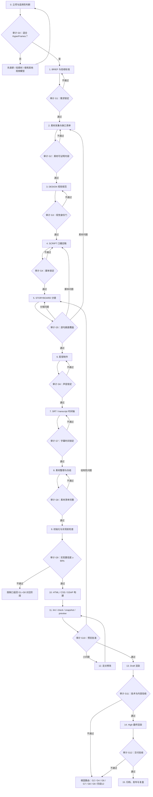

# HyperFrames 视频工程完整生成与审计 SOP

> 适用项目：Learn Heartstone 宣传片、教程片、版本介绍、玩法演示及后续同类视频。
> 文档状态：首版，依据抖音《HyperFrames正确使用流程》完整视频、口播转写与关键帧核对整理，并结合当前 HyperFrames 工程实践补充审计闭环。
> 核心原则：不要让 AI 猜视频；让 AI 执行一个已经策划、配音、定时、备齐素材并定义验收标准的视频工程。

## 1. 使用方式

以后每次生成视频，都应先建立本 SOP 规定的工程资料包，再进入 HyperFrames 实现。除非审计门明确通过，否则不得跳到下一阶段，也不得直接渲染最终版。

执行者可以是 Codex 或其他 AI coding agent；但脚本定稿、素材真实性、预览批准和最终发布必须由人确认。

## 2. 方法来源与项目补充

### 2.1 参考视频明确提出的方法

- HyperFrames 是 HTML 到视频的渲染框架，不是“一句话自动成片”的黑箱工具。
- 正确输入应包含口播稿、配音、字幕时间戳、分镜、素材路径、设计风格和验收标准。
- 推荐阶段为：采集素材 → 确定设计 → 脚本 → 分镜 → 配音与时间戳 → 构建工程 → 预览、校验、渲染。
- 第一版完成后要组合使用预览、结构校验和 snapshot 审计；修改时使用小范围、可定位的剪辑指令。本 SOP 按当前工具规则固定为 `lint → check → snapshot → final preview`。
- 教程标题、流程图、数据图表、网页/产品介绍、字幕包装、代码演示和 UI 动效适合 HyperFrames；复杂真人实拍、电影级镜头和随机 B-roll 应由录屏、素材库或其他视频模型先提供。

### 2.2 本 SOP 的工程化补充

- 使用当前 HyperFrames 的统一审计命令 `check` 代替旧版分散的 validate/inspect 流程；开发中仍可单独运行 lint 做快速反馈。
- 增加 `BRIEF.md`、`ACCEPTANCE.md`、`ASSET_MANIFEST.md`、`REVIEW_LOG.md`，使需求、验收、素材和修改记录均可追溯。
- 增加“依赖失效规则”：脚本、配音、时间轴或素材发生变化时，明确哪些下游产物必须重新生成和审计。
- 增加 draft render、FFprobe、音轨检查、关键帧接触表和交付归档。

## 3. 总流程



## 4. 标准工程资料包

每个视频工程至少应具有以下结构：

```text
VideoProject/
├─ BRIEF.md
├─ ACCEPTANCE.md
├─ DESIGN.md
├─ SCRIPT.md
├─ STORYBOARD.md
├─ RECORDING_PLAN.md            # 有真实操作/录屏时必备
├─ ASSET_MANIFEST.md
├─ REVIEW_LOG.md
├─ hyperframes.json
├─ index.html
├─ narration/
│  ├─ script.txt                # 从锁定 SCRIPT.md 导出的纯口播文本
│  ├─ narration.wav
│  └─ segments/                 # 需要分段配音时使用
├─ captions/
│  ├─ captions.srt
│  └─ transcript.json
├─ assets/
│  ├─ screenshots/              # 真实软件和游戏截图
│  ├─ recordings/               # 连续操作录屏
│  ├─ images/                   # 生成图、背景图、装饰图
│  ├─ cards/                    # 卡牌、角色或产品独立素材
│  ├─ bgm/
│  └─ sfx/
├─ snapshots/
├─ renders/
└─ source/                      # 原始资料，不直接在成片中引用
```

### 4.1 文件职责

| 文件 | 唯一职责 | 锁定时间 |
|---|---|---|
| `BRIEF.md` | 视频目的、受众、平台、比例、时长、信息边界 | G1 |
| `ACCEPTANCE.md` | 可判定的完成标准和禁止项 | G1，后续只能明确增补 |
| `DESIGN.md` | 色彩、字体、字幕、布局、动效语法、禁止风格 | G3 |
| `SCRIPT.md` | 最终口播文字，不承载画面说明 | G4 |
| `STORYBOARD.md` | 时间段、口播、画面、素材、动画、转场、审计点 | G5 |
| `RECORDING_PLAN.md` | Build SHA、测试存档、逐镜头操作、期望结果和重录条件 | G2 |
| `ASSET_MANIFEST.md` | 每个素材的路径、来源、用途、状态、版权/真实性 | G8 |
| `captions.srt` | 句级字幕时间轴 | G7 |
| `transcript.json` | 词级开始/结束时间；本 SOP 默认必备，用于同步验证和后续换音频 | G7 |
| `REVIEW_LOG.md` | 每次审计、问题、修改和通过记录 | 持续更新 |

## 5. 阶段 0：立项与适用性判断

### 输入

- 视频主题和业务目标。
- 已有素材类型：录屏、截图、卡图、实拍、数据、网页或文档。
- 发布平台和画面比例。

### 动作

1. 判断核心画面是否属于可控、清晰、可复现的信息表达。
2. 列出必须由真实素材证明的内容。
3. 列出 HyperFrames 无法凭空生成、必须外部提供的内容。

### 输出

- 一页立项说明，写入 `BRIEF.md` 的背景部分。
- 初始素材缺口列表。

### 审计 G0：适用性

通过条件：

- 主体可以由文字、图形、截图、录屏、卡牌、图表或已有视频构成。
- 复杂真人镜头或真实操作已经有来源，或有明确采集计划。
- 不要求 HyperFrames 凭空生成未经提供的真实玩法或人物镜头。

不通过：先录制、采购或生成外部素材，完成后重新进入 G0。

## 6. 阶段 1：需求与验收标准锁定

### `BRIEF.md` 必填项

- 视频名称、目的、目标观众。
- 发布平台、分辨率、比例、帧率、目标时长。
- 本次批准的 HyperFrames 固定版本。
- 一句话核心信息。
- 必须展示的功能和不得展示的内容。
- 是否需要旁白、字幕、BGM、音效。
- 是否需要 storyboard 评审和人工最终批准。

### `ACCEPTANCE.md` 必填项

验收条目必须可以回答“是/否”，不能只写“效果高级”“节奏舒服”。例如：

- 总时长在 58–62 秒。
- 输出 1080×1920、30fps、H.264 + AAC。
- 全程显示“测试版”。
- 每个功能声明都有真实画面或真实素材支撑。
- 不显示 Unity Console、开发者工具、个人路径或调试错误。
- 字幕不超过两行，并位于平台安全区内。
- 音轨没有削波、静音空段或明显爆音。

### 审计 G1：需求锁定

审计人：内容负责人。
通过条件：目的、平台、时长、必须项、禁止项和可判定验收标准均已确认。
不通过：禁止开始脚本和画面实现。

## 7. 阶段 2：素材采集

### 动作

1. 按 `ACCEPTANCE.md` 的每条功能声明反推所需证明素材。
2. 真实操作优先录制短片段，不尝试一次性录完整视频。
3. 每个关键动作保留操作前、操作中、操作后状态。
4. 清除通知、浏览器书签、个人信息、控制台和调试浮层。
5. 记录素材来源、分辨率、时长和可用范围。

### 录制技术规格（项目默认值）

- 录制来源：只捕获游戏/WebGL窗口，不录桌面、Unity Editor、终端或浏览器开发者工具。
- 源分辨率：优先 1920×1080；浏览器缩放固定 100%。
- 源帧率：60fps；最终视频仍可按 BRIEF 输出30fps。
- 编码：H.264，高质量恒定质量或足够高的码率；禁止二次压缩后的聊天软件转存素材。
- 鼠标：操作教学镜头显示鼠标；纯结果镜头可以隐藏，但必须在分镜中注明。
- 音频：游戏原声和系统音效按镜头需要录制；旁白在后期独立混合。
- 镜头手柄：每段操作开始前、结果出现后各保留至少1秒静止画面。
- 环境：通知关闭、个人账号信息遮蔽、无弹窗、无 Console、无调试路径。
- 竖屏预检：录完后立即放入1080×1920裁切模板，确认按钮、卡名和描述仍可读。
- 版本记录：每段录屏必须记录 Git commit/build SHA、运行入口和测试存档/场景编号。

推荐工具可使用 OBS 或系统录屏；工具不是验收重点，输出规格和可复现性才是。

### Learn Heartstone 必须录制的连续素材

- 选择种族并确认。
- 选择英雄并进入酒馆。
- 购买、刷新、拖拽上场和调整站位。
- 三张同名随从触发三连，打开普通/金色详情对比。
- 准备阶段触发、亡语、召唤物和衍生物三连结算。
- 战斗回放的攻击指针、时间轴和逐步播放。
- 卡牌库五本筛选、搜索布莱恩、加载更多。
- 完整阵容进入战斗的结尾镜头。

### Learn Heartstone 逐镜头录制表

正式录制前，将下表复制进 `STORYBOARD.md` 或独立 `RECORDING_PLAN.md` 并补全。若项目尚无可复现测试存档/场景注入，先建立 fixture，禁止依赖随机刷新反复碰运气。

| 镜头 ID | Build SHA | 前置存档/测试场景 | 操作步骤 | 期望结果 | 前后保留 | 失败重录条件 | 输出文件名 |
|---|---|---|---|---|---|---|---|
| LH-R01 | 待填 | 开始界面固定存档 | 选择5个种族并确认 | 显示已选5/5并进入下一步 | 各1秒 | 选项未完整显示、鼠标遮字 | `scene-03-tribe-selection-clean.mp4` |
| LH-R02 | 待填 | R01结束状态 | 选择英雄并确认 | 英雄与技能清晰可见，进入酒馆 | 各1秒 | 技能文字不可读、转场卡顿 | `scene-03-hero-selection-clean.mp4` |
| LH-R03 | 待填 | 固定3金币/商店/手牌 fixture | 购买→刷新→拖拽上场→调整站位 | 四个动作均有明确状态变化 | 各1秒 | 任一步失败或画面被浮层遮挡 | `scene-04-buy-refresh-position.mp4` |
| LH-R04 | 待填 | 三张同名随从 fixture | 加入第三张→三连→打开详情 | 普通/金色属性和描述差异可读 | 各1.5秒 | 未稳定触发、描述停留不足 | `scene-05-triple-golden-description.mp4` |
| LH-R05 | 待填 | 固定亡语/准备阶段阵容 fixture | 进入结算并逐步观察 | 准备触发、亡语、召唤、衍生物三连顺序清楚 | 各1秒 | 结算过快、日志/顺序不可读 | `scene-06-resolution-order.mp4` |
| LH-R06 | 待填 | 已完成战斗回放 fixture | 播放/暂停/逐步/拖动时间轴 | 攻击指针、死亡、召唤记录清晰 | 各1秒 | 时间轴或事件被裁切 | `scene-07-combat-replay-controls.mp4` |
| LH-R07 | 待填 | 完整卡池 fixture | 筛选5本→搜索布莱恩→加载更多 | 布莱恩出现，加载后列表连续 | 各1秒 | 卡牌未显示、筛选条件不可读 | `scene-08-library-tier5-brann.mp4` |
| LH-R08 | 待填 | 完成阵容 fixture | 点击开始战斗 | 阵容完整、无弹窗，双方开打 | 前1秒/后2秒 | 阵容被遮挡或出现调试信息 | `scene-09-enter-combat-final.mp4` |

### 审计 G2：素材覆盖

逐条对照验收标准：

| 检查项 | 通过标准 |
|---|---|
| 真实性 | 素材来自当前可运行版本，不伪造 UI 和功能 |
| 完整性 | 每项声明至少有一份可用素材 |
| 连续性 | 操作型功能有连续录屏，而不是只靠静态截图 |
| 清洁度 | 无调试信息、隐私和无关弹窗 |
| 可读性 | 手机竖屏裁切后关键文字仍能识别 |

任一关键功能无素材：退回阶段 2，不得用装饰画面代替证明。

## 8. 阶段 3：视觉规范

`DESIGN.md` 至少包含：

- 视觉定位和情绪。
- 主色、辅助色、背景色、正文色和警示色。
- 字体及本地可渲染的后备字体。
- 标题、字幕、角标、信息卡的字号和安全区。
- 横屏素材在竖屏中的 contain/crop 规则。
- 场景入口、场景内运动、转场和最终淡出规则。
- 明确禁止的风格，例如蓝紫霓虹、通用 AI 渐变、过量粒子、持续闪烁。

### 审计 G3：Visual Identity Gate

通过条件：在写 composition HTML 前，`DESIGN.md` 已存在；颜色、字体、排版、素材裁切和动效语言均可执行。
不通过：不得开始 HTML 实现。

## 9. 阶段 4：口播脚本定稿

### 动作

1. 先写内容结构，再写完整口播。
2. 每段只承担一个信息目标。
3. 所有功能表述必须与当前版本一致。
4. 朗读并计时，按照目标时长删减。
5. 删除需要 AI 自行补事实的模糊表述。

### 推荐结构

- 0–3秒：问题或结果钩子。
- 3–8秒：产品是什么。
- 中段：按用户操作或机制因果依次展示。
- 倒数5–8秒：总结、测试版状态和非官方声明。

### 审计 G4：脚本锁定

通过条件：

- 事实与当前版本一致。
- 朗读时长留出转场和停顿空间。
- 每句话都可以在素材库中找到对应证明。
- 口播已经人工确认，状态标记为 `LOCKED`。

脚本锁定后再改文字，会使配音、SRT、transcript 和分镜失效，必须按第 21 节依赖规则重做。

## 10. 阶段 5：分镜

`STORYBOARD.md` 使用下表逐段填写：

| 场景 | 时间 | 口播 | 主画面 | 素材路径 | 字幕 | 动画 | 转场 | 审计点 |
|---|---:|---|---|---|---|---|---|---|
| S01 | 00:00–00:03 | … | … | `assets/...` | … | … | … | 画面能否证明口播 |

### 分镜规则

- 每句口播必须有明确画面，不允许“AI 自行找合适素材”。
- 每个素材必须填写真实本地路径。
- 每场只安排一个主运动，避免截图同时缩放、旋转和漂移。
- 转场服从叙事关系：翻面适合卡牌/正反对比，Push 适合步骤推进，光漏适合庆祝或升档，模糊溶解适合焦点切换。
- 非最终场景不得提前做退出动画；退出由场景交界统一处理。

### 审计 G5：逐句覆盖

通过条件：脚本每句话均能追溯到场景、素材、字幕和时间段；场景总时长与目标一致；没有素材占位符。
不通过：退回脚本或素材阶段，不允许让实现阶段补策划。

## 11. 阶段 6：配音

### 动作

1. 使用锁定后的 `SCRIPT.md` 录制真人音频或外部 TTS。
2. 输出无削波、无环境噪声、响度一致的 WAV。
3. 如果分段生成，建立音频清单，记录每段文本、文件、时长和计划开始时间。
4. 不满意内置声音时应更换工具或真人录制，不要让低质量声音进入后续工程。
5. 从锁定后的 `SCRIPT.md` 导出 `narration/script.txt`；该文件只含需要朗读的纯文本，不得包含 Markdown 标题、分镜说明或审计备注。

### 可执行的配音路径

任选一种，并在 `REVIEW_LOG.md` 记录工具、声音、速度和版本：

1. 真人录音：录制为 WAV，后续统一响度。
2. 外部 TTS：导出无背景音乐的独立 WAV。
3. HyperFrames 本地 TTS（环境支持时）：

```powershell
$hfVersion = "0.7.62"  # 示例；必须与 BRIEF 中批准的版本一致
npx --yes "hyperframes@$hfVersion" tts narration\script.txt `
  --voice zf_xiaobei --lang zh `
  --output narration\raw-narration.wav
```

统一转换为项目母带：

```powershell
ffmpeg -y -i narration\raw-narration.wav `
  -af "loudnorm=I=-16:LRA=7:TP=-1.5" -ar 48000 -ac 1 `
  narration\narration.wav
```

项目默认规格：48kHz、单声道 PCM WAV；旁白目标响度约 -16 LUFS，true peak 不高于 -1.5dBTP。最终与BGM/SFX混音后再次检查整体响度。

### 审计 G6：声音锁定

- 文本与 `SCRIPT.md` 一致。
- 发音、停顿和语速自然。
- 时长适配分镜。
- 音量无明显忽高忽低。
- 状态标记 `VOICE LOCKED`。

不通过：只重录问题句；除非脚本本身错误，不回到整篇改写。

## 12. 阶段 7：字幕与词级时间轴

### 产物

- `captions/captions.srt`：句级字幕，必备。
- `captions/transcript.json`：词级时间戳，本 SOP 默认必备，即使当前版本不做逐词动画也要保留，便于同步审计和后续重剪。格式示例：

```json
[
  { "id": "w0", "text": "选择", "start": 8.45, "end": 8.78 },
  { "id": "w1", "text": "种族", "start": 8.78, "end": 9.16 }
]
```

### 动作

1. 从最终配音生成 SRT。
2. 始终生成词级 JSON；需要逐词高亮、关键词弹跳、数字强调时直接消费该文件，不再重新估时。
3. 人工校正产品名、卡牌名、英文缩写和专有名词。
4. 删除音乐符号、乱码、短促幻听和空白条目。

### 可执行的字幕路径

稳定优先方案：将最终 `narration.wav` 导入剪映/CapCut或其他成熟字幕工具，人工校对后导出 UTF-8 SRT。

本地 ASR 环境可用时：

```powershell
$hfVersion = "0.7.62"  # 示例；必须与 BRIEF 中批准的版本一致
New-Item -ItemType Directory -Path captions -Force | Out-Null
npx --yes "hyperframes@$hfVersion" transcribe narration\narration.wav `
  --dir captions --model small --language zh
npx --yes "hyperframes@$hfVersion" transcribe captions\transcript.json `
  --to srt --output captions\captions.srt
```

第一条命令的规范化输出必须为 `captions/transcript.json`，内容是本节示例所示的扁平词数组；第二条命令从它导出 SRT。执行后至少验证：

```powershell
$words = Get-Content -Raw -Encoding UTF8 captions\transcript.json | ConvertFrom-Json
if ($words.Count -eq 0 -or $null -eq $words[0].start -or $null -eq $words[0].end) {
  throw "transcript.json 不是有效的词级时间数组"
}
```

若当前固定版本或本机 whisper 构建链不支持，应使用外部 ASR 或 faster-whisper，最终仍须转换为同一扁平 schema 并保存到上述路径；不得退回到人工凭感觉估时间。生成方式、模型和转换脚本必须写入 `REVIEW_LOG.md`。

### 审计 G7：时间轴锁定

- 字幕文字与配音一致。
- 句级时间没有覆盖、倒序或超出音频。
- 抽查开头、中间、结尾至少三段同步。
- 单屏字幕不超过两行，移动端可读。
- 产品名和专有名词识别正确。

不通过：修正字幕/转写；不得通过调整画面掩盖错误时间轴。

## 13. 阶段 8：素材整理与冻结

### 命名规则

推荐：`scene-<编号>-<用途>-<状态>.<扩展名>`。

示例：

- `scene-03-tribe-selection-clean.mp4`
- `scene-05-minion-normal.png`
- `scene-05-minion-golden.png`
- `scene-08-brann-tier5-search.mp4`

### `ASSET_MANIFEST.md` 表格

| ID | 文件路径 | 类型 | 场景 | 来源 | 真实性/版权 | 状态 |
|---|---|---|---|---|---|---|
| A001 | `assets/recordings/...` | 录屏 | S03 | 当前 WebGL | 自有录制 | approved |

### 审计 G8：素材冻结

- 分镜中所有路径实际存在。
- 没有重复、模糊或无法理解的文件名。
- 图片尺寸和视频时长已检查。
- 关键素材没有调试遮挡。
- 清单状态均为 approved 或有明确替代方案。

通过后进入实现，素材路径不应随意移动。

## 14. 阶段 9：初始化与实现前检查

### 初始化

```powershell
$hfVersion = "0.7.62"            # 示例；立项时确认并写入 BRIEF/REVIEW_LOG
node --version                    # 必须 >= 22
ffmpeg -version
npx --yes "hyperframes@$hfVersion" doctor
npx --yes "hyperframes@$hfVersion" init your_video_project `
  --example blank --resolution portrait --non-interactive
Set-Location your_video_project
```

先确保 `DESIGN.md` 已准备好，再编写或修改 composition HTML。

`init` 会在 `package.json` 中固定 HyperFrames 版本。之后优先使用项目的 npm scripts，不要让每次命令临时漂移到不同版本。若需要 lint/snapshot 等未提供的脚本，应新增一个与 package.json 现有版本完全相同的 `hf` 脚本，例如：

```json
{
  "scripts": {
    "hf": "npx --yes hyperframes@0.7.62",
    "check": "npx --yes hyperframes@0.7.62 check",
    "render": "npx --yes hyperframes@0.7.62 render"
  }
}
```

上例的 `0.7.62` 只是示例；必须复制当前项目 `package.json` 已固定的版本。现有项目在首次影响渲染的工作前，可先只读检查升级差异：

```powershell
npx hyperframes@latest upgrade --project . --check
```

只有决定升级并在升级后重新通过 `npm run check`、snapshot 和 draft render，才能保留新版本；否则继续使用原固定版本。

### 实现前置信度检查

至少确认：

- 仓库中没有重复工程或可直接复用的实现。
- HyperFrames 版本、Node.js、FFmpeg 和浏览器环境可用。
- 素材、脚本、配音、时间轴、分镜和验收标准齐全。
- 所有必须证明的功能均有真实素材。
- 预计实现置信度达到 90%。

### 审计 G9：可以开始实现

任一关键输入缺失时，禁止用临时占位或 AI 猜测继续；应退回对应阶段。

## 15. 阶段 10：构建 HyperFrames 工程

### 实现要求

- 所有定时元素使用 `class="clip"`。
- 定时元素声明 `data-start`、`data-duration`、`data-track-index`。
- 根 composition 定义宽度、高度和总时长。
- GSAP timeline 必须 `paused: true` 并注册到 `window.__timelines`。
- 只使用确定性动画；禁止 `Math.random()`、`Date.now()` 和无限循环。
- 视频媒体使用 `muted playsinline`，音频单独由 `<audio>` 承载。
- 视频和音频媒体元素放在根宿主 composition 中；不要把需要被发现和编码的媒体藏在未挂载的子模板里。
- 只引用清单中批准的本地素材。
- 每个场景具有入口动画，场景交界具有明确转场。
- 字幕由 SRT/transcript 时间轴驱动，不重新凭感觉估时。
- 每个真实录屏场景必须定义一个可见中点 snapshot；黑屏、未解码、只有占位背景或媒体时长为0时直接阻断 render。

### 开发中快速审计

完成第一版 HTML 和结构性改动后运行：

```powershell
npm run hf -- lint
```

lint 错误必须立即修复，避免问题累积到最终检查。

## 16. 阶段 11：预览与完整审计

### 16.1 最终检查

当前 HyperFrames 推荐使用统一命令：

```powershell
npm run check
```

它用于检查结构、运行时错误、失败资源、布局、动效断言和可读性。参考视频中的 validate/inspect 属于旧式分散表达；新工程文档统一写 `check`。

### 16.2 关键帧快照

```powershell
npm run hf -- snapshot --at 1.5,5,12,20,30,45,58
```

每个场景至少抽查一个稳定中段；每种转场至少抽查一次峰值或中点。

### 16.3 Studio 预览

```powershell
npm run dev
```

### 审计 G10：预览批准

人工依次检查：

1. 每段画面是否准确对应当前口播。
2. 是否出现没有证据支撑的功能声明。
3. 字幕是否被平台 UI、卡牌、按钮或安全区遮挡。
4. 关键文字是否停留足够时间。
5. 动效是否过快、过慢或同时发生过多运动。
6. 转场是否遮挡 UI 太久、产生黑帧或闪烁。
7. 卡图、人物和截图是否被错误裁切。
8. “测试版”和非官方声明是否正确。
9. 音频是否同步、是否有静音或重叠。

只有明确人工批准后，才允许进入 draft render。

预览失败不能只按表面症状处理：事实错误回 G4，缺少证明素材回 G2，声音问题回 G6，字幕同步问题回 G7，素材路径/版本问题回 G8，工具环境问题回 G9，只有纯布局和动画问题才进入阶段12。

## 17. 阶段 12：定点修改

修改指令使用“场景 + 对象 + 动作 + 幅度 + 验证点”：

```text
场景 S04：将主标题字号提高 20%，保持两行以内；
字幕整体上移 60px，不能覆盖底部按钮；
只修改 S04，不改变其他场景时间线；
修改后在 18秒和22秒生成 snapshot 验证。
```

推荐修改示例：

- “S02 标题放大20%。”
- “S03 字幕上移50px。”
- “S04 转场改为 Push Slide，时长0.55秒。”
- “S06 背景亮度降低15%，卡牌保持不变。”

禁止：

- “整体再高级一点。”
- “全部重做得更有感觉。”
- 在小问题上推翻全部 HTML 和时间线。

每次修改写入 `REVIEW_LOG.md`，并重新运行受影响时间点的 lint/check/snapshot。

### 根因退回表

| 发现的问题 | 退回位置 | 重新通过的最小审计范围 |
|---|---|---|
| 功能声明或事实错误 | G4 脚本 | G4–G12 |
| 缺少真实操作/证明素材 | G2 素材 | G2、G5、G8–G12 |
| 设计体系错误或全片不一致 | G3 视觉规范 | G3、G5、G9–G12 |
| 发音、停顿、语速或音质问题 | G6 配音 | G6、G7、G10–G12 |
| 字幕文字或时间轴错误 | G7 字幕 | G7、G10–G12 |
| 素材损坏、路径失效、版本错误 | G8 素材冻结 | G8–G12 |
| Node/FFmpeg/浏览器/CLI问题 | G9 环境 | G9–G12 |
| 单场布局、裁切、亮度、动画或转场 | 阶段12 | 受影响场景 lint/check/snapshot、G10–G12 |
| 编码、音轨、分辨率、帧率问题 | 阶段13/14命令或G9环境 | G11–G12 |

## 18. 阶段 13：Draft 渲染

```powershell
npm run render -- --quality draft --fps 30 --output renders/draft.mp4
```

### 审计 G11：Draft 技术与内容验收

使用 FFprobe 检查：

```powershell
ffprobe -v error -show_entries format=duration,size,bit_rate `
  -show_entries stream=codec_name,codec_type,width,height,r_frame_rate,sample_rate,channels `
  -of json renders/draft.mp4
```

必须确认：

- 时长、分辨率、帧率和编码正确。
- MP4 同时包含视频流和音频流。
- 完整播放无黑帧、卡顿、闪屏、爆音和字幕错位。
- 开头3秒钩子成立，结尾信息完整。
- 关键操作画面足以让陌生观众理解。

不通过：记录精确时间点并回到定点修改，不直接渲染 high。

## 19. 阶段 14：最终渲染与交付

```powershell
npm run render -- --quality high --fps 30 `
  --output renders/final-1080x1920-high.mp4
```

### 审计 G12：最终交付

- 再次 FFprobe 验证技术规格。
- 计算 SHA256，确保传输后可校验。
- 抽取最终版开头、中段、结尾和全部转场关键帧。
- 确认最终版音轨存在且响度可接受。
- 确认文件名、版本号和发布日期明确。
- 确认最终版与已批准 draft 内容一致。

交付内容至少包括：

- 高质量 MP4。
- HyperFrames 工程目录。
- `BRIEF.md`、`DESIGN.md`、`SCRIPT.md`、`STORYBOARD.md`、`ACCEPTANCE.md`。
- captions、transcript、素材清单。
- snapshots 接触表。
- `REVIEW_LOG.md` 和最终校验信息。

## 20. 阶段 15：归档、发布与复盘

### 归档

建立只读交付目录，至少保存：

- 最终 high MP4、draft MP4和最终 SHA256。
- 完整 HyperFrames 工程和固定版本 `package.json`。
- BRIEF、ACCEPTANCE、DESIGN、SCRIPT、STORYBOARD、RECORDING_PLAN、ASSET_MANIFEST、REVIEW_LOG。
- narration、SRT、transcript、批准素材和关键帧接触表。
- 发布标题、封面、文案、平台和发布日期。

最终 SHA256 生成后，不得再覆盖同名 MP4；任何修改都应生成新版本号并重新通过 G12。

### 发布前检查

- 账号、链接、测试版措辞和非官方声明正确。
- 封面和前3秒与成片内容一致，不制造未实现功能预期。
- 平台压缩后抽查字幕、声音和细小 UI 的可读性。
- 已确认素材版权、隐私和内部信息边界。

### 复盘

记录：

- 哪些场景返工最多，根因在哪个上游阶段。
- 哪些素材、动画或审计规则可复用。
- 实际时长、渲染时间、文件大小和发布反馈。
- 是否需要更新本 SOP、项目模板或 HyperFrames recipe。

归档完成后，任务才算真正结束。

## 21. 依赖失效与退回规则

| 发生变化 | 必须重新生成/检查 | 自动撤销的通过状态/产物 |
|---|---|---|
| `BRIEF.md` 的目标、平台或时长 | 验收、设计、脚本、分镜、声音、时间轴和全部下游 | G1–G12；全部 preview/draft/high/SHA256 |
| `SCRIPT.md` 文字 | 配音、SRT、transcript、分镜时间、HTML、预览 | G4–G12；全部 preview/draft/high/SHA256 |
| 配音文件 | SRT、transcript、音频时长、场景时间、预览 | G6、G7、G10–G12；全部 draft/high/SHA256 |
| SRT/transcript | 字幕渲染、关键词动画、check、snapshot | G7、G10–G12；全部 draft/high/SHA256 |
| 素材内容或路径 | 素材清单、真实性/版本、分镜路径、资源检查、受影响场景快照 | G2、G8、G10–G12；相关 preview 及全部 draft/high/SHA256 |
| `DESIGN.md` | 全部场景的视觉一致性审计 | G3、G5、G9–G12；全部 preview/draft/high/SHA256 |
| 单个场景布局/动画 | 受影响场景和相邻转场的 lint/check/snapshot | G10–G12；全部 draft/high/SHA256 |
| HyperFrames 版本升级 | 全量 check、关键帧对比、完整 preview、draft render | G9–G12；全部 high/SHA256 |

原则：上游产物一旦变化，下游的“已通过”状态自动失效，必须重新审计。

## 22. `REVIEW_LOG.md` 记录格式

```markdown
## Review 2026-07-18-01

- 阶段：G10 预览批准
- 审计人：
- 结果：FAIL / PASS
- 时间点：00:18.4
- 问题：S04 字幕覆盖底部按钮
- 修改要求：字幕上移60px；不改其他场景
- 退回阶段：12 定点修改
- 验证：18秒和22秒 snapshot + check
- 完成提交/文件：
```

## 23. 交给 Codex 的标准总提示词

```text
请使用 HyperFrames 相关技能，严格按照本视频工程中的文件执行，
不要从零猜测视频内容，也不要编造任何素材路径或功能画面。

必须先完整读取：
BRIEF.md
ACCEPTANCE.md
DESIGN.md
SCRIPT.md
STORYBOARD.md
RECORDING_PLAN.md（项目包含真实录屏时）
ASSET_MANIFEST.md
captions/captions.srt
captions/transcript.json
以及 assets/ 下已批准的本地素材。

输出规格以 BRIEF.md 为准。字幕必须跟随最终配音时间轴。
所有功能声明只能使用 ASSET_MANIFEST.md 中批准的真实素材证明。

执行顺序：
1. 检查输入完整性和实现置信度；不足时停止并报告缺口。
2. 初始化或恢复 HyperFrames 工程。
3. 按 STORYBOARD.md 实现场景、动画和转场。
4. 开发中运行 lint。
5. 完成后运行 check，并在分镜审计点生成 snapshot。
6. 启动最终 preview，等待人工批准。
7. 批准后先渲染 draft，并用 FFprobe 验证。
8. draft 通过后再渲染 high 最终版。

修改必须采用场景级定点修改，不得因局部问题推翻整个工程。
未经人工预览批准，不得渲染最终版。
```

## 24. Learn Heartstone 下一版视频的建议执行顺序

现有截图动态剪辑版可以保留为视觉原型，但若要达到“完整玩法宣传片”，应按以下顺序补齐：

1. 在视频工程内建立正式 `BRIEF.md` 和 `ACCEPTANCE.md`，先锁定连续操作、字幕、安全区、真实性和交付规格。
2. 对照验收标准建立素材缺口和 `RECORDING_PLAN.md`，使用固定 build SHA、测试存档/fixture 和逐镜头操作表完成真实录屏。
3. 复用并重新审计现有暖金酒馆 `DESIGN.md`，确认真实录屏在竖屏中的裁切规则。
4. 把现有宣传脚本迁入工程并修订为正式 `SCRIPT.md`，在素材可覆盖后锁定文字。
5. 根据锁定脚本建立逐句 `STORYBOARD.md`，填写口播→画面→素材路径→动画→转场→审计点。
6. 使用最终口播生成完整 narration，人工批准后锁定。
7. 从最终 narration 生成并人工校正 SRT 和词级 transcript。
8. 将素材按 screenshots/recordings/cards/narration 分类，建立 `ASSET_MANIFEST.md` 并通过 G8。
9. 在实现置信度达到90%后，重建以真实录屏为主、截图和卡图为补充的第二版。
10. 按 `lint → check → snapshot → final preview → draft → high` 完成 G10–G12。

## 25. 最终检查清单

### 策划与输入

- [ ] BRIEF 已锁定。
- [ ] 验收标准均可判定。
- [ ] DESIGN 已通过 Visual Identity Gate。
- [ ] SCRIPT 已定稿。
- [ ] STORYBOARD 覆盖每句口播。
- [ ] 真实录屏项目具有 RECORDING_PLAN、Build SHA 和可复现 fixture。
- [ ] 配音已人工批准。
- [ ] SRT 和 transcript 已校正。
- [ ] 素材清单无缺口和占位符。

### 实现与审计

- [ ] 实现置信度 ≥ 90%。
- [ ] 所有素材使用真实本地路径。
- [ ] lint 无错误。
- [ ] check 通过。
- [ ] 每场景和每类转场都有 snapshot。
- [ ] Studio preview 已人工批准。
- [ ] 所有修改记录在 REVIEW_LOG。

### 渲染与交付

- [ ] Draft 完整播放通过。
- [ ] FFprobe 规格正确且音视频流存在。
- [ ] High 最终版已生成。
- [ ] 最终版关键帧和音轨复查通过。
- [ ] SHA256 已记录。
- [ ] 工程、文档、素材、字幕和成片已归档。

## 26. 结论

稳定的 HyperFrames 视频不是从“一句提示词”开始，而是从一套已审计的资料包开始。真正可复用的流程是：

> 先明确目标和验收 → 采集真实素材 → 锁定设计与脚本 → 完成分镜 → 锁定配音和时间轴 → 冻结素材 → 让 Codex 按文件实现 → check/snapshot/preview 审计 → 定点修改 → draft 验收 → high 交付 → 归档复盘。

这份 SOP 应作为后续视频任务的默认执行规范；任何跳步都需要在 `REVIEW_LOG.md` 中说明原因和风险。

## 27. 来源与置信度

### 主要来源

1. [抖音：HyperFrames正确使用流程](https://www.douyin.com/video/7646216565277210286) — 方法原则、七步流程、文件包、素材整理、预览审计、定点修改和适用边界。
2. [HyperFrames 官方文档入口](https://hyperframes.heygen.com/) — 当前 composition、check、preview、snapshot 和 render 工作流。
3. [HyperFrames LLM 文档索引](https://hyperframes.heygen.com/llms.txt) — 官方机器可读文档入口。

### 本地证据

- 完整参考视频：`.planning/douyin-video-generation-workflow/source/douyin-reference.mp4`
- 中文转写：`.planning/douyin-video-generation-workflow/transcript-faster-whisper.json`
- 关键帧接触表：`.planning/douyin-video-generation-workflow/frames/contact-sheet-20.jpg`
- 当前工程：`PromoVideo/LearnHeartstoneTestVersion/`

### 置信度

高。参考视频已完整下载，页面章节、355秒原声转写和20帧画面相互印证；部分 ASR 专有名词错误已按画面与上下文校正。新版命令差异以当前 HyperFrames CLI/技能说明为准。
