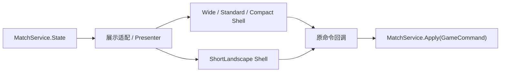
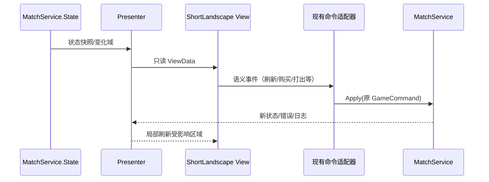

# 手机 UI Shell / ShortLandscape 重构制作规格

> 文档状态：可进入实施评审
> 目标版本：首期以 844×390 横屏酒馆主界面为基准
> 适用技术：Unity 6、uGUI、现有 UnityStyle 主题与 Prefab 体系
> 核心原则：只换 UI 壳层与布局编排，不改变游戏业务逻辑、数据和对外接口

## 1. 执行结论

本次应重构“手机端 UI Shell、布局组件、响应式策略和展示层”，不全量重写 UI，更不重写游戏逻辑。

首个交付对象是 `ShortLandscape` 下的酒馆主界面。它复用现有卡牌、商店、战场、手牌、拖拽、回放和弹窗组件，将原先由单一主控制器集中创建的界面拆成常驻 Shell、局部 Presenter、Drawer 和统一 Modal Root。主界面稳定后，再按同一规则迁移对手编辑、工具、开局配置、攻略选择和版本中心。

必须保持不变的边界：

- `MatchService`、`GameCommand`、命令执行顺序、规则计算、数据库和存档格式不变。
- 原按钮、拖拽和选择行为继续调用同一命令或回调；成功后的状态、日志、错误结果不变。
- 已有卡牌、Zone、战斗回放、发现、选择、工具等组件优先复用，不复制一套手机业务实现。
- 安全区、DPI、Canvas Scaler、输入系统、触控尺寸换算、移动键盘避让和减少动态效果基础继续使用。
- 桌面 `Wide`、`Standard` 和普通 `Compact` 行为在首期不做产品重排。

本项目不应建立长期并行的“Mobile V2”入口。桌面和手机必须进入同一路由、读取同一状态、转发同一命令，只由 LayoutContext 选择不同 Shell 编排。

## 2. 文档用途与完成定义

本文是制作规格，不是概念稿。实施人员应能仅依据本文回答以下问题：

1. 哪些代码和业务接口绝对不能改。
2. `ShortLandscape` 如何判定，与现有 `Compact` 如何兼容。
3. 844×390 下每个主区域放在哪里、显示什么、折叠什么。
4. 每个已有窗口、工具、机制和状态迁移到哪里。
5. 弹层如何遮罩、阻断输入、管理焦点与返回键。
6. 主控制器如何拆分，哪些组件和 Prefab 继续复用。
7. 每个实施阶段修改什么、通过什么测试才可以进入下一阶段。
8. 如何证明重构前后相同操作产生相同业务状态。

本文完成定义包括：范围、信息架构、尺寸体系、组件职责、全功能覆盖矩阵、交互状态、实施批次、测试矩阵、发布回滚和最终验收清单均有明确规定。

## 3. 事实来源与优先级

实现前应同时参考以下仓库资料；若旧方案与本文冲突，以“现行业务代码和测试 > 本文已明确的新决策 > 旧设计文档”的顺序处理：

- [全局产品要求](TavernSimulatorGlobalRequirements.zh-CN.md)
- [现有 UI 综合改进计划](UnityUiComprehensiveImprovementPlan.md)
- [窗口级主题重设计清单](UnityUiThemeRedesignByWindowPlan.zh-CN.md)
- [Prefab UI 实施计划](UnityPrefabUiImplementationPlan.md)
- [UGUI 优化审计](UguiOptimizationAuditPlan.zh-CN.md)
- [玩家视角测试标准](TavernPlayerPerspectiveTestingStandard.zh-CN.md)
- [测试套件总览](testing/test-suite-overview.zh-CN.md)
- [2026-08-13 手机端滚动栏热修](Releases/2026-08-13-mobile-onepage-rail-hotfix.md)
- [2026-08-14 手机端尺寸换算热修](Releases/2026-08-14-mobile-picker-windows-web-release.md)

旧主题文档中 P01–P05、S01–S05、T01–T29、C01–C08 是功能覆盖基线，但其中“只保留三档响应式”和旧 Main Hub 模块数量已经过时。本文正式新增 `ShortLandscape`，并以当前实际路由为准。

## 4. 范围、非目标与不变量

### 4.1 本次重构范围

- `UnityTavernLayoutMode`、`UnityTavernLayoutContext` 和 UI 尺寸令牌的短横屏扩展。
- 酒馆主屏的顶部状态、商店、己方战场、手牌抽屉、主操作和更多菜单编排。
- 对手编辑的“战场 / 机制 / 手牌”三分页表达。
- 卡牌详情底部面板、工具抽屉、全屏任务页和统一阻塞弹层。
- 主控制器的展示职责拆分、常驻 UI 树和局部刷新边界。
- Setup、Main Hub、Strategy Guides、Version Center 等次级页面的后续迁移规范。
- 844×390 为核心的几何、层级、输入、业务契约和截图回归测试。

### 4.2 明确不做

- 不修改卡牌规则、战斗模拟、购买/出售/打出规则或数据库结构。
- 不修改公共 `GameCommand` 类型、参数语义或 `MatchService.Apply(...)` 返回语义。
- 不迁移 UI Toolkit，不引入新的 UI 框架，不为本次重构增加第三方布局依赖。
- 不重画全部卡牌和已有主题资源；可调整密度、裁切与缩放，不另造业务组件。
- 不把调试功能删掉；只改变入口、层级和在手机上的呈现方式。
- 不以减小到不可读字号、取消禁用原因、隐藏关键状态的方式换取“放得下”。
- 不在首期重排桌面端，也不承诺竖屏完成完整酒馆操作；当前产品仍以横屏为游戏主方向。

### 4.3 业务与行为不变量

| 不变量 | 验证方式 |
|---|---|
| UI 只读取 `MatchService.State` | 静态检查 Presenter/View 不直接写领域对象 |
| 状态修改只走现有 `Apply(GameCommand)`、`ApplyBatch`、`ApplyAndOpenReplay` 或原查询入口 | 命令映射测试与代码审查 |
| 相同初始状态 + 相同操作序列 = 相同最终状态、日志和错误 | 重构前后契约快照测试 |
| UI 本地状态只包含选择、抽屉、弹层、筛选、滚动、回放帧等视觉状态 | ViewState 类型审查 |
| 失败命令不伪造成功动画、不提前改领域状态 | 失败旅程测试 |
| 输入锁、目标选择和待处理选择遵守现有规则 | PlayMode Raycast 与状态测试 |

## 5. 当前问题与量化依据

### 5.1 844×390 不是“再缩小一点”可以解决

现有 Compact Canvas 以宽度匹配。以参考宽 1920 计算：

```text
Canvas scale ≈ 844 / 1920 = 0.4396
有效 Canvas 高 ≈ 390 / 0.4396 = 887.2 units
```

现有 Compact 的四个主要 Zone 固定高度约为：

```text
商店 240 + 对手战场 118 + 己方战场 200 + 手牌 140 = 698 units
```

698 还没有包含顶部状态、攻略 HUD、效果架、动作栏、标题、间距和安全区；完整主界面最低需求约 720 units 以上。现场开启攻略提示后，可用于主内容的高度约 593 units，因此布局溢出是确定结果。继续在同一棵纵向树上改几个 `preferredHeight`，只会把遮挡转移到别的状态。

### 5.2 Compact 的语义过宽

当前模式只有 `Wide / Standard / Compact`，Compact 同时覆盖窄桌面窗口、手机横屏和低高度窗口。它能表达“空间较少”，却不能表达短横屏的核心事实：纵向空间极端稀缺、横向空间仍可用于滚动与分栏。

### 5.3 主控制器承担过多布局职责

`UnityTavernTrainerController.cs` 约 650 KB，集中编排主桌、商店、双方战场、手牌、攻略 HUD、右侧信息、卡库、工具、对手编辑、英雄选择、随从编辑、发现、机制选择、时空酒馆、回放、Toast、Tooltip、拖拽和目标选择。`PerformRebuild()` 会清理并重新建立主树及所有浮层。

这会造成四类风险：

- 改一个窗口可能改变另一窗口的层级和输入。
- 局部筛选、回放推进或状态变化容易触发无关区域重建。
- Modal、Drawer、Toast 和 Drag 共用动态层级，容易穿透或互相遮挡。
- 超大测试依赖对象名和整树形态，阻碍逐步迁移。

### 5.4 现有测试无法发现核心视觉问题

已有 844×390 测试主要确认对象存在、截图成功、部分控件达到最小高度。截图辅助断言没有系统检测：

- Rect 是否超出 SafeArea。
- 不应重叠的区域是否相交。
- 阻塞弹层是否处于最高可交互层。
- 底层战场/手牌是否仍能收到点击。
- 抽屉展开、键盘出现、长中文和错误态是否仍可操作。

本次必须新增几何和输入契约，截图只作为最后一层视觉证据。

## 6. 总体目标架构

### 6.1 单一业务入口，多个布局 Shell



两个 Shell 不持有两套业务逻辑。Presenter 从同一状态生成展示数据，View 只发出语义化 UI 事件，现有控制器或命令网关把事件转成原命令。

### 6.2 建议运行时层级

```text
UnityTavernRoot
├─ BackgroundLayer                 非交互背景，raycastTarget=false
├─ SafeAreaRoot
│  ├─ DesktopShellHost             Wide / Standard / Compact
│  └─ ShortLandscapeShellHost      新短横屏 Shell
│     ├─ TopStatusBar
│     ├─ ShopRegion
│     ├─ PlayerBoardRegion
│     └─ HandDrawerDock
├─ HudOverlayRoot                  紧急提示、目标步骤，不阻塞全屏
├─ DrawerRoot                      手牌展开、更多、Inspector
├─ ModalRoot
│  ├─ ModalBlocker                 全屏拦截，覆盖整个可交互画布
│  ├─ ModalContentHost             当前阻塞窗口
│  └─ ModalDetailHost              允许的一层嵌套详情
├─ DragAndTargetRoot               无 Modal 时使用；开 Modal 必须取消拖拽/目标会话
├─ TooltipRoot                     不抢输入，自动避边
└─ ToastRoot                       非阻塞，避开主 CTA 和待处理选择
```

建议层级契约：Base 0、HUD 100、Drawer 200、Modal Blocker 300、Modal Content 310、Modal Detail 320、Drag/Target 400、Tooltip 450、Toast 500。具体 `sortingOrder` 可集中配置，但禁止业务窗口自行申请任意高层级。打开阻塞 Modal 时，Drag/Target 会话先取消，因此不存在“拖拽图在 Modal 上方仍可操作”。

### 6.3 主控制器拆分目标

| 职责 | 建议组件 | 只负责 |
|---|---|---|
| Shell 路由 | `UnityTavernShellController` | 选择布局模式、连接 Presenter、保存视觉状态 |
| 顶部状态 | `TavernTopStatusPresenter/View` | 回合、金币、等级、手牌数、英雄摘要、主 CTA |
| 商店 | `TavernShopPresenter/View` | 商店卡牌、刷新、冻结、升级及禁用原因 |
| 己方战场 | `TavernBoardPresenter/View` | 7 个站位、选择、拖拽、出售/施法落点 |
| 手牌 | `TavernHandPresenter/DrawerView` | 收起/展开、滚动、选中、拖出、满手提示 |
| 状态与攻略 | `TavernStatusPresenter` | 效果摘要、任务、饰品、攻略目标、待处理状态 |
| 对手 | `TavernOpponentPresenter/View` | 三分页及原对手命令 |
| 更多菜单 | `TavernMoreMenuPresenter/View` | Inspector、工具、卡库、回放、设置入口 |
| 弹层协调 | `TavernModalCoordinator` | Modal Stack、遮罩、返回、焦点、输入锁 |
| Toast/Tooltip | 独立 Coordinator | 队列、避让、生命周期，不改业务状态 |

首期允许原主控制器继续作为命令适配器，但它不再直接决定所有 RectTransform。每迁移一个区域，就把该区域的 Build/Refresh/事件绑定移入相应 Presenter/View；禁止先复制整份控制器再删减。

## 7. ShortLandscape 模式规范

### 7.1 模式判定

新增：

```csharp
public enum UnityTavernLayoutMode
{
    Wide,
    Standard,
    Compact,
    ShortLandscape
}
```

判定必须使用扣除 SafeArea 后、经过现有 density scale 处理的逻辑尺寸，不使用 framebuffer 原始像素，也不使用平台名硬编码：

```text
isLandscape = safeLogicalWidth > safeLogicalHeight
isWideEnough = safeLogicalWidth / safeLogicalHeight >= 1.60
isShort = safeLogicalHeight <= 480 dp/pt
ShortLandscape = isLandscape && isWideEnough && isShort
```

决策优先级：先判定 `ShortLandscape`，再执行现有 Wide/Standard/Compact 判定。为降低迁移风险：

- 新增 `IsShortLandscape`。
- 迁移期 `IsCompact` 在 `Compact` 或 `ShortLandscape` 时均返回 true，使旧组件继续使用紧凑皮肤。
- 只有新 Shell 和已迁移区域使用 `IsShortLandscape` 做结构变化。
- 1280×720 不应因横向比例而进入短横屏；高 DPI 手机也不能因 framebuffer 像素大而误判 Wide。
- 分辨率或 SafeArea 波动仍使用现有稳定帧机制；同一模式内只 Reflow，不重建整条 Route。

必须添加判定边界测试：844×390、994×384、高 DPI 等效尺寸进入 ShortLandscape；1280×720、1440×900 不进入；左右刘海 SafeArea 后结果稳定。

### 7.2 单位与换算规则

本文出现三种单位：

| 单位 | 用途 | 规则 |
|---|---|---|
| dp/pt 或物理视觉像素 | 触控、字号、844×390 区域预算 | 产品规格单位 |
| Canvas units | `RectTransform` 最终尺寸 | 只通过 LayoutContext 换算一次 |
| 比例/弹性权重 | 剩余空间分配、横向卡牌宽度 | LayoutGroup 或明确公式计算 |

禁止：

- 把 `Screen.width/height` 直接赋给 `sizeDelta`。
- 先手工乘 DPI，再调用已有转换函数。
- 同一值在父级和子级各做一次 Canvas 转换。
- 为适配 844×390 把正文降到 14 以下或把触控命中降到 44 以下。

建议在 `UnityTavernUiStyle` 增加 ShortLandscape token，而不是散落数字：

```text
SL.TopBarHeight            48
SL.ShopRegionHeight        96
SL.BoardRegionHeight       116
SL.HandPeekHeight          72
SL.HandExpandedMaxHeight   176
SL.RegionGap               4–6
SL.TouchMin                48（视觉可小，命中盒不可小）
SL.BodyFont                16
SL.MetaFont                14
SL.CriticalFont            22–24
SL.PanelRadius             10–12
```

以上先按安全区内 dp/pt 预算，再调用 `CanvasUnitsForPhysicalPixels` 或现有等价 API。若 844×390 扣除 SafeArea 后不足以全部使用标称高度，收缩顺序为“区域间距 → 卡面内部装饰 → 商店/战场卡牌视觉高度”，不得先压缩触控命中、关键文字或主 CTA。

### 7.3 844×390 基准构图

```text
┌ 英雄摘要 | 回合 | 金币 | 等级 | 手牌 | 主操作 | 更多 ┐ 48
├ 商店：横向卡牌 | 刷新 | 冻结 | 升级                 ┤ 96
├ 己方战场：7 个紧凑站位 + 目标/拖拽提示             ┤ 116
├ 手牌抽屉：横向滚动/展开把手 + 状态徽标             ┤ 72
└ SafeArea / 设备边缘                                   ┘
```

48 + 96 + 116 + 72 = 332，剩余高度用于 SafeArea、三处间距、边框和设备差异。高度不足时由同一预算器计算，不允许各区域自行抢占。

左右刘海或圆角侵入由 `SafeAreaRoot` 统一处理；主 CTA 和返回/更多不可贴在受限边缘。横向内容区域内可滚动，但根页面禁止出现横向溢出。

## 8. 酒馆主界面详细制作规格

### 8.1 顶部状态栏

显示优先级从高到低：

1. 当前阶段/回合和上下文主 CTA。
2. 金币及变化反馈。
3. 酒馆等级和升级成本/可用状态。
4. 手牌数量及满手警告。
5. 英雄头像或紧凑生命/护甲摘要。
6. “更多”入口及未读/待处理徽标。

主 CTA 根据现有状态显示“结束招募 / 进入战斗 / 继续 / 返回酒馆”等原行为，不新增业务状态。CTA 固定在安全可达位置，不能被 Toast、手牌抽屉或 Tooltip 覆盖。不可执行时显示原禁用原因，不能只变灰。

英雄技能、秘密、任务、奖励、饰品、畸变、暗黑赠礼、延迟对象和攻略状态不常驻铺开。顶部英雄摘要显示关键数字和最多 1–2 个紧急徽标；点击后打开“状态与攻略”Drawer。待处理的强制选择不能只用徽标，必须出现阻塞 Modal 或明确的紧急横幅。

### 8.2 商店区

- 卡牌沿横向 `ScrollRect` 排列，使用 `RectMask2D`，滚动内容不得覆盖右侧动作组。
- 商店卡数量较少时自动居中或等距；较多时显示半张下一卡作为可滚动提示。
- 刷新、冻结、升级保留原命令、价格、资源校验、冻结状态和禁用原因。
- 动作按钮视觉可使用图标 + 短标签，但命中盒至少 48dp/pt；颜色不是唯一状态表达。
- 金色、不可购买、已冻结、目标选择、卡牌无效等继续使用现有 CardComponent 状态矩阵。
- 点击卡牌先选中；再次点击或长按打开详情 Bottom Sheet。拖拽阈值达到后不得触发长按详情。
- 购买可继续使用现有拖拽到手牌/战场或按钮路径；两条路径必须生成相同命令。
- 滚动手势与拖拽手势按方向锁定：初始横向位移优先滚动，明确向下/向战场拖动才进入卡牌拖拽。

### 8.3 己方战场

- 始终保留 7 个语义站位；空槽也必须可识别、可命中。
- 站位宽度按可用宽度动态计算，最小间距优先于装饰边框；属性、嘲讽/圣盾/剧毒等关键状态不可被裁掉。
- 超大攻击/生命继续使用现有大数字格式，不因卡面缩小溢出。
- 拖拽重排显示插入线；非法落点显示原因；出售显示收益；施法或战吼目标沿用现有单/双目标步骤。
- 进入目标选择后，高亮合法目标、弱化非法目标，并提供固定取消入口；取消后恢复之前选中和焦点。
- 攻略站位、塑形法术目标或训练提示使用非阻塞 HUD 覆盖层，不改变战场 Rect，也不截获无关点击。
- 对手战场不再常驻占用纵向区域，通过顶部“对手”摘要或更多菜单进入；战斗预览或强制对手目标状态可临时切换上下文视图。

### 8.4 手牌抽屉

状态机：

| 状态 | 高度 | 行为 |
|---|---:|---|
| Peek | 72 | 显示横向手牌、数量、选中态和展开把手 |
| Expanded | 最大 176 | 向上覆盖局部内容，显示更完整卡面与说明入口 |
| Dragging | 自动回落到 Peek | 让出战场落点，保留拖拽幽灵 |
| Locked | 72 或隐藏交互 | 阻塞 Modal、战斗或强制选择期间不可操作 |

- 默认 Peek，记住本局内用户上次选择；Route 重建后按 ViewState 恢复。
- 手牌使用横向滚动，满手显示明确计数与警告。
- 点击选中；再次点击或长按进入详情；滑动不误开详情。
- 从 Expanded 开始向战场拖拽时，超过阈值后抽屉自动收为 Peek，战场恢复完整命中区域。
- 对不适合精确拖拽的场景，保留“选中手牌 → 点击合法战场槽/目标”的等价路径，但最终仍调用同一命令。
- 打出法术、随从、选择一、发现、双目标和满场/满手失败提示全部保留。
- Drawer 本身不是阻塞 Modal；点空白可收起，但不得吞掉正在执行的目标选择或拖拽。

### 8.5 卡牌详情 Bottom Sheet

- 从底部出现，默认不超过安全区高度的 72%；内容过长使用内部滚动。
- 显示完整卡图、名称、类型、等级、种族、关键词、规则文本、当前附魔/统计变化和上下文动作。
- 在商店、手牌、双方战场、卡库、发现、回放中使用同一详情组件和数据源。
- 有危险操作时与普通详情分离：详情内可给出“出售/移除”等入口，但仍需原确认或禁用规则。
- Bottom Sheet 打开时记录焦点来源，关闭后恢复到原卡牌；减少动态效果开启时立即切换终态。
- 若底层处于目标选择，详情只读且不得改变目标会话；关闭后继续选择。

### 8.6 状态、攻略与效果信息

原英雄效果架和攻略 HUD 迁移为两级表达：

- 一级：顶部摘要徽标和紧急横幅，只显示会影响当前决策的状态、倒计时和待处理数量。
- 二级：“状态与攻略”Drawer，分为状态、攻略、日志/建议三个 Tab。

必须覆盖英雄技能、秘密、任务/奖励、大小饰品、畸变、暗黑赠礼、延迟对象、塑形法术、攻略目标、完成状态、招募日志、建议和选中卡详情。长中文使用滚动/展开，不以省略号作为唯一查看方式。

攻略完成属于阻塞确认时进入 Modal Root；普通进度更新属于非阻塞 HUD。Toast 不得遮住攻略确认或主 CTA。

### 8.7 更多菜单

“更多”使用右侧 Drawer 或安全区内全屏菜单，按任务分组，不用一页堆满按钮：

| 分组 | 入口 |
|---|---|
| 对局 | 对手编辑、战斗预览/回放、返回/退出确认 |
| 信息 | 状态与攻略、卡牌详情、招募日志、战斗日志、建议 |
| 内容 | 卡库、机制库、英雄/英雄技能/伙伴库、任务奖励、饰品 |
| 工具 | 普通工具、高级工具、场景保存/加载、测试与重置 |
| 系统 | 语言、减少动态效果、帮助；只展示项目已有设置 |

有未处理选择、错误或回放结果时，入口显示文本或图形徽标，不能仅用颜色。打开阻塞 Modal 后自动关闭 More Drawer。

## 9. 对手编辑制作规格

短横屏对手编辑改为安全区内全屏任务页，顶部保留返回、对手摘要和三枚固定 Tab，底部保留当前 Tab 的主操作。禁止把对手战场、全部机制和手牌同时纵向展开。

### 9.1 战场 Tab

- 展示对手 7 个站位、空槽、移动、移除和编辑。
- 支持复制己方、镜像、清空等原工具；危险操作保留确认和撤销/反馈语义。
- 点击/长按卡牌打开统一详情；编辑随从进入 Modal Root 的随从编辑任务页。
- 对手英雄摘要可在此显示，但英雄技能与机制详情进入“机制”Tab。

### 9.2 机制 Tab

- 覆盖英雄技能及目标、任务/任务奖励、大小饰品、秘密/畸变、战斗前法术和其他对手机制。
- 每一项使用摘要卡 + 编辑入口，不把所有选择器同时实例化。
- 机制库、任务奖励库、饰品库和英雄技能选择器使用统一全屏库窗口，关闭后恢复原 Tab、筛选和滚动位置。
- 不可组合或当前版本不允许的机制显示原禁用原因。

### 9.3 手牌 Tab

- 横向或紧凑网格显示对手手牌，保留新增、移动、移除、编辑和清空。
- 添加目标上下文明确区分“对手手牌”和“对手战斗前法术”；不能依赖窗口标题之外的隐含状态。
- 满手、未知卡、空态和非法编辑均显示明确反馈。

三页切换不写 MatchState，仅保存 UI Tab 状态。关闭对手编辑后回到原酒馆焦点和滚动位置；对手编辑中的所有实际修改继续调用现有命令。

## 10. Modal Root、Drawer 和瞬时层契约

### 10.1 阻塞 Modal 范围

下列窗口必须进入统一 Modal Root：

- 返回/退出确认、攻略完成确认和删除确认。
- 发现、选择一、进阶机制选择、玩家定向选择、英雄选择。
- 随从编辑、卡池/机制库选择、卡牌库详情中的阻塞编辑流程。
- 时空酒馆、战斗结算中必须确认的步骤。
- Setup 中的版本冲突、英雄选择、卡池版本切换/删除等确认。

卡牌只读详情通常使用 Bottom Sheet；若详情之上再打开编辑，编辑占用 `ModalDetailHost`。最多允许“一个主 Modal + 一个详情/确认层”，不支持任意深度堆栈。

### 10.2 Modal 生命周期

打开顺序：

1. 结束或取消当前拖拽、Tooltip 和不兼容目标会话。
2. 记录当前选中对象和 EventSystem 焦点。
3. 关闭 More/普通 Drawer。
4. 启用全屏 Blocker，确认其覆盖 SafeArea 外仍可点击的画布边缘。
5. 建立内容并把焦点移到标题、首个合法操作或指定默认项。
6. 播放短动效；减少动态效果时立即到终态。

关闭顺序：

1. 防止重复提交并等待当前命令结果。
2. 关闭嵌套详情，再关闭主内容。
3. 禁用 Blocker 后才恢复底层 Raycast。
4. 恢复原选中对象；对象已不存在时回到来源区域的稳定入口。
5. 按原业务规则恢复或结束目标会话。

返回键优先级：嵌套详情 → 当前 Modal（仅可取消时）→ Drawer → 手牌 Expanded → Route 返回。发现、强制选择、时空酒馆等不可随意取消的流程必须拦截返回并解释原因。

### 10.3 输入与层级硬约束

- `ModalBlocker` 必须能被 `GraphicRaycaster` 命中，并位于所有底层可交互 Graphic 之上。
- Modal 打开时点击底层手牌、战场、商店和主 CTA，领域状态不得变化。
- 装饰 Image 的 `raycastTarget=false`；不要用透明大图误拦截 Drawer 外区域。
- Toast 和 Tooltip 不作为 Modal Blocker。Tooltip 不抢焦点；Toast 只有关闭按钮可交互。
- 同一时刻只有一个 Coordinator 能写 Modal Root，不允许各窗口自行 `SetAsLastSibling()` 争层级。

### 10.4 各窗口在短横屏中的呈现映射

| 现有功能/窗口 | ShortLandscape 呈现 | 关键保留内容 |
|---|---|---|
| 卡牌详情 | Bottom Sheet | 完整规则、属性、附魔、上下文动作 |
| Discover / 选择一 | 阻塞全屏选择页 | 候选、剩余数、选择限制、禁用原因 |
| 进阶机制选择 | 阻塞全屏选择页 + 筛选 | 机制说明、合法性、确认 |
| 玩家定向选择 | 阻塞全屏任务页 | 来源、目标步骤、取消规则 |
| 英雄选择 | 全屏 Picker | 英雄、技能、搜索/筛选、当前版本 |
| 随从编辑 | 全屏表单或分步 Modal | 属性、关键词、附魔、保存/取消 |
| 普通/高级工具 | 更多 → 全屏工具页 | 所有原工具分组，不删除 |
| 通用/高级/对手机制卡库 | 全屏库页 | 目的地、类型、筛选、分页、详情 |
| 时空酒馆 | 独立阻塞 Modal | 五槽、Minor/Major、Chronum、购买/退出 |
| 战斗回放 | 全屏回放页 | 双方棋盘、播放、逐帧、速度、时间线、统计/日志 |
| 返回确认 | 小型阻塞确认 | 未保存/退出后果、确认/取消 |
| Toast | Toast Root 队列 | 成功、失败、禁用原因；不遮关键操作 |
| Tooltip | Tooltip Root | 约 300ms 延迟、避边、不抢输入 |
| 拖拽/目标 | DragAndTarget Root | 幽灵、插入线、收益、合法性、固定取消 |

## 11. 全功能与内容覆盖清单

本节是防遗漏清单。迁移 PR 必须在对应行注明“复用、迁移、延期但可达”之一；不得用“手机不需要”直接删除功能。

### 11.1 路由级页面

| 当前路由 | 内容 | 本计划去向 |
|---|---|---|
| Hub | 模拟对局、一图流训练、语言、当前版本 | 第四阶段迁移；短横屏一行导航 + 两个主入口 |
| VersionCenter | 版本列表、详情、概览、修订、机制、对比 | 第四阶段；列表/详情单页切换，主体滚动 |
| StrategyGuides | 浏览、创建、导入、分享、开始 | 浏览页第四阶段；创作工作台单独批次 |
| Setup | 游戏版本、英雄/种族、版本机制、高级卡池 | 第四阶段；保留四步 Stepper |
| UnityTrainer | 完整酒馆训练 | 第一至三阶段核心目标 |
| RealisticTrainer | 写实训练入口/视图 | 兼容现有 Route，后续复用 Shell token |
| LegacyTrainer | 旧版兼容入口 | 不在首期重排，确保路由不回归 |

### 11.2 酒馆常驻与二级功能

| 类别 | 必须覆盖的内容 | ShortLandscape 入口 |
|---|---|---|
| 顶部状态 | 回合、阶段、金币、等级、升级、生命、护甲、手牌数 | TopStatusBar / 英雄摘要 |
| 商店 | 卡牌、刷新、冻结、升级、价格、禁用原因 | ShopRegion |
| 己方场面 | 7 槽、站位、属性、关键词、重排、出售、目标 | PlayerBoardRegion |
| 手牌 | 随从/法术、滚动、满手、打出、目标 | HandDrawer |
| 英雄效果 | 英雄技能、秘密、任务/奖励、饰品、畸变 | 顶部徽标 → 状态 Drawer |
| 特殊状态 | 暗黑赠礼、延迟对象、待处理选择、塑形法术 | 紧急 HUD / Modal / 状态 Drawer |
| 攻略 | 当前目标、进度、阵容/站位提示、完成 | 状态与攻略 Drawer / 完成 Modal |
| Inspector | 选中卡、详情、建议、日志 | 更多 → 信息 / 详情 Sheet |
| 对手 | 场面、手牌、英雄技能、机制、法术 | 更多 → 对手三分页 |
| 战斗 | 开始、结果、伤害、种子、双方棋盘 | 主 CTA / 回放全屏页 |
| 回放 | 播放暂停、逐帧、速度、时间线、事件、统计、日志 | 更多或战斗结果 → 回放 |

### 11.3 卡库、机制库和工具

库窗口必须保留：

- 目的地：玩家手牌、对手手牌、对手战场、对手战斗前法术。
- 卡牌种类：随从、法术、英雄、英雄技能、伙伴。
- 分类：等级、种族、类别、资格、搜索、CardId、当前版本。
- 变体：普通/金色、详情、分页、禁用原因、筛选与滚动恢复。
- 专用库：任务奖励、饰品、通用机制、进阶机制、对手机制。

工具窗口必须保留：

- 加金币、加随从、加法术。
- 操作对手手牌/战场，清空、复制、镜像。
- 英雄选择和对手英雄/技能配置。
- 场景保存/加载、重置快照。
- 战斗测试、跳过、回放入口。
- 机制覆盖、双方修正、亡灵攻击/相关状态等现有高级工具。

手机上按任务分组和搜索，不允许把所有按钮同时塞入单个 ScrollView 顶部；但任一现有动作最多三次点击可达。

### 11.4 选择、编辑与异常状态

必须覆盖：

- 选择一、发现、队列中的连续选择、强制选择不可取消。
- 单目标、双目标、目标取消、合法/非法目标、来源卡消失。
- 随从编辑、英雄选择、任务/饰品/机制选择、卡池版本编辑。
- 空商店、空场、空手牌、满手、满场、资源不足、版本不兼容。
- 命令成功、业务拒绝、异常错误、重复提交、操作处理中。
- 攻略完成、返回确认、删除确认、卡池切换确认。
- 时空酒馆五槽、Minor/Major、Chronum、已购占位、购买失败和退出。

### 11.5 视觉状态矩阵

共享卡框和按钮至少保留以下状态：

```text
Normal / Hover / Focused / Selected / Pressed / Disabled
Affordable / Unaffordable / Targeting / LegalTarget / IllegalTarget
Dragging / Accepted / Rejected / Purchased / Frozen / Pending
```

任何状态都不能只靠颜色。至少同时使用边框、图标、文本、透明度、缩放或形状中的另一种信号。主题继续沿用“星灯秘法酒馆”令牌；本次改变信息密度和布局，不另造互斥视觉语言。

### 11.6 旧知识库 P/S/T/C 编号逐项承接

| 编号 | 既有窗口/区域 | 本文承接位置 |
|---|---|---|
| P01 | Main Hub | 12.1、第四阶段 |
| P02 | Unity 酒馆开局配置 | 12.2、第四阶段 |
| P03 | Unity 酒馆训练主界面 | 7–10、第一至三阶段 |
| P04 | Realistic Trainer | 12.5 兼容回退 |
| P05 | Legacy Trainer | 12.5 兼容回退 |
| S01 | 英雄选择 | Modal Root 全屏 Picker |
| S02 | 卡池版本编辑 | Setup 第四步全屏任务页 |
| S03 | 卡池版本切换确认 | Modal Root 确认层 |
| S04 | 高级机制配置 | Setup 第三步 + Modal |
| S05 | 高级机制卡池编辑 | Setup 第四步 + 全屏库页 |
| T01 | 顶部状态与英雄效果架 | TopStatusBar + 状态 Drawer |
| T02 | 对手摘要/配置 | 更多 → 对手三分页 |
| T03 | 商店 | ShopRegion |
| T04 | 对手棋盘/手牌 | 对手战场/手牌 Tab |
| T05 | 己方棋盘 | PlayerBoardRegion |
| T06 | 手牌 | HandDrawer |
| T07 | 酒馆/快捷操作栏 | Top 主 CTA + Shop 动作 + 更多 |
| T08 | 操作/详情/建议/日志 Inspector | 状态与攻略 Drawer / 更多信息组 |
| T09 | 任务追踪 | 顶部徽标 + 状态 Drawer |
| T10 | 饰品追踪 | 顶部徽标 + 状态 Drawer |
| T11 | 高级选择状态 | 紧急 HUD + 阻塞选择 Modal |
| T12 | 返回大厅确认 | Modal Root 确认层 |
| T13 | 卡牌详情 | Bottom Sheet |
| T14 | 战斗回放 | 全屏 Replay 页 |
| T15 | 训练工具 | 更多 → 工具页 |
| T16 | 对局内英雄选择 | Modal Root 英雄 Picker |
| T17 | 通用卡牌库 | 更多 → 全屏库页 |
| T18 | 卡牌库详情 | 库页内 Bottom Sheet/Detail Host |
| T19 | 高级卡牌库 | 更多 → 高级库页 |
| T20 | 对手机制库 | 对手机制 Tab → 库页 |
| T21 | 机制卡详情 | Bottom Sheet/Modal Detail |
| T22 | 随从编辑 | 全屏表单 Modal |
| T23 | 发现选择 | 阻塞全屏选择 Modal |
| T24 | 高级机制选择 | 阻塞全屏选择 Modal |
| T25 | 玩家定向选择 | 阻塞任务 Modal |
| T26 | 时空酒馆 | 独立五槽阻塞 Modal |
| T27 | 错误/成功 Toast | Toast Root 队列 |
| T28 | 关键词/效果 Tooltip | Tooltip Root / 触控详情替代 |
| T29 | 拖拽/落点/目标浮层 | DragAndTarget Root |
| C01 | Legacy 卡牌获取 | Legacy Compact 回退；后续复用全屏库 |
| C02 | Legacy 战斗测试 | Legacy 回退；更多 → 工具映射 |
| C03 | Legacy 回放调试 | Legacy 回退；全屏 Replay 映射 |
| C04 | Legacy 对手编辑 | Legacy 回退；对手三分页映射 |
| C05 | Legacy 随从编辑 | Legacy 回退；全屏表单映射 |
| C06 | Realistic 抽屉组 | 兼容现有；后续接统一 Drawer Root |
| C07 | Realistic 发现 | 兼容现有；后续接 Modal Root |
| C08 | Realistic Toast/反馈 | 兼容现有；后续接 Toast Root |

该表的含义是“功能有明确归宿”，不是要求第一阶段同时重构所有 P/S/C 页面。阶段延期只允许延期布局迁移，不允许让现有入口失效。

## 12. 次级页面迁移规格

### 12.1 Main Hub

- 只保留当前真实的两个主入口：模拟对局、一图流训练；不恢复旧文档中已过时的四个未开放模块。
- 顶部导航单行，语言和当前版本为紧凑入口。
- 两个主入口在安全区内完整可点；不使用大面积空白顶部。
- 844×390 与 390×844 的轻量网页/Unity 入口应分别走适合的布局，不发生横向溢出。

### 12.2 Setup 四步配置

固定结构：单行步骤摘要、滚动内容区、底部安全区主按钮。四步不得合并丢失：

1. 游戏版本：版本选择、冲突与说明。
2. 英雄与种族：英雄选择、5–10 种族、快捷动作。
3. 版本机制：机制摘要、选择与编辑。
4. 高级卡池：Profile 新建、复制、保存、删除、切换确认、搜索、筛选、批量操作和滚动恢复。

底部“上一步 / 下一步 / 开始”固定；软键盘出现时内容区收缩并自动滚到当前输入项，主按钮仍可达。复杂 Picker 进入 Modal Root。

### 12.3 Strategy Guides

浏览页：顶部单行模式切换，攻略 Rail 受 `RectMask2D` 约束，详情可滚动，底部固定“预览/复制码/开始”。必须保留最终阵容、机制、多个开局 Profile、选择状态和导入校验。

创作器作为独立复杂工作台迁移，不能塞入酒馆第一阶段。完整能力包括模板/草稿/删除确认、四步编辑、英雄/种族/阵容、高级 Profile、塑形法术、站位、暗黑赠礼、报价、对手和冻结发布。分享卡、导入和错误反馈继续使用现有业务逻辑。

### 12.4 Version Center

- 短横屏采用版本列表页与版本详情页切换，不保留桌面双栏硬挤。
- 详情内部保留概览、修订、机制、对比 Tab；Tab 单行可横向滚动。
- 内容区滚动，返回和版本切换固定可达；长差异行允许换行/展开。

### 12.5 Realistic / Legacy / 兼容窗口

首期不重做其产品结构，但必须接入 SafeArea、触控 token、Modal Root 和模式判定基础，确保新枚举不会落入错误默认分支。旧窗口若没有 ShortLandscape 专用实现，明确回退到 Compact，而不是空页面或异常。

## 13. Prefab 与代码迁移设计

### 13.1 复用资产

优先复用现有：

- `UnityTavernRoot.prefab`。
- `TavernCard.prefab`、`BoardMinion.prefab`、`CardSlot.prefab`。
- `ShopZone.prefab`、`PlayerBoardZone.prefab`、`OpponentBoardZone.prefab`、`HandZone.prefab`。
- `ActionPanel`、`AdvisorPanel`、`CombatLogPanel`、`RecruitLogPanel`、`RightInspectorPanel`、`SelectedCardDetailPanel`。
- `CardDetailModal`、`DiscoverModal`、`ErrorToast`、`TrainerToolsModal`。
- `CombatReplayPanel.prefab`。
- `UnityTavernCardComponent`、`UnityTavernZoneComponent`、`UnityTavernRightPanelComponent` 及现有拖拽/选择组件。

### 13.2 新增或调整资产

建议新增：

```text
Prefabs/Shell/ShortLandscapeShell.prefab
Prefabs/Shell/ShortLandscapeTopStatusBar.prefab
Prefabs/Shell/ShortLandscapeHandDrawer.prefab
Prefabs/Shell/TavernMoreDrawer.prefab
Prefabs/Shell/TavernModalRoot.prefab
Prefabs/Panels/TavernOpponentTaskPage.prefab
Prefabs/Modals/CardDetailBottomSheet.prefab
```

也可先将新节点加入 `UnityTavernRoot.prefab` 再拆 Prefab，但生产绑定必须使用 serialized references。稳定对象名只用于迁移期测试兼容，禁止新生产代码依赖 `transform.Find`、`GameObject.Find` 或层级索引。

Root 建议显式引用：Background、SafeArea、DesktopShellHost、ShortLandscapeShellHost、Hud、Drawer、ModalBlocker、ModalContent、ModalDetail、Drag、Tooltip、Toast。

### 13.3 数据流



ViewData 只做格式化、可见性、禁用原因和引用 ID，不复制规则推导。是否合法、花费多少、产生什么结果继续由现有领域层决定。

### 13.4 局部刷新边界

| 状态变化 | 允许刷新的区域 |
|---|---|
| 金币/等级/回合 | TopStatus + 相关商店动作状态 |
| 商店变化 | ShopRegion |
| 己方场面变化 | PlayerBoardRegion |
| 手牌变化 | HandDrawer + 手牌计数 |
| 英雄效果/攻略变化 | 状态摘要/Drawer，不重建商店和战场 |
| 对手变化 | 对手摘要；对手页打开时刷新对应 Tab |
| Toast | Toast 队列 |
| 回放帧 | ReplayPanel 内部，不重建主酒馆 |
| 筛选/分页 | 当前库内容容器，不重建 Route 或主桌 |

允许布局模式切换时重建 Shell，但必须先序列化视觉状态：当前选中卡、手牌展开状态、More/Drawer 来源、对手 Tab、筛选、滚动位置、回放帧和可恢复 Modal。强制选择 Modal 不允许因尺寸切换丢失。

## 14. 命令与回调契约映射

具体命令类型以当前代码为准，不在 UI 重构中重命名。测试至少覆盖以下语义映射：

| UI 行为 | 领域入口 | 重构要求 |
|---|---|---|
| 刷新商店 | 现有刷新 `GameCommand` | 价格、失败原因、商店结果一致 |
| 冻结/解冻 | 现有冻结命令 | 状态、图标、日志一致 |
| 升级酒馆 | 现有升级命令 | 花费、等级、禁用原因一致 |
| 购买 | 现有购买命令 | 点击/拖拽路径结果一致 |
| 出售 | 现有出售命令 | 收益、场面和日志一致 |
| 打出随从/法术 | 现有打出命令 | 槽位、目标、选择队列一致 |
| 重排 | 现有移动/重排命令 | 插入索引一致 |
| 选择目标 | 现有目标命令/回调 | 单/双目标步骤和取消一致 |
| 推进回合 | 现有下一回合命令 | 战斗、回放和状态推进一致 |
| 对手编辑 | 原对手命令集合 | 三 Tab 只是重排入口 |
| 工具/卡库 | 原工具命令或查询 | 目的地、过滤、错误一致 |
| 场景保存加载 | 现有存取入口 | 数据格式和确认一致 |

为避免 UI 动画制造竞态：按钮点击后只进入“处理中”视觉状态，不预写金币、场面或手牌；收到命令结果后再刷新。重复提交由现有命令保护和 View 的短期输入锁共同防止。

## 15. 输入、可读性、本地化与动效

### 15.1 触控和手势

- 核心控件命中目标至少 48dp/pt；次级图标视觉可以更小，但外围透明命中盒不得重叠相邻动作。
- 触控目标之间至少保留 4dp/pt 可区分间距；危险动作与主操作不得相邻且同形同色。
- 滚动、长按和拖拽使用统一阈值，不能由每个卡牌窗口自行定义。
- 长按只打开详情，不直接执行不可逆操作。
- 目标选择始终有取消方式；双目标明确显示“第 1/2 步”。
- 打开软键盘时使用现有 Keyboard Avoider 收缩可用区，当前输入和提交按钮自动滚入视口。

### 15.2 键盘、鼠标和未来导航

当前产品仍以键盘/鼠标和触控为主，控制器导航不是本期阻塞项，但不得破坏 uGUI `Selectable` 体系：

- 每个 Modal 建立明确首焦点、Tab 顺序和焦点陷阱。
- Drawer、Modal 关闭后恢复来源焦点。
- Escape/返回遵循统一优先级。
- Hover 只作为补充，触控不能依赖 Hover 才看到必要信息。
- 新组件不把所有 Navigation 永久设为 None；无法合理导航时记录后续任务。

### 15.3 文字与本地化

- 元信息最小 14，正文推荐 16–18，关键数字/主状态 22–24；按已有物理字号换算落到 Canvas。
- 中文、英文均测试；按钮优先使用短标签，但完整含义必须通过可见文本或可访问说明获得。
- 卡牌、英雄、技能、任务、奖励、饰品、畸变、时空酒馆、候选、错误、空态、日志、回放全部继续走现有本地化入口。
- 长中文说明在详情、日志和机制页内滚动/展开；顶部状态不滚动长句，只显示摘要并提供详情入口。
- 禁止把关键禁用原因仅放在 Tooltip；触控点击禁用项时应显示就地原因或 Toast。

### 15.4 动效和声音

- Drawer/Bottom Sheet 进入 120–180ms，Modal 进入 140–200ms，状态反馈 80–140ms；避免长时间占用输入。
- 动画完成后禁用 Update/Animator 驱动，沿用现有终态停用优化。
- Reduce Motion 开启时立即应用终态，不遗漏焦点和 Raycast 状态。
- 购买、出售、非法操作可复用现有反馈；声音不可作为成功/失败的唯一信号。

### 15.5 Toast、Tooltip 与错误

- Toast 同屏最多 2–3 条，重复消息合并；重要错误可手动关闭。
- 显示时长按文本长度调整，必须避开主 CTA、目标取消、发现确认和金币区。
- Tooltip 延迟约 300ms，贴近来源但自动避开 SafeArea；触控以详情 Sheet 替代依赖 Hover 的 Tooltip。
- 系统异常和业务拒绝分开呈现：前者给出可重试/返回，后者保留具体规则原因。

## 16. 性能与生命周期要求

### 16.1 常驻树和局部更新

- ShortLandscape Shell 进入 Route 后常驻，普通命令结果不 `ClearChildren()` 整树重建。
- 固定 7 槽战场、商店槽、手牌可见单元复用现有节点；只更新数据和视觉状态。
- 回放推进只更新回放区；卡库筛选/分页只更新当前列表内容。
- Drawer/Modal 可按需创建并复用，但关闭后必须清理事件订阅、输入锁和临时 Sprite 引用。
- 同帧多次状态通知合并为一次对应域刷新，沿用现有 Rebuild 合并与 ProfilerMarker。

### 16.2 列表和图片

- 使用已实现的固定分页与有界 LRU 卡图缓存，不回退到无限“加载更多”或永久 Sprite 缓存。
- 商店、战场和手牌数量固定且小，不为它们引入通用虚拟列表。
- 大型卡库若分页后实测仍有节点/GC 问题，再评估小型池化；未测量前不新增第三方依赖。
- 所有裁切滚动区使用 `RectMask2D`；不为矩形裁切恢复 stencil `Mask`。

### 16.3 性能门禁

静态门禁：

- 普通状态变化不增加 Root 子节点总数。
- 同一 Shell 不重复订阅事件。
- 装饰 Graphic 不参与 Raycast。
- 没有新增无终止的 `Update/LateUpdate` UI 动画。
- 没有把全部卡图同步加载到一个移动页面。

运行时门禁必须在目标设备建立基线后填写真实数值，禁止从静态分析伪造毫秒或内存指标。至少记录：进入酒馆、连续刷新、满手滚动、手牌展开、打开/关闭 10 次 Modal、回放 30 秒后的 FPS、主线程 UI 时间、GC Alloc、活动节点数、纹理内存和峰值内存。重构版本不得相对已冻结基线出现无解释的持续增长。

## 17. 分阶段实施计划

每阶段都先在独立分支或功能开关下完成；只有退出标准全部通过才迁移下一批。建议开关为布局级 `EnableShortLandscapeShell`，关闭时回退现有 Compact，不改变存档和业务状态。开关用于开发和回滚，不长期维护两套产品行为。

### 第一阶段：ShortLandscape 基础与酒馆主屏

目标：844×390 下完成可玩的核心招募循环。

实施项：

1. 扩展 `UnityTavernLayoutMode/Context`，新增判定、token 和边界测试。
2. 在 `UnityTavernRoot` 增加固定 Shell/Drawer/Modal/Toast/Drag 引用和层级契约。
3. 创建 ShortLandscape TopStatus、Shop、PlayerBoard、Hand Peek 骨架。
4. 复用现有 Card/Zone 组件绑定真实 State。
5. 接通金币、刷新、冻结、升级、购买、出售、打出、重排、下一回合的原命令。
6. 把英雄效果和攻略 HUD 先迁移为顶部摘要 + 状态 Drawer，不能临时删除。
7. 保持旧 Compact 为回退路径。

退出标准：

- 844×390、994×384 核心主屏无越界和不允许重叠。
- 空态、满商店、满场、满手、攻略开启均可完成招募循环。
- 相同命令序列的最终 MatchState/日志与旧 UI 一致。
- Wide/Standard/Compact 既有主流程测试不回归。

### 第二阶段：手牌抽屉、详情与主操作

目标：完成手机上的精确卡牌操作和信息获取。

实施项：

1. 完成 HandDrawer Peek/Expanded/Dragging/Locked 状态机。
2. 接入统一长按、点击、滚动和拖拽手势仲裁。
3. 实现 CardDetail Bottom Sheet 和焦点恢复。
4. 完成单/双目标、固定取消、非法原因和拖出时自动收起。
5. 完成上下文主 CTA、处理中状态、防重复提交。
6. 迁移状态/攻略/日志/建议 Drawer。

退出标准：

- 随从、法术、选择一、发现、单/双目标全部可完成。
- 滑动手牌不会误开详情，长按不会误触拖拽，拖拽时战场可见可命中。
- Bottom Sheet 不越界、长文本可读，关闭后恢复来源焦点。
- Modal 打开时手牌进入 Locked，底层点击不改变状态。

### 第三阶段：对手、工具和所有酒馆弹层

目标：酒馆 Route 功能完整，无隐藏的桌面专属操作。

实施项：

1. 完成对手“战场 / 机制 / 手牌”三分页。
2. 迁移普通/高级工具、所有卡库和机制库到全屏任务页。
3. 接入英雄选择、随从编辑、发现、机制选择、玩家定向选择、确认窗口。
4. 接入独立时空酒馆和战斗回放页。
5. 统一 Toast、Tooltip、Modal Stack、返回键和输入锁。
6. 删除已迁移区域在主控制器中的布局编排代码；保留命令适配，不复制逻辑。

退出标准：

- 本文第 11 节每项均标记已迁移或明确兼容回退，且入口可达。
- 每种阻塞 Modal 都通过 Raycast 穿透测试和焦点恢复测试。
- 对手编辑、工具、库、时空酒馆和回放的旧业务测试全部通过。
- 主控制器不再负责已迁移窗口的具体 Rect 和层级创建。

### 第四阶段：入口与次级页面

目标：形成一致的手机页面骨架。

迁移顺序：Main Hub → Setup → Strategy Guide 浏览 → Version Center → Strategy Guide 创作/导入/分享工作台 → Realistic/Legacy 兼容收口。

共同要求：压缩无意义顶部空白、导航保持单行、详情区域内部滚动、主按钮固定在底部 SafeArea；Picker 和确认进入统一 Modal Root；软键盘出现时仍可提交。

退出标准：

- 每个 Route 在 844×390 无根级横向/纵向溢出。
- Setup 四步、攻略浏览/开始、版本列表/详情均可完整走通。
- 旧 Route、微信小游戏直达 Strategy Guides 和桌面布局不回归。

### 第五阶段：测试、性能、发布与清理

目标：将手机布局从“人工截图看起来可以”升级为自动门禁。

实施项：

1. 提取 `UiGeometryAssert`、`ModalContractAssert`、触控尺寸和 SafeArea 辅助断言。
2. 建立 844×390 状态截图集和允许差异规则。
3. 运行 EditMode、PlayMode、业务契约、桌面回归和目标设备性能基线。
4. 清理过渡对象名适配、重复布局分支和已无调用的动态 Build 方法。
5. 更新知识库、对象层级图、调试入口和回滚步骤。

退出标准：本文第 20 节 DoD 全部通过，且不存在未说明的业务测试删除或截图基线放宽。

## 18. 自动化测试设计

### 18.1 测试分层

| 层级 | 目的 | 示例 |
|---|---|---|
| LayoutContext 单元测试 | 模式与单位正确 | 844×390、DPI、SafeArea、边界抖动 |
| Presenter/EditMode | 显示状态和事件映射 | 金币、禁用原因、徽标、CTA、Tab |
| 几何 EditMode | Rect、安全区、重叠、触控尺寸 | `AssertContainedBy`、交集白名单 |
| PlayMode 输入 | Raycast、拖拽、Modal、焦点 | 底层状态不变、关闭后恢复 |
| 业务契约 | 新旧 UI 行为等价 | 相同命令序列状态快照一致 |
| 截图回归 | 主题、密度、文字裁切 | 844×390 关键状态集 |
| 目标设备 | 性能、DPI、刘海、软键盘 | Android/iOS/WebGL/微信目标 |

### 18.2 通用几何断言

新增共享断言，不在每个测试复制 Rect 计算：

- `AssertContainedBy(child, safeArea, tolerance)`。
- `AssertNoUnexpectedOverlap(rects, allowList, tolerance)`。
- `AssertMinimumPhysicalSize(control, 48, 48)`。
- `AssertVisiblePercent(card, minimum)`，用于 Peek 卡和滚动提示。
- `AssertTopRaycastAt(point, expectedRoot)`。
- `AssertScrollableContentClipped(viewport, content)`。
- `AssertBottomSafeActionReachable(action, safeArea)`。

允许重叠必须白名单化，例如 Drag Ghost、Tooltip、Toast、展开手牌覆盖基础层。不能简单要求所有 Rect 零相交。

### 18.3 844×390 必测截图/几何状态

1. 空商店、空场、空手牌。
2. 满商店、满 7 场、满手牌。
3. 手牌 Peek、Expanded、Dragging、Locked。
4. 攻略 HUD 关闭、开启、目标抽屉展开、完成确认。
5. 卡牌详情短文本和最长中文文本。
6. 商店冻结、升级不可用、资源不足。
7. 单目标、双目标第 1/2 步、取消、非法目标。
8. 对手战场/机制/手牌三 Tab 的空态和满态。
9. 普通工具、高级工具、卡库筛选、无结果和详情。
10. 发现、选择一、英雄选择、随从编辑、进阶机制、玩家定向选择。
11. 时空酒馆五槽、已购、购买失败。
12. 战斗结果和回放播放/暂停/逐帧/时间线。
13. Toast 2–3 条、Tooltip 避边、错误确认。
14. 左右不对称 SafeArea、软键盘打开、Reduce Motion。
15. 中英文与长名称/大数值。

截图断言不能只检查文件非空。应冻结背景和数据种子，进行像素差异或感知差异比较，并保留适度阈值处理字体渲染差异；任何基线更新必须附变更原因和人工审阅图。

### 18.4 核心玩家旅程

| ID | 旅程 | 关键断言 |
|---|---|---|
| PJ-01 | 进入对局 → 刷新 → 购买 → 上场 → 结束回合 | 命令结果一致，主 CTA 始终可达 |
| PJ-02 | 手牌展开 → 详情 → 关闭 → 拖到战场 | 手势不冲突，焦点/选择恢复 |
| PJ-03 | 法术 → 单/双目标 → 取消/完成 | 步骤、合法性和结果一致 |
| PJ-04 | 编辑对手三页 → 战斗 → 回放 | 所有对手能力可达，回放完整 |
| PJ-05 | 打开工具/卡库 → 筛选 → 添加 → 返回 | 目的地、筛选、滚动恢复 |
| PJ-06 | 强制发现/机制/时空酒馆 | Modal 阻断底层，返回规则正确 |
| PJ-07 | Setup 四步 → 开始对局 | 参数、冲突和最终 MatchState 一致 |
| PJ-08 | 攻略选择 → 开始 → 目标推进 → 完成 | 攻略状态、HUD、完成确认一致 |

### 18.5 契约测试方法

对每条关键旅程建立固定初始快照和语义操作列表。旧 Shell 与 ShortLandscape 分别执行操作，比较：

- 领域 State 的序列化快照。
- 命令类型和关键参数序列。
- 招募/战斗日志。
- 错误代码和本地化键。
- 回放种子、帧和结果（适用时）。

不比较纯视觉状态，如 Drawer 是否展开、ScrollRect 位置或选中高亮。若旧 UI 无法自动执行某触控路径，则直接断言它与已验证的同一 `GameCommand` 映射，不为测试改业务接口。

### 18.6 Modal 穿透测试模板

每类阻塞 Modal 至少验证：

1. Modal 内容按钮可被 `GraphicRaycaster` 正确命中。
2. 在底层手牌、战场、商店和主 CTA 坐标发送点击。
3. 命中对象属于 Blocker/Modal，而非底层对象。
4. MatchState、选中卡和命令计数保持不变。
5. 关闭后同一底层坐标恢复可操作。
6. 焦点回到来源对象或定义的安全回退。

可复用现有 Timewarped PlayMode 中“弹层开启时底层手牌点击被阻断”的证据模型。

## 19. 验收矩阵

### 19.1 分辨率与设备类别

| 类别 | 必测尺寸/条件 | 期望模式 |
|---|---|---|
| 基准短横屏 | 844×390 | ShortLandscape |
| 历史窄窗口 | 994×384 | ShortLandscape |
| 高 DPI 手机 | 与 844×390 等效逻辑尺寸、较大 framebuffer | ShortLandscape |
| 普通横屏 | 1280×720 | 现有 Compact/Standard 规则，不误进 ShortLandscape |
| 桌面 | 1440×900、1920×1080 | Standard/Wide |
| 刘海/挖孔 | 左右不同 SafeArea | 内容在安全区、两方向均可用 |
| WebGL/微信 | 旋转、浏览器栏变化、恢复前后台 | 稳定帧后 Reflow，不抖动重建 |

### 19.2 功能验收

- 主招募循环无需打开调试窗口即可完成。
- 所有旧酒馆功能可从新结构进入，最多三次点击可达低频工具。
- 所有按钮仍转发原命令/回调，相同操作产生相同状态变化。
- 对手编辑三分页完整承接场面、机制、手牌与快捷操作。
- 卡牌详情、发现、选择、编辑、时空酒馆和回放无内容删减。
- 禁用原因、错误、空态、满手/满场和重复提交均有明确反馈。

### 19.3 布局和输入验收

- 所有主要控件包含于 SafeArea；根页面无非预期横向/纵向溢出。
- Top、Shop、Board、Hand 在 844×390 无非预期相交；抽屉/浮层重叠均在白名单。
- 触控目标满足 48dp/pt 规范，关键文字不小于规定字号。
- Modal 完全阻断底层交互，Drawer 只拦截自身区域。
- 长按、滚动、拖拽、点击不会互相误触。
- 键盘、鼠标、触控均可完成核心流程；焦点关闭后恢复。

### 19.4 回归验收

- 现有 EditMode/PlayMode UI 测试通过；删改旧断言必须给出等价新覆盖。
- Match/Combat/Rules/Database 等非 UI 测试不因重构改变。
- Wide/Standard/Compact 截图和行为无非预期变化。
- 现有移动 DPI、安全区、键盘避让、FocusTrap、减少动态效果、LRU/分页测试继续通过。

## 20. Definition of Done

只有以下项目全部满足，手机 UI Shell 才算完成：

### 架构

- [ ] `ShortLandscape` 使用安全区逻辑尺寸判定并有边界测试。
- [ ] 单一 Route/State/命令链，无长期 Mobile V2 业务副本。
- [ ] 主控制器已移除迁移区域的具体布局和层级职责。
- [ ] Shell、Drawer、Modal、Drag、Tooltip、Toast 有固定 Root 和唯一协调者。
- [ ] 新生产绑定使用 serialized references，无新增层级查找依赖。

### 主界面

- [ ] 顶部状态、商店、己方战场、手牌 Peek 和主 CTA 在 844×390 同时可达。
- [ ] 英雄效果、任务、饰品、畸变、暗黑赠礼、延迟对象和攻略信息均有入口。
- [ ] 手牌四状态、卡牌详情、单/双目标、拖拽、重排、出售全部完成。
- [ ] 对手战场/机制/手牌三分页功能完整。
- [ ] 工具、卡库、机制库、时空酒馆和回放未丢失。

### 质量

- [ ] SafeArea、重叠、触控尺寸、裁切和底部主操作均有自动断言。
- [ ] 每类 Modal 有 Raycast 穿透和焦点恢复测试。
- [ ] 关键玩家旅程和新旧业务契约测试通过。
- [ ] 844×390 关键状态截图完成审阅和冻结。
- [ ] 中英文、长文本、大数字、空态、错误态、软键盘、Reduce Motion 通过。
- [ ] 目标设备性能基线有真实记录，无持续节点/内存增长。

### 交付

- [ ] 功能开关关闭可安全回退旧 Compact，业务存档不受影响。
- [ ] 文档、Prefab 层级图、测试说明和已知限制同步更新。
- [ ] 没有为了通过测试而放宽业务结果、SafeArea 或触控底线。

## 21. 风险、缓解与回滚

| 风险 | 缓解 |
|---|---|
| 超大主控制器拆分导致命令映射漂移 | 先建立命令契约测试，Presenter 只转发语义事件 |
| 测试依赖旧对象名和动态层级 | 迁移期保留稳定测试 ID/适配器，再逐批替换断言 |
| 手机手势与拖拽冲突 | 统一阈值、方向锁定、拖拽时自动收起手牌 |
| Modal 层级仍被个别窗口绕过 | Modal Root 只有 Coordinator 可写，加入最前 Raycast 测试 |
| 高 DPI/Canvas 二次缩放复发 | 所有规格经 LayoutContext 单次转换，增加等效 DPI 测试 |
| 长文本迫使主屏变高 | 主屏只显示摘要，完整文本进入滚动详情 |
| 功能藏得太深 | 主流程常驻，低频工具最多三次点击可达，徽标提示待处理状态 |
| 局部刷新出现陈旧 UI | 按状态变化域定义刷新表，加入操作后关键数字/卡牌断言 |
| 同时维护两套 Shell 成本上升 | 只分布局，不分业务；稳定后删除过渡分支和旧短横屏补丁 |
| 次级页面范围过大 | 按阶段迁移，创作器单独批次，不阻塞主酒馆交付 |

回滚方案：关闭 `EnableShortLandscapeShell`，让该模式暂时走兼容 Compact；不回滚领域数据、不转换存档。若某个已迁移 Modal 单独失败，可在协调器的窗口映射处回退旧内容 Prefab，但仍必须经过统一 Blocker，避免恢复输入穿透。任何回滚都要保留故障截图、分辨率、状态快照和命令日志。

## 22. 建议文件改动地图

实际文件名可随现有命名调整，但职责边界不得重新集中：

| 路径/区域 | 预期改动 |
|---|---|
| `Runtime/Presentation/TavernTrainer/UnityStyle/UnityTavernLayoutContext.cs` | 新模式、逻辑尺寸判定、SL metrics/token 接口 |
| `UnityTavernUiStyle.cs` | ShortLandscape 尺寸、字号、间距和层级 token |
| `UnityTavernTrainerController.cs` | 保留生命周期/命令适配，逐步移出布局 Build |
| `Prefabs/UnityTavernRoot.prefab` | 固定 Shell/Drawer/Modal/Toast/Drag serialized slots |
| `Prefabs/Shell/*` | 新 ShortLandscape Shell、TopBar、HandDrawer、More、ModalRoot |
| `Prefabs/Panels/*` | 对手任务页、状态/攻略 Drawer 的组合 |
| `Prefabs/Modals/*` | Bottom Sheet 与现有 Modal 的统一宿主适配 |
| `Tests/EditMode/UI/ResponsiveUiFoundationTests.cs` | 模式、DPI、SafeArea、换算边界 |
| `Tests/EditMode/UI/UnityTavernTrainerViewTests.cs` | Presenter、几何、功能与截图回归 |
| `Tests/PlayMode/*` | Modal 穿透、拖拽、焦点、软键盘与旅程测试 |

建议新增测试辅助类放在 UI 测试公共目录，避免把几何算法继续堆进 500 KB 级测试文件。

## 23. 需求追踪矩阵

| 原始决策/问题 | 本文落点 | 验证 |
|---|---|---|
| 只重构 UI，接口和逻辑不变 | 4.3、14 | 业务契约测试 |
| 新增 ShortLandscape | 7.1 | 模式边界测试 |
| 顶部只保留关键状态 | 8.1 | 844×390 几何/截图 |
| 商店和战场占主空间 | 7.3、8.2、8.3 | 区域预算断言 |
| 手牌底部抽屉 | 8.4 | 四状态旅程 |
| 卡牌点击/长按详情 | 8.5 | 手势与焦点测试 |
| 对手三分页 | 9 | 功能覆盖测试 |
| 工具/回放/卡池进更多 | 8.7、11.3 | 可达性检查 |
| 统一 Modal Root | 10 | Raycast 穿透测试 |
| 场景/选择页压缩顶部、内容滚动、底部 CTA | 12、17 第四阶段 | Route 几何测试 |
| 不漏状态和复杂机制 | 11 | 覆盖清单逐项签字 |
| 不再只检查截图存在 | 18.2–18.6 | 几何/层级/契约门禁 |
| 先酒馆再迁移其他页面 | 17 | 阶段退出标准 |

## 24. 实施前检查表

开始编码前，负责人应确认：

- [ ] 已冻结旧 UI 的核心命令序列和 844×390 现场截图。
- [ ] 已列出本批会移动的对象名、测试引用和 serialized references。
- [ ] 已确认没有另一个正在实现相同 Shell/Modal/Drawer 的分支。
- [ ] 已确认新组件复用现有 Card/Zone/UiStyle/LayoutContext，不新增不必要依赖。
- [ ] 已为本批定义可独立回退的功能开关边界。
- [ ] 已选定本批的几何、输入、业务契约和桌面回归测试。
- [ ] 已确认 Unity 当前工作区无会被覆盖的用户改动。

## 25. 最终设计原则

这次重构不是把桌面 UI 等比缩进手机，也不是为手机复制一套规则层。正确的结果是：同一台“发动机”通过新的短横屏壳层，把主决策常驻，把低频信息渐进展开，把所有阻塞流程交给统一 Modal Root，并用状态契约而不是截图存在性证明行为没有变化。

酒馆主界面是模板：它稳定后，Setup、攻略、版本中心和其他页面都沿用相同的 SafeArea、单次单位换算、顶部导航、滚动内容、底部主操作、Drawer/Modal 层级和测试门禁。这样可以逐页迁移，同时把业务风险和回滚范围控制在最低水平。
