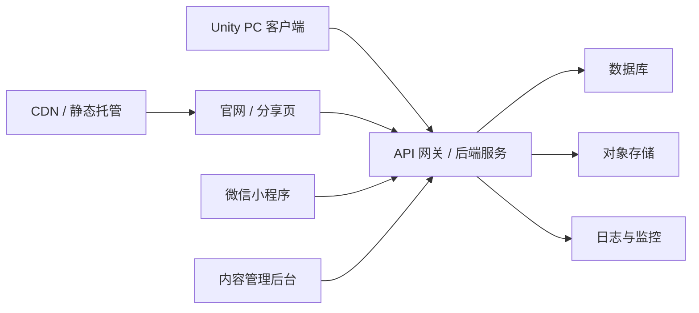

# 官网、服务器、分享与小程序架构规划

## 文档目的

本文整理项目从 PC Alpha 工具走向可分享、可复盘、可教学产品时，需要的网站、服务器、网关、数据和微信小程序方案。

它回答四个问题：

- 现在发 Alpha 是否必须先上服务器。
- 后续残局处理、新手教程和分享功能什么时候需要后端。
- 官网、API、数据库、对象存储、微信小程序分别承担什么。
- 每个版本实际要做哪些上线准备。

## 结论先行

当前不建议一开始就做完整服务器、账号和社区系统。最稳的路径是：

1. `v0.1` 和 `v0.2` 先用静态官网、网盘镜像、反馈表单和手工整理反馈，不引入复杂后端。
2. `v0.3` 做复盘分享时再引入后端，用分享码保存和读取场景。
3. `v0.4` 做新手教程时引入内容管理能力，让教程任务和解释可以在线更新。
4. `v0.5` 做残局题库时引入题目、提交记录、结果统计和公开分享页。
5. `v1.0` 之后再考虑账号、收藏、评论、排行榜和社区审核。

微信小程序可行，但不建议现在把完整 Unity 模拟器搬进小程序。更合适的定位是轻量入口：

- 看残局题。
- 打开别人分享的复盘场景。
- 看新手教程。
- 提交反馈。
- 引导下载 PC 版本。

完整自由模拟、复杂战斗演算和编辑器能力仍优先放在 PC Unity 端。

## 总体架构

### 各部分职责

| 模块 | 主要职责 | 何时需要 |
| --- | --- | --- |
| Unity PC 客户端 | 自由模拟、阵容编辑、战斗复盘、场景导入导出 | 已经是主产品 |
| 静态官网 | 下载、说明、更新日志、已知问题、反馈入口 | v0.1 就可以做 |
| API 网关 | 统一入口、限流、鉴权、跨域、版本兼容 | v0.3 开始需要 |
| 数据库 | 场景、题目、教程、反馈、版本信息 | v0.3 开始需要 |
| 对象存储 | 日志附件、截图、较大场景文件、导出包 | v0.3 或 v0.4 开始需要 |
| 内容管理后台 | 管理教程、残局题、公告、已知问题 | v0.4 开始需要 |
| 微信小程序 | 轻量浏览、分享传播、教程和残局入口 | v0.4/v0.5 后更合适 |

## 分阶段上线方案

| 阶段 | 是否需要后端 | 主要线上能力 | 实际操作 |
| --- | --- | --- | --- |
| v0.1 Alpha 种子版 | 不需要 | 下载页、反馈说明、已知问题 | 静态页面 + 网盘链接 + 表单或邮箱/群反馈 |
| v0.2 Alpha 反馈版 | 可选 | 反馈收集、版本公告 | 先用表单；如果反馈量变大，再加 `POST /api/feedback` |
| v0.3 复盘分享版 | 需要 | 场景上传、分享码、分享页 | 接入数据库和对象存储，支持分享码读取 |
| v0.4 新手教程 MVP | 需要 | 教程任务、内容配置、教程进度 | 加内容表和简单后台，客户端拉取教程数据 |
| v0.5 残局训练版 | 需要 | 题库、作答、结果统计、公开传播 | 加题目、提交记录、结果分布和公开页 |
| v1.0 正式版 | 需要 | 账号、收藏、评论、社区、审核 | 加登录、权限、举报、管理后台和运营工具 |

## v0.1/v0.2：先做静态官网

### 必须具备

- 项目定位：明确这是酒馆战棋训练、复盘、站位验证 Alpha 工具。
- 下载入口：Windows zip 包、版本号、发布日期、文件大小。
- 国内镜像：百度网盘或阿里云盘作为镜像，不作为唯一来源。
- 更新日志：列出本版新增、修复、已知问题。
- 反馈入口：表单、邮箱、QQ/微信群反馈格式。
- 已知问题：链接到缺陷文档或单独整理用户可读版。

### 暂时不做

- 不做账号系统。
- 不做在线社区。
- 不做排行榜。
- 不做复杂后台。
- 不要求客户端强依赖联网。

### 推荐实现

- 官网可以先用 Vercel、Cloudflare Pages、GitHub Pages 或国内静态托管。
- 反馈可以先用腾讯文档、飞书表格、问卷星、GitHub Issues 或自建表单。
- 下载包可以用国内网盘镜像，加一个长期可控的主发布页。

## v0.3：复盘分享后端

### 触发条件

当用户需要把一个场景发给别人，并且希望别人用一个链接或分享码打开时，就需要后端。

### 场景分享最小闭环

1. Unity 客户端导出场景 JSON。
2. 客户端调用 `POST /api/scenes` 上传场景。
3. 后端返回短分享码，例如 `BG-7K3P2Q`。
4. 其他用户通过分享码调用 `GET /api/scenes/{shareCode}`。
5. Unity 客户端导入后复现局面。
6. 官网分享页可以展示阵容摘要、备注、版本兼容提示和下载入口。

### 场景数据必须包含

- `schemaVersion`：场景格式版本。
- `appVersion`：导出客户端版本。
- `catalogVersion` 或 `cardDataHash`：卡牌数据版本。
- `seed`：随机种子。
- `playerHero` 和 `opponentHero`。
- `playerBoard` 和 `opponentBoard`。
- 酒馆状态、手牌、金币、回合数等可选上下文。
- `unsupportedEffects`：导出时已知未完整支持的英雄、宝宝或机制。
- `notes`：用户写的复盘说明。

### 分享码策略

- 分享码短、可读、可手打。
- 默认公开只读。
- 支持过期时间，但早期可先长期保留。
- 支持软删除和举报，避免垃圾内容长期外露。
- 保存原始 JSON，同时保存一份摘要字段便于网页展示和搜索。

## v0.4：新手教程内容系统

### 为什么需要后端

教程内容会持续调整。如果每次改教程都要重新发 PC 客户端，会拖慢迭代。后端可以让客户端拉取最新教程任务、说明和示例场景。

### 教程数据模型

- `lesson`：教程章节，例如基础操作、战斗理解、经济节奏、站位训练。
- `lesson_step`：具体步骤，例如买随从、调整站位、开始战斗。
- `training_scene`：固定教学场景。
- `success_condition`：完成条件，例如指定随从上场、战斗获胜、伤害降低。
- `hint`：失败提示和解释。

### 客户端行为

- 离线时使用内置教程。
- 联网时检查教程内容版本。
- 新教程内容只影响训练模式，不影响自由模拟的核心规则。
- 教程场景需要带 `schemaVersion`，防止旧客户端误读新格式。

## v0.5：残局题库和作答系统

### 核心能力

- 用户打开一道残局题。
- 用户调整站位或选择操作。
- 系统跑固定种子或多个种子。
- 返回胜率、伤害分布、关键触发摘要。
- 用户可以分享题目和自己的答案。

### 后端需要记录

- 题目内容。
- 题目难度和标签。
- 推荐答案或参考站位。
- 用户提交结果。
- 版本和规则数据。
- 公开展示的统计结果。

### 先不急着做的能力

- 账号排行榜。
- 实时多人比较。
- 大规模评论区。
- 复杂反作弊。

这些都可以等题库证明有人玩、有人分享后再做。

## 技术方案对比

| 方案 | 优点 | 风险 | 推荐阶段 |
| --- | --- | --- | --- |
| Vercel + Supabase | 上手快，数据库、认证、API、静态站组合成熟，跨平台友好 | 国内访问可能不稳定，需要国内镜像 | 官网、国际访问、快速验证 |
| 腾讯云 CloudBase | 微信小程序生态顺，云函数、数据库、存储一体化，国内访问好 | 跨平台和迁移弹性弱一些 | 小程序优先、国内用户优先 |
| Cloudflare Pages + Workers + D1/R2 | 边缘网络强，成本低，静态和 API 都轻量 | 国内访问不确定，D1 生态仍需谨慎 | 技术型轻量后端 |
| 传统 VPS + PostgreSQL | 控制力强，任何功能都能做 | 运维成本高，备份、安全、部署都要自己管 | 后期或有明确运维需求时 |

### 当前推荐

- 如果目标是尽快上线 PC Alpha：静态官网 + 表单 + 网盘镜像。
- 如果目标是做跨平台分享：Vercel + Supabase 更灵活。
- 如果目标是微信小程序优先传播：腾讯云 CloudBase 更省心。
- 如果两边都想兼顾：先用抽象的数据模型和 API，不把业务逻辑写死在某一家云服务里。

## API 草案

| 方法 | 路径 | 用途 |
| --- | --- | --- |
| `GET` | `/api/releases/latest` | 获取最新版本号、下载地址、更新日志 |
| `GET` | `/api/releases` | 获取历史版本 |
| `POST` | `/api/feedback` | 提交反馈、日志摘要、复现信息 |
| `POST` | `/api/scenes` | 上传复盘或残局场景 |
| `GET` | `/api/scenes/{shareCode}` | 读取分享场景 |
| `POST` | `/api/scenes/{shareCode}/reports` | 举报不合适内容 |
| `GET` | `/api/lessons` | 获取教程章节列表 |
| `GET` | `/api/lessons/{id}` | 获取教程详情 |
| `GET` | `/api/puzzles` | 获取残局题列表 |
| `GET` | `/api/puzzles/{id}` | 获取残局题详情 |
| `POST` | `/api/puzzles/{id}/attempts` | 提交一次残局作答结果 |

早期接口可以不做用户登录，但必须做限流和基础防滥用。

## 数据表草案

### `releases`

- `version`
- `channel`
- `downloadUrl`
- `mirrorUrls`
- `changelog`
- `knownIssuesUrl`
- `createdAt`

### `feedback`

- `id`
- `appVersion`
- `category`
- `description`
- `sceneJson`
- `combatLog`
- `contact`
- `status`
- `createdAt`

### `scenes`

- `id`
- `shareCode`
- `title`
- `notes`
- `schemaVersion`
- `appVersion`
- `cardDataHash`
- `sceneJson`
- `summaryJson`
- `visibility`
- `createdAt`

### `lessons`

- `id`
- `title`
- `category`
- `order`
- `contentJson`
- `sceneJson`
- `enabled`
- `updatedAt`

### `puzzles`

- `id`
- `title`
- `difficulty`
- `tags`
- `sceneJson`
- `answerJson`
- `explanation`
- `enabled`
- `createdAt`

### `puzzle_attempts`

- `id`
- `puzzleId`
- `anonymousUserId` 或 `userId`
- `answerJson`
- `resultJson`
- `appVersion`
- `createdAt`

### `users`

账号系统可以后置。早期只需要匿名设备 ID 或不记录用户。

## 网关、域名和运维

### API 网关要解决什么

- HTTPS。
- CORS。
- 版本路由。
- 请求限流。
- 简单鉴权。
- 日志记录。
- 错误响应格式统一。
- 防止单个用户大量上传场景或反馈。

这里的“网关”不一定是传统 Nginx 服务器，也可以是 Vercel API Routes、Cloudflare Workers、腾讯云函数 HTTP 入口或 CloudBase 云函数。

### 域名建议

至少准备两个入口：

- 官网主域名：放下载、文档、更新日志、分享页。
- API 子域名：例如 `api.example.com`。

如果部署在中国大陆服务器，需要考虑备案。早期不想处理备案时，可以先用境外静态托管加国内网盘镜像。

### 基础运维清单

- SSL 自动续期。
- 数据库每日备份。
- 对象存储生命周期管理。
- API 错误日志。
- 反馈和场景上传限流。
- 发布包校验信息。
- 旧客户端兼容提示。
- 管理后台最小权限。
- 隐私说明和用户协议草案。

## 微信小程序可行性

### 可行的部分

- 展示残局题。
- 展示复盘摘要。
- 打开分享码。
- 浏览新手教程。
- 收藏或转发题目。
- 提交文字反馈。
- 引导用户下载 PC 客户端。

### 不建议现在做的部分

- 在小程序内完整运行 Unity 自由模拟器。
- 在小程序里做复杂阵容编辑器。
- 在小程序里承载完整战斗动画和大量卡牌资源。
- 一开始就做账号、社区、排行榜全套能力。

### 需要注意

- 小程序包体、资源加载、审核和性能都会限制完整模拟器。
- 如果使用炉石相关名称、图片和文本，公开上架时需要谨慎处理版权、商标和用户预期。
- 小程序更适合做传播入口，不适合替代 PC 主工具。

## 版本兼容原则

分享和教程一旦上线，版本兼容会变成核心问题。

每个分享场景、教程场景、残局题都应该携带：

- 场景格式版本。
- 客户端版本。
- 卡牌数据版本。
- 英雄和宝宝实现状态。
- 随机种子。
- 是否依赖暂未完整实现的机制。

客户端导入时需要明确提示：

- 完全兼容。
- 可以导入但结果可能不同。
- 当前版本不支持，需要升级。
- 依赖的英雄或宝宝机制仍是近似实现。

## 内容安全和隐私

早期尽量少收集个人信息。

建议：

- 反馈联系方式设为可选。
- 场景默认不包含用户真实身份。
- 日志中不要包含本机路径、系统用户名或隐私信息。
- 分享页支持举报和下架。
- 管理后台能删除场景、反馈和附件。
- 公开说明这是玩家训练和复盘工具，不承诺与官方完全一致。

## 当前最实际的下一步

1. 先做 `v0.1` 静态发布页和发布包说明。
2. 在 PC 客户端里补“复制反馈信息”能力。
3. 设计场景 JSON 导入导出格式，先本地文件可用。
4. 当本地场景文件被真实用户使用后，再做分享码后端。
5. 分享码稳定后，再把微信小程序作为轻量传播入口接进来。

这样不会在用户还没验证前过早背上服务器、账号和社区的维护成本，也不会堵住后续教程、残局和分享能力的扩展路线。
