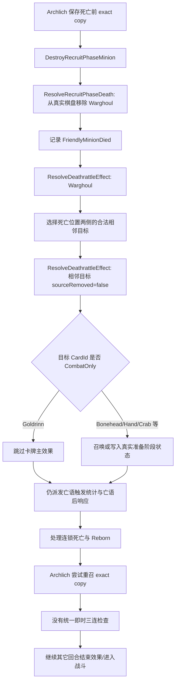

# 准备阶段戈德林、时空战争食尸鬼与衍生物三连专项审计

## 文档状态

- 日期：2026-07-18。
- 状态：P0 与安全边界明确的 P1 已完成本地实现；待 Unity Editor 内完整回归后再考虑更新版本。
- 范围：普通六本野兽“巨狼戈德林”、五本“时空扭曲战争食尸鬼”、准备阶段死亡/亡语连锁、衍生物三连。
- 本轮动作：已修改战斗/准备阶段逻辑与专项测试；未修改 `ProjectSettings`，未提交、未推送、未部署。
- Unity 验证边界：当前主 Unity Editor 的 MCP 端口为 `6401`，已确认 `127.0.0.1:6401` 正在监听；此前关于 `6402` 未监听的说明已失效。已使用 Unity 6000.4.10f1 自带 Roslyn 分别编译 Runtime 与 EditMode Tests，并执行 9 个定向验证场景；本次文档更正本身未重新运行完整 Unity Test Runner，后续 MCP 验证应使用 `6401`。

## 本次实现结果

本轮严格按本文高置信度范围完成以下修改：

1. 金色 Warghoul 改为按原站位快照依次触发两侧合法亡语；普通版本仍只选一个合法相邻目标。
2. Warghoul 的 Titus/Deios 额外次数作用于 Warghoul 本身，子亡语不再被同一额外次数嵌套放大；金色 Warghoul + 普通 Titus 的契约结果为两侧各触发两次。
3. Goldrinn 的原生 combat-only +8/+8 在 Recruit 继续不产生永久结果，但其身上的 Surf n' Surf 附加 Crab 亡语可以独立结算。
4. 金色 Harmless Bonehead 改为召唤四个 1/1 Skeleton；金色 Surf n' Surf 改为生成 `Golden=true`、6/4、`BG27_004_Gt2` 的 Crab。
5. Recruit 真实召唤完成后立即执行三连检查，并循环到稳定；Board/Hand 采用原地修改，保证 `CombatContext` 不持有失效列表引用。
6. 即时三连按实际棋盘数量变化更新后续召唤位置，因此三连释放的格子可被同一亡语后续 token 或 Reborn 使用。
7. TripleEngine 从双倍普通基础属性重建金卡，再按材料顺序合并三份附魔，并合并材料关键词；同源附魔不去重。
8. Combat 快照不接入 Recruit 三连回调，战斗内 token 不会污染真实酒馆三连状态。

本轮没有扩大实现低置信度内容：金色 Archlich 双目标精确顺序、全局回合结束统一队列、完整数据驱动亡语载荷模型仍保留为后续工作；当前仅对 Surf n' Surf 附加亡语做最小兼容修复。

## 执行摘要

这次审计最重要的结论不是“戈德林应该在准备阶段永久给野兽 +8/+8”，而是相反：

1. 普通巨狼戈德林 `BGS_018` 的文本明确限定“在本场战斗的剩余时间内”。它在准备阶段被战争食尸鬼直接触发时，没有当前战斗上下文，因而不应该永久强化酒馆真实棋盘，也不应自动为下一场战斗预存 +8/+8 Aura。当前项目跳过戈德林主效果的方向大概率正确，置信度中高。
2. 戈德林亡语虽然没有产生 +8/+8，仍然是一次实际“亡语被触发”。因此 Titus/Deios 的额外次数、亡语触发计数，以及 Blood Amulet、Unholy Sanctum、时空蜥蜴、Ghoul-acabra 等“亡语触发后”响应仍然可以生效。当前项目采取的“主效果无操作，但触发事件继续派发”具备合理规则基础。
3. 当前确定存在的 Warghoul 缺陷是金色版本：官方金色文本要求触发两侧相邻随从的亡语，项目仍只随机触发一个。
4. 当前阶段过滤以随从 `CardId` 为粒度。一旦本体是 CombatOnly，例如戈德林，代码会把该实体上所有附加亡语一起跳过。戈德林如果同时获得 Surf n' Surf 的小螃蟹亡语，准备阶段被 Warghoul 触发时，小螃蟹也不会召唤。这是确定的组合性错误。
5. 小螃蟹、小骷髅、断手在真实酒馆里都可以形成三连。项目目前也把它们视为三连材料，方向正确；真正缺口是准备阶段亡语/回合结束召唤后没有即时三连检查点，而且一次三连检查只合成一组，不能循环到稳定。
6. 衍生物还有三项确定差距：金色无害的骨头仔应召唤四个 1/1 小骷髅，当前却召唤两个 2/2；金色 Surf n' Surf 应召唤已经是金色的 6/4 Crab，当前生成的是 `Golden=false` 的 6/4 普通材料；三连合成只保留第一份材料的附魔和属性，丢失另外两份强化。
7. 回合结束效果仍由固定 Tier/系统处理器顺序驱动，Drakkari 只包裹五本随从处理器。它会继续影响 Archlich、Warghoul、token 召唤和三连的先后关系，不能只靠单卡特判收尾。

综合判断：

- “让戈德林准备阶段也执行 +8/+8”不是正确修复。
- 第一优先级应是金色 Warghoul、即时三连固定点、token 金色身份/文本和三连材料合并。
- 随后必须处理“同一随从多份亡语载荷”的阶段能力与顺序，才能同时正确修复 Goldrinn + Surf n' Surf、跳蛙传播和未来附加亡语。

## 审计范围与明确不改范围

### 本文包含

- Archlich Kel'Thuzad 在回合结束消灭 Warghoul 的完整链路。
- 普通/金色 Warghoul 的相邻目标、额外亡语次数和顺序。
- 普通/金色 Goldrinn 在战斗阶段与准备阶段的状态边界。
- 其它准备阶段 Destroy/Dies、直接触发亡语和亡语后响应。
- Skeleton、Helping Hand、Crab 等衍生物身份、金色版本、三连资格、合成时点和属性合并。
- 回合结束处理器、Reborn、七格上限和卡池所有权的相关影响。
- 后续修复优先级、建议架构和测试矩阵。

### 本文不包含

- 本轮不实现代码。
- 不修改现有选择界面滚动位置修复。
- 不修改 `ProjectSettings`。
- 不重新设计所有卡牌数据格式。
- 不发布 WebGL 或线上版本。
- 没有客户端录像或官方底层说明的精确顺序，不写成高置信度事实。

## 证据等级

| 结论 | 主要证据 | 置信度 |
|---|---|---:|
| Goldrinn 普通 +8/+8、金色 +16/+16，限定本场战斗 | HearthstoneJSON、项目本地数据 | 高 |
| 普通 Warghoul 触发一个相邻亡语；金色触发两侧相邻亡语 | HearthstoneJSON 普通/金色卡牌文本 | 高 |
| token 可以三连，三只出现后立即融合，可在阶段之间、多次发生 | wiki.gg Battlegrounds 规则原文 | 高 |
| Triple Card 保留三份材料的附魔 | wiki.gg Battlegrounds 规则原文 | 高 |
| Warghoul 在准备阶段触发 Goldrinn 时不永久加属性、不预存下一场战斗 Aura | 卡牌文本与阶段语义推导；没有直接客户端录像 | 中高 |
| Goldrinn 主效果无操作后，“亡语触发后”观察者仍响应 | 通用触发语义与当前项目事件模型推导 | 中 |
| 金色 Warghoul 两侧亡语的精确执行顺序 | 官方只说明两侧都触发，没有底层队列说明 | 中低，待实测 |
| 金色 Archlich 双目标和完整回合结束队列顺序 | 现有项目契约与通用规则推导 | 中低，待实测 |

## 真实卡牌与 token 数据

### 戈德林与战争食尸鬼

| 卡牌 | CardId | 普通文本要点 | 金色文本要点 |
|---|---|---|---|
| 巨狼戈德林 | `BGS_018` / `TB_BaconUps_085` | 亡语：本场战斗剩余时间内，你的野兽 +8/+8 | +16/+16 |
| 时空扭曲战争食尸鬼 | `BG34_Giant_331` / `BG34_Giant_331_G` | 嘲讽；亡语触发一个相邻随从的亡语，Warghoul 除外 | 触发两侧相邻随从的亡语，Warghoul 除外 |

不要把普通巨狼戈德林与 `BG34_Giant_362` 时空扭曲戈德林混淆：后者是“本局游戏中、无论在哪里”的永久野兽成长，项目中另有服务层持久奖励。本文讨论的六本 8/8 是 `BGS_018`。

### 用户提到的三类衍生物

| 中文俗称 | 官方普通 token | 官方金色 token | 当前项目 tokenId | 当前项目生成方式 |
|---|---|---|---|---|
| 小骷髅 | `BG_ICC_026t`，Skeleton，1/1 亡灵 | `BG_ICC_026t_G`，2/2 | `skeleton` | Harmless Bonehead、Bone Watcher 等亡语 |
| 断手 | `BG25_010t`，Helping Hand，2/1 亡灵，Reborn | `BG25_010_Gt`，4/2，Reborn | `reborn-hand` | Handless Forsaken 亡语 |
| 小螃蟹 | `BG27_004t2`，Crab，3/2 野兽 | `BG27_004_Gt2`，6/4 | `crab` | Surf n' Surf 临时 Spellcraft 赋予的亡语 |

HearthstoneJSON 的 `battlegroundsPremiumDbfId` / `battlegroundsNormalDbfId` 明确把上述普通与金色 token 配成一对。它们不是“池内普通随从”，但仍然拥有合法金色版本。

### 木乃伊工匠与断手的复生语义（2026-08-15 已验证）

- `BG25_010` 断手被遗忘者本体初始只有有效亡语，不具有有效复生；卡面 `officialKeywords` 保留 Reborn 是因为亡语文本引用了该关键字。
- 断手亡语召唤的 `reborn-hand` / Helping Hand 才真正具有复生。普通断手召唤一只 2/1，金色断手召唤两只 2/1；外部效果另行赋予断手本体复生仍是合法状态。
- `BG28_309` 木乃伊工匠本体同样不自带复生。单次亡语从存活、尚无复生、且按统一种族规则计为亡灵的友方随从中随机选择：普通最多 1 个，金色最多 2 个；选择不放回，候选不足时按实际数量执行。
- “不同”按卡牌身份处理：所有普通/金色木乃伊工匠都不能成为另一只木乃伊工匠的目标，避免同名互相授予复生；亡灵双种族与全部种族随从均是合法候选。
- 战斗死亡、招募阶段死亡、Titus 额外亡语次数共用同一目标规则。Titus 的每一次额外亡语独立执行，已获得复生的目标会从后续候选中排除。
- 大地母亲之眼、三连和其它共享点金入口都以同一个 `Golden` 运行时状态进入该亡语，因此不能为不同点金来源复制单卡分支。
- 本轮门禁覆盖普通/金色目录有效与官方关键字、断手本体与 Hand 衍生物、大地母亲之眼、共享点金转换器、三连、跨种子随机、普通/金色同名排除、亡灵双种族、全部种族、候选不足、Titus 与招募阶段死亡；专项 EditMode 结果为 28/28。

## 当前项目链路

### 回合结束到 Archlich

`MatchService.BeginTurnTransition` 当前按固定处理器顺序执行：

```text
TurnEnded 通用事件
  -> Tier 1 随从
  -> Hero Buddy
  -> Tier 3 随从
  -> Tier 4 随从
  -> Tier 5 随从
       -> Archlich Kel'Thuzad
  -> Tier 6/7 随从
  -> Timewarped 随从
  -> 英雄
  -> 饰品
  -> 任务/异常
  -> 立即进入战斗
```

关键位置：

- `Assets/LearnHearthstone/Runtime/Application/Services/MatchService.cs:21487`
- `Assets/LearnHearthstone/Runtime/Application/Services/MatchService.cs:25457`
- `Assets/LearnHearthstone/Runtime/Application/Services/MatchService.cs:25522`

Archlich 位于 `HandleTurnEndedForTierFiveMinions`。它先复制左侧亡灵的完整实例，再调用统一准备阶段死亡入口，最后通过 `ResolveRecruitPhaseSummon` 尝试重召 exact copy。

### 准备阶段死亡与 Warghoul



关键代码：

- 准备阶段死亡入口：`CombatEngine.cs:435`
- 准备阶段死亡循环：`CombatEngine.cs:1971`
- 亡语总入口：`CombatEngine.cs:2462`
- 准备阶段 CombatOnly 过滤：`CombatEngine.cs:2900`
- Warghoul 分派：`CombatEngine.cs:3238`
- Warghoul 相邻选择：`CombatEngine.cs:4486`
- CombatOnly 列表：`CombatEngine.cs:3324`

## 巨狼戈德林：当前实现与真实规则差距

### 战斗阶段实现

战斗中，Goldrinn 通过 `GrantPersistentCombatTribeBonus`：

1. 立刻给当前存活野兽 +8/+8，金色 +16/+16。
2. 把该加成记录在当前 `CombatSideState.PersistentTribeBonuses`。
3. 本场战斗之后召唤的野兽也会获得同一个加成。
4. 通过唯一 Enchantment Id 防止同一份 Aura 重复应用。

这与“本场战斗剩余时间内”基本吻合，现有测试也覆盖了戈德林死亡后召唤的小猫继续获得 +8/+8。

关键位置：

- `CombatEngine.cs:1280`
- `CombatEngine.cs:3285`
- `DomainEngineTests.cs:317`

### 准备阶段被 Warghoul 直接触发

当前行为是：

1. Goldrinn 不死亡，仍留在真实棋盘。
2. `ResolveDeathrattleEffect` 记录 Goldrinn 的亡语被触发。
3. Titus、Deios、任务等额外亡语次数仍会影响这次触发。
4. `ResolveDeathrattleSummons` 发现 Goldrinn 被列为 CombatOnly，跳过 +8/+8 主效果。
5. Blood Amulet、Unholy Sanctum、Timewarped Saurolisk、Timewarped Ghoul-acabra 等通用“亡语触发后”效果仍然响应。
6. Goldrinn 继续进入下一场战斗；它在战斗中真正死亡时仍能正常给野兽 +8/+8。

### 与真实战棋的判断

| 行为 | 当前项目 | 真实规则判断 | 结论 |
|---|---|---|---|
| 准备阶段永久给真实棋盘野兽 +8/+8 | 不会 | 文本明确只限“本场战斗剩余时间”，不应永久写入 | 当前方向正确 |
| 为下一场战斗预存 +8/+8 Aura | 不会 | 没有“下一场战斗”文本，也没有当前战斗上下文 | 建议继续不预存 |
| Goldrinn 本体因被直接触发而死亡 | 不会 | Warghoul 只触发目标亡语，不消灭目标 | 正确 |
| 计为一次亡语触发 | 会 | Warghoul 的文本确实执行了“Trigger Deathrattle” | 大概率正确 |
| 亡语后观察者响应 | 会 | 主效果无有效上下文不等于触发事件不存在 | 中置信度，建议保留并实测 |
| Goldrinn 获得的其它附加亡语独立执行 | 不会，CombatOnly 一并跳过 | 每份附加亡语应独立结算 | 确定错误 |

### 为什么不能直接删除 Goldrinn 的 CombatOnly 标记

`GrantPersistentCombatTribeBonus` 会立即修改 `owner.Board`。准备阶段的 `owner.Board` 就是真实酒馆棋盘。如果直接允许该分支运行，会出现：

- 当前所有野兽获得永久 +8/+8。
- `PersistentTribeBonuses` 只存在于临时 `CombatContext`，调用结束后丢失。
- 后续准备阶段召唤物又不会应用该 combat bonus，因为 `ApplySummonAuras` 在 Recruit 阶段提前返回。

结果既不是永久全局成长，也不是完整的下一场战斗 Aura，而是只永久强化“触发当时在场”的野兽。因此不能以移除过滤作为修复。

正确方向是把同一随从上的每一份亡语作为独立载荷处理：Goldrinn 原生载荷在 Recruit 为无操作；Surf n' Surf、跳蛙或其它附加载荷按各自阶段能力继续执行。

## 时空扭曲战争食尸鬼专项分析

### 普通版本

普通 Warghoul 每次亡语只触发一个相邻随从的亡语。两侧都合法时，项目使用稳定随机选择；自身已经死亡时，代码使用其死亡位置左右两侧，位置计算方向正确。

### 金色版本

官方金色文本是“Trigger adjacent minions' Deathrattles”，即两侧合法目标都应触发。当前代码没有 `minion.Golden` 分支，仍然构造目标列表后随机选一个。

这是高置信度确定缺陷。

### 与额外亡语次数的组合

| 场景 | 真实预期 | 当前项目 |
|---|---|---|
| 普通 Warghoul，无 Titus | 随机触发一个合法相邻亡语 | 基本一致 |
| 普通 Warghoul + Titus | Warghoul 亡语执行两次；每次重新触发一个合法相邻 | 当前会执行两次随机选择，方向一致 |
| 金色 Warghoul，无 Titus | 左右两侧合法亡语都触发一次 | 只随机触发一个 |
| 金色 Warghoul + Titus | Warghoul 亡语执行两次；每次两侧都触发，总计最多四个子亡语 | 只执行两次“随机一个”，总量和覆盖范围都错误 |
| 金色 Warghoul 一侧为空/不合法 | 触发唯一合法一侧 | 当前通常也触发唯一合法一侧 |

### Goldrinn + 另一侧 token 亡语

以金色 Warghoul 左侧 Goldrinn、右侧 Harmless Bonehead 为例：

真实预期应至少包含：

1. Goldrinn 的原生 combat-only +8/+8 在准备阶段不产生属性结果。
2. Goldrinn 仍算一次被触发的亡语，可响应适用的亡语后效果。
3. Bonehead 的亡语召唤两个 1/1 Skeletons。
4. 每次真实 Skeleton 进入棋盘后立刻检查三连。
5. 如果 Titus 让金色 Warghoul 再触发一次，则两侧再次分别触发。

当前项目只随机选择一侧：

- 选到 Goldrinn 时，场上可能只有亡语后响应，没有 Skeleton。
- 选到 Bonehead 时会召唤 Skeleton，但不会在进入战斗前自动三连。

### 目标顺序与随机数

当前普通 Warghoul 的随机种子包含 `context.Log.Count`。这保证同一次重放稳定，但无关日志增删会改变玩法随机结果。建议随机序列只依赖规则事件序号、触发源实例和 repeat index，不依赖日志实现细节。

金色 Warghoul 两侧的精确执行顺序缺少官方底层说明。后续实现应先锁定项目契约并用客户端录像校正：

- 候选必须在该次 Warghoul 亡语开始时形成快照。
- 建议按原战场位置从左到右入队。
- 第一侧的亡语产生死亡/召唤后，完整结算到规定检查点，再执行第二侧。
- 若客户端实测表明两侧先同时入队，再统一结算，应以实测修正规则。

## 其它准备阶段死亡与直接亡语入口

### 真实死亡来源

| 来源 | 语义 | 当前入口 | 死亡后继续效果 |
|---|---|---|---|
| Butchering | Destroy 友方亡灵 | `DestroyRecruitPhaseMinion` | 法术自身成长/奖励 |
| Jailer Sticker | Destroy 友方亡灵 | 同上 | 回池后获取亡灵牌 |
| Disguised Graverobber | 战吼 Destroy 友方亡灵 | 同上 | 获取原始版复制，不是 exact copy |
| Disturbed Grave / Tomb Turning | 打出后 Dies | 同上 | 回池，不应执行 Sell 效果 |
| Archlich Kel'Thuzad | 回合结束 Destroy 左侧亡灵 | 同上 | 死亡链、Reborn 后尝试 exact copy |

统一入口是正确方向。需要继续保持以下负向边界：Sell、Remove、Return、Transform、Debug Remove 和暂未确认的 Consume 不能仅因为底层调用 `Board.Remove` 就进入亡语。

### 准备阶段可执行亡语能力

| 能力 | 代表实现 | Recruit 当前策略 | 审计判断 |
|---|---|---|---|
| 召唤真实 token | Skeleton、Helping Hand、Beetle、Crab | 进入真实棋盘，受七格限制 | 应保留，但必须接三连固定点 |
| 永久强化真实随从 | Scarlet Skull、Three Lil' Quilboar、Ghoul-acabra | 直接 Buff 真实棋盘 | 文本无战斗限定时合理 |
| 永久全局成长 | Plaguerunner、Blood Gem/Elemental/Beetle 成长 | 写 Tavern 状态或奖励 | 合理，需按文本区分 combat/game |
| 获取手牌/法术/经济 | Bully、Hunter、Coldlight、Timewarped Kil'rek 等 | 排队 Recruit reward | 合理，满手与三连时点需测试 |
| 触发其它亡语 | Warghoul、Whirl-O-Tron、Fish of N'Zoth | 递归调用亡语入口 | 需要独立载荷与顺序模型 |
| 造成友方范围伤害 | Tunnel Blaster、Bristlebach 等 | 可造成进一步准备阶段死亡 | 必须完整进入死亡固定点 |
| 依赖敌方/击杀者/本场战斗 | Leeroy、Kangor、Bassgill、Goldrinn 等 | CardId 级 CombatOnly 跳过 | 主效果跳过合理，但不能连带跳过附加亡语 |

### 亡语后响应

`ResolveDeathrattleEffect` 在主效果之后统一执行：

- Blood Amulet。
- Unholy Sanctum。
- Thornspike Pauldron。
- Timewarped Saurolisk。
- Timewarped Ghoul-acabra。
- 亡语触发统计、任务和部分奖励。

它们的文本如果没有战斗限定，应当在准备阶段生效。需要注意的是：当前即使主卡效果被 CombatOnly 跳过，这些响应仍会发生。本文建议保留这个总体语义，但增加测试确认客户端是否把“无可执行子效果的亡语”仍计为已触发。

### Reborn 的相邻差距

准备阶段当前 `CreateRebornInstance` 直接 clone 死亡实例，测试还要求保留永久附魔和计数器。真实 Reborn 通常以 1 点生命复活并失去此前附魔；Goldrinn combat Aura、跳蛙载荷、血宝石或其它 Buff 是否保留会直接改变准备阶段连锁。

这不是本轮 Goldrinn 主问题，但与 Helping Hand、Archlich 和跳蛙高度相关。后续应把：

- Reborn 新实体；
- Archlich exact copy；
- Triple Card 合成；

拆成三套明确且不同的状态构造规则，不能都依赖 `Clone()` 后局部删除字段。

## 准备阶段回合结束顺序

### 当前固定分类顺序

当前不是“收集场上所有回合结束触发器后按统一规则排队”，而是按 Tier/系统调用函数。结果包括：

- Tier 5 的 Archlich 会在 Tier 6/7 和 Timewarped 回合结束效果之前执行，无论实际入场顺序。
- 同一个 handler 内使用 `State.Player.Board.ToList()`，通常按当前站位快照处理。
- 每个 Archlich 目标的死亡/亡语链会立即结算。
- 其它 handler 不一定按同一站位/入场规则处理。

### Drakkari 差距

当前 Drakkari 只在 `HandleTurnEndedForTierFiveMinions` 内计算 repeats，因此：

- Archlich、Dynamic Duo、Felbat 等五本效果会重复。
- Tier 1/3/4/6/7 和 Timewarped 随从的回合结束效果不会由同一个 Drakkari 逻辑重复。

这与通用“你的回合结束效果额外触发”不一致。Ghastly Mask/Sticker 又通过整套重复调用所有 tier handler 模拟额外次数，形成第二套重复模型。

该问题会改变：

- Warghoul 被 Archlich 消灭几次。
- 多少 token 在进入战斗前生成。
- token 是否已三连和释放槽位。
- 后续回合结束效果看见普通 token 还是金色 token。

## 衍生物三连规则与当前差距

### 真实规则

wiki.gg Battlegrounds 规则原文确认：

- token minions 也有 Triple Card 版本，规则与普通随从相同。
- 手中和战场合计三只同种非金色随从时立即融合。
- 融合可以发生在阶段之间。
- 一个阶段中可以连续发生多次融合。
- Triple Card 保留三份材料此前的 Enchantments。
- Triple Card 从战场回到手牌；之后打出 Triple Card 时获得 Triple Reward。

因此，小螃蟹、小骷髅、断手“能不能三连”的答案是：能。

### 当前三连资格

`IsPlayerTripleMaterial` 只检查：

- 类型为 Minion 或 HeroBuddy。
- `DefinitionId` 非空。
- 不是已经金色的材料。

它没有过滤 `PoolSource.Summon`，这对于 token 是正确的。token 不占共享卡池，不代表它不能三连。

### 当前 token 身份

`AddToken` 当前设置：

```text
DefinitionId = tokenId
CardId       = tokenId.ToUpperInvariant()
Golden       = false（默认）
PoolSource   = Summon
PoolCopiesHeld = 0
```

因此三个 `skeleton`、三个 `reborn-hand` 或三个 `crab` 可以被当前分组算法识别为同种材料。

### 差距矩阵

| 项目 | 真实预期 | 当前实现 | 影响 |
|---|---|---|---|
| token 是否可三连 | 可以 | 可以作为材料 | 方向正确 |
| 三连检查时点 | 第三只进入真实手牌/战场后立即检查 | 仅购买、打出、磁力、少数变形等手工调用 | 回合结束 token 带着三只普通体进入战斗 |
| 一次检查处理多少组三连 | 循环到稳定，可同阶段多次 | 每次只合成一个候选 | 六只 Skeleton 只能先合成一组 |
| 召唤与三连交错 | 第三只出现立刻合成并释放槽位，再继续召唤 | 整个召唤流程没有三连 | 错误满场、少召唤后续 token |
| 三份强化合并 | 保留三份材料 Enchantments | clone 第一份，另外两份只贡献池份数 | 丢 Buff、Counter、附加效果 |
| 官方金色 token 身份 | 切换到 premium token 定义 | 原 DefinitionId/CardId + `Golden=true` | 卡图、文本、CardId 分派精度不足 |
| 金色 Bonehead | 四个 1/1 Skeleton | 两个 2/2 Skeleton | 数量、占位、三连时点错误 |
| 金色 Handless | 两个 2/1 Reborn Hands | 两个 2/1 Reborn Hands | 基础效果正确 |
| 金色 Surf n' Surf | 召唤金色 6/4 Crab | 召唤 `Golden=false` 的 6/4 Crab | 可错误二次三连成 12/8 |
| Triple Reward 时点 | 打出 Triple Card 时获得 | 打出未领奖的金色随从时获得 | 与当前规则资料一致 |
| token 卡池占用 | 不占共享池 | `PoolCopiesHeld=0` | 正确方向 |

### 典型错误场景

#### 场景 1：三只小骷髅在回合结束生成

真实：第三只 Skeleton 进入真实棋盘时立刻形成金色 2/2 Skeleton，并回到手牌。

当前：三只 Skeleton 留在战场，直接进入下一场战斗；下一次购买/打出触发 `ResolvePlayerTriples` 时才可能合成。

#### 场景 2：六只小骷髅

真实：应连续形成两只金色 Skeleton，只要手牌/战场迁移规则允许。

当前：没有检查点时完全不合成；即使在链末补一次现有 `ResolvePlayerTriples`，也只合成一只，剩余三只仍不处理。

#### 场景 3：七格边界

假设场上已有一只 Skeleton，某亡语继续依次召唤四只 Skeleton：

- 第二只进入后仍不合成。
- 第三只进入后应立即三连，释放两个格子。
- 后续 Skeleton 应继续有空间召唤。

当前不在召唤中间检查三连，可能先触发满场溢出，少召唤后续 token。

#### 场景 4：金色 Surf n' Surf

真实：死亡召唤的是已经金色的 6/4 Crab，不是三连材料。

当前：生成 6/4、`Golden=false` 的 `crab`。三个这样的 Crab 会被合成为 12/8 金色 Crab，形成不存在的二次翻倍。

#### 场景 5：三只带不同 Buff 的断手

真实：金色 Helping Hand 应保留三只材料此前的附魔总和，并保留 Reborn。

当前：只 clone 第一只断手并把第一只当前属性乘二；另外两只的 Buff/附魔丢失。

## Root Cause Analysis

### 根因 1：亡语只有关键词，没有独立有序载荷

**Error**：同一随从的原生亡语、Surf n' Surf、跳蛙传播亡语等不能独立判断阶段能力和执行顺序。

**Expected**：每份亡语载荷独立记录来源、参数、获得顺序和 Recruit/Combat 支持范围。

**Cause**：核心仍按 `minion.CardId` 分派原生效果，少量附加效果靠 Tag/Counter 补丁；`Keyword.Deathrattle` 只表示“存在亡语”，不保存亡语内容。

**Fix**：扩展现有有序 `Enchantments`，保存每份附着亡语的类型、来源、参数、获得序号和阶段能力；原生亡语也以同一执行条目暴露给解析器。

**Prevention**：任何“获得某亡语”“复制某亡语”“触发某亡语”的新卡，必须先证明载荷可复制、可排序、可按阶段过滤，再进入实现。

### 根因 2：CombatOnly 过滤粒度是随从 CardId

**Error**：Goldrinn 原生亡语被跳过时，Surf n' Surf 等附加亡语也被一并跳过。

**Expected**：只跳过 Goldrinn 的 combat-only 载荷，其它 AnyPhase 载荷继续执行。

**Cause**：`ResolveDeathrattleSummons` 在解析任何卡牌或附加 Tag 前执行 `IsCombatOnlyDeathrattle(minion.CardId)` 并整体返回。

**Fix**：把阶段能力放到单个 effect payload；删除实体级“一刀切”过滤。

**Prevention**：阶段过滤测试必须覆盖“一张 CombatOnly 本体 + 一份 AnyPhase 附加亡语”的组合。

### 根因 3：三连是散落调用，不是区域变更固定点

**Error**：准备阶段亡语、Reborn、Archlich exact copy 和回合结束生成 token 后不立即三连；一次调用也只合成一组。

**Expected**：每次真实 Recruit 手牌/战场发生可三连的新增或身份变化后，循环融合到稳定。

**Cause**：`ResolvePlayerTriples()` 由购买、打出、磁力等调用者手工触发；CombatEngine 的 Recruit 召唤上下文没有统一三连回调。

**Fix**：引入 Recruit mutation checkpoint，并在每次真实 summon/add/copy/reborn/exact-copy/transform 后执行 fixed-point triple resolver。

**Prevention**：禁止新玩法路径直接 `Board.Add` / `Hand.Add` 后自行决定是否调用三连；统一通过区域变更服务。

### 根因 4：TripleEngine 只克隆第一份材料

**Error**：另外两份材料的附魔、Buff、计数器和附加亡语丢失。

**Expected**：按真实三连规则构造金色基础版本，并合并三份材料应保留的全部 Enchantments/状态。

**Cause**：当前 `golden = baseItem.Clone()`，随后把第一份当前属性乘二；其余材料只参与 `PoolCopiesHeld` 求和。

**Fix**：区分基础金色定义、永久附魔合并、临时效果清理、关键词/Counter 合并和池份数合并。

**Prevention**：三连测试必须使用三份不同 Buff、不同附加亡语和不同池来源的材料，不能只测三张白板。

### 根因 5：回合结束效果不是统一触发队列

**Error**：顺序由 Tier/系统函数决定，Drakkari 只覆盖五本处理器，Ghastly 又使用另一套整轮重复。

**Expected**：收集可执行回合结束触发项，以统一顺序和 repeat 规则逐个结算，每个触发项后跑死亡/亡语/三连固定点。

**Cause**：历史功能按卡牌批次逐步堆入 `HandleTurnEndedForTier*`。

**Fix**：建立 `EndOfTurnTrigger` 队列，明确 source、position、acquisition sequence、repeat count 和 checkpoint。

**Prevention**：新增回合结束卡只能注册触发器，不能再新增独立 handler 顺序分支。

## 推荐修复优先级

| 优先级 | 修复项 | 原因 |
|---|---|---|
| P0 | 金色 Warghoul 同时触发两侧合法亡语 | 官方文本明确，当前直接少触发一侧 |
| P0 | Recruit 每次真实召唤/入手后的 fixed-point 三连检查 | 直接影响 token、满场和进入战斗前状态 |
| P0 | 金色 Bonehead 改为四个 1/1 Skeleton | 明确卡牌文本错误 |
| P0 | 金色 Surf n' Surf 生成真正金色 6/4 Crab | 当前可产生不存在的二次三连 |
| P0 | TripleEngine 合并三份永久附魔/载荷 | 所有三连材料均可能丢状态 |
| P1 | 亡语载荷独立化，修复 CombatOnly 本体误伤附加亡语 | 同时解决 Goldrinn+Crab、跳蛙传播等组合问题 |
| P1 | 金色 Warghoul 目标快照、顺序与 Titus 组合测试 | 防止两侧链路随棋盘变化漂移 |
| P1 | 统一回合结束触发队列和 Drakkari repeats | Archlich/Warghoul/token 链路的长期正确性依赖它 |
| P1 | Reborn 状态构造规则与真实规则对齐 | 影响 Helping Hand、跳蛙、永久 Buff 和 exact copy 区分 |
| P2 | token 映射官方普通/金色 CardId/DefinitionId | 提升卡图、文本和 CardId 分派精度 |
| P2 | Warghoul RNG 移除对 `Log.Count` 的依赖 | 避免日志改动改变玩法结果 |
| P2 | 统一 Destroy/exact copy/token 的卡池所有权 | 避免重复回池或错误持有共享池份数 |

## 推荐实施顺序

### 第一阶段：锁定现状与高置信度单卡修正

1. 先补测试，不改架构。
2. 增加 Goldrinn 准备阶段无永久 +8/+8 的负向测试。
3. 增加金色 Warghoul 两侧都触发测试。
4. 修正金色 Bonehead 和金色 Surf n' Surf token 身份。

### 第二阶段：Recruit 三连固定点

1. 把三连解析提取为可对真实 `Board + Hand` 原地执行的 fixed-point resolver。
2. 不要在 CombatEngine 内重设 `State.Player.Board` 列表引用；当前 Recruit `CombatContext` 持有原列表，必须原地 mutate 或显式返回更新后的集合。
3. 在每次真实 token summon、Reborn、exact copy、加入手牌、复制和变形后调用固定点。
4. 每次融合后重新扫描，直到没有候选或安全上限触发。
5. Combat snapshot 禁止调用该固定点。

### 第三阶段：三连状态合并

1. 根据普通/金色定义构造正确基础实体。
2. 合并三份永久 Enchantments，而不是把第一份当前属性简单乘二。
3. 明确 Counter、附加亡语、Spellcraft 临时效果、Reborn 消耗状态和 PoolCopiesHeld 的合并策略。
4. token 使用官方 premium 映射；无官方金色定义时才进入明确策略分支。

### 第四阶段：亡语载荷与阶段能力

1. 用现有有序 `Enchantments` 保存附加亡语载荷。
2. 给每份载荷标注 `AnyPhase`、`CombatOnly`、`RecruitOnly` 或 `NeedsPolicyDecision`。
3. Goldrinn 原生载荷在 Recruit 返回无操作，但不阻塞之后的 Crab/跳蛙载荷。
4. 同一实体上的载荷按获得顺序执行；原生亡语通常早于后来附着亡语。
5. 每份载荷完成后派发一次对应的 DeathrattleResolved/after-trigger 响应。

### 第五阶段：回合结束统一队列

1. 收集随从、英雄、饰品、任务、异常的回合结束触发项。
2. 明确排序和 Drakkari/Ghastly repeat 规则。
3. 每个触发项后执行死亡、亡语、Reborn、三连固定点到稳定。
4. 所有触发项完成后再创建战斗快照。

## 测试矩阵

### Goldrinn 与 Warghoul

| 用例 | 预期 |
|---|---|
| 普通 Warghoul 仅相邻普通 Goldrinn | Goldrinn 不死亡；真实棋盘无 +8/+8；亡语触发计数 +1 |
| 上述场景进入战斗后 Goldrinn 死亡 | 当前和之后召唤的野兽获得 +8/+8 |
| 普通 Warghoul 左右都是合法亡语 | 只触发一个，由稳定规则选择 |
| 金色 Warghoul 左右都是合法亡语 | 两侧都触发一次 |
| 金色 Warghoul + Titus | 两侧各触发两次 |
| 金色 Warghoul 一侧为 Warghoul | 排除 Warghoul，只触发另一侧 |
| Goldrinn + Blood Amulet | 无 +8/+8，但 Blood Amulet 按一次亡语触发响应 |
| Goldrinn + Timewarped Ghoul-acabra | 无 Goldrinn +8/+8；Ghoul-acabra 的准备阶段永久成长按契约发生 |
| Goldrinn 获得 Surf n' Surf 亡语 | Goldrinn 原生载荷无操作，Crab 载荷仍召唤 |
| Goldrinn 获得多份附加亡语 | 原生和附加载荷按获得顺序独立结算 |
| Warghoul 两侧均合法且第一侧改变棋盘 | 第二侧按目标快照/最终确认顺序稳定执行 |
| 修改日志文本/增加无关日志 | Warghoul 随机结果不改变 |

### 准备阶段死亡与阶段边界

| 用例 | 预期 |
|---|---|
| Butchering/Jailer/Graverobber/Tomb Turning Destroy 带亡语目标 | 进入统一死亡链，卡牌后续奖励在规定检查点执行 |
| Sell/Remove/Return/Transform 带亡语目标 | 不触发亡语 |
| CombatOnly 本体无附加亡语 | 主效果不执行，但不会崩溃 |
| CombatOnly 本体 + AnyPhase 附加亡语 | 只执行附加载荷 |
| 亡语造成友方伤害并产生新死亡 | 新死亡完整结算后再继续来源文本 |
| 亡语召唤填满战场 | Reborn/exact copy 按发生时空间独立检查 |
| Recruit Reborn 带永久 Buff | 按最终确认的真实 Reborn 规则构造，不误当 exact copy |
| Archlich exact copy | 保留死亡前完整状态，与 Reborn 明确不同 |

### 小骷髅、断手、小螃蟹三连

| 用例 | 预期 |
|---|---|
| 第三只 1/1 Skeleton 被准备阶段亡语召唤 | 立即形成金色 2/2 Skeleton，进入手牌 |
| 一次效果生成六只 Skeleton | 连续形成两只金色 Skeleton |
| 三连发生后释放战场槽位 | 同一亡语后续 token 继续召唤，不错误溢出 |
| 三只 2/1 Reborn Hands | 形成金色 4/2 Helping Hand，保留 Reborn |
| 三只断手各有不同永久 Buff | 金色结果保留三份 Buff 总和 |
| 普通 Surf n' Surf 生成三只 3/2 Crab | 形成金色 6/4 Crab |
| 金色 Surf n' Surf 生成 6/4 Crab | 该 Crab 一开始就是金色，不参与后续三连 |
| 金色 Bonehead | 召唤四个 1/1 Skeleton，不是两个 2/2 |
| token 三连材料 `PoolCopiesHeld=0` | 金色 token 不占共享池份数 |
| 战斗快照生成三个 token | 不在战斗中形成永久 Triple Card |
| Archlich exact copy 成为第三份普通随从 | 在进入战斗前立即三连 |
| Recruit Reborn 成为第三份普通随从 | Reborn 落地后立即三连 |
| 手满但战场可容纳金色结果 | 按最终项目契约处理，不丢失材料/结果 |
| 手牌与战场都无法放置金色结果 | 不得先消费三份材料再静默丢失结果 |
| 打出新形成的 token Triple Card | 获得一次 Triple Reward，不重复领奖 |

### 回合结束顺序

| 用例 | 预期 |
|---|---|
| Archlich 产生第三只 token，后面还有回合结束 Buff | 先三连，再由后续触发项看到金色结果/更新后的棋盘 |
| Drakkari + Tier 1/3/4/5/6/7/Timewarped 回合结束随从 | 所有符合文本的回合结束效果使用同一 repeat 规则 |
| Ghastly + Drakkari | 组合次数按明确公式执行，不由两套 handler 重复产生意外乘法 |
| 两个 Archlich | 每个触发项后死亡/亡语/三连结算到稳定，再执行下一个 |
| 金色 Archlich 双目标 | 目标顺序稳定，Warghoul 相邻关系和 token 占位可重放 |

## 验收标准

- 普通 Goldrinn 在 Recruit 被直接触发时不会永久 Buff，也不会预存下一场 Aura。
- Goldrinn 上的其它 AnyPhase 附加亡语不会被 CombatOnly 本体连带抑制。
- 普通 Warghoul 仍只触发一个合法相邻目标；金色 Warghoul 触发两侧。
- Titus/Deios 对普通和金色 Warghoul 的总触发次数与文本一致。
- Skeleton、Helping Hand、Crab 均可在真实 Recruit board/hand 三连。
- 三连在第三份材料出现后即时发生，并循环到稳定。
- 即时三连能正确释放战场槽位，影响同一效果后续召唤。
- 金色 Bonehead、金色 Surf n' Surf 和官方金色 token 身份正确。
- Triple Card 保留三份材料应保留的永久附魔和附加亡语。
- Combat snapshot 永远不触发真实三连。
- 回合结束所有效果完成、死亡/亡语/三连稳定后，才创建战斗快照。
- 新增专项测试和完整 EditMode/PlayMode 回归通过后，才允许更新版本。

## 明确保留的待实测问题

1. Warghoul×Goldrinn 在实际客户端是否存在未写在文本中的“下一场战斗预置”特殊实现。本文建议没有，需录像复核。
2. 金色 Warghoul 两侧亡语是先固定入队再结算，还是左侧完整结算后再选右侧。
3. 金色 Archlich 双目标的目标快照与 exact-copy 插入顺序。
4. 完整回合结束队列在客户端是按站位、入场顺序、触发器获得顺序还是内部类别顺序。
5. Recruit Reborn 在所有 Battlegrounds 特例下应保留/清除哪些 Counter 与动态载荷。

## Sources

### 官方与结构化卡牌数据

- [HearthstoneJSON latest enUS cards](https://api.hearthstonejson.com/v1/latest/enUS/cards.json)：Goldrinn、Warghoul、Bonehead、Handless、Skeleton、Helping Hand、Crab 的普通/金色文本和 DBF 映射。
- [Handless Forsaken 官方卡牌页](https://hearthstone.blizzard.com/en-gb/battlegrounds/95265-handless-forsaken?bgCardType=minion&minionType=undead&tier=4)：本体亡语召唤具有 Reborn 的 Hand，Reborn 属于衍生物语义。
- [Mummifier 规则资料](https://hearthstone.wiki.gg/wiki/Battlegrounds/Mummifier)：普通/金色目标数量、随机目标元数据与“different”语义的交叉核对。
- [Blizzard 34.2 Patch Notes](https://hearthstone.blizzard.com/en-us/news/24244423/34-2-patch-notes-battlegrounds-arena-and-gameplay-updates)：时空酒馆内容的官方版本背景。
- [Timewarped Warghoul 官方卡牌页](https://hearthstone.blizzard.com/en-us/cards/127443-timewarped-warghoul)。
- [Goldrinn 官方卡牌页](https://hearthstone.blizzard.com/en-us/cards/59955-goldrinn-the-great-wolf)。

### 社区规则资料

- [Battlegrounds rules](https://hearthstone.wiki.gg/wiki/Battlegrounds)：Triple Card、token 三连、即时融合、阶段间融合和附魔保留规则。
- [Deathrattle](https://hearthstone.wiki.gg/wiki/Deathrattle)：亡语触发与顺序背景。
- [Reborn](https://hearthstone.wiki.gg/wiki/Reborn)：亡语先于 Reborn、Reborn 新实体与附魔规则背景。
- [Goldrinn, the Great Wolf](https://hearthstone.wiki.gg/wiki/Battlegrounds/Goldrinn,_the_Great_Wolf)。
- [Timewarped Warghoul](https://hearthstone.wiki.gg/wiki/Battlegrounds/Timewarped_Warghoul)。

社区页面不是 Blizzard 官方规则书；本文只在官方卡牌文本没有描述底层固定点和三连细节时引用，并对不确定结论单独标注置信度。

### 本地代码与文档

- `Assets/LearnHearthstone/Runtime/Application/Services/MatchService.cs`
- `Assets/LearnHearthstone/Runtime/Domain/Engine/CombatEngine.cs`
- `Assets/LearnHearthstone/Runtime/Domain/Engine/TripleEngine.cs`
- `Assets/LearnHearthstone/Runtime/Domain/Engine/TavernSpellEngine.cs`
- `Assets/LearnHearthstone/Runtime/Domain/Models/MinionModels.cs`
- `Assets/LearnHearthstone/Resources/Data/battlegroundsMinions.json`
- `Assets/LearnHearthstone/Resources/Data/timewarpedTavernCards.json`
- `Assets/LearnHearthstone/Tests/EditMode/Core/DomainEngineTests.cs`
- `Docs/RecruitPhaseDeathAndDeathrattleCompletionSpec.zh-CN.md`
- `Docs/RecruitAndCombatPhaseConsistencyAudit.zh-CN.md`

## 后续动作建议

先让用户确认本文对 Goldrinn 准备阶段语义的判断，再按 P0 顺序实现：

1. 金色 Warghoul。
2. token 定义/金色 Bonehead/金色 Crab。
3. Recruit fixed-point 三连检查。
4. TripleEngine 三份状态合并。
5. 亡语载荷与阶段能力。
6. 回合结束统一队列。

在前四项通过专项测试前，不建议更新线上版本。
