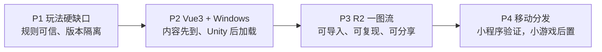
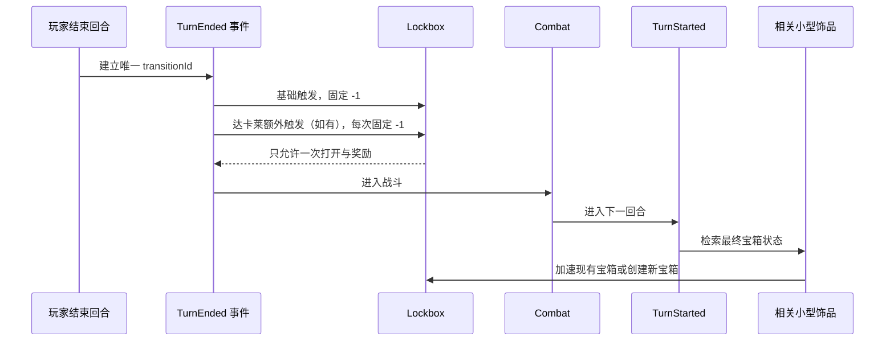
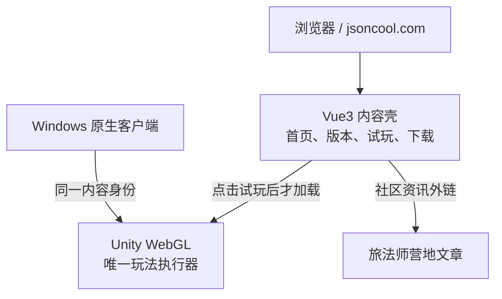

# 36.2 玩法收口、产品外壳与一图流实施计划

> 状态：实施基线
> 决策日期：2026-08-06
> 适用项目：Learn Heartstone / <https://jsoncool.com/>
> 发布平台：Cloudflare；不再以 Vercel 作为本路线的目标平台
> 上位路线：[PostLaunchProductRoadmap.zh-CN.md](PostLaunchProductRoadmap.zh-CN.md)
> 分享架构：[OnlineServicesAndSharingArchitecturePlan.md](OnlineServicesAndSharingArchitecturePlan.md)
> 发布门：[PatchSubmissionAndReleasePolicy.zh-CN.md](PatchSubmissionAndReleasePolicy.zh-CN.md)

## 1. 结论与固定顺序

本路线把后续工作固定为四个阶段：

1. 关闭玩法硬缺口。
2. 建立 Vue3 产品外壳与 Windows 原生安装包。
3. 建立 R2 一图流场景底座，再做编辑器与图片导出。
4. 先做轻量微信小程序；只有真实传播与试玩需求成立后，才适配微信小游戏运行时。



阶段不可倒置。可以在同一阶段内并行准备互不依赖的任务，但只有当前阶段退出门通过后，下一阶段才进入正式实现和发布。

本路线的产品目标不是继续堆叠一个“什么都有但入口很重”的模拟器，而是形成以下闭环：

```text
看到内容 → 输入分享码/点击阵容 → 立即进入可复现场景 → 完成一次操作 → 导出或再分享
```

## 2. 已冻结的产品与规则决策

### 2.1 开局英雄与种族

- 恢复完整英雄选择页：英雄头像/卡面、技能、护甲、版本状态、搜索/筛选、手选和随机入口都要保留。
- 种族选择不再硬性要求“恰好 5 个”才能继续。
- 默认保留官方式“随机 5 个”快捷操作。
- 当前产品策略把 `SelectionCap` 设为 `10`；自定义模式允许从当前可玩种族中选择 `5–Math.Min(SelectionCap, PlayableTribes.Count)` 个，36.2 因而可手选 5–10 个，并提供“全部 10 个”快捷操作。
- 选择上限由单一版本/产品策略计算，数字 `10` 不能再散落硬编码到多个 UI 分支；未来若可玩种族超过 10，必须先显式修订 `SelectionCap`，不能由 `PlayableTribes.Count` 自动扩大产品边界。
- 当前选择数量、启用种族和排除种族必须始终可见；进入下一步时再由统一策略校验。

这里的“最多 10 个种族”是当前产品能力，不表示每个历史版本都必须拥有相同的 10 个种族。历史版本仍以其版本快照声明的可玩种族为准。

生产开局要求 `PlayableTribes.Count >= 5`。如果某个版本快照不足 5 个可玩种族，应判定该版本包不完整并阻止开局，同时给出可诊断错误；小型测试夹具如需少于 5 个种族，必须走显式的 test-only 构造路径，不能放宽正式 UI 规则。

### 2.2 36.2 的机制选择边界

36.2 / Season 14 的开局“赛季机制”区域只允许：

- 黑暗之赐；
- 饰品。

任务、畸变、扭曲时空、伙伴等不能出现在 36.2 的可选机制列表，也不能通过旧存档或旧 UI 状态偷渡启用。旧版本继续使用各自的历史规则和可选机制，不做全局删除。

“只有黑暗之赐和饰品”只约束赛季机制入口，不表示从 36.2 内容池中排除新英雄、新随从、回归随从或酒馆法术。这些内容仍由版本目录和卡池快照统一决定，不能被做成独立开关。

36.2 的用户可选机制策略冻结为：

| 项目 | 决策 |
| --- | --- |
| 逻辑机制 ID | `dark-gifts`、`trinkets` |
| 正式 36.2 默认值 | 两者都启用 |
| 自定义训练 | 只允许在这两个 ID 内调整；小型/大型饰品 UI 都映射到 `trinkets`，不形成第三个赛季机制 |
| 内部规则标志 | `activate`、`lockbox`、`fishbait` 是内容/规则能力，不是开局机制卡片，也不能由玩家单独关闭 |
| 无效 UI 偏好 | 丢弃非法键并记录诊断；不得传入运行时 |
| 存档/场景声明非法机制 | 以版本不兼容拒绝导入，不静默改写；旧存档继续按其原始版本解析 |

这样区分“页面上可选的赛季机制”和“具体卡牌需要的底层规则能力”，避免把宝箱等内容机制误做成第三个开局开关。

### 2.3 上锁的宝箱与达卡莱

宝箱倒计时是结束回合效果，不是下一回合开始效果。

- 每一个有效的结束回合触发实例，宝箱固定减少 `1`。
- 同一个触发实例因按钮重入、命令重放、存档恢复或重复分发再次到达时，不能再次扣减。
- 普通达卡莱附魔师使结束回合效果总计触发 `2` 次；金色达卡莱总计触发 `3` 次。
- 多个达卡莱不叠加，只取项目现有规则中的最强倍率。
- 达卡莱产生的是额外触发实例；每个实例仍然只减 `1`，不能把它实现为一次“减 2/3”的无来源批量修改。
- 如果宝箱在某次触发中打开，后续触发实例看到 `Opened=true` 后必须无操作，奖励只能结算一次。
- 回合开始检索宝箱的相关小型饰品仍在 `TurnStarted` 执行：先看到上一个回合结束后的最终宝箱状态，再决定加速现有宝箱或创建新宝箱。

`transitionId` 必须在 `BeginTurnTransition` 命令边界创建，在执行任何结束回合效果前先写入 `MatchState`；建议最小状态为 `TurnEndTransitionSequence` 与 `PendingTurnEndTransitionId`。直到整次转换完成前，重入、存档恢复和命令重放都复用同一个 ID，完成后才清空 pending 状态并递增序列。

一次宝箱 occurrence 的“校验、倒计时、打开标记、事件记录、奖励入队”作为同一领域命令提交。任一步失败时不能留下半扣倒计时或已打开但未发奖的状态；优先复用 `DelayedObjectService.Advance` 现有的无部分提交语义，不为本地状态机额外引入分布式 outbox。已完成 request ID 要进入存档/场景/回放；第一版不主动裁剪，后续如需压缩只能随 schema 迁移并证明不会破坏幂等。

建议的固定顺序：



已知来源目前不会在 `TurnEnded` 处理中创建新宝箱。为了保持确定性，若未来新增这种来源，默认只让事件开始时已经存在的宝箱参与本次倒计时；除非正式规则明确要求创建后立即触发。

### 2.4 两种“金色但无三连奖励”的来源

只有以下两类来源必须被明确标记为不发三连奖励：

1. 1 星夺金健将。36.2 中它不再依靠战吼变金，获取时就是相应的金色结果，且不发三连奖励。
2. 6 星的安静的投递员（Silent Deliverer，`MIN-R22`，DBF `132923`）发现/生成的随机金色 4 星随从，该金色 4 星随从不发三连奖励；金色投递员产生两张时，两张都携带同一类来源标记。

安静的投递员不是固定目标 ID：候选必须从当前版本可用的 4 星随从池解析，固定种子只负责可复现抽样，不能把测试中的某张目标牌写死进正式行为。

不能写成“所有生成的金色随从都没有三连奖励”。普通三连、明确允许奖励的金色化和其他生成来源必须维持原规则。

### 2.5 抉择同时触发

使抉择“两者皆触发”的饰品能力必须落到统一抉择解析器，而不只是给新生成的牌加一个展示标签。

- 只支付一次费用、只消耗一次卡牌或技能使用次数。
- 两个效果按卡牌定义中的稳定顺序执行。
- 目标选择只出现规则真正需要的次数；不能因执行两个效果重复收费或重复阻塞。
- 从商店、手牌、发现、复制、变形、存档恢复和分享场景导入得到的抉择牌都要一致。
- UI 必须显示“两个效果都会触发”，不能继续让玩家误以为只执行已点击的一侧。

### 2.6 准备阶段进击传播

准备阶段攻击已经能够执行随从自己的进击效果，但它产生的全局 `RallyResolved` 事件也必须传播到：

- 黑暗之赐观察者；
- 饰品或其他当前版本允许的全局观察者；
- 旧版本中合法存在的扭曲时空/英雄等观察者。

修复只补全事件传播，不能再次执行随从自己的进击效果。一个实际进击触发只能有一个稳定事件 ID；重复消费同一奖励不得再次触发全局观察者。

## 3. 当前实现基线与差距

| 项目 | 当前工程状态 | 目标差距 | 主要证据 |
| --- | --- | --- | --- |
| 36.2 机制条 | 已只显示黑暗之赐与饰品 | 增加版本策略和旧状态钳制回归，防止未来回退 | `UnityTavernTribeSelectionView.cs`、`SetupStepperFlowTests.cs` |
| 种族自选 | 继续门、计数、按钮、随机和进入门多处写死 `5`；已有“全部种族”入口 | 抽成 `5–Math.Min(SelectionCap, PlayableTribes.Count)` 的策略，当前保留随机 5 和全部 10 | `UnityTavernTribeSelectionView.cs` |
| Lockbox | 在 `CompletePendingTurnStart`、切换到下一回合后推进；测试要求创建回合不减 | 迁移到 `TurnEnded`；创建后的首个回合结束即减；接入达卡莱额外触发 | `Season14MechanicServices.cs`、`MatchService.cs`、`LockboxMechanicTests.cs` |
| 达卡莱 | 多个随从结束回合处理器已经使用普通 2、金色 3 的倍率 | 复用统一倍率并为每个宝箱触发实例生成稳定去重键 | `MatchService.cs` |
| 夺金健将 | 仍是 1/1、圣盾、战吼使自己变金 | 按 36.2 正式实体更新数据与行为，移除战吼并锁无三连奖励 | `battlegroundsMinions.json`、`MatchService.cs` |
| 6 星生成金色 4 星 | 已通过现有金色化路径抑制三连奖励 | 增加来源级回归，避免以后被通用金色重构破坏 | `MatchService.cs` |
| 抉择两者皆触发 | 已给部分生成卡添加 `choose_one_both_effects` 标签 | 补齐所有来源、统一解析与端到端测试 | `MatchService.cs`、`Season14TrinketFinalBehaviorTests.cs` |
| 准备阶段进击 | 随从自身效果执行；准备阶段奖励桥忽略 `FriendlyRallyTriggered` | 与正常战斗共用全局 `RallyResolved` 分发，且不双触发自身效果 | `CombatEngine.cs`、`MatchService.cs` |
| 两名新英雄 | 行为和英雄图来源已接入；萨维斯 12 甲、特莱斯塔斯 10 甲 | 正式 DBF、英雄技能图和最终内容修订仍待冻结 | `battlegroundsHeroes.json`、版本事实表 |
| 六名旧英雄调整 | 当前目录仍保留旧费用、阈值或旧技能版本 | 建立 36.2 版本覆盖并回归旧版本，不直接污染历史快照 | `battlegroundsHeroes.json`、营地 36.2 整理 |
| 场景底座 | `TestScenarioDefinition` schema v3 已覆盖战局、版本、选择、延迟对象和 RNG | 增加“一图流挑战包装层”、难度、允许操作和发现策略 | `TestScenarioModels.cs`、`TestScenarioMapper.cs` |
| Web/发布 | WebGL 与 Cloudflare 发布链已存在 | 新增独立 Vue3 壳；静态路由不加载 Unity；接入 Windows 下载和场景分享 | `Assets/WebGLTemplates`、`Deploy/Cloudflare`、发布文档 |

本表只说明本路线涉及的差距，不替代完整内容清单。36.2 是否可以从 `Partial` 升为 `Verified`，仍由全部必需英雄、随从、法术、黑暗之赐、饰品、卡池差异和资源完整性共同决定。

## 4. 版本事实与英雄调整冻结

### 4.1 来源优先级

实现前按以下优先级冻结事实：

1. 正式客户端数据或 Battle.net Cards API 快照；
2. 暴雪正式补丁日志；
3. 暴雪赛季公告、开发者说明和官方卡图；
4. 旅法师营地、HSReplay 等社区交叉核对；
5. 单张截图或试玩观察。

低优先级来源可以建立 `preview` 修订，但不能覆盖已发布的历史内容字节，也不能单独把版本标记为 `Verified`。

### 4.2 36.2 新英雄

| 英雄 | 36.2 行为 | 当前状态 | 收口任务 |
| --- | --- | --- | --- |
| 梦魇之王萨维斯 | 被动；每 4 个回合发现一张具有黑暗之赐的随从牌；沿用当回合普通黑赐候选等级与限制 | 行为已实现，12 甲，`heroDbfId=0`，英雄技能图片为空 | 核对正式 DBF/卡图/本地化；验证第 4/8/12…回合与选择队列阻塞 |
| 特莱斯塔斯，寄生之魂 | 开局发现一张具有黑暗之赐的 5 星随从牌，第 7 回合解锁，使用专属赠礼池 | 行为已实现，10 甲，`heroDbfId=0`，英雄技能图片为空 | 核对正式 DBF/卡图/专属池；验证开局队列、锁定、解锁、存档和回放 |

官方赛季公告确认两名英雄及其设计方向，但完整可执行文本还需要正式数据交叉核验。现有官方 CDN 英雄图应下载、校验 hash 并作为本地资产发布，不能让运行时依赖外部热链。

### 4.3 营地整理的旧英雄行为调整

下表来源暂记为 `CommunityObserved`。在正式数据升格前，可以进入 36.2 preview 版本覆盖，不得全局改写旧版本。

| 英雄 | 当前目录/旧行为 | 36.2 目标 | 实现注意 |
| --- | --- | --- | --- |
| 艾德温 | 购买 5 张牌后提升 | 购买 4 张牌后提升 | 计数器、剩余文案和临界购买测试同时更新 |
| 拉卡尼休 | 当前目录是主动获得 Lantern Light 的另一版技能 | 酒馆法术额外 +1/+1，每 3 回合在回合开始时提升 | 这是技能修订切换，不是只改 `4→3`；必须用版本化英雄技能定义 |
| 凯瑞尔 | 技能 1 费 | 技能 0 费 | 指令可用性、金币不变和 UI 费用同步 |
| 拉格纳罗斯 | 购买 16 张牌获得萨弗拉斯 | 购买 12 张牌获得萨弗拉斯 | 精确一次解锁；旧进度存档迁移要钳制 |
| 萨鲁法尔 | 购买 4 个随从后提升酒馆光环 | 购买 3 个后提升 | 商店已有随从与新刷随从采用同一成长版本 |
| 强化机器人 | 刷新后给 1 个随机随从随机额外关键词 | 每次刷新触发两次 | 两次独立确定性取样；允许同一目标被选中时按正式规则处理；回放结果一致 |

英雄版本解析至少需要以下绑定信息，具体可落在现有目录字段或轻量覆盖表中，不要求为了形式新增平行仓储：

```text
HeroVersionBinding {
  gameVersionId, heroCardId, heroRevisionId, heroPowerRevisionId,
  armorProfileId, sourceLevel, implementationStatus
}
```

解析优先级冻结为“精确 `gameVersionId` 绑定 → 该版本声明的 ruleset/content fallback → 仅历史版本可用的 legacy 定义”。如果 36.2 已声明绑定但对应修订缺失，必须报不完整内容，不能静默落回旧技能。存档、回放和场景一旦记录了实际 hero/heroPower revision，就继续解析该修订，不能随当前目录更新而漂移。

营地同页还提供单打低分段、单打高分段和双打三套护甲列表。当前项目英雄模型只有一个 `Armor` 值，因此不要手工把整张表覆盖成单一数字。实施时应：

- 新增或复用版本化 `armorProfile`，至少区分项目实际支持的模式/分段；
- P1-A 在 `SoloLow` 与 `SoloHigh` 中为当前单人训练模式冻结一个明确默认 profile，并在英雄选择页显示；正式事实未确认前不凭空选择，版本保持 Preview；
- 不支持的双打 profile 只进入内容事实，不假装已在运行时生效；
- 旧场景继续保存实际护甲快照，导入时不因当前 profile 改变而静默改写。

## 5. P1：关闭玩法硬缺口

### P1-A 事实快照与失败测试

目标：先把“正确行为”写成失败测试和版本事实，再修改运行时。

任务：

- 从正式客户端/API 或可追溯来源生成 36.2 英雄、护甲、夺金健将和相关饰品事实快照。
- 给每条事实记录 `sourceLevel`、`revisionId`、`contentFingerprint` 和获取日期。
- 对本文 2.1–2.6 的规则先补失败测试；不删除为了暴露缺口而失败的用例。
- 将营地六项英雄调整放入 36.2 版本覆盖清单，正式来源未到时保留 Preview 标记。

完成定义：事实表、失败用例、目标版本和旧版本对照都可由另一位开发者独立复核。

### P1-B 恢复英雄/种族完整选择与版本机制策略

实施状态（2026-08-06）：已完成。`SetupSelectionPolicy` 已统一 5–10 自选、随机 5、`SelectionCap=10`、全部快捷入口与 Ruleset allowed/default 机制；36.2 只允许并默认启用 `dark-gifts`、`trinkets`，legacy 保留历史合法机制。策略字段已纳入内容 fingerprint，P1-A 对应红灯已转绿；下一项为 P1-C。

建议改动点：

- `UnityTavernTribeSelectionView.cs`：删除散落的 `selected.Count == 5`、`< 5` 和 `/5` 决策。
- 建立单一的开局能力模型，例如 `SetupSelectionPolicy`：
  - `DefaultRandomTribeCount=5`；
  - `MinCustomTribeCount=5`；
  - `SelectionCap=10`；
  - `MaxCustomTribeCount=Math.Min(SelectionCap, PlayableTribes.Count)`；
  - `AllowedMechanicIds` 来自 `GameVersion`/`Ruleset`；
  - `DefaultMechanicIds` 明确版本默认值。
- UI 只消费策略，不自己猜版本。
- Season 14 只显示并接受 `dark-gifts` 与 `trinkets`；Lesser/Greater 只是饰品子配置。
- 普通 UI 偏好中的非法键在进入领域层前移除并记录 warning；存档、URL 分享场景或版本化场景显式声明任务、畸变、时空等非法机制时，版本解析器必须以“不兼容”拒绝，不能静默改写可复现输入。
- `activate`、`lockbox`、`fishbait` 只由 ruleset/content 快照决定，不能出现在用户机制开关中。

最小回归矩阵：

| 用例 | 预期 |
| --- | --- |
| 随机 5 个 | 无重复，全部来自当前版本可玩种族 |
| 手选 5、6、10 个 | 均能进入下一步，卡池与选择一致 |
| 手选超过当前版本上限 | UI 不允许，领域校验也拒绝 |
| 点击全部种族 | 当可玩种族数不超过 `SelectionCap` 时选择全部；若未来超过上限则隐藏/禁用该快捷操作并要求先修订产品策略，不任意截取 10 个 |
| 36.2 开局机制 | 只有黑暗之赐与饰品；任务/畸变不存在 |
| 旧版本开局机制 | 保留该版本原有合法选择 |
| 旧存档向 36.2 注入非法机制 | `Rejected`，返回版本不兼容诊断；不修改输入后继续运行 |
| 英雄手选/随机 | 卡面、技能、护甲和版本状态正确，选择可复现 |

### P1-C Lockbox、结束回合与达卡莱

实施状态（2026-08-06）：已完成。宝箱自然倒计时已进入真实 `TurnEnded` 链；一次 transition 在效果前持久化稳定 ID 和最强达卡莱 1/2/3 occurrence 快照，每个 occurrence 只执行 `Advance(1)` 并以完整 request ID 幂等。创建回合跳过已删除，重复 Begin、打开一次、回合开始饰品分支和结束前/后场景恢复均有回归；自然、战吼、亡语、金币和饰品加速已分离事件来源/类型。P1-A 两个 Lockbox 红灯已转绿，下一项为 P1-D。

实现契约：

- 将宝箱自然倒计时从 `CompletePendingTurnStart` 移到 `TurnEnded` 分发链。
- 建立一次真实回合转换的稳定 `transitionId`。
- 结束回合倍率在事件开始时取玩家场上最强达卡莱快照：无/普通/金色对应 1/2/3。
- 为每个宝箱和每个触发序号建立请求 ID，例如：

```text
turn-end:{round}:{transitionId}:lockbox:{instanceId}:occurrence:{0..n-1}
```

- `DelayedObjectService.Advance` 每次只接收 `1`；依靠请求 ID 保持幂等。
- `BeginTurnTransition` 先持久化 `PendingTurnEndTransitionId`，效果链、存档恢复和重放都复用它；转换完成后才清空并递增序列。
- 自然倒计时、战吼/亡语/花费金币加速、饰品回合开始加速必须使用不同来源与事件类型。
- 删除“创建回合自动跳过”的旧条件和对应旧测试断言。
- 存档/场景要保存足够的事件历史或已完成请求 ID，使回放恢复后不会重复打开。
- 每个 occurrence 复用领域状态机的原子提交：倒计时、打开、事件和奖励要么全部成功，要么全部不落地；第一版不裁剪完成 ID。

强制测试：

| 初始状态 | 操作 | 预期 |
| --- | --- | --- |
| 新建宝箱 5 | 当回合正常结束 | 4 |
| 新建宝箱 5 + 普通达卡莱 | 当回合结束 | 3（两个触发实例，各 -1） |
| 新建宝箱 5 + 金色达卡莱 | 当回合结束 | 2（三个触发实例，各 -1） |
| 宝箱 1 + 普通/金色达卡莱 | 当回合结束 | 只打开并发奖一次 |
| 同一 occurrence 重放两次 | 重复调用 | 只扣一次 |
| 同一回合结束命令重入 | 重入/恢复 | 只完成一次 transition |
| 上回合宝箱打开 + 回合开始饰品 | 下一回合开始 | 饰品看到已打开状态，再按规则创建新宝箱 |
| 宝箱未打开 + 回合开始饰品 | 下一回合开始 | 只加速现有宝箱，不额外创建 |
| 保存于结束回合前/后 | 恢复并继续 | 与不中断路径状态和奖励完全一致 |

### P1-D 金色来源与三连奖励

优先复用现有“已处理三连奖励”标记，不增加一套平行奖励系统。若现有字段语义不足，再补来源枚举/字符串用于日志和测试。

任务：

- 按正式 36.2 数据更新夺金健将普通/金色实体、身材、文本和关键词。
- 删除夺金健将的战吼处理分支；获取时直接建立金色实例并写入无奖励来源。
- 保留安静的投递员（`MIN-R22`/DBF `132923`）从当前版本 4 星池生成随机金色随从的现有抑制逻辑，覆盖普通产生一张、金色产生两张并补端到端测试。
- 普通三连、商店合法金色、其他明确允许奖励的金色化必须继续发三连奖励。
- 场景导入/复制这些特殊金色随从时保留来源或已处理标记，不能重新发奖。

回归矩阵至少包含：手牌已满、发现队列已有阻塞选择、复制特殊金色、卖出再获得、保存恢复和旧版本夺金健将。

实施状态（2026-08-06）：已完成。36.2 通过 `BG32_236@36.2-preview-v1` 将夺金健将解析为 2/2、圣盾、无战吼、创建即金色，并用 `minion.always-golden-no-triple-reward` 加既有 `triple-reward-granted` 标记抑制奖励；legacy 继续通过 `self_golden` 标签保留 1/1 战吼自金。安静的投递员继续复用 `MakeGoldenInPlace`，普通/金色生成 1/2 张随机金色四星随从。复制、场景 effectId 回退、保存恢复、满手购买/发现、卖出再获得、普通三连和显式可奖励金色均已有回归。最终 P1-D 聚焦集 12/12、邻域 51/51 通过；Console `error CS` 为 0，JSON 与 diff-check 门通过，暂存区保持为空。此前完整 EditMode 在 1664/2154 后因主 Editor/MCP 无响应中断，该环境异常已记录但不替代上述 P1-D 定向退出门；下一项为 P1-E。

### P1-E 抉择双效果统一解析

实施状态（2026-08-06）：已完成。单卡永久能力由 `choose-one-both-effects` Counter 表达，Fandral 发现写入该能力并派生兼容展示标签；Trailblazer Sticker 作为动态已装备能力进入最终解析，派生标签带独立来源标记，饰品替换时原子清理且不影响永久能力。酒馆法术和 Foodie/Scarab/Season14 野猪人选择共用最终能力判定，双效果固定按 option 顺序执行，只消费/计数一次且不残留选择。双路径写 `choose-one.resolved` 父事件和两条共享 requestId 的 `choose-one.branch-resolved`；`ResolveAllOptions` 已纳入场景保存恢复。P1-E 聚焦 7/7、相关邻域 118/118 通过，Console `error CS` 为 0，diff/static 门通过，暂存区为 0；未修改 P1-F。

任务：

- 找到所有 Choose One 的最终解析入口，以能力状态决定单选还是双执行。
- 让展示标签成为解析结果的派生信息，不作为唯一行为来源。
- 冻结双效果执行顺序、目标复用规则、费用和卡牌消耗时机。
- 覆盖随从、酒馆法术、生成牌、复制、变形、发现、场景导入和存档恢复。
- 双效果路径写入一条父事件和两条可追踪子效果，便于回放解释。

强制断言：只支付一次；两个效果各一次；没有残留选择窗口；事件和回放顺序稳定；没有饰品时仍只执行玩家选择的一项。

### P1-F 准备阶段进击统一传播

实施状态（2026-08-06）：已完成。`CombatReward` 现在携带由 `CombatEngine` 为每次合法进击生成并在奖励克隆中保留的 `RallyOccurrenceId`；正常战斗与准备阶段统一调用 `DispatchRallyObservers`，只传播 Vaelastrasz、Timewarp 与黑暗之赐观察者，不重放随从自身进击效果。传播以 `sourceInstanceId + rallyOccurrenceId` 写入持久化 `rally.observers-dispatched` requestId，同一奖励重放被忽略，多次合法 occurrence 分别传播，且场景保存/恢复沿用既有 `MechanicEvents` 映射。P1-F/P1-A 聚焦 10/10、跨族定向邻域 31/31、完整核心邻域 291/291、MatchService 与 36.2 承载邻域 379/379 通过；Console `error CS` 为 0，diff/static 门通过，暂存区为 0；未修改 P1-G。

任务：

- 在 `ApplyRecruitPhaseRewards` 中把 `FriendlyRallyTriggered` 交给共用的全局传播函数。
- 将正常战斗目前执行的 `HandleVaelastraszRally`、Timewarp 分发和 `DispatchDarkGiftEvent(RallyResolved)` 按版本能力复用。
- 明确“随从自身进击已由 `CombatEngine` 解析”，桥接层只通知观察者。
- 使用 `sourceInstanceId + rallyOccurrenceId` 去重。

强制测试：

- 准备阶段进击触发随从自身效果一次。
- 同一次进击触发黑暗之赐观察者一次。
- 多次合法进击分别传播。
- 重放同一奖励不重复传播。
- 正常战斗路径行为不变。
- Season 14 不错误激活旧版本非法机制；旧版本合法观察者仍工作。

### P1-G 英雄调整、资源与版本隔离

实施状态（2026-08-06）：已完成。`content-36.2-preview-v1` 已从 2 个扩展为 8 个英雄修订；艾德温、拉卡尼休、凯瑞尔、拉格纳罗斯、萨鲁法尔和强化机器人均以独立 36.2 hero/effect revision 生效，legacy 的 5 次购买、旧主动拉卡尼休、1 费凯瑞尔、16/4 阈值和单次刷新保持不变。拉卡尼休酒馆法术额外增益与每第三回合成长复用现有酒馆法术结算链；英雄选择、随机/开局、版本锁、存档、回放和场景恢复继续使用同一 resolved `HeroCatalog`。两名新英雄的简中、本地英雄图与 SHA-256 已冻结，运行时只读 Unity `Resources`/本地 fallback，不访问 `imageSource`；因正式 hero/power DBF 和独立技能图尚未确认，继续保留 preview ID、DBF 0、技能图 fallback 和单一护甲字段的 Preview 边界，不伪造 SoloLow/SoloHigh/Duos profile。P1-G 聚焦 7/7、英雄/种族 UI 8/8、版本/场景/存档/回放邻域 58/58、完整既有英雄技能 150/150 通过；Console `error CS` 为 0，JSON/hash/hotlink/diff-check 门通过，暂存区为 0；下一项严格进入 P1-H。

任务：

- 为两名新英雄补正式 DBF、英雄技能图、本地化、图片 hash 和内容来源；正式数据未确认前保持 preview ID。
- 实现 4.3 中六项旧英雄调整，并以 36.2 hero/effect revision 绑定。
- 为拉卡尼休建立完整技能版本切换，不直接修改全局旧技能。
- 按项目实际支持范围接入 36.2 护甲 profile。
- 检查英雄选择页、随机英雄、存档、回放和场景导入均解析到同一版本英雄修订。
- 图片下载到本地资源并设置稳定 fallback；公开构建不依赖营地或暴雪 CDN 热链。

### P1-H 总体验收与退出门

P1 退出前必须：

- 上述定向测试全部通过。
- 相关 UI EditMode/PlayMode、存档、回放、版本锁和内容协议测试通过。
- 普通 EditMode、Stress（排除 Marathon）、PlayMode 和 WebGL 玩家旅程门通过。
- Console 无新增 Error/Exception/关键 Warning。
- 旧版本回归通过，尤其是旧英雄技能、旧机制可选项和旧夺金健将。
- 36.2 的 `Partial/Verified` 状态由完整内容门决定，不因只修完本文几个缺口而虚假升格。
- 两名新英雄仍存在 `heroDbfId=0`、英雄技能图缺失或未本地化时，36.2 不得升为 `Verified`；对外宣发使用的英雄/随从图片必须已落本地并通过引用完整性检查。
- 六名旧英雄调整仍只有 `CommunityObserved` 证据时，只允许进入明确标记的 Preview 覆盖；取得完整官方 36.2 快照并完成差异核对，是升为 `Verified` 和 Production 默认版本的硬门。
- 若仍为 Preview，产品外壳必须展示 Preview 和 `unsupportedEffects`；不得自动成为默认正式版本。

实施状态（2026-08-07）：已完成 P1-H 工程退出门。普通 EditMode 2,162/2,162、Stress 10/10（排除唯一 Marathon）、PlayMode 19/19 和 WebGL 分块单测 1/1 全部通过；大型 UI fixture 的 129 个源码方法按有界批次全部通过，不再运行不可恢复的整类长任务。唯一一次新 WebGL 构建与候选装配成功，候选 `p1h-20260807-r1 / 36.2-preview / ruleset-36.2-preview-v1` 的内容指纹为 `02c095c0894978fa8601df56bebf2905606d465fdeb22d876e47263b38063ecd`；101,899,863 字节的源 `.data.br` 已拆成 11 个发布分块，最大 11,998,676 字节，未发布单体数据文件，全部内容/分块 hash 与独立重组校验通过。Cloudflare Preview `p1h-preview-20260807-r2`（`https://8c1e6b8d.learn-heartstone.pages.dev`）在桌面 HD、桌面 2K、手机横屏三视口完成玩家旅程：11/11 分块、Remote 快照/版本/指纹精确命中、无请求或页面错误、无溢出/旋转阻塞，HD 输入已实际进入四步开局。Pages `_headers` 已使用合法的 `/content/:asset.v:version.json` 占位规则，内容清单保持 `must-revalidate`，版本化内容返回一年 `immutable`。最终 Unity Console 为 0，`git diff --check` 为 0，暂存区为 0；Production 与 `jsoncool.com` 未变，仍为既有 P6 legacy 候选。由于正式 hero/power DBF、独立技能图、完整官方 36.2 快照和六名旧英雄的官方差异证据仍未冻结，36.2 继续保持 `Partial/Preview`、不升为 `Verified`、不成为 Production 默认版本。

## 6. P2：Vue3 产品外壳与 Windows 原生包

### 6.1 架构边界

Vue3 负责产品入口，Unity 继续负责规则和互动战局。两者之间不能复制第二套玩法逻辑。



硬边界：

- `/`、`/versions` 和 `/download` 不能请求 Unity `.loader.js/.framework/.wasm/.data`；`/play` 的静态预检阶段也不能请求。
- 只有在 `/play` 路由中，且用户明确点击“开始试玩”后，才创建 Unity 容器并加载构建。
- Vue 展示卡牌/英雄摘要可以读取内容快照，但不能自行结算黑赐、饰品、进击或战斗。
- Unity 与 Vue 通过小型桥接契约通信，不直接互相访问内部状态。

### 6.2 冻结路由

| 路由 | 用途 | 是否加载 Unity |
| --- | --- | --- |
| `/` | 产品说明、当前版本牌轨、两个机制和主要 CTA | 否 |
| `/versions` | 版本/支持状态、已知差异、更新时间、未支持效果和旅法师营地资讯外链 | 否 |
| `/play` | 资源预检和自由训练入口 | 用户确认后加载 |
| `/download` | Windows 原生包、版本、hash、已知问题 | 否 |

P2 明确不实现 `/guides` 和 `/s/:shareCode`，也不提前搭建 P3 的短码、D1/R2 或静态兼容壳。未冻结路由统一进入 Vue 404；一图流只在 P3 场景协议、导入和确定性门完成后进入产品信息架构。

直接访问 `/play` 也不能自动下载 Unity。页面先渲染静态的版本兼容、资源大小、网络/内存提示和用户确认面板，加载状态机固定为：

```text
idle -> loading -> ready
                  -> failed -> loading（用户主动重试）
```

只有 `idle -> loading` 的用户动作才能插入 Unity 容器并请求 `.loader.js/.framework/.wasm/.data`；离开页面要释放桥接监听，失败态不得在后台无限重试。

### 6.3 Cloudflare 部署形态

- Vue3/Vite 构建作为 Cloudflare Pages 静态资产发布；P2 当前不增加 Worker、D1 或动态 API。
- 不提供顶层 `404.html`，使用 Pages 原生 SPA fallback；不得使用会优先吞掉 `/unity/*` 的 `/* /index.html 200` 通配 `_redirects`。
- `_headers` 声明安全头、指纹资源缓存和 Unity 预压缩资源的 MIME/`Content-Encoding`；根 HTML 与 release/content manifest 保持可重新验证。
- `jsoncool.com` 作为 Production；Preview 使用不可混淆的 Cloudflare 预览地址。
- Unity 构建 manifest 指向不可变、带 hash 的 R2 对象；HTML 入口可更新，版本资源不可覆盖。
- 保留现有 WebGL 分块策略；R2 解决对象承载，不等于自动解决总下载量、内存或移动端渲染性能。

### 6.4 Unity 桥接契约

完整桥接阶段只需要：

```text
Vue -> Unity: loadScenario(json | shareCode)
Vue -> Unity: setLocale(locale)
Unity -> Vue: unityReady(buildVersion, contentSnapshotId)
Unity -> Vue: loadProgress(percent, stage)
Unity -> Vue: scenarioLoaded(result | diagnostics)
Unity -> Vue: scenarioCompleted(resultSummary)
Unity -> Vue: fatalError(code, safeMessage)
```

所有消息必须带协议版本；错误消息不得包含本机路径、访问令牌或内部堆栈。

当前 P2 静态壳首批切片只负责在用户确认后创建同源 iframe，并用 iframe 页面 `load` 区分“页面已连接”；不得把它标成 Unity runtime ready。上述 `unityReady/loadProgress` 消息桥在 Unity 模板提供协议版本后接入。

### 6.5 Windows 原生安装包

- 交付真正的 Unity Windows 构建，不用 Electron/Tauri 再包一层 WebGL。
- Windows 与 WebGL 使用同一 `GameVersionId`、`RulesetId`、`ContentSnapshotId` 和场景 schema。
- 第一版只提供人工下载更新，不引入自动更新器。
- 下载清单包含版本、发布时间、文件大小、SHA-256、最低系统说明、已知问题和回滚下载。
- 安装包/压缩包和不可变发布 manifest 放 R2；下载页通过 `downloads.jsoncool.com` 直连 R2 对象，并保留 Pages 同版本 manifest 供页面展示与校验。P2 不为这一条下载链新增 Worker。

### 6.6 P2 验收门

- 静态路由网络面板中没有 Unity 请求。
- 点击试玩后加载状态、失败重试和返回静态页都可用。
- 直接访问/刷新每个 Vue 路由不会 404。
- WebGL 与 Windows 导入同一固定场景得到相同初始状态和确定性结果。
- Windows 包 hash 与下载页一致。
- Cloudflare Preview smoke 通过后，Production 由同一候选提升；可回滚到上一个静态壳和 Unity manifest。

实施状态（2026-08-07）：P2 Vue3 静态壳、当前 P2 WebGL 候选、Windows 原生包、Cloudflare R2 下载链和隔离 Preview 已完成，位于 `WebApp`、`Builds/ReleaseCandidate/0.1.0-alpha__20260807T070409Z-cc03773-dirty` 与 `Builds/WindowsRelease/0.1.0-alpha__p2-20260807-r1__build-4615b881f7`。路由严格冻结为 `/`、`/versions`、`/play`、`/download`；`/guides` 与 `/s/:shareCode` 未实现。UI 使用 UI/UX Pro Max 2.13.0 生成并人工校正的暗色酒馆设计系统，版本中心包含三条旅法师营地外链且明确标为社区资料。WebGL 构建 `build-bd3dd55881` 与 Windows 构建 `build-4615b881f7` 统一为 `p2-20260807-r1 / ruleset-36.2-preview-v1`，package fingerprint 为 `a3d90859eafc4d2d58e2b52cfeaee96868f51329710201b66323111be8a43817`；102,697,948 字节源数据已拆成 11 块，最大 11,869,690 字节，最终 `dist` 68 个文件中无文件超过 25 MiB。Windows 关闭崩溃已定位为 Unity 6000.4.10f1 的 `PlatformAccessibilityManager::StaticDestroy`，最终使用仅限该 Unity 版本、仅限 `UnityPlayer.dll+0x107B81` 的原生异常 guard；D3D11/D3D12 均以 exit 0 关闭且无新增 CrashDump。Windows zip 为 179,289,812 字节，SHA-256 `99955513b4e6077ab8a069efffe6cd3561cd84c6e0f91479e904a7b1adaaff69`。R2 订阅已启用，Standard 桶 `learn-heartstone-releases` 与 `downloads.jsoncool.com`（ownership/SSL active，最低 TLS 1.2）已建立；ZIP 经 12 个连续 Range 完整回读，字节总和与 SHA-256 均与本地冻结候选一致，最终 manifest 也已上传并回读一致。下载按钮已在隔离 Preview `https://p2-windows-r2-20260807.learn-heartstone.pages.dev` 开放；四路由、Unity release-meta、Windows manifest、375×812/1440×900 DOM、Console 和 R2 206/Cache HIT smoke 全部通过。经单独发布决策，同一 `dist` 已提升为 `main` Production 部署 `c9ae9e3a-69f4-4a4a-b919-9f9cb7219a0a`；`https://jsoncool.com` 的四路由、双视口下载页、manifest、Unity 身份与 R2 206 Range 最终 smoke 全部通过，上一 Production `8d030d39-72fa-4038-9cc5-d1a17256421f` 保留为回滚点。

下载页面向玩家只展示版本、下载动作、约 180 MB 大小和解压运行提示；构建号、内容快照、SHA-256、D3D/R2 验证过程与发布门只保留在 manifest、实施文档和自动化测试中，不进入玩家界面。

## 7. P3：R2 一图流场景底座

### 7.1 不重建战局快照

现有 `TestScenarioDefinition` schema v3 继续作为战局状态权威。新增一个轻量挑战包装层，例如：

```json
{
  "schemaVersion": 1,
  "scenarioId": "scn_...",
  "revision": 1,
  "title": "...",
  "gameVersionId": "36.2-preview",
  "rulesetId": "...",
  "contentSnapshotId": "...",
  "difficulty": "GuidedDiscover",
  "state": { "$ref": "TestScenarioDefinition-v3" },
  "allowedActions": [],
  "discoverPolicy": {},
  "objectives": [],
  "hints": [],
  "render": {},
  "provenance": {}
}
```

真实实现可以内嵌 `state` 或引用不可变对象，但不能维护两份语义相同的战局字段。

### 7.2 三档难度

| 难度 | 中文定位 | 初始状态 | 玩家主要操作 | 发现控制 |
| --- | --- | --- | --- | --- |
| `Showcase` | 简单/成型体验 | 直接给成型或接近成型阵容 | 少量站位、出售、开始战斗 | 通常无发现或固定结果 |
| `GuidedDiscover` | 引导/三连发现 | 给若干对子、三连或指定资源 | 完成三连并做关键发现 | 可保证目标出现，但必须标“引导” |
| `OpenBuild` | 进阶/其他找牌方式 | 给预算、回合和部分组件 | 刷新、买卖、法术、黑赐、饰品、宝箱等 | 默认固定种子的自然候选 |

三档难度共用同一个执行器，只通过数据限制操作和候选，不能各写一套玩法代码。

### 7.3 发现策略

```text
NaturalSeeded  完全由固定种子和内容池产生，适合真实复现
MustInclude    候选中保证包含指定卡，其余候选按固定种子产生
Pinned         候选及顺序完全固定，适合教学和截图
```

每个场景和导出图必须显示其策略。`MustInclude`/`Pinned` 不能伪装成自然发牌。

难度与发现策略的允许矩阵冻结为：

| 难度 | 默认策略 | 允许的替代 | 限制 |
| --- | --- | --- | --- |
| `Showcase` | `Pinned` | `NaturalSeeded`；需要发现教学时可用 `MustInclude` | 所有受控候选必须在 UI/图片标明 |
| `GuidedDiscover` | `MustInclude` | `Pinned`；高级作者可显式选择 `NaturalSeeded` | 目标牌保证出现时必须显示“引导发现” |
| `OpenBuild` | `NaturalSeeded` | 仅“辅助模式”可用并标明 `MustInclude` | 正常 OpenBuild 禁止 `Pinned`，避免冒充开放找牌 |

三档的最小默认交互也要数据化：

- `Showcase`：允许站位、出售和开始战斗；目标是观察/完成既定阵容，不强制找牌。
- `GuidedDiscover`：允许完成指定三连和发现；目标是取得目标牌或完成一段教学连招，提示按步骤逐级揭示。
- `OpenBuild`：在作者声明的金币、回合和行动次数预算内开放买卖、刷新、法术及合法赛季机制；目标必须可由 validator 在限制内判断成功/失败，提示可选。

### 7.4 导入与验证管线

导入顺序固定为：

1. 文件大小、UTF-8、JSON 语法和 schema 版本检查。
2. 版本、规则集、内容快照和指纹解析。
3. ID、卡池、英雄、机制、数量、属性和状态上限校验。
4. 迁移旧 schema，并输出逐条 migration diagnostic。
5. 校验允许操作、目标和发现策略不会引用不存在的对象。
6. 同种子运行两次，确认初始状态和关键结果一致。
7. 输出 `Compatible`、`CompatibleWithWarnings` 或 `Rejected`，禁止静默近似。

场景格式是声明式 JSON，不接受脚本、表达式执行、任意程序集名、反射类型名或远程代码 URL。

### 7.5 R2 对象与 D1 元数据

R2 对象 key 使用稳定前缀：

```text
scenes/{sceneId}/{revision}.json
renders/{sceneId}/{revision}.webp
releases/windows/{version}/{fileName}
unity/{buildId}/{hashedAssetName}
```

D1 最小记录：

```text
sceneId, shareCode, currentRevision, schemaVersion,
gameVersionId, contentSnapshotId, difficulty,
title, summaryJson, objectKey, renderKey, contentHash,
status, createdAt, updatedAt, deletedAt
```

规则：

- R2 修订对象不可覆盖；编辑产生新 revision。
- D1 只保存可查询元数据和对象 key，不重复存整份大 JSON。
- 场景 JSON canonicalize 后计算 SHA-256；相同 hash 可提示重复，但不擅自合并作者记录。
- shareCode 使用不易混淆字符并建立唯一约束。
- 第一版已发布场景属于“持分享码可读”的 unlisted 内容，不承诺隐私：分享码使用 CSPRNG 生成、不少于 96 bit 随机熵（例如 20 位无歧义 Base32），查询按 IP/colo 限速且不存在/不可见场景使用一致错误外形，降低枚举风险。
- `GET /api/scenes/{shareCode}` 只允许读取 `Published`；`Draft` 仅本地保存或持编辑凭据访问，`SoftDeleted`、`Suspended` 和未通过审核的内容对公开读取统一返回 `SCENE_UNAVAILABLE`。举报本身不自动下架，必须由状态转换决定可见性。
- 场景 bucket 默认私有，Worker 是场景 JSON 的唯一读写网关；公开的分享图、Unity hash 资源和 Windows 发行物可经受控自定义域路径分发。
- 第一版上限作为可配置常量冻结：场景 JSON `1 MiB`、D1 `summaryJson` `32 KiB`、单张分享图 `5 MiB`；超限在写 R2 前拒绝。
- 带内容 hash 的 Unity/安装包/分享图使用 `public, max-age=31536000, immutable`；可变场景元数据和 JSON 第一版使用 `Cache-Control: no-store`，后续有 ETag 实测再放宽。
- 删除先软删除 D1 记录，默认恢复期 30 天；恢复期结束后才由生命周期或 GC 物理清理 R2，不在请求链内即时删除。

创建/修订的提交协议：

1. canonicalize、验证并计算内容 hash；
2. 用条件写入创建不可变 R2 对象，已存在同 key 且 hash 不同则失败；
3. `HEAD` 校验对象大小、hash 与写入结果；
4. 用 D1 事务和乐观条件更新 revision、objectKey 与 current pointer；
5. 若 D1 提交失败，R2 对象保留为暂时无引用对象，由经过宽限期的每日/人工 GC 清理，不能立即删除可能已被并发引用的对象。

读取时先从 D1 解析当前 revision 和对象 key，再读 R2；若对象缺失或 hash 不一致，返回明确的一致性错误并告警，不能静默回退到旧 revision。

### 7.6 API 最小闭环

| 方法 | 路径 | 用途 |
| --- | --- | --- |
| `POST` | `/api/scenes/validate` | 仅验证，不发布 |
| `POST` | `/api/scenes` | 创建场景并返回分享码 |
| `GET` | `/api/scenes/{shareCode}` | 返回元数据与可读取的场景内容 |
| `POST` | `/api/scenes/{shareCode}/revisions` | 保存新修订 |
| `POST` | `/api/scenes/{shareCode}/reports` | 举报/下架入口，公开发布后再启用 |

第一版不做账号、评论、排行榜、关注或复杂权限。匿名创建需要尺寸限制、速率限制和可下架能力；真实滥用出现后再接 Turnstile。

### 7.7 编辑器与一图流图片

只有“格式 + 导入 + 校验 + 固定种子 + 三档难度”通过后才做编辑器。

编辑器第一版：

- 选择版本、英雄、种族、回合、金币和酒馆等级。
- 配置战队、手牌、商店、黑赐、饰品、宝箱和关键计数器。
- 配置允许操作、目标、提示和发现策略。
- 一键本地验证；不通过时不允许发布。
- 预览与试玩使用同一份场景 JSON。

图片第一版采用固定模板和客户端渲染导出，避免过早引入服务端浏览器截图系统。图片至少显示：标题、版本、英雄/种族、核心阵容、替换位、难度、发牌策略、分享码/二维码和“非官方训练工具”说明。生成的 WebP/PNG 可上传 R2，并与场景 revision 绑定。

### 7.8 P3 验收门

- 三档各有至少一个黄金样例，导入、保存、再导入一致。
- 同一场景在两次运行、WebGL 和 Windows 上结果一致。
- 错版本、错内容 hash、非法卡、越界属性、未知效果和恶意文本都有明确拒绝/警告。
- 分享码可从 `/s/:code` 打开摘要，再进入 `/play/:code`。
- 修订不可覆盖旧对象，软删除和下架有效。
- 一图流图片与实际场景 revision、难度和发现策略一致。

## 8. P4：移动分发

### 8.1 先做轻量微信小程序

第一版小程序只承担：

- 浏览热门/最新一图流；
- 打开分享码和二维码；
- 查看阵容、目标、提示、难度和版本兼容性；
- 收藏可以先做本地收藏；
- 复制分享码、打开网页试玩或引导下载 Windows 客户端；
- 收集“想在手机直接试玩”的真实行为数据。

不在小程序第一版中：

- 完整 Unity 自由模拟器；
- 复杂场景编辑器；
- 大量战斗动画资源；
- 账号、社区、排行榜和评论系统；
- 把当前模糊/卡顿的 WebGL 简单包进 `web-view` 当作“移动版完成”。

小程序复用 `/api/scenes` 和同一场景摘要模型，不复制规则结算。

实施状态（2026-08-09）：原生两页 MVP 已落在 [`MiniProgram/`](../MiniProgram/README.md)，支持浏览/搜索、分享码与二维码入口、场景详情、本地收藏、本地步骤、复制/分享和网页/Windows 交接。共享契约由 `ScenarioShareContractService` 组合现有攻略编译器与 `TestScenarioDefinition` v3；当前仍使用本地 fixture 或可选 API 地址，没有引入 Unity 运行时、`web-view`、账号或社区系统。

### 8.2 进入微信小游戏的条件

只有同时满足以下证据才立项：

- 小程序分享码打开量稳定，不只是一次推广峰值。
- 明确有足够用户从移动端点击“开始试玩/希望手机试玩”。
- 一图流场景完成率和二次分享率证明互动场景本身有价值。
- 已在目标真机验证 Unity 资源、内存、字体、触控和网络预算可达。
- 微信小游戏适配的构建、审核、更新和资源 CDN 成本已单独评估。

若成立，再使用官方 Unity/团结引擎微信小游戏适配方案建立独立运行时分支；业务场景协议、版本锁和内容快照继续复用，不重写游戏规则。

### 8.3 移动端观测事件

至少记录匿名聚合事件：

```text
miniapp_scene_open
miniapp_share_code_open
miniapp_play_intent
miniapp_copy_code
miniapp_open_web
miniapp_download_intent
scenario_start
scenario_complete
scenario_reshare
```

不采集无必要的微信身份、通讯录或本机文件信息。所有事件带产品版本、场景版本和兼容状态，但不带场景中的用户隐私备注。

是否进入微信小游戏必须先登记决策表，再开始观察窗口；不能看到结果后倒推门槛。初版模板：

| 字段 | 要求 |
| --- | --- |
| `observationWindow` | 明确起止日期、版本和推广活动，活动峰值单独标记 |
| `uniqueMobileSceneOpens` | 去重的一图流移动端打开量，作为样本量基础 |
| `playIntentRate` | `miniapp_play_intent / eligible_scene_open` |
| `scenarioCompletionRate` | 已开始互动场景中的完成率，按难度拆分 |
| `reshareRate` | 完成或打开后再次分享的比例 |
| 性能基线 | 按设备档位记录资源下载量、加载时长、峰值内存和运行帧率的 p75 |
| 适配成本 | 小游戏运行时改造、审核、更新、CDN 与持续维护的人日/费用估算 |
| 预注册门槛 | 每项的通过线、否决线和证据负责人；取得首轮基线后冻结，评估期内不追改 |

P4 第一个观察窗口只用于建立基线；第二个预注册窗口才作 go/no-go 判断。若样本不足，结论是“继续验证”，不是默认进入小游戏开发。

### 8.4 P4 验收门

- 主流目标真机能打开、分享和读取场景摘要。
- 分享码、二维码和网页/客户端跳转闭环可用。
- API 超时、场景下架、版本不兼容有清楚反馈。
- 已取得足以支持或否决微信小游戏投入的真实指标。

## 9. 跨阶段测试与发布策略

### 9.1 测试分层

| 层级 | P1 | P2 | P3 | P4 |
| --- | --- | --- | --- | --- |
| Domain 单测 | 回合事件、奖励、抉择、进击、英雄版本 | 桥接 DTO | schema、validator、确定性 | 摘要模型 |
| Application 集成 | 完整回合、选择队列、存档回放 | Vue↔Unity 消息 | API、D1/R2、导入 | 小程序↔API |
| UI/玩家旅程 | 英雄/种族/机制开局 | 静态页、延迟加载、下载 | 编辑、发布、分享、试玩 | 打开、分享、跳转 |
| 回归 | 旧版本全部相关族 | WebGL 原入口 | 旧场景迁移 | Web/Windows 不受影响 |
| 发布 smoke | Unity Preview | Cloudflare Preview/Windows 包 | 分享码 Production 只读验证 | 真机预览版 |

### 9.2 原子发布单元

- P1 作为 Unity `CLIENT/FEATURE + CONTENT` 候选发布，可独立回滚。
- P2 的 Vue 壳、Unity manifest 和 Windows release manifest 作为独立 Web/Release 候选。
- P3 的 schema/validator 先随客户端发布；D1/R2 API 后启用；公开创建入口最后打开。
- P4 只依赖已稳定的公开读 API；移动端发布失败不能影响 Web/Windows。

### 9.3 兼容与回滚

- 内容修订不可覆盖；历史版本按 ID 解析。
- 场景 schema 只做向前迁移，不让新客户端回写破坏旧对象。
- Vue 壳回滚时保留上一个 Unity manifest 和下载 manifest。
- Worker/D1 迁移优先新增字段/表；破坏性迁移必须有双读期和恢复脚本。
- R2 删除使用延迟清理，不能在发布事故中立即物理删除唯一对象。

## 10. 指标与产品判定

### 10.1 核心漏斗

```text
landing_view
→ scene_detail_view / code_entered
→ play_click
→ unity_load_started
→ unity_ready
→ scenario_started
→ scenario_completed
→ image_exported / share_created / scenario_reshare
```

### 10.2 每阶段要回答的问题

| 阶段 | 要回答的问题 |
| --- | --- |
| P1 | 用户遇到的是规则错误，还是只是不理解 UI？版本结果是否可信？ |
| P2 | 静态内容能否在不加载 Unity 时快速触达？多少人愿意继续试玩或下载？ |
| P3 | 一图流是否真的被导入、完成、改编和再分享？哪档难度有效？ |
| P4 | 移动端主要是内容消费/传播，还是确有足够直接试玩需求？ |

不要先写死增长目标。先取得稳定基线，再为小游戏立项设阈值；否则容易用一次推广流量证明一个并不存在的长期需求。

## 11. 主要风险与控制

| 风险 | 后果 | 控制 |
| --- | --- | --- |
| 社区预览与正式数据冲突 | 规则再次返工 | 来源等级、版本修订、正式快照覆盖 Preview |
| Lockbox 去重过度 | 达卡莱额外触发失效 | 按 occurrence 去重，而不是按整个回合只允许一次 |
| Lockbox 去重不足 | 重放重复扣减/发奖 | 稳定 transitionId、requestId 和事件日志 |
| 36.2 机制泄漏 | 出现任务/畸变等非法组合 | 版本策略在 UI 和领域两层校验 |
| Vue 复制玩法 | Web 与 Unity 规则分叉 | Vue 只展示，Unity/共享领域层唯一结算 |
| 场景格式重复 | 两套快照长期漂移 | 包装 `TestScenarioDefinition` v3，不重建 state |
| 引导发牌伪装成自然发牌 | 用户对攻略产生错误预期 | 图片和场景显式标出 DiscoverPolicy |
| R2 当数据库使用 | 查询和修订困难 | 大对象进 R2，关系元数据/短码进 D1 |
| WebGL 分块被误当成性能优化 | 手机仍卡顿、总下载量不变 | 独立测量总字节、内存、首屏和帧率 |
| Cloudflare 国内网络差异 | 首页/API/大资源体验不稳定 | 国内多网络真机测量；下载保留镜像策略 |
| 公开场景滥用 | 垃圾内容/存储成本 | 限制、hash、软删除、举报；需要时 Turnstile |
| 卡图版权与热链 | 发布或上架风险 | 本地资产、来源台账、授权边界、非官方说明 |
| 小程序过早承载 Unity | 工期和审核风险失控 | 小程序先验证传播，小游戏独立立项 |

## 12. 执行清单与交接格式

每个工作包开始前都应在独立计划中写清：

- 基线版本、目标版本和来源修订；
- 允许修改的文件范围；
- 失败测试和预期通过测试；
- 存档/回放/场景迁移影响；
- Preview smoke 步骤；
- 回滚对象和回滚验证；
- 未解决事实和 `unsupportedEffects`。

每个工作包结束时按以下格式交接：

```text
Outcome:
Changed:
Rules frozen:
Tests passed:
Tests not run:
Version/content impact:
Preview evidence:
Known limitations:
Rollback:
Next work package:
```

## 13. 立即实施顺序

P1-A、P1-B、P1-C、P1-D、P1-E、P1-F、P1-G、P1-H 已完成；下一项严格进入 P2 Vue3 产品外壳与 Windows 原生包：

1. P1-A 已完成：冻结 36.2 英雄/夺金健将/Lockbox 事实和失败测试。
2. P1-B 已完成：恢复英雄与种族完整选择，并锁 36.2 机制边界。
3. P1-C 已完成：修正 Lockbox `TurnEnded`、幂等和达卡莱额外触发。
4. P1-D 已完成：更新夺金健将并锁两种无三连奖励来源。
5. P1-E 已完成：统一抉择双效果解析。
6. P1-F 已完成：准备阶段与正常战斗共用进击观察者传播，并以 occurrence requestId 幂等。
7. P1-G 已完成：导入六项 36.2 Preview 英雄调整，冻结两名新英雄本地资源，并保持 DBF/护甲未确认项的版本边界。
8. P1-H 已完成：完整测试、Console/diff/资源、WebGL 分块和 Cloudflare Preview 三视口玩家旅程门均通过；36.2 诚实保持 Partial/Preview，Production 未变。
9. P2 Vue3 静态壳首批切片已完成：四条精简路由、版本中心社区资讯、Unity 点击后加载和组合构建门均通过。
10. P2-0 Unity 发布前稳定门已完成：种族滚动状态、时空酒馆默认关闭、普通黑赐/发动可见入口、36.2 单人随从图片 94/94 与紧凑按钮均已落地；EditMode 2178 通过、1 项显式 Marathon 跳过，PlayMode 19/19，Console/diff 门通过。
11. P2 当前候选与 Preview 门已完成：Windows/WebGL/静态 manifest 身份一致，Cloudflare Preview smoke 通过，Production 未修改。
12. P2 Windows 关闭门已完成：`PlatformAccessibilityManager::StaticDestroy` 的版本/地址限定原生 guard 在 D3D11、D3D12 均 exit 0 且无新 dump。
13. P2 R2 与下载门已完成：Standard 桶、`downloads.jsoncool.com`、ZIP/manifest 上传、完整 Range 回读 hash 和隔离 Preview smoke 均通过；Windows 下载已在 Preview 开放。
14. P2 Production 提升已完成：经单独发布决策，同一已验证 `dist` 已部署到 `main`（`c9ae9e3a-69f4-4a4a-b919-9f9cb7219a0a`），`https://jsoncool.com` 最终 smoke 全部通过；上一 Production `8d030d39-72fa-4038-9cc5-d1a17256421f` 保留为回滚点。

## 14. 研究信心

| 结论 | 信心 | 原因 |
| --- | --- | --- |
| 四阶段依赖顺序 | 高 | 用户已明确冻结，并与现有 R1→R2 路线一致 |
| Lockbox/达卡莱目标语义 | 高 | 用户明确补充；现有代码也已有 1/2/3 结束回合倍率先例 |
| 当前代码差距 | 高 | 来自本地源代码、数据和测试直接审计 |
| 新英雄技能与 12/10 护甲 | 中高 | 官方公告确认英雄方向，社区正文和当前数据一致；正式 DBF 未取得 |
| 六名旧英雄行为调整 | 中 | 营地正文来自试玩整理，公开完整补丁日志尚未取得 |
| Vue + Workers + D1/R2 分层 | 高 | 与 Cloudflare 当前官方 Vue、Static Assets、R2、D1 文档一致 |
| 小程序先于小游戏 | 中高 | 与当前性能问题和既有架构边界一致；是否进入小游戏仍需真实数据 |

## 15. 来源

### 外部资料

1. [暴雪：Battlegrounds Season 14 — Dark Gifts of Dalaran](https://hearthstone.blizzard.com/en-us/news/24290433/announcing-battlegrounds-season-14-dark-gifts-of-dalaran)：赛季、黑暗之赐、两名新英雄、Lockbox、饰品和上线时间。
2. [旅法师营地：36.2 战棋预览（十六）英雄调整一览](https://www.iyingdi.com/tz/post/5675745)：两名新英雄中文行为、六名旧英雄调整和护甲整理；按 `CommunityObserved` 使用。
3. [Cloudflare：Vue on Workers](https://developers.cloudflare.com/workers/framework-guides/web-apps/vue/)：Vue/Vite、Worker API 与 bindings 架构。
4. [Cloudflare：SPA Static Assets routing](https://developers.cloudflare.com/workers/static-assets/routing/single-page-application/)：SPA fallback 与 `/api/*` Worker 路由。
5. [Cloudflare：R2 Workers API](https://developers.cloudflare.com/r2/api/workers/workers-api-reference/)：Worker 通过 binding 读写 R2。
6. [Cloudflare：D1 Worker Binding API](https://developers.cloudflare.com/d1/worker-api/)：Worker 查询 D1 的接口边界。
7. [Cloudflare：R2 Objects](https://developers.cloudflare.com/r2/objects/)：平面 key 空间与前缀组织。
8. [Unity：Web 平台浏览器兼容性](https://docs.unity3d.com/cn/6000.0/Manual/webgl-browsercompatibility.html)：WebGL 浏览器/移动端能力边界。
9. [Unity：浏览器脚本与 Unity 交互](https://docs.unity3d.com/cn/current/Manual/webgl-interactingwithbrowserscripting.html)：Vue/JavaScript 与 Unity 消息桥接依据。
10. [微信小游戏 Unity/团结引擎适配 SDK](https://github.com/wechat-miniprogram/minigame-tuanjie-transform-sdk)：只有 P4 数据门通过后才使用的官方适配入口。

### 项目内证据

- [PostLaunchProductRoadmap.zh-CN.md](PostLaunchProductRoadmap.zh-CN.md)
- [OnlineServicesAndSharingArchitecturePlan.md](OnlineServicesAndSharingArchitecturePlan.md)
- [TavernTribeBanSelectionDesign.md](TavernTribeBanSelectionDesign.md)
- [WebGLWebReleaseReadinessSpec.zh-CN.md](WebGLWebReleaseReadinessSpec.zh-CN.md)
- `Assets/LearnHearthstone/Runtime/Presentation/TavernTrainer/UnityStyle/UnityTavernTribeSelectionView.cs`
- `Assets/LearnHearthstone/Runtime/Domain/Engine/Season14MechanicServices.cs`
- `Assets/LearnHearthstone/Runtime/Application/Services/MatchService.cs`
- `Assets/LearnHearthstone/Runtime/Domain/Engine/CombatEngine.cs`
- `Assets/LearnHearthstone/Runtime/Domain/Models/TestScenarioModels.cs`
- `Assets/LearnHearthstone/Resources/Data/battlegroundsHeroes.json`
- `Assets/LearnHearthstone/Resources/Data/battlegroundsMinions.json`
- `Assets/LearnHearthstone/Tests/EditMode/Mechanics/LockboxMechanicTests.cs`
- `.planning/dark-gifts-version-design-20260729/season14-content-fact-table.zh-CN.md`
