# Unity WebGL ReleaseCandidate 与 Cloudflare Pages 发布指南

> 状态：当前执行规范
>
> 基准日期：2026-08-12
>
> 发布平台：Cloudflare Pages 直传

## 1. 文档目的

本文说明如何把 Unity、Prefab、浏览器外壳或内容真源的修改，构建为可审计的 WebGL ReleaseCandidate，并按“干净 Git 源 → 本地 Pages 验收 → Cloudflare Preview → Production → 正式域名复验”的顺序发布。

后续发布以本文和 [三渠道统一上传要求](ThreeChannelReleaseSubmissionWorkflow.zh-CN.md) 为准。2026-08-12 的 [已上线发布记录](Releases/2026-08-12-web-release.md) 是第一份完整样例；其中的 SHA、deployment ID、候选目录和 ZIP 哈希只能作为历史证据，不能复用为下一版本身份。

```mermaid
flowchart LR
    A["分块提交并 push"] --> B["从最终 SHA 创建干净工作树"]
    B --> C["Unity 测试与完整 WebGL 构建"]
    C --> D["组装 ReleaseCandidate"]
    D --> E["构建唯一 WebApp/dist"]
    E --> F["wrangler pages dev 本地验收"]
    F --> G["Cloudflare Preview"]
    G --> H["记录旧 Production 回滚点"]
    H --> I["同一 dist 部署 main"]
    I --> J["jsoncool.com Production 复验"]
    J --> K["同候选 ZIP 与发布记录"]
```



## 2. 当前平台边界

| 项目 | 当前值 |
| --- | --- |
| Cloudflare Pages 项目 | `learn-heartstone` |
| Production 分支 | `main` |
| Pages 默认域名 | `learn-heartstone.pages.dev` |
| 正式域名 | [https://jsoncool.com](https://jsoncool.com) |
| 发布方式 | `wrangler pages deploy` 直传 |
| Git 集成 | 不作为发布触发器；push 不等于部署 |
| 网站发布输入 | 附加候选后的 `WebApp/dist` |
| 完整 Unity 路径 | `/unity/`，只在用户确认后加载 |

Cloudflare 直传的 Preview 和 Production 是两个 deployment。它们必须使用同一最终源 SHA 和同一个冻结 `dist`，但 deployment ID 不会相同。旧文档中的 Vercel Preview/Promote、Vercel DNS 和 `vercel.json` 已退出当前主链。

## 3. 真源、生成物与响应头职责

提交到 Git 的真源包括：

- Unity：`Assets/LearnHearthstone/`、`ProjectSettings/` 和受影响测试；
- Unity WebGL 模板：`Assets/WebGLTemplates/LearnHeartstone/`；
- 候选组装：`Tools/Release/assemble-release-candidate.mjs`、`Tools/Release/webgl-data-chunks.mjs`；
- 独立候选/下载包响应头：`Deploy/Cloudflare/_headers`；
- 产品站响应头：`WebApp/public/_headers`；
- Brotli 透传：`WebApp/functions/unity/Build/_middleware.js`；
- 产品站与 Unity 附加逻辑：`WebApp/src/`、`WebApp/scripts/attach-unity.mjs`、`WebApp/wrangler.toml`。

生成物不得进入 Git：

- `Builds/WebGL/**`；
- `Builds/ReleaseCandidate/**`；
- `Builds/DownloadPackage/**`；
- `WebApp/dist/**`、`WebApp/.wrangler/**`；
- `Library/**`、`Temp/**`、日志、Token、AppSecret 和平台缓存。

`Deploy/Cloudflare/_headers` 进入独立候选；候选附加到产品站时，`attach-unity.mjs` 会移除候选根部 `_headers`，最终 `dist` 使用 `WebApp/public/_headers` 的 `/unity/**` 规则。预压缩 Build 文件的 `Content-Encoding: br` 由 Pages Function 手动透传，静态 `_headers` 不重复声明该字段。

## 4. 发布前 Git 门禁

正式构建必须从已经 push 的提交产生，而不是从带有其他未提交工作的主工作区产生。

```powershell
git status --short
git diff --check
git add -- <本提交块明确文件列表>
git diff --cached --check
git diff --cached --stat
git commit -m "<本提交块主题>"
git push origin <source-branch>

$sourceCommit = git rev-parse HEAD
$remoteCommit = git rev-parse "origin/<source-branch>"
if ($sourceCommit -ne $remoteCommit) {
    throw "本地与远端源提交不一致，禁止构建正式候选。"
}
```

固定规则：

- 不使用 `git add .`；主工作区的无关修改属于用户，不能混入发布。
- 产品源码可由多个分块提交组成；最终构建身份是完成所有本轮源码块后的 SHA。
- 发布证据文档允许在 Production 之后形成单独的后续提交；它不改变已发布产物的 `sourceCommit`。
- 普通 `git push` 因 TLS/连接重置失败时，不得假装已 push。只有已认证的 GitHub Git Database API 仍可达、能够保持准确 parent/tree，并能在完成后 fetch 校验远端提交和本地引用完全一致时，才允许作为故障回退；发布记录必须注明。否则停止发布。

建议从最终 SHA 创建独立工作树：

```powershell
$releaseRoot = 'D:\unity project\Learn Heartstone\Builds\ReleaseWorktree'
$releaseName = '<yyyyMMdd-shortSha>'
$releaseWorktree = Join-Path $releaseRoot $releaseName
git worktree add --detach $releaseWorktree $sourceCommit
```

候选组装前，工作树 `git status --porcelain=v1 --untracked-files=all` 必须为空。

## 5. Unity 测试与 WebGL 构建

先运行受影响的 EditMode/PlayMode 测试和编译门禁。C#、Prefab、场景、Unity UI、序列化资源或玩法内容变化时必须重新构建 WebGL；纯 Vue/CSS/Pages 配置变化可以复用已验 Unity 二进制，但必须在发布记录中写明复用的原始构建，并从最终 SHA 生成新候选和新 `dist`。

### 5.1 已有 Unity Editor 正在运行

不要启动第二个 Editor。使用项目内 request runner：

```powershell
$project = '<干净发布工作树绝对路径>'
$stamp = Get-Date -Format 'yyyyMMdd-HHmmss'
$output = Join-Path $project "Builds\WebGL\LearnHeartstone_$stamp"
$request = Join-Path $project 'Temp\WebGLReleaseBuild.request'
$result = Join-Path $project 'Temp\WebGLReleaseBuild.result'

if (Test-Path -LiteralPath $request) {
    throw "已有未消费的 WebGL build request：$request"
}

Remove-Item -LiteralPath $result -ErrorAction SilentlyContinue
[System.IO.File]::WriteAllText($request, $output, [System.Text.UTF8Encoding]::new($false))

$deadline = (Get-Date).AddMinutes(40)
while (-not (Test-Path -LiteralPath $result)) {
    if ((Get-Date) -gt $deadline) {
        throw "等待 WebGL 构建结果超时；检查 Unity Console 和 Editor.log。"
    }
    Start-Sleep -Seconds 2
}

Get-Content -LiteralPath $result
```

第一行必须是 `success`。失败时读取异常和 Editor.log，不重复提交同一 request。

### 5.2 没有 Unity Editor 正在运行

确认没有其他 Editor 实例后，使用批处理入口：

```powershell
$project = '<干净发布工作树绝对路径>'
$unity = 'D:\unity hub Editor\6000.4.10f1\Editor\Unity.exe'
$stamp = Get-Date -Format 'yyyyMMdd-HHmmss'
$output = Join-Path $project "Builds\WebGL\LearnHeartstone_$stamp"
$log = Join-Path $project "Logs\WebGLBuild_$stamp.log"

New-Item -ItemType Directory -Force -Path (Split-Path $log) | Out-Null
& $unity `
    -batchmode -nographics -quit `
    -projectPath $project `
    -executeMethod WebGLReleaseBuild.BuildFromCommandLine `
    -webglOutput $output `
    -logFile $log

if ($LASTEXITCODE -ne 0) {
    throw "WebGL 构建失败，请检查：$log"
}
```

`WebGLReleaseBuild` 必须保持完整构建：`EditorUserBuildSettings.buildScriptsOnly = false`、Brotli、无 decompression fallback。不要通过脚本增量构建掩盖未更新的 IL2CPP 内容。

## 6. 组装并冻结 ReleaseCandidate

```powershell
$contentVersion = '<本轮内容版本>'
node Tools\Release\assemble-release-candidate.mjs `
    --webgl $output `
    --content-version $contentVersion
```

把命令输出的 `ReleaseCandidate:` 路径保存为 `$candidate`。候选至少包含：

```text
index.html
Build/
TemplateData/
content/
release-meta.json
_headers
```

组装器会把 WebGL data 拆成不超过 Cloudflare Pages 单文件限制的 Brotli 分片，并校验分片哈希。复核：

```powershell
Get-Content -LiteralPath (Join-Path $candidate 'release-meta.json')
Get-ChildItem -LiteralPath (Join-Path $candidate 'Build') `
    -Filter '*.data.br.chunks.json' | Get-Content
git check-ignore -v -- $candidate
git ls-files -- $candidate
```

放行条件：

- `sourceCommit` 等于已 push 的最终 SHA；
- `sourceDirty` 为 `false`；
- `buildId`、`contentVersion`、`packageFingerprint` 已记录；
- `git ls-files -- $candidate` 没有输出；
- 所有分片小于 25 MiB，清单与实际文件一一对应；
- `_headers` 与 `Deploy/Cloudflare/_headers` 一致。

候选通过本地验收后立即冻结。后续修复必须形成新提交、新候选和新 `dist`，不得原地替换字节。

## 7. 构建唯一产品站 `dist`

```powershell
Push-Location WebApp
npm ci
npm test
npm run build:with-unity -- "$candidate"
Pop-Location
```

最终部署输入是 `WebApp/dist`，不是候选目录。构建后检查：

- `dist/unity/release-meta.json` 与候选一致；
- `/play` 确认前不创建 Unity iframe、不请求 `/unity/Build/**`；
- `dist/_headers` 来自 `WebApp/public/_headers`；
- `WebApp/functions/unity/Build/_middleware.js` 仍参与 Pages 本地和线上运行；
- 构建后不再修改 `dist`。如果修改了源码、模板、响应头或 Function，重新执行本节并重跑所有后续门禁。

## 8. 本地 Cloudflare Pages 验收

Vite preview 不会完整模拟 Pages Functions。最终本地门禁必须使用：

```powershell
Push-Location WebApp
npx wrangler pages dev dist --port 4180
Pop-Location
```

至少完成以下矩阵：

| 范围 | 必查项 |
| --- | --- |
| 手机版轻量页 | 390×844 和 430×932；`/`、`/guides`、攻略深链；0 横向溢出；0 Unity 请求 |
| 桌面网页 | 1280×720 和 1600×900；入口层级、产品壳、网页全屏进入/退出 |
| 手机试玩入口 | 文案清晰；沉浸式/PWA 引导可见；不支持原生全屏时有明确回退 |
| 完整 Unity | `/play` 确认后 loader、WASM、framework 和全部 data 分片成功；0 page error、0 request failure |
| 一图流 | 查看、创建、阵容码导入、档位试玩和 1600×900 PNG 浏览器下载 |
| 响应头 | Brotli 文件 MIME、`Content-Encoding: br`、immutable/no-transform；HTML/manifest 可重新验证 |
| 路由 | 首页和直接打开的深链均为 200，不返回错误页面 |
| 版本身份 | `release-meta.json` 的 SHA、dirty 状态、buildId 和 fingerprint 与候选一致 |

2026-08-12 的本地 Pages 完整 Unity 启动基线为 6.8 秒。加载器当时使用 12 个数据分片、6 路并发、每片最多 3 次重试和退避；这些是已验现状，不是可以跳过性能验证的永久常量。

## 9. 部署 Cloudflare Preview

先记录当前 Production，再部署 Preview：

```powershell
Push-Location WebApp
npx wrangler pages deployment list --project-name learn-heartstone

npx wrangler pages deploy dist `
    --project-name learn-heartstone `
    --branch <preview-branch> `
    --commit-hash <sourceCommit> `
    --commit-message "<版本与 Preview 说明>"
Pop-Location
```

记录 CLI 返回的 Preview URL 和 deployment ID。在线至少检查：

- 根页面、`/guides`、攻略深链、`/play`、`/download`、`/versions` 为 200；
- 390×844 与 1440×900 无横向溢出；
- `/play` 点击确认前 Unity 请求为 0；
- 桌面全屏可进入和退出，手机回退文案清楚；
- `unity/release-meta.json` 是本轮源身份；
- manifest、loader、WASM、framework 和 data 分片响应头正确；
- 浏览器无未解释的 Console/page error/request failure。

Preview 失败时修真源并创建新提交、新候选和新 Preview。禁止在 Cloudflare 或本地 `dist` 中直接热改。

## 10. 慢网与断连诊断

必须区分三种时间：Wrangler 上传耗时、浏览器下载约 120 MB Unity 资源的耗时、特定机器到 Cloudflare 的网络故障。Cloudflare 增量上传可因文件复用只需数秒；这不代表用户完整冷启动也只需数秒。

稳定链路上的完整 Unity 冷启动目标为 300s 内。出现超时或 `ERR_SSL_PROTOCOL_ERROR`、`ERR_CONNECTION_CLOSED` 时：

1. 记录失败 URL、响应状态、传输字节、吞吐和浏览器错误；
2. 检查是否存在 4xx/5xx、哈希不一致、加载器异常或稳定网络可复现；任一成立都阻断发布；
3. 用同一 `dist` 的 `wrangler pages dev` 做完整 Unity 启动，确认产物本身；
4. 在线复核路由、版本身份、响应头、移动/桌面门禁和至少一个交叉网络；
5. 只有证据表明是特定客户端链路故障时，才可在保留回滚点的前提下继续，并在发布记录明确写出限制。

不得用无限重试、取消并发上限或直接调大超时来掩盖产品故障。

## 11. 部署 Production

Preview 放行后，不修改、不重建 `dist`。再次记录旧 Production deployment，然后从同一目录执行：

```powershell
Push-Location WebApp
npx wrangler pages deployment list --project-name learn-heartstone

npx wrangler pages deploy dist `
    --project-name learn-heartstone `
    --branch main `
    --commit-hash <sourceCommit> `
    --commit-message "<版本与 Production 说明>"

npx wrangler pages deployment list --project-name learn-heartstone
Pop-Location
```

Cloudflare 会创建新的 Production deployment；不要把它写成“Promote 了同一个 Preview ID”。完成后在 [https://jsoncool.com](https://jsoncool.com) 重跑第 9 节用户路径，并确认：

- Production deployment 环境为 Production、分支为 `main`、源 SHA 正确；
- `jsoncool.com/unity/release-meta.json` 为本轮候选且 `sourceDirty: false`；
- 正式域名 HTTPS、路由、响应头、手机/电脑 UI 和全屏都正常；
- 上一 Production deployment ID 已作为回滚点写入发布记录。

## 12. 生成网页下载包

下载包必须来自同一个已验 ReleaseCandidate，不重新构建 Unity：

```powershell
$candidate = '<已验 ReleaseCandidate 绝对路径>'
$version = '<buildId>'
$outputRoot = 'Builds\DownloadPackage'
$zip = Join-Path $outputRoot "LearnHeartstone-Web-$version.zip"
$packageFiles = @(
    $candidate,
    'Tools\WebGL\serve_webgl.py',
    'Tools\Release\WebGLDownloadPackage-README.zh-CN.txt'
)

New-Item -ItemType Directory -Force -Path $outputRoot | Out-Null
Compress-Archive -LiteralPath $packageFiles -DestinationPath $zip -CompressionLevel Optimal
Get-FileHash -LiteralPath $zip -Algorithm SHA256
```

把 ZIP 解压到新临时目录，使用包内 `serve_webgl.py` 做 HTTP smoke。记录文件名、绝对路径或下载 URL、字节数、SHA-256、文件数和解压验收结果。

## 13. 回滚

Production 前必须记录最近已知良好 deployment ID、源 SHA 和可复现产物。出现 P0 时优先在 Cloudflare Dashboard 回滚到该 deployment；如果控制台回滚不可用，则从冻结的已知良好 `dist` 或候选重新部署，并立即复跑 Production smoke。

固定规则：

- 不删除仍承担回滚职责的历史 deployment；
- 内容字节变化必须生成新 `contentVersion`，不覆盖旧版本；
- 源码撤销使用可审计的 revert 提交，不使用破坏性 reset；
- DNS、证书和客户端网络故障分层诊断，不通过重复构建 Unity 解决。

## 14. 2026-08-12 已验证样例

以下是本流程的首个正式基准，只作历史核对：

| 身份 | 已验证值 |
| --- | --- |
| 最终源提交 | `b96d5441e7ed1dce0afae16248fe2e6857944b07` |
| `buildId` | `20260812T082640Z-b96d544` |
| `sourceDirty` | `false` |
| `packageFingerprint` | `8f98bc12a2d8580adebc07c5f07ed490f206889a6dbc62a35053ef1a3934a3af` |
| Preview | `5caa5210-8cb6-46f5-afb4-8de58aaf36b7` |
| Production | `4cb42d49-f32b-4069-8510-56e3bc315af1` |
| 当时回滚目标 | `c9ae9e3a-69f4-4a4a-b919-9f9cb7219a0a` |
| ZIP | `LearnHeartstone-Web-20260812T082640Z-b96d544.zip` |
| ZIP SHA-256 | `5063257066232BB3B793759DAB7137EAE1AFF3CA533DA7345965E424214F24B5` |

当时本机到 `*.pages.dev` 单分片约 348 KiB/s，并出现 TLS/连接重置；同一 `dist` 在本地 Pages 6.8 秒完整启动，Production 路由、身份、响应头、手机/桌面 UI 和全屏在正式域名通过。此记录确立了“先诊断网络层级，再决定是否阻断”的证据要求，不是放宽真实资源错误。

## 15. 一页式检查清单

### 源码与候选

- [ ] 已按交付块提交并 push，远端 SHA 与本地一致。
- [ ] 正式工作树干净，候选 `sourceDirty: false`。
- [ ] Unity 变化已做完整、非 scripts-only 的 WebGL 构建。
- [ ] 新 ReleaseCandidate 的 buildId、contentVersion、fingerprint 已记录。
- [ ] 候选分片、哈希、单文件大小和 `_headers` 校验通过。

### 本地与 Preview

- [ ] `npm test` 与 `npm run build:with-unity` 通过。
- [ ] `wrangler pages dev` 的手机、桌面、全屏和完整 Unity 门禁通过。
- [ ] Preview 来自同一冻结 `dist`，deployment ID 已记录。
- [ ] Preview 路由、版本身份、Brotli/MIME、缓存和浏览器错误通过。
- [ ] 慢网或断连已经分层归因，没有用无限重试或调大超时掩盖。

### Production、下载包与记录

- [ ] 旧 Production deployment 已记录为回滚点。
- [ ] `main` Production 来自同一 `dist` 和同一源 SHA。
- [ ] `jsoncool.com` 手机/桌面路径、全屏、HTTPS 和版本身份通过。
- [ ] ZIP 来自同一候选，解压 HTTP smoke、字节数和 SHA-256 已记录。
- [ ] 发布记录和文档索引已更新并形成独立证据提交。

## 16. Vercel 历史说明

Vercel 是 2026-07 的历史发布平台，不再是默认目标。除非先形成明确的平台迁移决策并同步修改本文、三渠道规范、补丁策略和索引，否则不得继续使用旧的 `vercel deploy`、`vercel promote`、Vercel deployment ID、旧 DNS 值或 `Deploy/Vercel` 配置发布当前产品。
