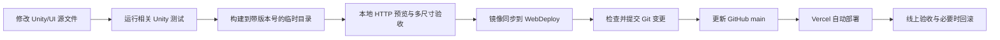

# Unity UI 修改同步到 WebGL 网页版操作指南

## 1. 文档目的

本文说明如何把项目中的 Unity UI、字体、布局或网页外壳修改，安全同步到网页版并发布到 Vercel。

固定链路如下：



当前生产地址：<https://hengheng-one.vercel.app/>

相关文档：

- [Unity WebGL 网页版上线专项规范](WebGLWebReleaseReadinessSpec.zh-CN.md)：发布门槛、浏览器风险和玩法回归范围。
- [测试套件索引](testing/test-suite-overview.zh-CN.md)：按功能定位 EditMode/PlayMode 测试。
- [WebDeploy 说明](../WebDeploy/README.md)：Vercel 项目设置摘要。

## 2. 三类目录的职责

### 2.1 Unity UI 真源头

长期修改应落在 Unity 工程中，例如：

- 运行时 UI、文字、字体、布局和交互：`Assets/LearnHearthstone/`
- Prefab：`Assets/LearnHearthstone/Runtime/Presentation/TavernTrainer/UnityStyle/Prefabs/`
- WebGL 发布构建入口：`Assets/LearnHearthstone/Editor/WebGLReleaseBuild.cs`
- Unity WebGL 项目设置：`ProjectSettings/ProjectSettings.asset`

### 2.2 浏览器外壳真源头

以下内容属于 Unity Canvas 外面的网页层：

- 页面 HTML、Canvas 容器和旋转设备提示：`Assets/WebGLTemplates/LearnHeartstone/index.html`
- 16:9 缩放、黑边、安全区和 footer 样式：`Assets/WebGLTemplates/LearnHeartstone/TemplateData/style.css`

修改网页模板后也需要重新构建 WebGL，Unity 才会把模板复制到发布产物。

### 2.3 部署产物

`WebDeploy/` 是 Vercel 直接托管的完整静态站点，但它是构建结果，不是 UI 的长期源文件。

不要只改 `WebDeploy/index.html` 或 `WebDeploy/TemplateData/style.css` 后就结束。下一次 Unity 构建会覆盖这些修改。若为线上止血临时改了 `WebDeploy`，必须把同一修复补回 `Assets/WebGLTemplates/LearnHeartstone/`。

`WebDeploy` 中有两个需要保留的部署支持文件：

- `WebDeploy/vercel.json`
- `WebDeploy/README.md`

其中部署配置的唯一人工真源是 `Deploy/Vercel/vercel.json`；`WebDeploy/vercel.json` 只是迁移期旧 Root Directory 所需的同步副本。

### 2.4 运行时内容选择与回退

WebGL 客户端在创建本次游戏会话前只选择一次内容快照，固定优先级为：

```text
Remote -> LKG（Last Known Good）-> Embedded Resources
```

- WebGL 从当前页面同源的 `content/content-manifest.json` 开始下载；版本化 Minion 文件名由 manifest 给出，并继续从同一 `content/` 目录读取。不要把运行时内容 URL 写成某个 Preview 或 Production 域名。
- Remote 只有在协议版本、客户端版本、文件名、字节数、SHA-256、UTF-8 与中英文 Minion Catalog 解析全部通过，并且成功持久化为 LKG 后，才会进入本次会话。
- LKG 位于 Unity 的 `Application.persistentDataPath/Content/LKG`。稳定的 `content-manifest.json` 指向版本化内容文件；写入时先落内容文件，最后替换 active manifest。坏包、断网或持久化失败都不能覆盖旧 LKG。
- `Assets/WebGLTemplates/LearnHeartstone/index.html` 必须保持 `config.autoSyncPersistentDataPath = true`，让 WebGL 的持久化目录同步到浏览器存储并在下次启动恢复。
- Editor 与非 WebGL 构建不主动联网，只尝试已有 LKG，然后回退到 `Resources/Data/battlegroundsMinions.json`。该 Resources 文件仍是源码仓库内唯一人工内容真源和最终内置回退。
- 当前版本不做运行中热切换。远程内容发生变化后，新的有效快照只在下一次客户端启动时选择，避免同一对局中内容源漂移。

## 3. 当前固定环境与 Vercel 配置

当前验证环境：

- Unity：`6000.4.10f1`
- Unity 可执行文件：`D:\unity hub Editor\6000.4.10f1\Editor\Unity.exe`
- Vercel Framework Preset：`Other`
- Vercel Root Directory：`WebDeploy`
- Vercel Build Command：留空
- Vercel Output Directory：`.`
- GitHub 远端：`https://github.com/heng6k/Learn-Heartstone-2026-06-05_09-24-27.git`
- 生产部署分支：`main`

`WebDeploy/vercel.json` 已为 Unity 的 Brotli 文件配置 `.wasm.br`、`.framework.js.br`、`.data.br` 所需的 MIME、`Content-Encoding: br` 和缓存响应头，不要在同步构建产物时丢失它。

## 4. 发布前检查

以下命令默认从项目根目录 `D:\unity project\Learn Heartstone` 执行。

### 4.1 检查工作区和分支

```powershell
git status --short --branch
git branch --show-current
git remote -v
```

先确认：

- 当前改动中哪些是本次 UI 修改，哪些是其他尚未完成的工作。
- 不覆盖、删除或回退其他人的未提交文件。
- 最终要上线的源代码改动与 `WebDeploy` 构建产物会进入同一个可审查的提交或一组连续提交。

不要直接使用 `git add .`。仓库经常同时存在多项 UI、Prefab 或玩法修改，应显式选择要提交的文件。

### 4.2 确认 Unity 状态

- 使用固定版本 `6000.4.10f1` 打开项目。
- 等待脚本编译完成，Console 中没有编译错误。
- 确认 Build Settings 中仍有启用场景。
- 若 Unity 编辑器正在运行，批处理构建前先保存资源和场景；避免两个 Unity 实例同时写入工程。

### 4.3 运行相关测试

至少运行与修改范围直接相关的 EditMode 测试；涉及点击、弹窗、回合切换或输入阻挡时，再运行对应 PlayMode 玩家旅程。

本轮字体和响应式 UI 的基础回归包括：

- `LearnHearthstone.Tests.EditMode.MainHubViewTests`
- `LearnHearthstone.Tests.EditMode.UnityTavernTrainerViewTests` 中与布局、语言和 HUD 有关的方法

完整测试分类和运行方式以 [测试套件索引](testing/test-suite-overview.zh-CN.md) 为准。测试失败时不要先构建上线包；先判断是本次回归还是已有基线问题，并把结论记录清楚。

## 5. 构建 WebGL 并组装 ReleaseCandidate

不要先直接构建进 `WebDeploy`。Unity 只生成原始 WebGL 站点，再由 `Tools/Release` 复制部署配置并生成跨机器稳定的 `release-meta.json`。

```powershell
$project = 'D:\unity project\Learn Heartstone'
$unity = 'D:\unity hub Editor\6000.4.10f1\Editor\Unity.exe'
$stamp = Get-Date -Format 'yyyyMMdd-HHmmss'
$output = Join-Path $project "Builds\WebGL\LearnHeartstone_$stamp"
$log = Join-Path $project "Logs\WebGLBuild_$stamp.log"

New-Item -ItemType Directory -Force -Path (Split-Path $log) | Out-Null

$arguments = @(
    '-batchmode', '-nographics', '-quit',
    '-projectPath', ('"' + $project + '"'),
    '-executeMethod', 'WebGLReleaseBuild.BuildFromCommandLine',
    '-webglOutput', ('"' + $output + '"'),
    '-logFile', ('"' + $log + '"')
)
$process = Start-Process -FilePath $unity -ArgumentList $arguments -Wait -PassThru -WindowStyle Hidden

if ($process.ExitCode -ne 0) {
    throw "WebGL 构建失败，请检查日志：$log"
}

Write-Output "WebGL 原始输出：$output"

$contentVersion = '20260727'
$assembly = & node Tools\Release\assemble-release-candidate.mjs --webgl $output --content-version $contentVersion
if ($LASTEXITCODE -ne 0) {
    throw "ReleaseCandidate 组装失败"
}
$assembly | Write-Output
$candidate = (($assembly | Select-String '^ReleaseCandidate:').Line -replace '^ReleaseCandidate:\s*', '')
```

组装后检查：

```powershell
Get-ChildItem -LiteralPath $candidate
Get-ChildItem -LiteralPath (Join-Path $candidate 'Build')
Get-Content -LiteralPath (Join-Path $candidate 'release-meta.json')
Get-Content -LiteralPath (Join-Path $candidate 'vercel.json')
Get-Content -LiteralPath (Join-Path $candidate 'content\content-manifest.json')
```

候选包至少应包含：

```text
index.html
Build/
TemplateData/
release-meta.json
vercel.json
content/
  content-manifest.json
  battlegroundsMinions.v<contentVersion>.json
```

`Build/` 下应同时存在 loader、framework、wasm 和 data 文件。当前发布使用 Brotli 产物，因此通常会看到 `.wasm.br`、`.framework.js.br` 和 `.data.br`。

`contentVersion` 是本次内容包的不可变版本标识。修改 `Assets/LearnHearthstone/Resources/Data/battlegroundsMinions.json` 并准备发布新内容时必须使用新值；同一个版本号不得覆盖为不同字节。组装器会校验文件名、字节数和 SHA-256，并在最后写入 `content-manifest.json`。

### 为什么输出目录必须带版本号

项目当前 `webGLNameFilesAsHashes` 为关闭状态，而 Vercel 对 Build 资源使用长期 `immutable` 缓存。Unity 生成的 Build 文件名前缀会受输出目录名称影响。

因此每次正式候选包应使用新的时间戳或版本号目录。这样新的 `index.html` 会引用新的 Build 文件名，避免 CDN 继续返回旧的 `.wasm`、`.data` 或 framework 文件。不要反复使用同一个候选目录名构建正式版本。

## 6. 本地 HTTP 预览

Unity WebGL 不能用双击 `index.html` 的方式可靠验收，必须通过 HTTP 服务运行，且 Brotli 文件需要正确响应头。

在新的 PowerShell 窗口中执行：

```powershell
Set-Location 'D:\unity project\Learn Heartstone'
python Tools\WebGL\serve_webgl.py "$candidate" --port 8125
```

若新窗口没有 `$candidate` 变量，直接填入上一阶段打印出的候选包绝对路径：

```powershell
python Tools\WebGL\serve_webgl.py "D:\unity project\Learn Heartstone\Builds\ReleaseCandidate\CLIENT__BUILD_ID" --port 8125
```

然后打开：<http://127.0.0.1:8125/>

端口已被占用时换用 `8126` 等空闲端口，不要停止来源不明的本地服务。

## 7. 浏览器验收矩阵

不要只看“页面能打开”。每次 UI 同步至少覆盖下表：

| 场景 | 建议尺寸 | 必查项目 |
| --- | --- | --- |
| 桌面宽屏 | `1920×1080` | Canvas 铺满可用区域，16:9，无裁切、无拉伸 |
| 笔记本 | `1366×768` | 文字清晰，按钮不重叠，边缘操作区可点击 |
| 紧凑横屏 | `1000×600` | 上下留黑边，跨布局断点后 UI 正确重建 |
| 手机竖屏 | `390×844` | 只显示“请旋转设备”，不把酒馆压成竖屏 |
| 手机横屏 | `844×390` | 提示消失，Canvas 居中按 16:9 显示 |

功能与视觉检查：

- 中文标题、卡牌名、说明和按钮没有缺字或方框。
- 切换英文后，没有英文重影、异常换行、按钮截断或文字溢出。
- Canvas 始终等比例缩放；剩余区域为黑边，不拉伸、不裁切。
- footer 不参与布局，页面没有横向或纵向滚动条。
- 窗口缩放、全屏切换和方向变化后，跨断点的 UI 会重新构建。
- 开局配置状态在布局重建后仍保留。
- 进入酒馆、选择种族、刷新/购买/出售、进入战斗等本次相关主流程可操作。
- 浏览器开发者工具 Console 中没有未解释的 Error、MIME、Brotli、WebAssembly、404 或 CORS 错误。

## 8. 安全同步到 WebDeploy

只有候选包通过本地验收后，才执行本步骤。

下面的 PowerShell 会先备份当前 `WebDeploy`，再做镜像同步，确保旧 Build 文件不会残留。执行前必须再次确认 `$candidate` 指向刚验收的 ReleaseCandidate，`$deploy` 指向本仓库的 `WebDeploy`。

```powershell
$project = (Resolve-Path 'D:\unity project\Learn Heartstone').Path
# 把下一行替换为刚才已经验收通过的 ReleaseCandidate 绝对路径。
$candidate = (Resolve-Path 'D:\unity project\Learn Heartstone\Builds\ReleaseCandidate\CLIENT__BUILD_ID').Path
$deploy = Join-Path $project 'WebDeploy'
$stamp = Get-Date -Format 'yyyyMMdd-HHmmss'
$backup = Join-Path $project "Builds\WebDeployBackup_$stamp"

if ((Split-Path $deploy -Leaf) -ne 'WebDeploy') {
    throw "部署目标异常：$deploy"
}

if (-not (Test-Path (Join-Path $candidate 'index.html'))) {
    throw "候选包缺少 index.html：$candidate"
}

New-Item -ItemType Directory -Force -Path $backup | Out-Null
robocopy $deploy $backup /MIR
if ($LASTEXITCODE -ge 8) {
    throw "备份 WebDeploy 失败，robocopy exit code=$LASTEXITCODE"
}

robocopy $candidate $deploy /MIR /XF README.md
if ($LASTEXITCODE -ge 8) {
    throw "同步 WebDeploy 失败，robocopy exit code=$LASTEXITCODE"
}

Copy-Item -LiteralPath (Join-Path $backup 'README.md') -Destination (Join-Path $deploy 'README.md') -Force
```

说明：`robocopy` 的退出码 `0` 到 `7` 都可能表示成功或存在已复制差异，`8` 及以上才视为失败。

同步后立即检查：

```powershell
Get-Content -LiteralPath .\WebDeploy\release-meta.json
Get-Content -LiteralPath .\WebDeploy\vercel.json
Get-ChildItem -LiteralPath .\WebDeploy\Build
Select-String -Path .\WebDeploy\index.html -Pattern 'loaderUrl|dataUrl|frameworkUrl|codeUrl'
```

重点确认：

- `index.html` 引用的四个 Build 文件都真实存在。
- `release-meta.json` 对应本次 client/build/source/Unity/UTC 信息，且不包含机器绝对路径。
- `vercel.json`、`README.md` 仍存在。
- `Build/` 中没有上一版本遗留的同类文件。

然后再次预览部署目录，而不是候选目录：

```powershell
python Tools\WebGL\serve_webgl.py WebDeploy --port 8125
```

至少完成一次桌面尺寸和一次手机竖屏复验。

## 9. Git 提交与更新 main

### 9.1 检查变更范围

```powershell
git status --short
git diff --stat
git diff -- WebDeploy/index.html WebDeploy/TemplateData/style.css WebDeploy/release-meta.json
```

正常情况下，Build 文件可能表现为旧文件删除、新文件新增，这是版本化文件名带来的预期变化。

不要提交：

- `Builds/` 下的候选包和备份。
- `Logs/` 下的本地构建日志，除非项目明确要求留档。
- `.vercel/` 本地项目状态。
- 与本次上线无关的用户工作区文件。

### 9.2 显式暂存

根据本次真实修改显式执行 `git add`，例如：

```powershell
git add -- <本次修改的Unity源文件1> <本次修改的Unity源文件2>
git add -- <本次修改的WebGL模板文件>
git add -A -- WebDeploy
git add -- Docs/WebGLUiChangeSyncAndDeploymentGuide.zh-CN.md Docs/DocumentationIndex.md
git diff --cached --stat
git diff --cached --name-status
```

尖括号内的路径必须替换为本次真实改动的具体文件。若一个文件中混有其他未完成工作，使用 `git add -p -- <文件路径>` 分块暂存，不能为了方便把整个 `Assets` 或 `Docs` 目录一起提交。

确认暂存内容后提交：

```powershell
git commit -m "deploy: sync latest WebGL UI"
```

### 9.3 让生产 main 获得提交

如果当前就在 `main`：

```powershell
git pull --ff-only origin main
git push origin main
```

如果当前在功能分支：

- 推荐通过 Pull Request 合并到 `main`；或
- 在工作区干净且确认提交完整后，把该分支合并进本地 `main` 再推送。

```powershell
git switch main
git pull --ff-only origin main
git merge --no-ff <功能分支名>
git push origin main
```

不要使用强制推送覆盖 `main`。如果 `main` 已有别人更新，先正常拉取、解决冲突并重新验收。

## 10. Vercel 自动部署与线上验收

GitHub `main` 更新后，Vercel 会从仓库的 `WebDeploy` 根目录创建新的生产部署。

上线后检查：

1. Vercel Deployment 状态为 Ready，不是 Error 或 Canceled。
2. 打开 <https://hengheng-one.vercel.app/>，确认加载的是本次 UI。
3. 打开 `https://hengheng-one.vercel.app/release-meta.json`，核对 client/build/source/Unity/UTC 信息；该文件必须走重新验证缓存。
4. 在开发者工具 Network 中确认 loader、data、framework 和 wasm 都返回 `200`。
5. 确认 `.br` 资源具有正确 `Content-Encoding: br` 和 MIME。
6. 再执行桌面、紧凑横屏、手机竖屏和中英文切换验收。
7. Console 中没有未解释错误。

`Ctrl+F5` 或无痕窗口只能用于诊断浏览器本地缓存，不能替代正确的版本化文件名和 Vercel 缓存配置。

## 11. 回滚

### 11.1 最快回滚：Vercel

若新版本已经上线但出现严重问题，在 Vercel 项目中找到上一条已验证的 Production Deployment，执行 Redeploy/Promote 恢复上一版本。

### 11.2 Git 回滚

对已经进入 `main` 的错误提交使用 `git revert`，不要重写生产分支历史：

```powershell
git switch main
git pull --ff-only origin main
git revert <错误提交哈希>
git push origin main
```

Vercel 会根据新的回滚提交自动重新部署。

### 11.3 尚未提交时恢复 WebDeploy

如果只是本地同步失败，可从第 8 节生成的 `Builds/WebDeployBackup_<时间戳>` 恢复。恢复前再次核对绝对路径，避免把其他目录作为镜像目标。

## 12. 常见问题

### 12.1 本地已改，网页完全没变化

依次检查：

1. 是否重新构建了 WebGL，而不是只改了 Unity/Prefab。
2. 是否把通过验收的候选包同步到了 `WebDeploy`。
3. 是否提交并推送到了 GitHub `main`。
4. Vercel 是否完成了新的 Production Deployment。
5. 新 `index.html` 是否引用了新的 Build 文件名。

### 12.2 页面白屏或一直停在加载界面

- 打开 Console 和 Network，检查 404、MIME、Brotli、WebAssembly 和内存错误。
- 确认 `WebDeploy/vercel.json` 未被覆盖或删除。
- 确认 `index.html` 引用的 loader、data、framework 和 wasm 文件全部存在。
- 不要通过 `file://` 双击页面验证。

### 12.3 中文缺字

- 确认打包字体仍位于 `Assets/LearnHearthstone/Resources/Fonts/`。
- 确认运行时在首次创建 UI 前加载打包字体。
- 确认字体资源和 `.meta` 已进入提交，并重新构建 WebGL。

### 12.4 英文重影、截断或显示不全

- 先判断是字体渲染、固定高度、自动换行还是布局断点问题。
- 检查共享文字/按钮工厂和具体 Prefab，不要只在 `WebDeploy` 中改生成后的页面。
- 同时验收英文主界面、开局设置、紧凑窗口和长按钮文案。

### 12.5 Canvas 被拉伸、裁切或出现滚动条

- 检查 `Assets/WebGLTemplates/LearnHeartstone/index.html` 和 `TemplateData/style.css`。
- 确认仍按可用窗口等比例计算 16:9 Canvas，并让剩余区域留黑边。
- 确认 footer 隐藏或绝对定位，不参与 Canvas 布局。

### 12.6 手机竖屏被压成酒馆界面

- 确认竖屏媒体查询和“请旋转设备”遮罩仍存在。
- 竖屏应显示提示并隐藏游戏容器，不应把整个横屏 UI 缩进竖屏。

### 12.7 Vercel 部署成功但访问 404

检查 Vercel：

- Root Directory 是否为 `WebDeploy`。
- Framework Preset 是否为 `Other`。
- Build Command 是否留空。
- Output Directory 是否为 `.`。

## 13. 一页式发布检查清单

### 源码与测试

- [ ] UI 修改位于 Unity/Prefab 或 WebGL Template 真源文件中。
- [ ] 没有只修改 `WebDeploy` 而遗漏源文件。
- [ ] Unity 无编译错误。
- [ ] 相关 EditMode 测试通过。
- [ ] 涉及完整交互时，相关 PlayMode 玩家旅程通过。

### 构建与本地验收

- [ ] 使用 Unity `6000.4.10f1`。
- [ ] 构建到新的带时间戳/版本号目录。
- [ ] loader、data、framework、wasm、`release-meta.json` 和 `vercel.json` 完整。
- [ ] 通过 `Tools/WebGL/serve_webgl.py` 预览。
- [ ] 中文无缺字，英文无重影/截断。
- [ ] 桌面、紧凑横屏、手机竖屏和手机横屏通过。
- [ ] 16:9 等比、黑边、footer、方向提示和断点重建正确。
- [ ] Console 无未解释错误。

### WebDeploy 与 Git

- [ ] 已备份旧 `WebDeploy`。
- [ ] 候选包已镜像同步，旧 Build 文件已清理。
- [ ] `WebDeploy/vercel.json` 和 `README.md` 仍存在。
- [ ] 已重新预览 `WebDeploy`。
- [ ] Git 暂存范围只包含本次发布内容。
- [ ] 候选包、备份、日志和 `.vercel` 未进入提交。
- [ ] 提交已进入并推送到 GitHub `main`。

### 线上

- [ ] Vercel Production Deployment 为 Ready。
- [ ] 线上 `release-meta.json` 对应本次构建。
- [ ] Build 资源返回 200，Brotli/MIME 正确。
- [ ] 线上多尺寸和中英文验收通过。
- [ ] 已知问题已记录；出现 P0 问题时已回滚。
