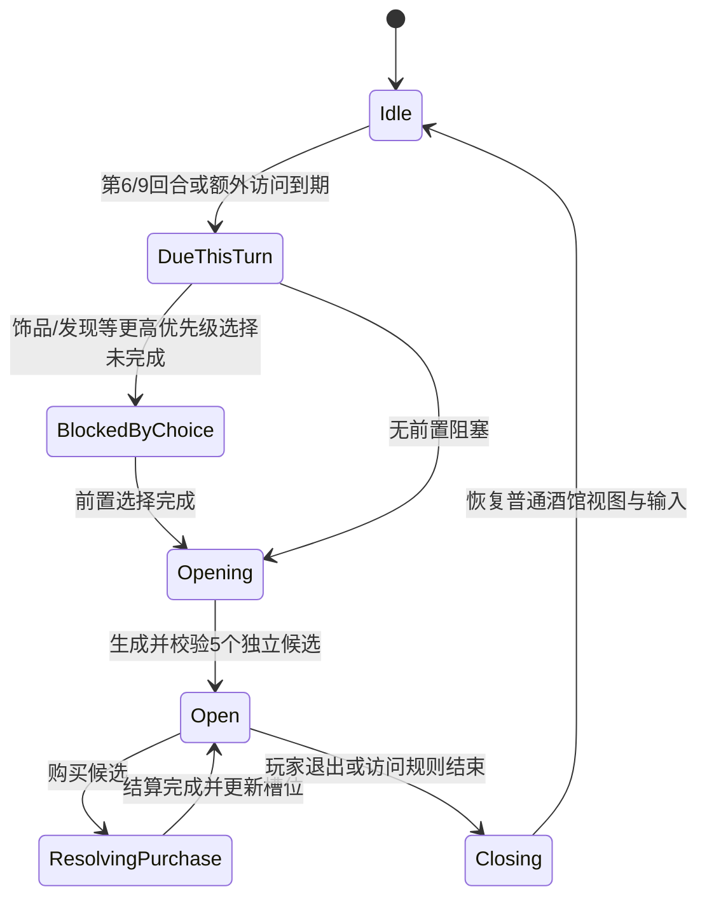

# 时空酒馆独立 UI 与规则改进方案

## 1. 文档目的

本文档用于指导 `Learn Hearthstone` 重构时空酒馆（Timewarped Tavern）。目标不是继续改造普通酒馆商店区域，而是建立一套独立的状态、候选槽位、交互层和 Unity UI，使时空酒馆更接近《炉石传说：酒馆战棋》的真实机制。

本文档是开发规格，不包含本轮代码实现。

## 2. 不可妥协的约束

以下规则属于架构不变量，后续实现、测试和代码评审均不得绕过：

1. 时空酒馆必须拥有独立的候选状态集合。
2. 每次访问必须显示 **5 个专属候选槽位**。
3. 这 5 个槽位不受普通酒馆随从数量、酒馆等级、普通商店槽位数或布局容量影响。
4. 禁止使用 `TavernState.Shop`、`TavernShopSlotState`、普通酒馆刷新结果或普通商店槽位配置存储时空候选。
5. 时空酒馆打开时必须进入独占交互模式；普通手牌、战场、商店、出售、冻结、刷新和英雄技能均不可操作。
6. 打开和关闭时空酒馆不得修改下层普通酒馆的候选、冻结状态、光环、池中副本或刷新计数。
7. UI 只能发送命令，不得直接修改 `MatchState`、Chronum 或候选购买状态。
8. 无论普通酒馆当前展示 3、4、5、6、7 个随从，时空酒馆始终按自己的规则构建 5 个槽位。

建议把固定数量声明为时空酒馆领域常量或规则字段，例如：

```csharp
public const int TimewarpedOfferSlotCount = 5;
```

该值不能从 `TavernShopSlots`、酒馆等级或普通 `Shop.Count` 推导。

## 3. 当前实现与目标行为

| 维度 | 当前本地实现 | 真实规则/目标行为 | 改进方向 |
|---|---|---|---|
| 触发回合 | 标准访问为第 6/9 回合，英雄规则另有分支 | 第 6 回合小型、第 9 回合大型；穆洛兹多第 8 回合是额外访问 | 使用访问队列，额外访问不替换标准访问 |
| 候选数量 | 默认 4 个 | 每次 5 个 | 独立生成并固定渲染 5 槽 |
| 候选构成 | 自定义权重选择，偏向手牌/战场种族 | 3 张随从、2 张非随从 | 增加构成约束生成器 |
| 费用构成 | 使用数据费用，没有访问级分布保证 | 3 张费用为 1，2 张费用至少为 2 | 先按费用桶与卡牌类型组装，再做资格筛选 |
| Chronum | 每次增加 3，剩余资源保留 | 34.2 上线规则为进入时获得 2，未花费资源在回合结束时消失 | 改为规则配置，默认采用官方档案 |
| 满手购买 | 手牌达到上限时购买失败 | 允许临时突破手牌上限 | 增加时空购买产生的临时手牌扩容状态 |
| 普通操作 | 当前仅替换商店区，其他区域仍会构建 | 访问期间不可操作普通手牌、战场、商店或英雄技能 | 独立全屏/模态交互层，并在服务层统一拦截命令 |
| 退出 | 关闭访问，普通界面继续 | 关闭特殊商店并返回原普通酒馆状态 | 保存普通视图快照引用，关闭后重新呈现，不重新生成普通商店 |
| 三连 | 已有独立定义身份 | 时空版本只与完全相同的时空版本三连 | 保持按时空 `DefinitionId` 判断，不与普通同名牌混合 |
| UI | 复用普通 `UnityTavernZoneComponent` 商店区 | 独立时空酒馆体验 | 新建专属根节点、Presenter、槽位组件和焦点控制器 |

## 4. 范围与非目标

### 4.1 本方案范围

- 独立时空酒馆状态与 5 个候选槽位。
- 第 6/9 回合及额外访问的统一调度。
- 官方五牌构成合同。
- 独立 Unity UI、输入焦点和普通操作锁定。
- Chronum 展示、购买、满手临时扩容和退出流程。
- 存档兼容、日志、自动化测试与手工验收。

### 4.2 本方案非目标

- 一次性补完全部 158 张时空卡牌的效果。
- 重做普通酒馆 UI。
- 修改普通随从池、普通刷新算法或普通酒馆槽位计算。
- 在时空酒馆中加入冻结、刷新、出售或拖拽上场功能。
- 为未实现效果的非随从牌伪造近似效果。

未实现效果的卡牌应在生成资格阶段被排除，或明确显示为不可用开发卡；正式可玩池中不得出现购买后无效果的候选。

## 5. 总体架构

建议把机制拆成四层：

| 层 | 责任 | 禁止事项 |
|---|---|---|
| Domain | 保存访问、Chronum、5 个候选槽位和临时手牌扩容状态 | 不引用 Unity 类型 |
| Application | 调度访问、生成候选、校验命令、购买和退出 | 不操作 GameObject |
| Presentation | 将只读 ViewModel 映射到独立 UI，并发送命令 | 不直接改 MatchState |
| Unity UI | 布局、动画、焦点、提示和输入设备适配 | 不决定卡牌资格和费用 |

推荐数据流：

```text
MatchService
  -> TimewarpedTavernViewModel
  -> UnityTimewarpedTavernPresenter
  -> UnityTimewarpedTavernView
  -> GameCommand(BuyTimewarpedOffer / ExitTimewarpedTavern)
  -> MatchService
```

## 6. 独立状态模型

现有 `PlayerTimewarpTavernState` 可以继续作为迁移入口，但需要明确其所有权和约束。

```csharp
public sealed class PlayerTimewarpTavernState
{
    public TimewarpTavernPhase Phase;
    public TimewarpKind VisitKind;
    public string VisitId;
    public string VisitSource;
    public int OpenedRound;
    public int Chronum;
    public bool HasTemporaryHandExpansion;
    public List<TimewarpedOfferSlot> Offers = new();
}

public sealed class TimewarpedOfferSlot
{
    public int SlotIndex;       // 0..4
    public string SlotId;       // 在一次访问内稳定
    public string CardId;
    public CardKind CardKind;
    public int Cost;
    public bool Purchased;
    public bool Interactable;
    public string DisabledReason;
}
```

状态约束：

- `Phase == Open` 时，`Offers.Count` 必须等于 5。
- `SlotIndex` 必须完整覆盖 `0..4`，不得因购买而删除列表元素。
- 购买后只把对应槽位标记为 `Purchased`，UI 保留空槽位置，避免其余卡牌跳位。
- `VisitId` 用于日志、存档恢复和防止重复生成。
- `VisitSource` 区分 `turn-6-minor`、`turn-9-major`、`murozond-turn-8-extra`、`debug` 等来源。
- 普通 `TavernState.Shop` 在访问前后必须保持值相等。

建议增加领域断言：

```csharp
if (state.Phase == TimewarpTavernPhase.Open && state.Offers.Count != 5)
{
    throw new InvalidOperationException("An open Timewarped Tavern must contain five offer slots.");
}
```

不要用补空普通随从的方式修复不足 5 张。候选生成失败应返回明确错误并记录资格池统计。

## 7. 官方五候选生成合同

### 7.1 固定构成

每次访问生成：

- 3 张时空随从。
- 2 张时空非随从牌。
- 其中 3 张费用为 1 Chronum。
- 其中 2 张费用至少为 2 Chronum。
- 小型访问通常提供第二英雄技能；玩家已经拥有两个英雄技能时不再强制提供。

卡牌类型约束和费用约束是两个同时成立的维度，不能先随机 5 张再事后修改类型或费用。

### 7.2 推荐生成步骤

1. 根据 `TimewarpKind` 选择小型或大型基础池。
2. 排除历史关闭池、禁用卡、未实现效果卡和当前模式不支持卡。
3. 应用官方种族资格、英雄资格、模式限制和卡牌前置条件。
4. 为小型访问预留第二英雄技能槽位；已有两个英雄技能时释放该要求。
5. 按 `CardKind` 分成随从与非随从桶。
6. 按费用分成 `cost == 1` 与 `cost >= 2` 桶。
7. 使用约束求解式抽取，保证 3 随从、2 非随从及 3 低费、2 高费同时成立。
8. 使用确定性种子打破同权重候选的顺序，保证回放和测试可复现。
9. 最终按费用和稳定次序排列，生成索引 `0..4`。
10. 生成后执行合同校验；任何条件不满足都不得打开残缺 UI。

### 7.3 池不足策略

生产环境不允许静默降级为 4 张或借用普通酒馆随从。建议按以下顺序处理：

1. 记录每个资格桶的候选数量和被排除原因。
2. 使用同一时空版本内的兼容后备规则重新筛选。
3. 若仍无法满足合同，阻止访问打开并给出开发错误日志。

调试模式可以显示“候选池配置不足”，但不得让普通 `Shop` 补位。

## 8. 独立 UI 方案

### 8.1 呈现形式

采用覆盖普通酒馆主交互区的全屏模态层。普通酒馆可在背景中保留低亮度静态画面，证明其状态仍在，但其所有射线和导航输入都必须被阻断。

不建议继续在 `BuildShop()` 中用 `UnityTimewarpedTavernZone` 替换普通商店区，因为该方式仍会构建手牌、战场和其他普通控件，难以保证独占交互。

### 8.2 推荐层级

```text
UnityTimewarpedTavernRoot
├── InputBlocker
├── BackgroundScrim
├── TavernBackdrop
├── Header
│   ├── VisitTypeLabel
│   ├── RoundLabel
│   └── ChronumCounter
├── OfferArea
│   ├── OfferSlot0
│   ├── OfferSlot1
│   ├── OfferSlot2
│   ├── OfferSlot3
│   └── OfferSlot4
├── CardDetailLayer
├── FeedbackLayer
│   ├── PurchaseError
│   └── ChronumChange
└── Footer
    └── ExitButton
```

`OfferArea` 必须直接拥有 5 个稳定槽位，不使用普通 `ShopZone.prefab` 的动态槽位数量。

### 8.3 布局规格

- 宽屏：5 张牌单行居中，固定等宽槽位，间距随容器在限定范围内变化。
- 16:10 与窄屏：允许整体等比缩小，但仍优先保持单行和完整卡面。
- 720p：卡牌名称、费用和主要数值必须可读；详细文字通过悬停/选中详情面板显示。
- 极窄窗口：允许 `3 + 2` 两行布局，但槽位索引和手柄导航顺序仍为 `0 -> 4`。
- 4K：限制最大卡牌宽度，避免五张牌被拉散到屏幕边缘。
- 使用 `CanvasScaler.ScaleWithScreenSize` 和安全区容器，不按视口宽度直接计算字体大小。

推荐参考分辨率为 `1920 x 1080`，测试范围覆盖 `1280 x 720`、`1920 x 1080`、`2560 x 1440`、`3840 x 2160` 和常见 16:10 比例。

### 8.4 视觉与反馈

- 标题必须明确显示“小型时空酒馆”或“大型时空酒馆”。
- Chronum 使用专属图标与数值，不显示普通金币购买语义。
- 每张卡的费用始终可见；资源不足时保持卡面可读并显示禁用原因。
- 已购买槽位保留为稳定空位，并显示已购买状态，不触发其他卡牌重排。
- 禁止出现冻结、刷新、出售或普通升级按钮。
- 动画只用于进入、购买确认和退出；开启减少动态效果时改为短淡入淡出。

## 9. 输入、焦点与控制器

时空酒馆打开后建立独立焦点作用域：

- 默认焦点落在第一张可购买卡牌；若没有可购买卡牌，则落在退出按钮。
- 键盘方向键、手柄方向键和摇杆按视觉顺序移动 `0..4`。
- 确认键购买当前卡牌，取消键第一次选择退出按钮，再次确认退出。
- 鼠标悬停只影响详情展示，不改变控制器的最后焦点。
- 购买后焦点优先移动到右侧最近的未购买槽位，其次左侧，最后退出按钮。
- 所有焦点状态必须有高对比度可见描边，不能只依赖颜色变化。
- `InputBlocker` 必须拦截透传点击、拖拽、滚轮和触摸。

Unity EventSystem 的导航图由时空 Presenter 单独建立，退出时销毁并恢复普通酒馆此前选中的对象。

## 10. 交互锁定与状态机



### 10.1 服务层命令门禁

不能只依赖 UI 隐藏按钮。`MatchService.ApplyCommand()` 或等价统一入口应在时空酒馆打开时执行白名单校验。

允许命令：

- `BuyTimewarpedOffer`
- `ExitTimewarpedTavern`
- 只读查看卡牌详情的表现层操作
- 时空卡牌结算需要的专属选择命令

拒绝命令：

- `BuyMinion`
- `RefreshShop`
- `ToggleFreeze`
- `SellMinion`
- `PlayMinion` / 普通手牌施放
- 普通战场拖拽和换位
- 普通英雄技能
- `NextTurn`
- 普通酒馆升级

拒绝时必须返回统一错误，例如 `CommandBlockedDuringTimewarpedTavern`，并保证状态完全不变。

### 10.2 访问调度

把访问建模为队列或明确的待处理项，而不是仅按当前回合即时覆盖：

```csharp
public sealed class PendingTimewarpVisit
{
    public TimewarpKind Kind;
    public int DueRound;
    public string Source;
    public bool IsExtraVisit;
}
```

这样第 8 回合额外访问不会替换第 6/9 回合标准访问，同回合的饰品选择也不会吞掉访问。

## 11. 购买、满手与退出

### 11.1 购买事务

一次购买应按原子事务处理：

1. 验证访问仍为 `Open`。
2. 验证槽位索引为 `0..4`、未购买且卡牌可用。
3. 验证 Chronum 足够。
4. 根据卡牌行为决定进入手牌、立即施放或打开后续选择。
5. 扣除 Chronum。
6. 标记槽位已购买。
7. 结算卡牌效果和同一时空版本三连。
8. 记录购买日志并刷新 ViewModel。

任一步骤失败时，不得只扣资源或只移除候选。

### 11.2 满手临时扩容

真实机制中，满手不应阻止时空购买。建议实现“时空溢出手牌”规则：

- 时空酒馆购买可以让手牌临时超过普通上限。
- 溢出牌仍按稳定顺序进入手牌，并参与同版本三连检查。
- 访问期间普通手牌不可使用，因此不会产生额外交互歧义。
- 退出后允许玩家处理溢出手牌，但在手牌回到普通上限前，普通获取手牌行为应按现有规则被限制。
- 存档必须保存溢出状态，加载后不能删除多出的牌。

不要通过替换、丢弃最右侧手牌或把购买牌直接放到战场来规避上限。

### 11.3 Chronum 生命周期

建议新增 `TimewarpedRulesProfile`，把数值从散落逻辑移入规则配置：

```csharp
public sealed class TimewarpedRulesProfile
{
    public int OfferCount = 5;
    public int ChronumGrantedOnVisit = 2;
    public bool ExpireUnspentChronumAtTurnEnd = true;
    public int RequiredMinionOffers = 3;
    public int RequiredNonMinionOffers = 2;
    public int RequiredOneCostOffers = 3;
    public int RequiredHigherCostOffers = 2;
}
```

默认档案采用已核实的官方 34.2 规则。若项目需要历史复刻，可创建具名历史档案，但 UI 的独立 5 槽约束不随档案变化。

### 11.4 退出

退出时：

- 关闭时空 UI 和焦点作用域。
- 清除本次未购买候选，不写入普通商店。
- 按当前规则档案处理剩余 Chronum。
- 清除本次临时访问标记，但保留合法的溢出手牌状态。
- 恢复普通酒馆视图，不调用普通刷新逻辑。
- 不自动推进回合。

## 12. Unity 组件与文件职责

建议新增以下文件，名称可按项目命名规范调整：

| 文件 | 职责 |
|---|---|
| `Runtime/Presentation/TavernTrainer/UnityStyle/Timewarped/UnityTimewarpedTavernPresenter.cs` | 订阅状态、构造 ViewModel、发送命令、管理打开/关闭 |
| `.../Timewarped/UnityTimewarpedTavernView.cs` | 绑定根节点、标题、资源、五槽和退出按钮 |
| `.../Timewarped/UnityTimewarpedOfferSlotComponent.cs` | 单个候选的显示、焦点、购买反馈和禁用原因 |
| `.../Timewarped/UnityTimewarpedFocusController.cs` | 键鼠、手柄、触摸焦点作用域 |
| `.../Timewarped/UnityTimewarpedTavernViewModel.cs` | 只读显示模型 |
| `.../Prefabs/Timewarped/TimewarpedTavernRoot.prefab` | 独立全屏根预制体 |
| `.../Prefabs/Timewarped/TimewarpedOfferSlot.prefab` | 专属候选槽位预制体 |

现有文件调整边界：

- `TavernMatchModels.cs`：完善独立状态、访问队列和规则档案。
- `MatchService.cs`：负责生成合同、命令门禁、购买事务、退出和存档恢复。
- `UnityTavernTrainerController.cs`：只负责挂载/切换独立 Presenter；删除 `BuildShop()` 内的时空商店替换分支。
- `UnityTavernZoneComponent.cs`：继续服务普通酒馆，不加入时空酒馆专用容量分支。
- `UnityTavernCardComponent.cs`：可复用纯卡面展示能力，但时空费用、购买和焦点由专属槽位组件包装。

优先复用已有卡图加载、详情弹窗、Toast 和本地化能力，不复用普通商店的状态与槽位容量逻辑。

## 13. 响应式、可访问性与可靠性

- 所有关键文字至少满足项目现有最小可读字号，720p 下不得裁切费用、名称和按钮文字。
- 卡牌详情支持键盘/手柄打开与关闭，不要求鼠标悬停。
- 费用不足、效果未实现、条件不满足必须同时提供文字原因，不能只变灰。
- 色彩信息需要图标或文字冗余，兼顾色觉差异。
- 安全区必须覆盖顶部标题、Chronum 和底部退出按钮。
- 动态文本使用稳定容器尺寸，资源数变化不能推动五张卡重新布局。
- 进入动画期间先建立输入阻挡；退出动画完成后再恢复普通酒馆输入。
- UI 被意外销毁或场景重载时，Presenter 应根据领域状态重建同一访问，而不是重新抽取候选。

## 14. 分阶段迁移

### 阶段 A：固化规则与回归基线

- 为当前普通商店状态、冻结状态和时空访问建立快照测试。
- 增加“普通商店任意槽位数，时空候选始终为 5”的领域测试。
- 将旧的 4 候选、3 Chronum、资源保留行为标记为待迁移断言。

### 阶段 B：独立状态与生成合同

- 引入固定五槽约束和生成后校验。
- 实现 3 随从、2 非随从及费用分布。
- 将额外访问改为待处理访问队列。
- 不改 UI，先用服务测试验证完整状态。

### 阶段 C：服务层锁定与购买事务

- 增加时空访问命令白名单。
- 实现满手临时扩容。
- 调整 Chronum 规则档案和退出清理。
- 验证失败购买不产生部分状态修改。

### 阶段 D：新建独立 UI

- 新建时空根预制体、Presenter、五槽组件和焦点控制器。
- 控制器在 `Phase == Open` 时显示模态层，不再替换普通商店 Zone。
- 完成键鼠、手柄、触摸和安全区适配。

### 阶段 E：移除旧路径

- 删除 `BuildShop()` 中 `UnityTimewarpedTavernZone` 分支。
- 删除依赖普通商店容量的兼容代码。
- 清理旧的 4 槽测试和文档描述。
- 保留一个版本的存档迁移代码，之后再按项目策略移除。

## 15. 测试矩阵

### 15.1 EditMode/服务测试

| 场景 | 预期 |
|---|---|
| 普通商店为 3 个槽位 | 时空访问仍生成 5 个槽位 |
| 普通商店为 7 个槽位 | 时空访问仍生成 5 个槽位 |
| 第 6 回合 | 打开小型访问，5 个候选满足构成合同 |
| 第 9 回合 | 打开大型访问，5 个候选满足构成合同 |
| 穆洛兹多第 8 回合 | 产生额外访问，不删除第 9 回合标准访问 |
| 同回合有饰品选择 | 先完成饰品，再打开同一待处理访问 |
| 候选池不足 | 不打开残缺商店，输出明确诊断 |
| 购买第 2 槽 | 只有索引 2 标记已购买，列表仍为 5 项 |
| 满手购买随从 | 购买成功并形成临时溢出手牌 |
| Chronum 不足 | 不扣资源，不改变槽位和手牌 |
| 访问期间普通命令 | 全部被服务层拒绝，状态不变 |
| 退出访问 | 普通 Shop、Frozen 和槽位顺序与进入前一致 |
| 保存并加载开放访问 | 恢复原 VisitId、候选和购买状态，不重新抽取 |

### 15.2 PlayMode/UI 测试

| 场景 | 预期 |
|---|---|
| 打开访问 | 独立根节点可见，普通交互射线被阻断 |
| 五张卡渲染 | 存在且仅存在 `OfferSlot0..4` |
| 购买一张 | 原槽位显示已购买，其余槽位不位移 |
| 键盘/手柄导航 | 焦点按 `0..4` 和退出按钮稳定移动 |
| 鼠标点击背景普通卡牌 | 不触发购买、出售、上场或选择 |
| 退出 | 时空根节点关闭，普通焦点与操作恢复 |
| 720p/1080p/1440p/4K | 无文字裁切、重叠和屏幕外按钮 |
| 减少动态效果 | 不播放大幅位移动画，流程仍完整 |

### 15.3 手工体验检查

- 五张牌在第一眼内可比较费用、类型和核心数值。
- 玩家不会误以为 Chronum 是普通金币。
- 玩家明确知道访问期间为什么不能操作手牌和战场。
- 退出后普通商店看起来与进入前完全一致。
- 普通商店槽位变化不会影响时空酒馆的视觉密度和候选数量。

## 16. 验收标准

实现同时满足以下条件才可验收：

1. 时空酒馆拥有独立全屏或模态 UI，代码中不再通过普通商店 Zone 承载候选。
2. 每次开放访问时领域状态和 UI 都恰好有 5 个稳定槽位。
3. 测试证明这 5 个槽位与普通酒馆的随从数量、酒馆等级和商店容量无关。
4. 候选满足 3 随从、2 非随从，以及 3 张 1 费、2 张至少 2 费的合同。
5. 访问期间所有普通酒馆命令都在服务层被拒绝，而不只是按钮被隐藏。
6. 满手时仍可购买会进入手牌的时空卡牌，且不会丢牌。
7. 退出后普通商店候选、冻结状态、顺序和池状态不变。
8. 第 6/9 回合访问稳定触发，额外访问不会替换标准访问。
9. 鼠标、键盘和手柄均可完成查看、购买和退出。
10. 720p 至 4K 测试中无重叠、裁切、焦点丢失或点击穿透。
11. 开放访问的存档可恢复原五个候选，不重新随机。
12. 未实现卡牌不会进入正式候选池。

## 17. 风险与回滚策略

| 风险 | 缓解措施 |
|---|---|
| 候选池暂时无法满足官方构成 | 在生成前统计资格桶，优先补齐非随从牌效果，不回退到普通随从 |
| 全局命令锁定遗漏入口 | 所有命令通过统一服务入口白名单校验，并加参数化测试 |
| 满手扩容影响普通手牌逻辑 | 用显式溢出状态隔离，并覆盖三连、存档和退出测试 |
| 新 UI 与现有控制器生命周期冲突 | Presenter 独立订阅状态，控制器只负责挂载和可见性 |
| 旧存档只有 4 个候选 | 加载时关闭旧的开放访问并记录迁移原因，或按保存的访问种子重新生成完整 5 槽；不得借普通 Shop 补位 |
| 官方规则后续平衡调整 | 使用具名 `TimewarpedRulesProfile`，将数值和构成合同集中配置 |

建议用功能开关 `UseIndependentTimewarpedTavernUi` 分阶段上线。回滚时只切回旧表现入口，不回滚新领域状态或修改普通商店数据；待新 UI 验证稳定后再删除旧路径。

## 18. 代码定位

当前关键实现位置：

- 规则与状态：`Assets/LearnHearthstone/Runtime/Domain/Models/TavernMatchModels.cs`
- 调度与候选生成：`Assets/LearnHearthstone/Runtime/Application/Services/MatchService.cs`，当前约在 `ScheduledTimewarpKindForRound()`、`GenerateTimewarpedOffers()`。
- 满手购买阻止：同文件 `BuyTimewarpedOffer()` 附近。
- 退出流程：同文件 `ExitTimewarpedTavern()`。
- 当前复用普通商店区的 UI：`Assets/LearnHearthstone/Runtime/Presentation/TavernTrainer/UnityStyle/UnityTavernTrainerController.cs` 的 `BuildShop()`。

实施时应先改领域和服务测试，再接入新 UI；不要从 `BuildShop()` 直接开始堆叠特殊分支。

## 19. 规则资料

- Blizzard 34.2 Patch Notes：<https://hearthstone.blizzard.com/en-us/news/24244423/>
- Blizzard Developer Insight: Timewarped Tavern：<https://us.forums.blizzard.com/en/hearthstone/t/developer-insight-timewarped-tavern/154893>
- Developer Insight 社区镜像：<https://www.hearthstonetopdecks.com/developer-insight-timewarped-tavern/>

本方案以已核实的 34.2 上线规则和 Developer Insight 为对齐基线。若后续版本调整 Chronum 数值或具体卡池资格，应更新规则档案与测试数据；独立状态、独立 UI 和固定五槽不受普通酒馆容量限制的架构约束保持不变。
